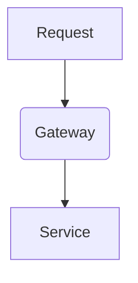
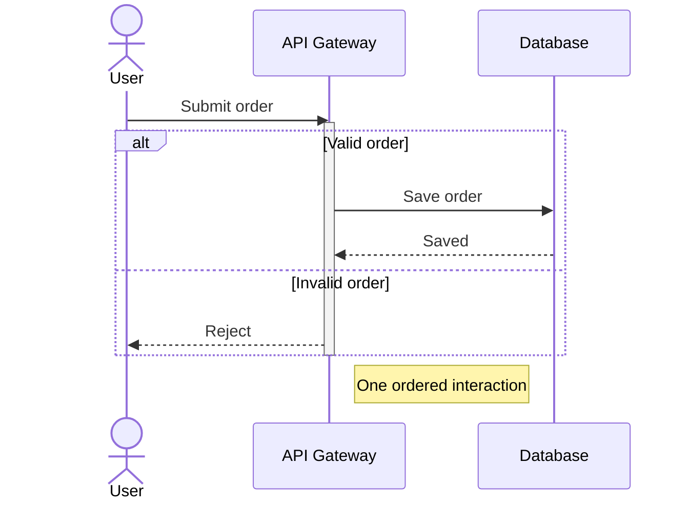

# Import examples

Surrounding prose must not become diagram content.

```mermaid
flowchart TD
  request["Request"] --> gateway("Gateway")
  gateway --> service["Service"]
```

More prose between diagrams.

```mermaid
sequenceDiagram
  actor User
  participant API as API Gateway
  participant DB as Database
  User->>API: Submit order
  activate API
  alt Valid order
    API->>DB: Save order
    DB-->>API: Saved
  else Invalid order
    API-->>User: Reject
  end
  deactivate API
  Note right of API: One ordered interaction
```
