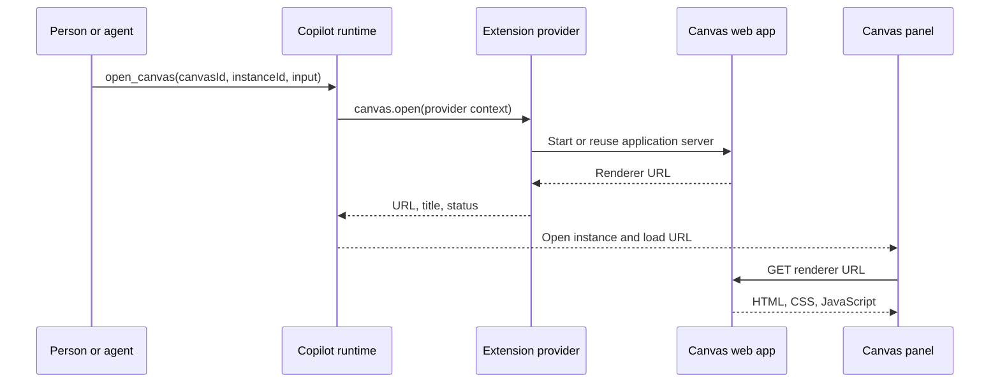
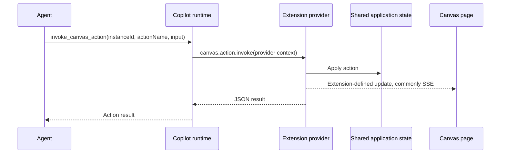

# GitHub Copilot App Canvas reference

**Research date:** 2026-08-26

This note explains how GitHub Copilot App canvases work from creation through
shutdown and resume. It also records the current experimental wire protocol.

This note describes Copilot. It does not select a Kandev architecture.

## Source levels

This note uses these source levels:

| Level                | Meaning                                                                  |
| -------------------- | ------------------------------------------------------------------------ |
| GitHub documentation | Public product behavior that GitHub documents.                           |
| Canonical SDK        | Current types, tests, and comments in `github/copilot-sdk`.              |
| First-party example  | Canvas code in the `github/awesome-copilot` repository.                  |
| Third-party example  | Public code that uses the SDK but does not define the product contract.  |
| Inference            | A conclusion that follows from source code but is not a stated contract. |
| Unknown              | Behavior that the public sources do not define.                          |

The Canvas SDK marks its protocol as experimental. Names and payloads can
change before the protocol becomes stable.

The protocol details in this note use these source revisions:

- `github/copilot-sdk` at
  [`29141a4cc779191f9b292a280daaddd3597cacac`](https://github.com/github/copilot-sdk/tree/29141a4cc779191f9b292a280daaddd3597cacac)
- `github/awesome-copilot` at
  [`71f7c9b1dc5044287b62fc700efc034da4065f87`](https://github.com/github/awesome-copilot/tree/71f7c9b1dc5044287b62fc700efc034da4065f87)
- `leestott/copilot-canvas-runtime` at
  [`3b9bea89b24f8dfc3327773c81a80265da00cdbe`](https://github.com/leestott/copilot-canvas-runtime/tree/3b9bea89b24f8dfc3327773c81a80265da00cdbe)

## Executive summary

A Copilot canvas is an extension-owned web application. The Copilot host shows
the application in its canvas panel.

A person describes the required surface with `/create-canvas`. The agent writes
the extension code and opens the completed canvas. A person can also install a
prebuilt canvas from a plugin.

The extension registers a canvas declaration and action declarations. Each
action includes a name, a description, and an optional JSON Schema.

Opening a canvas does not transfer HTML through the Canvas protocol. The host
asks the extension to open an instance. The extension returns a URL, title, and
optional status.

The host loads the URL in its web renderer. First-party examples return a
loopback URL that serves arbitrary HTML, CSS, and JavaScript.

The extension owns the canvas application and its state. Human controls and
agent actions can call the same extension logic. The SDK does not define the
web protocol between the iframe and the extension.

The public examples commonly use HTTP commands and Server-Sent Events (SSE).
This HTTP and SSE design is an example pattern, not the Canvas SDK protocol.

## Core terms

| Term               | Meaning                                                              |
| ------------------ | -------------------------------------------------------------------- |
| Extension          | Code that joins a Copilot session and contributes capabilities.      |
| Canvas declaration | Metadata and agent actions for one canvas type.                      |
| Provider           | The live connection that owns a canvas declaration and its handlers. |
| `extensionId`      | The runtime identifier for the provider.                             |
| `canvasId`         | The provider-local identifier for one canvas type.                   |
| `instanceId`       | A stable identifier for one open canvas instance.                    |
| Renderer URL       | The URL that the provider returns when an instance opens.            |
| Canvas action      | A named, JSON-shaped capability that an agent or host can invoke.    |
| Application state  | Data owned by the extension, a file, a service, or another system.   |

A canvas declaration is not a canvas instance. One declaration can serve
multiple instances. The `instanceId` separates their runtime state.

## End-to-end lifecycle

### 1. A person asks an agent to create a canvas

GitHub documents this creation flow:

1. A person starts or opens an agent session.
2. The person enters `/create-canvas` and describes the workflow.
3. The person describes human controls and agent capabilities.
4. The person selects project scope or user scope.
5. The agent writes the extension and opens the canvas panel.
6. The person asks the agent to revise the interface or capabilities.

Project extensions live under `.github/extensions`. A repository can share
these extension files with its team.

User extensions live under `~/.copilot/extensions`. These extension files stay
personal to the local user.

GitHub states that an extension commonly contains:

- `package.json` for metadata and dependencies
- `extension.mjs` for behavior and capabilities
- optional JSON artifacts for persistent application data

The extension source is the canvas definition. The agent creates or changes
that source. The person directs and reviews the result.

### 2. Copilot discovers and starts the extension

The extension entry file calls `joinSession`. It supplies one or more canvases
that were created with `createCanvas`.

The SDK sends canvas declarations during `session.create` or `session.resume`.
Handler functions stay in the extension process. The wire declaration contains
only metadata and schemas.

The renderer connection must request canvas support. The current SDK calls this
option `requestCanvasRenderer`. This option exposes these agent tools:

- `list_canvas_capabilities`
- `open_canvas`
- `invoke_canvas_action`

The separate `requestExtensions` option exposes extension management and
extension dispatch features.

### 3. A person or agent opens an instance

The caller supplies a `canvasId`, an `instanceId`, and optional input. The
caller can also supply an `extensionId` when several providers use the same
`canvasId`.

The runtime resolves the declaration and calls the provider's `canvas.open`
handler. The provider receives session, provider, canvas, and instance
identifiers. It also receives the open input and limited host context.

The provider starts or reuses the web application. The provider returns a URL,
a title, and an optional status.

The host records the open instance and loads the URL in the canvas panel. The
current SDK describes this URL as the URL for a web-rendered canvas.

Reopening the same `instanceId` focuses the existing panel. Renderer reload is
a host concern. The current provider API has no separate focus or reload
callback.



### 4. A person changes the canvas

The Canvas SDK does not prescribe this path. Each extension defines it.

First-party examples use normal browser communication:

1. A person clicks a control in the canvas page.
2. The page sends an HTTP request to the extension server.
3. The server validates and applies the operation.
4. The server changes the shared application state.
5. The server sends an SSE update to the page.
6. The page shows the new state.

Some canvas pages also ask the agent to do work. The first-party Color Orb
example sends a new session prompt after a person clicks its request button.

### 5. An agent changes the canvas

The agent first discovers the declared actions and their input schemas. It then
calls `invoke_canvas_action` for an open instance.

The runtime routes the invocation to the live provider. The provider receives
the `instanceId`, action name, and JSON input. The SDK dispatches the request to
the action handler that `createCanvas` registered.

The handler changes the same application state that the human path uses. The
handler can then notify the page through SSE, WebSocket, polling, or another
extension-defined channel.

The action handler returns any JSON value. The runtime returns that value to
the agent.



### 6. The host closes an instance

The user, agent, or host can close an instance. The runtime calls the
provider's `canvas.close` handler.

The extension can close web servers, SSE clients, browser contexts, and other
instance resources. The `onClose` callback is a notification. Its return value
is ignored, and callback errors are logged.

State lifetime is an extension decision. A provider can erase state on close,
retain state in memory, or save state to a file.

### 7. The provider disconnects or reloads

The protocol defines `session.canvas.unavailable` for a provider disconnect.
This event is transient.

The host keeps the panel mounted and shows a reconnecting state. A later
`session.canvas.opened` event with the same `instanceId` supplies a fresh URL.

First-party examples also guard against orphaned pages. The Chat Cards example
limits SSE retries because a hidden WebView can outlive its extension process.

### 8. A session resumes

The runtime has durable and transient canvas records.

`session.canvas.recorded` stores enough information to restore an open instance.
It omits the transient renderer URL and availability state.

`session.canvas.removed` records that an instance closed. It supersedes the
earlier recorded event for that instance.

The SDK accepts an `openCanvases` snapshot during `session.resume`. The runtime
can reopen or reattach those instances without creating new identities.

This mechanism restores panel identity and open input. It does not persist the
canvas application's domain state. The extension must persist that state.

## The two protocol layers

Copilot canvases have two separate protocol layers.

| Layer                       | Participants                          | Standardized by GitHub | Typical transport                             |
| --------------------------- | ------------------------------------- | ---------------------- | --------------------------------------------- |
| Canvas control protocol     | Host, runtime, provider, agent        | Yes, but experimental  | JSON-RPC and session events                   |
| Canvas application protocol | Canvas page and extension application | No                     | HTTP, SSE, WebSocket, polling, or custom code |

The first layer discovers and controls a canvas instance. The second layer
implements the actual application.

This separation is the source of the canvas's flexibility. The SDK does not
limit the application to a fixed widget or block schema.

## Canvas declaration

The current Node SDK uses this declaration shape:

```json
{
  "id": "agentic-kanban",
  "displayName": "Agentic Kanban",
  "description": "A shared board for people and agents.",
  "inputSchema": {
    "type": "object",
    "properties": {
      "project": { "type": "string" }
    }
  },
  "actions": [
    {
      "name": "move_card",
      "description": "Move one card to another column.",
      "inputSchema": {
        "type": "object",
        "properties": {
          "cardId": { "type": "string" },
          "columnId": { "type": "string" }
        },
        "required": ["cardId", "columnId"]
      }
    }
  ]
}
```

The SDK removes action handler functions before it serializes the declaration.
The functions remain in the provider process.

Canvas action names must not start with `canvas.`. GitHub reserves this prefix
for lifecycle operations.

## Runtime JSON-RPC methods

### Host or SDK to runtime

| Method                         | Purpose                      | Main input                        | Result                               |
| ------------------------------ | ---------------------------- | --------------------------------- | ------------------------------------ |
| `session.canvas.list`          | List available declarations. | `sessionId`                       | Canvas declarations and provider IDs |
| `session.canvas.listOpen`      | List live open instances.    | `sessionId`                       | `openCanvases`                       |
| `session.canvas.open`          | Open or focus an instance.   | Canvas, provider, instance, input | Open instance snapshot               |
| `session.canvas.close`         | Close an instance.           | `instanceId`                      | No result                            |
| `session.canvas.action.invoke` | Invoke an action.            | Instance, action, input           | Any JSON value                       |

### Runtime to provider

| Method                 | Purpose                                      | Main input                                                  | Result             |
| ---------------------- | -------------------------------------------- | ----------------------------------------------------------- | ------------------ |
| `canvas.open`          | Ask the provider to open an instance.        | Session, provider, canvas, instance, input, context         | URL, title, status |
| `canvas.close`         | Notify the provider that an instance closed. | Session, provider, canvas, instance, context                | No result          |
| `canvas.action.invoke` | Route one action to the provider.            | Session, provider, canvas, instance, action, input, context | Any JSON value     |

The SDK routes provider callbacks by `sessionId` and `canvasId`. It routes an
action again by action name.

## Main protocol shapes

### Open request from a caller

```json
{
  "extensionId": "project:my-extension",
  "canvasId": "agentic-kanban",
  "instanceId": "board-1",
  "input": { "project": "release-2026-08" }
}
```

`extensionId` is optional when `canvasId` is unique across providers.

### Open callback to the provider

```json
{
  "sessionId": "session-id",
  "extensionId": "project:my-extension",
  "canvasId": "agentic-kanban",
  "instanceId": "board-1",
  "input": { "project": "release-2026-08" },
  "host": {
    "capabilities": { "canvases": true }
  },
  "session": {
    "workingDirectory": "/path/to/worktree"
  }
}
```

### Open result from the provider

```json
{
  "url": "http://127.0.0.1:43127/",
  "title": "Agentic Kanban",
  "status": "ready"
}
```

The URL, title, and status are optional in the SDK type. A web-rendered canvas
needs a URL.

### Action request

```json
{
  "sessionId": "session-id",
  "extensionId": "project:my-extension",
  "canvasId": "agentic-kanban",
  "instanceId": "board-1",
  "actionName": "move_card",
  "input": {
    "cardId": "card-7",
    "columnId": "done"
  }
}
```

The action result can be any valid JSON value.

## Errors

An extension can throw `CanvasError(code, message)`. The Node SDK converts the
error to a JSON-RPC internal error with structured data:

```json
{
  "code": "extension_error_code",
  "message": "Safe error message"
}
```

If an action has no handler, the SDK uses
`canvas_action_no_handler`. If another handler throws an ordinary error, the
SDK uses `canvas_handler_error`.

The SDK does not define a shared application conflict model. An extension must
define its own conflict, retry, and recovery behavior.

## Session events

The current SDK defines these canvas events:

| Event                             | Persistence | Purpose                                         |
| --------------------------------- | ----------- | ----------------------------------------------- |
| `session.canvas.registry_changed` | Transient   | Replace the available declaration list.         |
| `session.canvas.opened`           | Transient   | Supply the live URL and open-instance metadata. |
| `session.canvas.closed`           | Transient   | Remove one instance from the live open list.    |
| `session.canvas.unavailable`      | Transient   | Mark an open instance as disconnected.          |
| `session.canvas.recorded`         | Durable     | Record an open instance for cold resume.        |
| `session.canvas.removed`          | Durable     | Record that an instance closed.                 |

The transient `opened` event can contain:

- `instanceId`
- `extensionId`
- `extensionName`
- `canvasId`
- `icon`
- `title`
- `status`
- `url`
- `input`

The durable `recorded` event contains identifiers, open input, and an optional
title. It does not contain the URL or availability state.

## The iframe and application protocol

The Canvas protocol returns a URL. It does not return an HTML string, a React
tree, or a fixed component description.

First-party examples serve complete HTML documents with custom CSS and
JavaScript. The examples include dashboards, games, diagrams, an animation
studio, a website studio, a Kanban board, and a browser control surface.

The protocol therefore permits the full interface range of the host's web
renderer. The public sources do not publish a smaller canvas widget schema.

The first-party Chromium Control Canvas states that the Copilot App uses a
WebKit `WKWebView`. That example opens a separate Chromium window when it needs
the Chromium engine.

### Common first-party web pattern

Most current first-party examples use this pattern:

```text
Canvas page                  Extension process
-----------                  -----------------
GET /                 -----> Return HTML, CSS, and JavaScript
GET /events           -----> Keep an SSE connection open
POST /api/<operation> -----> Apply a human operation
                       <----- Send state or event data through SSE
```

The URL and endpoint names are extension-defined. An extension can use a
different protocol.

### Loopback server protections in first-party examples

Several first-party examples add protections around their loopback servers:

- Bind only to `127.0.0.1`.
- Select an ephemeral or private port.
- Create a random capability token for each server or instance.
- Put the token in the renderer URL or generated page.
- Require the token on state and mutation endpoints.
- Pin the HTTP `Host` header to stop DNS rebinding.
- Reject cross-site mutation requests.
- Limit request body sizes and accepted fields.
- Close SSE clients and sockets during teardown.
- Redact credentials and typed text from logs.

These controls are example responsibilities. The Canvas SDK does not define
them as a standard application protocol.

## State and persistence

Copilot does not require one canvas state model. The extension selects it.

The third-party Multi-Agent Dev example stores state in a process map. It
deletes that state when the instance closes.

The first-party Daily Focus Board stores domain state in a JSON file. Human
HTTP operations and agent actions both call the same mutation functions.

The first-party Chat Cards extension retains deck state after panel close. It
stops only the page server and SSE connections, then saves state to disk.

The first-party Site Studio saves its dashboard state as an artifact. It
restarts a per-instance server when the canvas opens.

These examples show three independent lifetimes:

1. The canvas panel can open and close.
2. The extension process can connect, reload, and disconnect.
3. The application state can be ephemeral or durable.

The Canvas protocol coordinates the first two lifetimes. The extension owns the
third lifetime.

## Detailed public sample flow

The `leestott/copilot-canvas-runtime` sample uses one `extension.mjs` file.
This sample gives a small end-to-end example of the two protocol layers.

### Provider setup

1. The extension creates a process-level map of instance state.
2. The extension defines seven agent actions with JSON Schemas.
3. The extension registers one canvas with `createCanvas`.
4. The extension joins the Copilot session with `joinSession`.

### Open

1. Copilot calls the extension's `open` handler.
2. The handler uses `ctx.instanceId` as the map key.
3. The handler starts an HTTP server on `127.0.0.1` and an ephemeral port.
4. The handler returns the loopback URL and title.
5. The canvas panel loads the URL.

### Web endpoints

| Endpoint        | Purpose                                        |
| --------------- | ---------------------------------------------- |
| `GET /`         | Return the full HTML document.                 |
| `GET /events`   | Open an SSE stream and send the current state. |
| `POST /trigger` | Apply one human control action.                |
| `GET /state`    | Return the current instance state as JSON.     |

### Shared state flow

Human controls call `POST /trigger`. Agent calls enter through declared Canvas
actions. Both paths change the same object in the instance-state map.

After a change, the extension writes the full state to each SSE client. The
canvas page parses the event and redraws its HTML.

### Close

The `onClose` handler closes SSE responses and the loopback server. It then
deletes the instance state.

This cleanup behavior belongs to the sample. It is not a Copilot requirement.

## Sharing and collaboration

Copilot documentation uses "shared" for the person-agent work surface and for
project extension definitions.

Project scope shares extension code through the repository. User scope keeps
the extension code local.

The supplied Canvas documentation does not define concurrent multi-user editing
of one live instance. It also does not define roles, invitations, or presence.

Local Copilot sessions can be shared separately with view-only access. Session
sharing does not define canvas editing rights.

## Publicly unknown behavior

The reviewed public sources do not define these host details:

- the iframe `sandbox` attribute
- the renderer Content Security Policy
- URL scheme or origin restrictions
- credential and cookie behavior inside the renderer
- permission prompts for individual canvas actions
- network policy for extension processes
- filesystem isolation for extension processes
- remote canvas rendering in cloud sessions
- concurrent access by several people
- standard revisions, conflicts, or transactions for application state
- a standard database or file format for canvas state
- mobile renderer support

These items need direct product testing or additional GitHub documentation.
They cannot be inferred from the SDK types alone.

## Confirmed conclusions

- The agent authors a canvas extension from a human prompt.
- A prebuilt plugin can also contribute canvases.
- A canvas declaration contains metadata, open input, and agent actions.
- Each open canvas has a stable `instanceId`.
- The provider returns a renderer URL instead of HTML through JSON-RPC.
- Current examples serve arbitrary HTML, CSS, and JavaScript at that URL.
- Human and agent paths can operate the same extension-owned state.
- GitHub standardizes lifecycle and action dispatch, not the iframe protocol.
- Application persistence is separate from panel resume metadata.
- The protocol remains experimental.

## Sources

### GitHub product documentation

- [Working with canvas extensions in the GitHub Copilot app](https://docs.github.com/en/copilot/how-tos/github-copilot-app/working-with-canvas-extensions)
- [About the GitHub Copilot app](https://docs.github.com/en/copilot/concepts/agents/github-copilot-app)
- [Customizing the GitHub Copilot app](https://docs.github.com/en/copilot/how-tos/github-copilot-app/customize-github-copilot-app)
- [Managing agent sessions](https://docs.github.com/en/copilot/how-tos/copilot-on-github/use-copilot-agents/manage-and-track-agents)

### Canonical Copilot SDK

- [Node Canvas API](https://github.com/github/copilot-sdk/blob/29141a4cc779191f9b292a280daaddd3597cacac/nodejs/src/canvas.ts)
- [Generated JSON-RPC types and methods](https://github.com/github/copilot-sdk/blob/29141a4cc779191f9b292a280daaddd3597cacac/nodejs/src/generated/rpc.ts)
- [Generated Canvas session events](https://github.com/github/copilot-sdk/blob/29141a4cc779191f9b292a280daaddd3597cacac/nodejs/src/generated/session-events.ts)
- [Node Canvas end-to-end tests](https://github.com/github/copilot-sdk/blob/29141a4cc779191f9b292a280daaddd3597cacac/nodejs/test/e2e/canvas.e2e.test.ts)
- [Canvas extensibility pull request](https://github.com/github/copilot-sdk/pull/1372)
- [Canvas SDK parity and stability issue](https://github.com/github/copilot-sdk/issues/1373)

### First-party examples

- [GitHub Awesome Copilot canvas extensions](https://github.com/github/awesome-copilot/tree/71f7c9b1dc5044287b62fc700efc034da4065f87/extensions)
- [Daily Focus Board](https://github.com/github/awesome-copilot/tree/71f7c9b1dc5044287b62fc700efc034da4065f87/extensions/daily-focus-board)
- [Chat Cards](https://github.com/github/awesome-copilot/tree/71f7c9b1dc5044287b62fc700efc034da4065f87/extensions/chat-cards)
- [Diagram Viewer](https://github.com/github/awesome-copilot/tree/71f7c9b1dc5044287b62fc700efc034da4065f87/extensions/diagram-viewer)
- [Site Studio](https://github.com/github/awesome-copilot/tree/71f7c9b1dc5044287b62fc700efc034da4065f87/extensions/site-studio)
- [Chromium Control Canvas](https://github.com/github/awesome-copilot/tree/71f7c9b1dc5044287b62fc700efc034da4065f87/extensions/chromium-control-canvas)
- [Color Orb](https://github.com/github/awesome-copilot/tree/71f7c9b1dc5044287b62fc700efc034da4065f87/extensions/color-orb)

### Third-party example and commentary

- [Multi-Agent Dev Canvas sample](https://github.com/leestott/copilot-canvas-runtime/tree/3b9bea89b24f8dfc3327773c81a80265da00cdbe)
- [Sample extension source](https://github.com/leestott/copilot-canvas-runtime/blob/3b9bea89b24f8dfc3327773c81a80265da00cdbe/.github/extensions/multi-agent-dev/extension.mjs)
- [Sample scenario](https://github.com/leestott/copilot-canvas-runtime/blob/3b9bea89b24f8dfc3327773c81a80265da00cdbe/scenario.md)
- [Canvas is not a UI builder commentary](https://github.com/leestott/copilot-canvas-runtime/blob/3b9bea89b24f8dfc3327773c81a80265da00cdbe/docs/blog/canvas-is-not-a-ui-builder.html)
