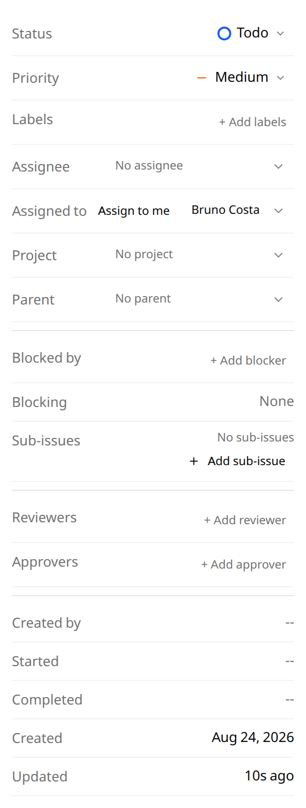

# Task 06: Human Assignee and Takeover

## Acceptance

- `tasks.assignee_user_id` is added via an idempotent migration and is fully
  independent of `assignee_agent_profile_id`. Setting one never clears the
  other, and an Office task with an agent assignee can also carry a human one.
- `PATCH /api/v1/tasks/{id}` accepts `assignee_user_id`, gated on `task.write`.
  A `viewer` receives 403; any caller holding `task.write` may assign to
  themselves.
- Assignment is advisory: it gates nothing. A caller who is not the assignee
  retains every scope they already hold.
- Setting the assignee to a user who cannot reach the workspace is refused.
- Takeover is reassign plus continue: the session, worktree, executor, and ACP
  session are untouched by a reassignment, proven by asserting the execution ID
  and worktree path are unchanged across the operation.
- `assignee_user_id` reaches the task DTO, the boot payload, and the sidebar
  filter dimensions.
- Task lifecycle events publish through the existing event path so the kanban
  updates live.

## Verification

- `go test ./internal/task/... -run 'TestAssigneeUser|TestTakeoverPreservesSession'`
- `KANDEV_TEST_POSTGRES_DSN=... go test ./internal/task/repository/sqlite/...`

## Files Likely Touched

- `apps/backend/internal/task/repository/sqlite/base_migrations.go`
- `apps/backend/internal/task/models/models.go`, `internal/task/dto/dto.go`
- `apps/backend/internal/task/service/service_tasks.go`
- `apps/backend/pkg/api/v1/` task DTO

## Inputs

- Spec: What (human assignee, takeover), Permissions, Scenarios.
- Patterns: ADR 0005 Wave F on why the agent assignee is not a task column; the
  task lifecycle event rule in `apps/backend/AGENTS.md` (every task mutation
  publishes, or the kanban goes stale).

## Output Contract

Report the independence test between the two assignee fields, the
session-preservation evidence for takeover, RED/GREEN commands, and set this
task plus its plan checkbox to done.

## Result

Done. `tasks.assignee_user_id` is added by `ensureTeamAccessSchema` and carried
through `internal/office`'s priority-to-TEXT rebuild, which recreates the tasks
table from a hardcoded column list and had been dropping it silently:
`MigrateLogger.Apply` swallows the error, so the only symptom was "table tasks
has no column named assignee_user_id" from unrelated write paths on a fresh
install. Two regression tests pin it, one at the rebuild
(`TestMigrate_PriorityRebuildPreservesAssignee`) and one at the service level
where both repositories share a database
(`TestUpdateTask_AssigneeSurvivesOfficeMigration`); a repository-only test
cannot see the loss.

Both write surfaces accept the field: `PATCH /api/v1/tasks/{id}` through the
task service, and `PATCH /api/v1/office/tasks/{id}`, which the properties panel
calls. The office route delegates the whole write to the task service's
`SetHumanAssignee` rather than writing the column itself. That is not only to
avoid duplicating the reach rule: the office route carries no `:wsId`, so
`officeWorkspaceScopeMiddleware` does not gate it, and a direct column write
would have let any signed-in user assign a task in a workspace they cannot
reach. With no writer wired the route refuses the mutation.

Independence and takeover are asserted directly: setting the human assignee
leaves the agent runner untouched and vice versa, and a reassignment changes
exactly one field (`TestUpdateTask_HumanAndAgentAssigneesAreIndependent`,
`TestUpdateTask_TakeoverLeavesExecutionStateUntouched`).

Delegating also closed a gap found by driving the live instance rather than
the tests: `officeWorkspaceScopeMiddleware` only gates routes carrying a
`:wsId`, so every office task mutation is ungated for browser callers. Against
a seeded two-role instance, a viewer and a non-member could both be refused
only after the write went through the task service. Their refusals now carry
the right status too: viewer 403, non-member 404 (existence stays hidden), and
an assignee who cannot reach the workspace 400 with a showable reason instead
of a 500.

The UI is an "Assigned to" row in the task properties panel with an
"Assign to me" button, hidden entirely when authentication is disabled. Copy
ships in all five locales. Names come from the user directory merged with the
workspace member list: the member list alone rendered every colleague who
reaches an org-visible workspace as a raw user id, which the screenshot below
caught and no unit test would have.

Both boards carry it. Kanban was not a second implementation: the office
picker and the kanban control share `useAssignablePeople`, and the field
travels the one existing kanban mapper (`toKanbanTask`) plus the SSR snapshot
mapper. Each of those three hops has its own test, because a dropped hop shows
every task as unassigned with no error anywhere.

Driving the live instance found two defects the unit tests had not: the
`task.updated` payload is hand-built and never carried `assignee_user_id`, so a
takeover left the previous owner's name on every open client until a reload;
and the frontend merge treats an absent key as "unchanged", so once the field
did arrive it needed the same preserve guard `parent_id` has, or an unrelated
lightweight update blanked it. Both now have regression tests on the exact
symptom.

Not done: the sidebar **filter dimension** for the human assignee. The filter
UI is built around agent assignees (`use-tasks-tree.ts` filters on
`assigneeIds`), and adding a second people-shaped dimension is a filter-model
change rather than a field pass-through. The field itself reaches the task DTO
and the detail view.

RED/GREEN:

- RED: `go test ./internal/task/service/ -run TestUpdateTask_AssigneeSurvivesOfficeMigration`
  fails with "table tasks has no column named assignee_user_id" when the office
  rebuild's column list is reverted.
- GREEN: `go test ./internal/task/... ./internal/office/...`
- GREEN: `pnpm test -- components/task/simple/components/human-assignee-picker.test.tsx`
