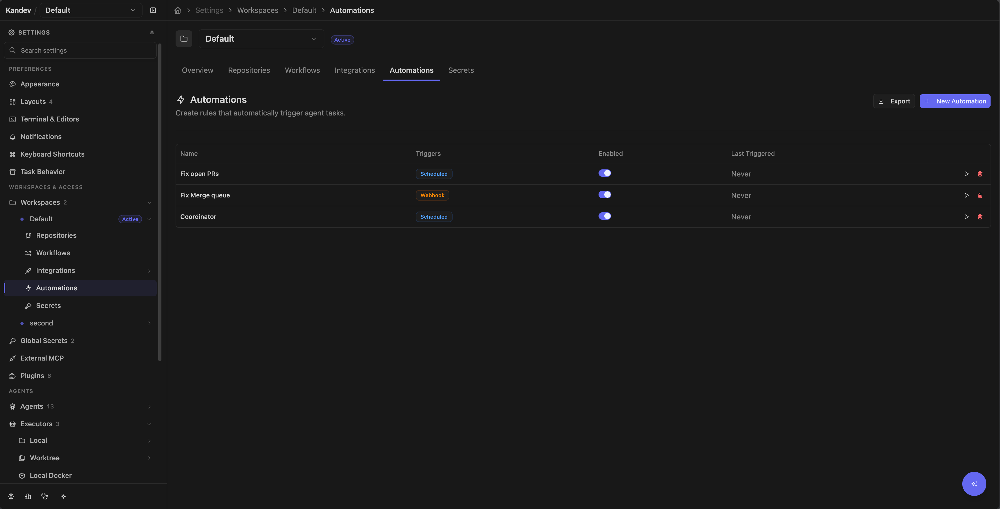
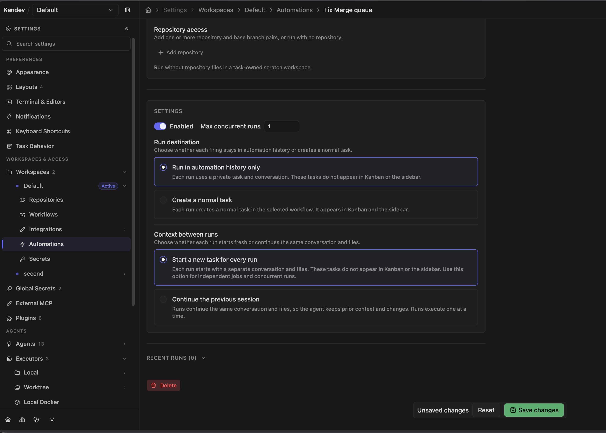
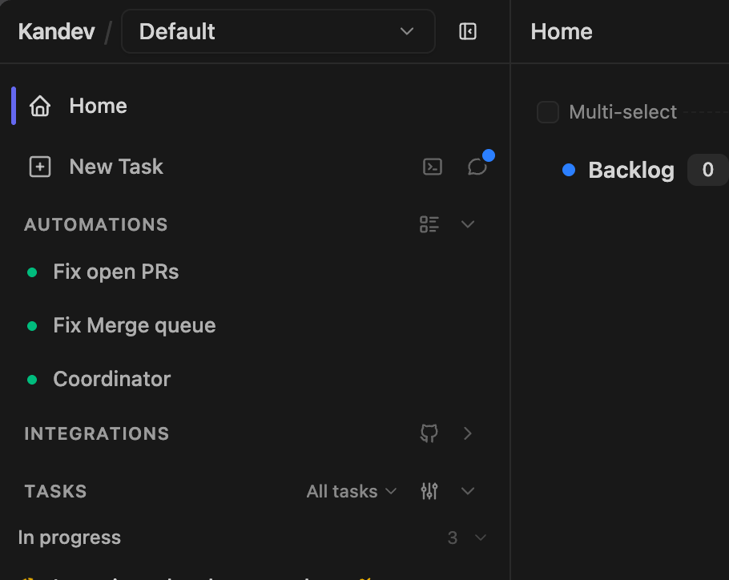

# Automation and MCP

Kandev has several mechanisms that can act without repeated manual setup. Their scopes and trust boundaries differ:

| Mechanism                   | Purpose                                                                                                        |
| --------------------------- | -------------------------------------------------------------------------------------------------------------- |
| Workflow events and actions | React to an existing task entering a step, receiving a message, or completing an agent turn.                   |
| Workspace automations       | Create task-backed work from a schedule, GitHub pull request, webhook, or manual trigger.                      |
| Task MCP                    | Give an active Kandev session task, plan, conversation, and coordination tools.                                |
| Office MCP and runtime CLI  | Give an Office run a restricted coordination surface and permission-checked commands for Office state changes. |
| Profile MCP                 | Add third-party MCP servers to one agent profile, subject to executor policy.                                  |
| External MCP                | Let a client outside a task configure Kandev and create or manage work through the backend.                    |

Use workflow events for predictable transitions on existing work. Use a workspace automation when an external signal must create new work. MCP is a tool interface, not a scheduler.

Across Kandev's task, configuration, external, and Office MCP modes, each tool call is validated against that mode's live `tools/list` schema before its handler runs. Missing required fields, wrong types, declared constraint violations, and unknown top-level fields return a tool error without performing the requested action. A missing-field error names each absent schema property, but never echoes submitted argument values. Nested configuration maps still accept arbitrary keys when their schema defines them as open.

## Quick path

- Use a **workflow event** for predictable transitions on existing tasks.
- Use a **workspace automation** when a schedule or external signal should create work.
- Use **task MCP** for tools inside an active agent session.
- Use **profile MCP** to add servers to an agent profile.
- Use **external MCP** to expose Kandev tools to third-party clients.
- Treat credentials delivered through any MCP or executor profile as available to the receiving agent.

## Workflow events and human gates

Regular workflow entry actions can enable plan mode, reset agent context, or auto-start an agent; auto-start can use the step prompt or a stored prompt override. Turn-start and turn-complete events can move the task, while turn-complete and step-exit actions can disable plan mode. There is no regular standalone **stop agent** or **send prompt** workflow action. Approval/review steps and steps without automatic start remain the supported human gates. Inspect events on both the source and destination step before enabling a move or automatic start; otherwise two steps can form a loop.

See [Tasks and workflows](tasks-and-workflows.md) for event configuration and defaults.

## Create a workspace automation

Open **Settings > Workspaces > _Workspace_ > Automations** (`/settings/workspace/{workspaceId}/automations`) and select **New Automation**. The top-level `/settings/automations` route redirects to, or asks you to select, a workspace.



1. Enter a required name and optional description.
2. Select an agent profile and executor profile. Passthrough profiles are not offered. Worktree and Local-compatible profiles can run without a repository in a task-owned scratch workspace.
3. Choose the run destination:
   - **Run in automation history only** keeps each generated task out of Kanban and the sidebar. Workflow selection is optional.
   - **Create a normal task** creates ordinary workflow work that appears in Kanban and the sidebar. A workflow is required; an empty starting step uses that workflow's configured starting step.
4. Add one or more repository and base-branch pairs, or leave the list empty. The selector is the same searchable paired-chip control used by New Task. A discovered repository is registered in the workspace when the automation is saved. An empty list uses a task-scoped scratch workspace and does not create a Git worktree. Kandev never selects the workspace's first repository for you.
5. Enter a prompt and optional task-title template.
6. Choose **Context between runs**:
   - **Start a new task for every run** creates a separate task, conversation, and task environment for each firing. In the hidden destination, those tasks do not appear in Kanban or the sidebar; in the normal-task destination, they do.
   - **Continue the previous session** reuses one task, primary session, conversation, and worktree across firings. The destination and exact repository/base-branch pairs remain part of continuation compatibility.
7. Keep the default maximum concurrency of 1 unless parallel work is safe. Reused sessions always use one active run.
8. Choose a schedule and optional GitHub condition, or switch to webhook mode.
9. Save, use **Run now** on the automation's page, then read what it said before widening credentials or scope.



The form can save an empty agent or executor selection, but launch still needs a usable profile. Scheduled, manual, webhook, and provider-triggered runs can remain repository-free. When a provider event supplies an exact repository through its established contract, Kandev uses that event context. A GitHub pull-request run with configured repository access checks out that PR's head branch and uses its base branch.

### What a firing produces

Every firing produces a distinct `AutomationRun` with exact task, session, and turn identity. A hidden destination uses `origin = automation_run`; that origin, not `is_ephemeral`, keeps its persistent task out of Kanban and task lists. A normal-task destination uses a separate visible automation origin, enters the selected workflow at its configured start step, and follows the ordinary task lifecycle. The workflow selector shows the same ordered step preview as New Task; automations do not have a separate step selector. The trigger is the start signal, so the agent starts immediately rather than waiting for a workflow step's `auto_start_agent` action.

With **Start a new task for every run**, each firing gets its own task, primary session, worktree or scratch workspace, and conversation. With **Continue the previous session**, the first firing creates one task and later firings send a new turn to its primary session. Kandev does not reset or rebase a reused checkout. If the saved task, session, runtime, or task environment is missing or incompatible, the firing creates a replacement thread and records that action on the run. A reused task keeps its creation title; each run keeps its own rendered `display_title` snapshot.

A finished run parks in `WAITING_FOR_INPUT` rather than `COMPLETED`, so you can reply to it and the agent continues in the same session and worktree. A run is a thread, not a receipt. Worktrees are retained for the ten most recent finished task IDs of each automation and reclaimed beyond that, so an older run stays readable but can no longer be answered.

The run destination and ordered repository/base-branch pairs are explicit saved settings. Existing empty repository selections migrate to scratch execution; there is no workspace-default fallback. Existing selected repositories use their configured default branch until the automation is saved with an explicit branch. Changing the destination, workflow, repository pairs, or runtime profiles replaces an incompatible reusable continuation on its next firing. Visible automation tasks survive automation deletion; hidden tasks use the automation cleanup lifecycle.

Selecting a run opens the complete shared transcript and focuses its exact turn. Replies sent from that transcript create a new turn in the same conversation and remain visible; run selection does not filter away newer replies.

A run cannot wait for a permission response. Kandev rejects the request and marks the run failed. Use only a profile whose intended, constrained actions can complete without a prompt.

## Trigger behavior

The editor has two exclusive layouts:

- **Scheduled**: one schedule plus at most one GitHub condition;
- **Webhook**: one authenticated webhook trigger. Switching to webhook deletes the schedule and condition, and switching back deletes the webhook trigger.

In the current backend, the schedule and GitHub PR condition are independent triggers. A non-empty schedule creates generic scheduled runs, while the PR trigger separately polls GitHub. Adding a PR condition does not constrain the scheduled run. Clear the schedule expression if the automation should run only for matching PRs.

### Schedule

The scheduler checks every 30 seconds and computes each expression's next calendar fire time in its configured timezone. A schedule created part-way through the day first fires at its next scheduled occurrence after creation (not immediately). A schedule missed while the backend was stopped fires once on the next check rather than once per missed occurrence.

<DocsVideo
  webm="./media/feature-guides/scheduled-workflow-automation.webm"
  mp4="./media/feature-guides/scheduled-workflow-automation.mp4"
  poster="./media/feature-guides/scheduled-workflow-automation.webp"
  title="Schedule workflow automation"
  caption="A workflow automation is configured with a schedule and saved for recurring execution."
/>

Use the supplied presets: every 5, 15, or 30 minutes; hourly; every 6 hours; daily; or weekly. The backend also accepts `@every` followed by a Go duration, `@hourly`, `@daily`, `@weekly`, and step forms such as `*/10 * * * *` or `0 */6 * * *`.

The editor accepts arbitrary five-field cron text, including fixed calendar forms such as `30 8 * * *`, weekday ranges such as `15 9 * * 1-5`, and day-of-month schedules, all of which now fire at the correct time. A saved timezone (for example `America/New_York`) is honored, including that zone's daylight-saving transitions; an empty timezone means UTC, so schedules are deterministic regardless of the host clock. Scheduled runs are deduplicated per trigger per minute.

### GitHub pull requests

The GitHub evaluator polls every 60 seconds and requires a working GitHub integration. It searches open PRs and supports:

- an explicit list of repositories;
- base-branch glob filters, including `*` and a trailing wildcard such as `release/*`;
- exact author-login filters;
- draft exclusion.

Select at least one repository. Although the UI offers **All repos**, an empty repository list is not evaluated, so it produces no PR runs. The editor exposes only the **Opened** event, but the evaluator currently ignores the saved event list: clearing that checkbox does not stop polling or firing. Disable the automation/trigger instead. The first evaluation considers every currently open matching PR rather than only PRs opened after the automation was enabled. Each matching PR is then deduplicated once per automation by repository and PR number.

The current evaluator does not apply label filters, and the current form does not offer them.

### GitHub pull requests merged

The **Pull request merged** condition watches pull requests linked to tasks in the
automation's workspace. Select **All repositories** or an explicit repository list, then
optionally filter by the pull request's base branch (for example `main` or `release/*`).
Kandev uses the existing GitHub PR poller, so a merge can take up to one minute to be
noticed. There is no backfill sweep when you create or enable the condition: it fires on
the first qualifying `github.task_pr.updated` event. Linking an already-merged PR, or a
later sync that changes a merged PR row, can therefore qualify that task once.

Each firing creates a hidden automation run task and carries the linked task id as
`{{data.task_id}}`. The default prompt asks the agent to call `archive_task_kandev` for
that task. The backend also binds the run to the event-selected task, so a missing or
different archive target is rejected before any task is changed. An already archived
target is safe and reports `already_archived`.

The merge is deduplicated per automation, task, repository, and pull-request number. A
concurrency-cap skip or a failure before a task is created does not consume that key, but
there is no durable retry queue; another PR update must arrive for it to be tried again.
**Run now** creates a manual run without a linked task id, so it tests the automation but
does not replay a missed merge.

### GitHub push and CI checks

Push and CI-check conditions are webhook-driven rather than polled. They require a workspace GitHub App connection (Settings > Workspaces > _workspace_ > GitHub) whose installation is subscribed to the `push` and `check_run` events. When the App delivers a matching, HMAC-verified webhook, the installation is resolved to its workspace and the matching automation fires.

- **Push**: fires when commits are pushed to a matching branch. Configure an explicit repository list and optional branch glob filters (`main`, `release/*`). Branch deletions are ignored. Deduplicated per repository by branch and pushed commit SHA.
- **CI check**: fires when a check run completes. Configure an explicit repository list, the conclusions to match (defaults to `failure`, which drives auto-fix-CI flows), and optional check-name and head-branch filters. Deduplicated per repository by check-run ID.

Because GitHub Apps only deliver events a user subscribed to at installation time, an App connection created before push/CI support was added must be reinstalled (or updated from its GitHub settings page) before these webhooks begin arriving. This generic CI trigger is distinct from the task-specific PR check remediation described under review features.

### Webhook

After creating a webhook automation, copy its URL and one-time displayed secret. The edit page can reveal the secret again.

Send:

```http
POST /api/v1/automations/webhook/{automationId}
X-Webhook-Secret: <secret>
Content-Type: application/json
```

Kandev silently reads only the first 1 MiB of the request body; it does not reject an oversized body. If that retained prefix is valid JSON, it becomes trigger data. Empty or invalid JSON is wrapped as `{"body":"<raw text>"}`. The endpoint returns 401 for a wrong secret, 404 for an unknown automation, and 409 when the automation or its webhook trigger is disabled.

Webhook delivery has no event deduplication or filter-expression evaluator. Make downstream actions idempotent when the sender retries. The secret is stored with the automation rather than in Kandev's encrypted provider-secret store, and anyone with Kandev settings access can reveal it. Treat it as a credential, use TLS, keep it out of URLs/logs, and replace the automation if rotation is required.

### Manual trigger

**Run now** on an automation's page and the play action in the settings table fire a run with trigger type `manual` and no deduplication. Use either action to test repository/profile resolution and read what comes back.

A trigger can succeed and still run nothing. A disabled automation, an already-fired dedup key, or a concurrency cap that is already reached all report **skipped with the reason** rather than claiming a fire. A cap skip writes a run row so the history explains itself; a disabled automation does not, since nothing was ever going to run.

## Prompt and title placeholders

Every trigger supports `{{trigger.type}}`, `{{trigger.timestamp}}`, and `{{data.<path>}}`.

GitHub PR runs additionally support `{{pr.number}}`, `{{pr.title}}`, `{{pr.url}}`, `{{pr.author}}`, `{{pr.repo}}`, `{{pr.branch}}`, `{{pr.base_branch}}`, and `{{pr.body}}`.

Webhook runs support `{{webhook.body}}` and `{{webhook.<path>}}`. Dot segments traverse nested objects, and a numeric segment indexes an array, for example `{{webhook.commits.0.message}}`. Scalar values are converted to text; objects and arrays become JSON. Missing or unresolved placeholders are removed rather than sent literally.

Trigger payloads are untrusted input. Do not let a PR body or webhook field silently choose credentials, repositories, shell commands, or a production target.

## Read what an automation has been doing

**Automations** in the sidebar lists the workspace's automations with a health dot. Picking one opens it. **`/automations`** is the agenda across all of them, what fires next, and the recent runs of every automation in one feed. **`/automations/<id>`** is one automation's conversation: it opens on the newest run's transcript, carries the run's title snapshot and a reply box, and groups runs as Running / Completed in a rail or mobile drawer. A selected open run exposes **Stop current run**, which cancels its exact task, session, and turn without touching another run in a shared session. Configuration is behind **Details**, because an automation is configured once and read continuously.



`/runs` still resolves to the same places, so older links keep working.

## Concurrency, history, and cleanup

Maximum concurrent runs defaults to 1 and cannot be less than 1. An admitted `triggered` run and a bound `task_created` run are both open until their exact turn is settled. A run counts as active while its task is neither deleted, archived, nor explicitly cancelled, the same definition the UI uses when it says an automation will not fire because a run is still open, so the reason shown and the cap causing it cannot disagree. `reuse_thread` requires `max_concurrent_runs = 1`. When the cap is reached, Kandev records a `skipped` run and advances the schedule's evaluation time rather than retrying every 30 seconds.

Run history can report `triggered`, `task_created`, `succeeded`, `failed`, `skipped`, `archived`, or `cancelled`. `triggered` means that admission succeeded but task/session/turn binding is not complete. The last two are derived at read time, not stored: a `task_created` run whose task was deleted or whose primary session was cancelled reads as `cancelled`, and one whose task was archived reads as `archived`. That derivation is defined once and shared by every view, so two surfaces cannot disagree about the same run.

A run that produced a task opens its conversation. A run that never produced one (a skipped firing) is listed but inert; there is nothing to read.

Deleting one run also deletes its associated task when no other automation run references it. **Delete all runs** deletes all now-unreferenced associated tasks and history for that automation and is irreversible. Automation deletion captures referenced hidden tasks in durable cleanup jobs and retries task/worktree cleanup after the database deletion if necessary.

### Continuation and fallback history

Native session continuation and provider-managed compaction remain authoritative for a healthy reusable session. If Kandev must synthesize a non-native resume prompt, it includes only the newest 50 non-empty `user_message` and `agent_message` entries, returned in chronological order and truncated per message. Tool calls, tool results, status events, and unknown event types do not appear and do not consume slots. The current firing prompt is added outside that 50-message window. Durable session history is not rewritten.

### Automation coordinator MCP

Automation sessions receive one fixed, workspace-scoped coordinator MCP surface. The server resolves the trusted automation principal before dispatch and uses that principal for workspace, caller task, caller session, surface, and audit identity; a prompt or tool argument cannot forge those values. The catalog includes coordination and pending-question or permission actions needed by an automation, but excludes task deletion, configuration mutation, task-local authoring, provider PR/MR actions, diagnostics, plugins, and arbitrary capability settings.

The automation's own hidden task and every session on it are invalid targets for mutation, messaging, stopping, spawning, and blocker discovery or resolution. Foreign-workspace targets return the same not-found result as unknown targets. A task spawned on another allowed task receives that target task's normal MCP profile and never inherits the automation surface. Reused worktrees are not reset or rebased by coordinator actions.

## Export automations

The automations settings page (**Settings > Workspaces > _Workspace_ > Automations**) has an **Export** control next to **New Automation**. It downloads every automation in the workspace as a zip, one YAML file per automation at `.kandev/automations/<slug>.yml`, ready to read, diff, or check into a repository. A workspace with no automations still downloads a (empty) zip rather than showing an error.

The same data is available directly over REST for scripting: `GET /api/v1/workspaces/:workspaceId/automations/export` returns one YAML document (`application/yaml`) listing every automation, and `GET /api/v1/workspaces/:workspaceId/automations/export/zip` returns the same per-file zip the UI control downloads (`application/zip`). Both are read-only and deterministic: exporting an unchanged workspace twice produces byte-identical output. A workspace you cannot access and a workspace that does not exist both return `404` with no distinguishing detail; any other failure returns `500`.

## Task MCP

Kandev automatically injects a task-aware MCP server into supported agent sessions. You do not need to add it to the profile. It lets the active agent use current IDs and structured operations instead of inferring board state from text.

Names ending in `_kandev` are the canonical MCP protocol tool names. Some agent clients show or register a server-qualified alias instead. For example, a client may expose canonical `step_complete_kandev` as `mcp__kandev__step_complete_kandev`. That qualified form is client-specific, not a second tool or a universal name; use the form exposed by the active client.

Task tools use normal client discovery. When `step_complete_kandev` is required but is not already visible, the agent should search the active tool catalog for its canonical name. Kandev does not request eager loading through client-specific metadata.

`create_task_kandev` advertises `prompt` for instructions delivered to a newly started agent. Older callers may still send `description` when `prompt` is absent, but sending both is an error; the compatibility name is intentionally omitted from the advertised schema.

### Native rich output

Task and Office agents can call `show_rich_output_kandev` when a workspace file,
trend, comparison, or small metric group is materially clearer as a native
presentation than as prose. The injected agent context requires this tool when
the user explicitly asks for a chart, graph, plot, or file preview and suitable
data is available. Prefer plain text or Markdown for ordinary answers. Small
row-and-column comparisons should remain Markdown tables; native tables would
duplicate that capability while adding another layout and accessibility
contract.

Version 1 accepts a title, an optional description, and one to four ordered
blocks:

- `file` references a task-workspace-relative path. It can include an optional
  repository discriminator, title, caption, and MIME type. Kandev never accepts
  absolute paths, traversal, URLs, data URIs, or inline file bytes.
- `chart` renders a line or bar chart and includes a plain-text summary for
  nonvisual interpretation. Data can be supplied in either of two ways:
  - Inline `labels` plus 1 to 4 `series`, with one finite numeric or `null`
    value per label.
  - A `csv` descriptor with a workspace-relative `.csv` `path`, optional
    `repo`, exact `x_column`, and 1 to 4 numeric `series` column mappings.
    Kandev reads 1 to 100 rows in file order. Empty numeric cells become gaps.
- `metrics` renders 1 to 6 plain-text label/value pairs with optional details.

Kandev renders visible x/y values and automatically shortens ISO date/time
labels, large numbers, and long categories on the axes. Tooltips retain the
original x label and full values. Give every series a clear label and include
its unit when useful, for example `p95 (ms)`. A one-series chart displays that
label as an informational legend; a multi-series chart renders local keyboard-
and touch-operable legend filters. Those filters change only the current view,
not the persisted result or agent context.

The complete tool input is limited to 64 KiB. Titles are limited to 120
characters and the optional presentation description to 500 characters.
Unknown fields and unsupported versions are rejected. Agents cannot choose
HTML, Markdown, JavaScript, CSS, colors, animation, component names, or layout;
Kandev owns those details so results remain consistent, accessible, and
responsive.

```json
{
  "version": 1,
  "title": "Build health",
  "description": "Latest local verification",
  "blocks": [
    {
      "type": "metrics",
      "items": [
        { "label": "Passed", "value": "38" },
        { "label": "Duration", "value": "12.4s", "detail": "Warm cache" }
      ]
    },
    {
      "type": "chart",
      "chart_type": "line",
      "title": "Runtime by run",
      "summary": "Runtime fell across the last five runs.",
      "labels": ["1", "2", "3", "4", "5"],
      "series": [
        { "label": "Runtime (s)", "values": [18.2, 16.4, 15.1, 13.8, 12.4] }
      ]
    },
    {
      "type": "file",
      "path": "reports/build.json",
      "title": "Raw report",
      "mime_type": "application/json"
    }
  ]
}
```

Use a CSV-backed line chart for a time series already present in the workspace:

```json
{
  "version": 1,
  "title": "API latency",
  "blocks": [
    {
      "type": "chart",
      "chart_type": "line",
      "title": "p50 and p95 latency",
      "summary": "Tail latency fell across the recorded samples.",
      "csv": {
        "path": "reports/latency.csv",
        "x_column": "recorded_at",
        "series": [
          { "column": "p50_ms", "label": "p50 (ms)" },
          { "column": "p95_ms", "label": "p95 (ms)" }
        ]
      }
    }
  ]
}
```

The source file might contain:

```csv
recorded_at,p50_ms,p95_ms
2026-08-13T10:00:00Z,18.2,29.4
2026-08-14T10:00:00Z,16.4,25.1
```

Use the same CSV form for a categorical bar comparison:

```json
{
  "version": 1,
  "title": "Traffic mix",
  "blocks": [
    {
      "type": "chart",
      "chart_type": "bar",
      "title": "Requests by route",
      "summary": "The API route carries most request volume.",
      "csv": {
        "path": "reports/routes.csv",
        "x_column": "route",
        "series": [{ "column": "requests", "label": "Requests" }]
      }
    }
  ]
}
```

CSV files must be UTF-8 text with one unique header row, no more than 256 KiB,
and 1 to 100 data rows. Named columns must exist exactly. X values must be
non-empty and at most 120 characters. Selected numeric cells must be finite
numbers or empty; malformed rows and invalid values reject the tool call with
the source row and column when available.

A completed presentation persists with the conversation and replays after a
reload. For a CSV chart, Kandev resolves selected columns during the tool call
and persists only bounded labels plus numeric or `null` values. It never stores
the raw CSV and never re-reads it during replay, so later edits or workspace
cleanup do not change the accepted chart.

File-preview bytes do not persist: Kandev fetches a referenced file only after
the user selects **Preview**, and **Open file** uses the existing desktop or
mobile file viewer. If the task workspace later disappears, the presentation
remains while that file block reports that its preview is unavailable.

This is a Kandev-native MCP tool, not a portable MCP rich-content standard or an
MCP App. Portable MCP content uses protocol-level content and resource types that
multiple compatible hosts can interpret, usually with less host-specific visual
control. MCP Apps let a server supply an interactive `ui://` application that a
supporting host runs in a sandbox; that enables richer interaction but introduces
a larger trust, permissions, lifecycle, and compatibility surface. Neither path
is implemented by this tool, and other MCP clients should not be expected to
render its payload as Kandev does.

### Task dependencies over MCP

`create_task_kandev` accepts `blocked_by`, a list of task IDs the new task must
wait on. Two further tools manage links on an existing task:

- `add_task_dependency_kandev` with `depends_on_task_id`, and an optional
  `task_id`.
- `remove_task_dependency_kandev` with the same arguments. Removing a link that
  is not there succeeds.

In a task-bound session, `task_id` defaults to the agent's own task and may only
name that task; use `depends_on_task_id` for the other end. The link is
authorized against both tasks, and a link that would close a cycle is rejected
with the offending path.

**Use a dependency for ordering, a subtask for decomposition.** Reaching for
`parent_id` to express "do this one first" gets neither the start gate nor the
chain: children run whenever they are started, and a parent's completion signal
fires when all children reach any terminal state, including failure.

An agent decomposing a plan into ordered steps should create each step with
`blocked_by` pointing at the previous one and leave `start_agent` at its
default. A create that declares dependencies does not launch immediately: the
requested start is recorded and fires once every predecessor has completed
successfully, so three chained creates produce a chain rather than three agents
in the same repository at once. Pass `start_when_unblocked: false` to create the
links with no launch intent at all. With no `blocked_by`, `start_when_unblocked`
records nothing and the task starts or does not start purely per `start_agent`.

Only success resolves a link. A predecessor that fails or is cancelled leaves
its dependents blocked with a reason naming it, and Kandev does not retry it or
drop the link on its own.

Starting a chain step by any other means consumes its recorded start, so the
gate cannot fire a second session on a task that is already running. A start
that fails keeps the intent, and preparing a workspace without launching an
agent does not consume it.

While a step is still waiting, `update_task_kandev` accepts
`deferred_launch_prompt` to replace the prompt it will launch with. Use it when
the brief written at creation time has gone stale. The rest of the recorded
launch (agent profile, executor) is preserved. Once the task has started the
update is rejected, because nothing would read the new prompt; send the new
context with `message_task_kandev` instead.

### Autopilot tasks and MCP profiles

Task creation accepts one optional boolean:

```go
mcp.WithBoolean(
    "autopilot",
    mcp.Description(
        "Start this task in autopilot mode. Default: false. The value is fixed at creation and is not inherited by subtasks. The agent does not ask the user directly; it asks its direct parent only for critical decisions.",
    ),
),
```

The value defaults to `false`. It is fixed when the task is created and is not
copied to a subtask. The task record is the source of truth after creation; a
later task update cannot switch the prompt or MCP tools between normal and
autopilot behavior.

The top-level task dialog does not expose this option. The subtask dialog has a
compact Autopilot switch with help text, but the value remains fixed after the
subtask is created.

Kandev builds the task MCP server from a backend-owned profile. The base
surfaces are `kanban-task`, `office-task`, `configuration`, and `external`.
Optional capability groups, such as task titles, provider automation, user
questions, and parent questions, are added or removed from that base profile.
This keeps tool discovery small and makes a context change atomic.

For a Kanban task, normal sessions receive `ask_user_question_kandev`.
An autopilot child receives `ask_parent_question_kandev` instead. An autopilot
root receives neither question tool. Kandev never registers both question
tools for one task session. Office sessions use their smaller skill/CLI
surface and do not receive Kanban task-creation tools.

An autopilot child should ask its parent only when a decision blocks useful
progress. `ask_parent_question_kandev` returns a `question_id` immediately;
the child turn then ends. The parent receives a durable question message and
answers with `message_task_kandev` using the child task ID and
`reply_to_question_id`. The child stays in the waiting-for-input state until
the correlated answer arrives, so the sidebar shows the normal question
indicator during the wait.

### Create idempotency with `external_id`

A caller that cannot tell whether an earlier `create_task_kandev` call (or `POST /api/v1/tasks`) actually landed (a crash before recording the response or a webhook redelivery) can pass an `external_id` and retry safely instead of guessing. `external_id` is an opaque, caller-chosen string, case-sensitive and byte-exact, unique per workspace: two workspaces can each hold their own task for the same value, but a second create for a value already held in the same workspace never makes a second task there. It is validated and trimmed like other free-text fields; a value that is empty after trimming is treated as if the field were omitted.

Every create response from both the MCP tool result and the REST response body always carries two additional fields, whether or not the request included an `external_id`:

- `deduplicated`: `true` when the returned task already existed for that identity, `false` when this call created it.
- `creation_complete`: `false` only when the returned task is an existing one whose own create had not finished when observed and may still be running (it is not proof the other create is still alive; it may have crashed). Every other outcome reports `true`.

<details>
<summary>Reading the four outcomes</summary>

| `deduplicated` | `creation_complete`                                | Meaning                                                                                                                                                                                                                |
| -------------- | -------------------------------------------------- | ---------------------------------------------------------------------------------------------------------------------------------------------------------------------------------------------------------------------- |
| `false`        | `true`                                             | This call created the task.                                                                                                                                                                                            |
| `true`         | `true`                                             | An earlier, finished create already holds this identity; that task is returned unchanged, with no new task, agent, or side effect of any kind.                                                                         |
| `true`         | `false`                                            | An earlier create for this identity had not finished when observed and may still be running, or may have crashed. The task is returned as-is; nothing about it is started, modified, or assumed finished.              |
| `false`        | `true`, and `external_id` absent from the response | This call finished creating a task, but another actor released or reused the identity in the narrow window before settlement. The task exists and is otherwise normal; it simply is not holding that identity anymore. |

</details>

**Do not react to `creation_complete: false` by releasing the identity and retrying.** The other create may still be doing required work; releasing it out from under that work can produce two tasks for the same identity. `creation_complete: false` means "ask again later," not "safe to force." An operator who has independently confirmed a create is abandoned (not merely slow) can free its identity with `DELETE /api/v1/workspaces/:workspace_id/tasks/by-external-id?external_id=...`, which returns `204` and leaves the task itself untouched. `GET` the same path to look up the task currently holding an identity, including one still unsettled, without creating anything; it returns `404` when nothing holds it.

Deleting or archiving the task that holds an identity does not carry the identity forward: archiving leaves it in place, but deleting the task frees the identity for reuse by a later create. `external_id` cannot be changed after creation; update requests that include it leave the task's identity untouched. The WebSocket `task.create` action and the plugin host's `Tasks().Create` do not accept `external_id`; use `create_task_kandev` or `POST /api/v1/tasks` for idempotent creates.

A task session currently registers these tool groups:

| Group                               | Available operations                                                                                                                                                                                                                                               |
| ----------------------------------- | ------------------------------------------------------------------------------------------------------------------------------------------------------------------------------------------------------------------------------------------------------------------ |
| Board lookups and task lifecycle    | List workspaces, workflows, workflow steps, tasks, agents, and executor profiles; create, update, move, archive, or delete tasks; halt all live work on a direct child. This mode does not mutate workflows, profiles, or executors.                               |
| Coordination                        | Message a task or targeted session, spawn a named session on the current or another same-workspace task, and read task conversation. See [Agent Communication](agent-communication.md) for delivery semantics, bidirectional reply patterns, and a worked example. |
| User interaction                    | Ask a structured question when the current agent/session supports it.                                                                                                                                                                                              |
| Plans                               | Create, get, update, and delete the current task plan.                                                                                                                                                                                                             |
| Walkthroughs                        | Show, get, and delete the task's code walkthrough.                                                                                                                                                                                                                 |
| Relationships and workspace sources | List related tasks, add a mixed repository/folder source batch to an idle task, use the legacy one-branch tool, and change a repository's diff base.                                                                                                               |
| Workflow signal                     | Signal step completion when an auto-advance step explicitly requires that signal.                                                                                                                                                                                  |

When **Settings → General → Task Actions → Agent-generated task titles** is enabled (the default; an
explicitly saved **off** value remains off), a task-mode session for a newly created task or subtask can
expose `set_task_title_kandev`. The first eligible session to launch atomically claims the handoff and is
prompted to call it before any other work, even though the task already has a provisional title. Use a
short title phrase targeting about six words in sentence case rather than a sentence or progress update.
The tool is omitted for ordinary tasks, tasks created while the setting was disabled, config sessions,
Office sessions, and every later session on the task, even if the owner fails before renaming it. A human
rename wins if it happens first; a late owner call returns `title_not_pending`, while a non-owner call
returns `title_not_owner`, without changing the title.

The same setting applies to ordinary Quick Chat. Quick Chat keeps its agent-and-chat-number label until
the owner receives the first user request, then the owner can set a more useful title. The owner keeps
the title capability while the title is pending, so a later request can retry after an ignored or failed
call. Configuration Chat and Quick Terminal do not expose this capability.

When the owner accepts a generated title, Kandev also updates the names of the task's Kandev-managed
branches from that final title and refreshes the session's branch snapshots. This is evaluated per
repository: a repository opened from an existing checkout branch (including a GitHub PR) is preserved,
as is every Local/Local PC checkout. A branch manually selected before the title call is preserved.
If one managed repository cannot be renamed or its snapshot cannot be persisted, the title remains
accepted and the response reports the successful, preserved, and failed branch outcomes separately.

Task identity is injected for operations that require it. Workspace, parent/subtask, executor, and task-state rules still apply.

### Provider-scoped review automation tools

Task-mode review automation tools follow the providers attached to the task's
repositories. Kandev computes their union when the session launches or
resumes:

| Attached providers  | Discoverable tools                                                  |
| ------------------- | ------------------------------------------------------------------- |
| GitHub only         | `get_task_pr_automation_kandev`, `update_task_pr_automation_kandev` |
| GitLab only         | `get_task_mr_automation_kandev`, `update_task_mr_automation_kandev` |
| GitHub and GitLab   | Both provider-specific pairs                                        |
| None or unsupported | Neither pair                                                        |

Adding a repository source successfully to an idle task can update the live
session's task MCP tool list after materialization. If live refresh is
temporarily unavailable, the source attachment remains committed and the next
launch or resume reconciles the tool list. Tool discovery only describes the
available surface; backend authorization and task/provider validation remain
authoritative for every call. The existing automation request and response
payloads are unchanged.

`spawn_session_kandev` creates a named sibling session on the current task by default and can target another task in the same workspace. `message_task_kandev` can address a task's primary session or an explicit session ID: a running agent receives queued input, an idle/created session can be started, and a failed or cancelled session rejects the message.

Without `session_id` the message goes to the task's primary session. If that primary is cancelled or failed, Kandev falls back to the newest session on the task that can still take a message, so a task with a live session stays reachable after its primary was stopped. A session named explicitly by `session_id` is never redirected. When every session is terminal the call fails and names `spawn_session_kandev`, which is the way to give the task a new session.

A same-task message requires the sibling's session ID. Normal messages can cross workspaces when the sender knows the full task ID. Delivery to a running session is queued by default. When a direct child must abandon its current approach and receive replacement work now, its parent should use `message_task_kandev` with `delivery_mode: "interrupt"`; another sender receives a hard error rather than a silent downgrade, and a request that cannot dispatch safely remains queued.

Use `stop_task_kandev` only when the direct child should halt without a replacement prompt. It has no session selector: one call gracefully stops every execution Kandev still observes as live across the child's active sessions, including non-primary sessions. Accepted sessions become `CANCELLED` before runtime teardown is scheduled. `status: "stopped"` confirms logical cancellation and asynchronous teardown, not operating-system process exit; a child with no live execution returns the idempotent `status: "not_running"` without changing task or session state.

After an accepted stop, Kandev attempts to move an unarchived, non-Office task from `IN_PROGRESS` or `SCHEDULING` to `REVIEW`; other task states are preserved. Worktrees, task environments, commits, task records, descendants, and queued messages remain available, and the task can be started again later.

`add_workspace_sources_kandev` adds one or more sources to an idle task and defaults `task_id` to the current task. A task may also target its same-workspace direct child; Kandev verifies the calling task and session on the backend, so agents cannot provide or override that provenance. Its `sources` input accepts the same atomic mixed batch as the Files panel: `repository` sources use exactly one saved repository ID, local Git path, or remote repository locator plus branch fields; `folder` sources use a local path and optional display name. Repository sources work on Worktree, Local/Local PC, Local Docker, SSH, and Sprites; folders work only on Worktree and Local/Local PC. The target must be repository-backed and have no active turn or tool call. Exact normalized retries are idempotent; contradictory duplicates, unsupported, or failed sources roll back the batch.

`add_branch_to_task_kandev` is the Worktree-only compatibility path for adding one repository/branch during an active agent turn. It creates the worktree as a sibling under the task directory, promotes the persisted Files root to that parent, and rescans it without restarting the agent, terminals, or workspace processes. The response returns `worktree_path` (the exact new repository location), `task_workspace_path` (the Files root), and `agent_cwd_changed: false`; deferred pre-launch materialization omits both paths. The original repository stays a separate Git worktree, so the sibling is not reported as an embedded repository or untracked files by its Git status. Use `add_workspace_sources_kandev` for mixed batch attachments to an idle task. `update_repository_base_branch_kandev` changes the base used for Kandev's diff, not a pull request's target branch.

The HTTP equivalent is `POST /api/v1/tasks/:id/workspace-sources`, with `{ "sources": [...] }`. An exact normalized retry succeeds as a no-op. It returns `400` for invalid input, `404` for a missing task/source outside the workspace, `409` for contradictory duplicates or an active task, and `422` when materialization or executor capability fails. Successful adoption publishes `task.updated` and `session.workspace_sources.updated`; clients should refresh their Files and repository state from those updates.

`step_complete_kandev` is registered and discoverable in every task-mode session, and in Office sessions per ADR 0015. Kandev includes its completion instruction, and acts on its signal, only on steps whose auto-advance action explicitly requires that signal: on Kanban boards this is opt-in per step, while office-default's `work` step ships with the requirement on. A user message arriving before transition can cancel that automatic move.

When `create_task_kandev.repositories[].repository_url` is a canonical GitHub pull request URL or a GitLab merge request URL on the configured host, Kandev resolves the contribution before creating the task. The contribution must still be open, have a valid source branch and head commit, and permit the target project to contribute; Kandev keeps the target repository as `origin`, fetches the exact source commit, and routes commits to the contributor's existing source branch. The existing pull request or merge request is associated with the task and reused for later changes, so Kandev does not open a duplicate. Provider-authored title, description, comments, and diff content are not copied into trusted task context. Configure the task's Git credentials as described in [task Git credentials](integrations.md#choose-task-git-credentials); Kandev runs a write preflight before starting the agent.

The task server runs inside agentctl's local runtime boundary. Its MCP routes do not use a separate bearer token. Do not expose agentctl ports; rely on the executor's process/network isolation and Kandev's session scoping.

<details>
<summary>Office MCP and runtime CLI</summary>

## Office MCP and runtime CLI

Office runs use a smaller MCP surface than regular task-mode sessions. The built-in Office server registers exactly these tools:

- `ask_user_question_kandev`;
- `create_task_plan_kandev`, `get_task_plan_kandev`, `update_task_plan_kandev`, and `delete_task_plan_kandev`;
- `list_related_tasks_kandev`;
- `list_task_documents_kandev`, `get_task_document_kandev`, and `write_task_document_kandev`.
- `show_rich_output_kandev`;
- `record_step_decision_kandev` records an `approved` or `rejected` verdict for the current workflow step. It requires a non-empty reason, and a later verdict supersedes the earlier one.
- `step_complete_kandev`, per ADR 0015: Kandev includes its completion instruction, and acts on its signal, only on Office steps whose auto-advance action explicitly requires that signal (office-default's `work` step is one such step).

These tools cover human questions, the current task plan, related-task discovery, task documents, quorum decisions, and the step-completion signal. Office state changes use the injected `$KANDEV_CLI kandev ...` commands instead. An Office agent should not search for additional Kandev MCP tools: Kanban/configuration tools are task-mode only and are not registered in Office mode.

### Runtime credentials

Kandev injects `$KANDEV_CLI`, `KANDEV_API_URL`, and `KANDEV_API_KEY` when the
Office scheduler starts an Office run. The API key is a short-lived, scoped
runtime token; it is not a personal access token or a value to create, copy,
or persist in configuration. The run also receives its agent, workspace, task,
and run identifiers automatically, and the launch context is bound to that
task.

If `agentctl kandev ...` reports that `KANDEV_API_URL` or `KANDEV_API_KEY` is
missing, do not set either variable yourself. A regular task session should use
its injected Kandev MCP tools. An Office-owned task must be started or woken
through Office so the scheduler can supply its signed runtime context.

An Office run can inspect the projects in its current workspace:

```bash
$KANDEV_CLI kandev projects list
```

An agent with the `can_create_projects` permission can create a project. CEO agents receive this permission by default; other roles do not unless it is explicitly granted. `--name` is required, and `--repository` can be repeated for every repository URL or local path owned by the project:

```bash
$KANDEV_CLI kandev projects create \
  --name "Payments" \
  --description "Payment services and checkout" \
  --repository "https://github.com/acme/payments" \
  --repository "/workspace/checkout"
```

The optional project flags are `--lead-agent-profile-id`, `--color`, `--budget-cents`, and `--executor-config`.

Use the returned project ID when creating work in that project:

```bash
$KANDEV_CLI kandev task create \
  --title "Add payment retry policy" \
  --project "$PROJECT_ID" \
  --assignee "$AGENT_ID"
```

Project list and create operations are forced to the workspace in the validated Office run token; the agent cannot select another workspace in these commands. Office runs cannot create or administer workspaces. Create additional workspaces through Kandev's user-facing setup and settings surfaces.

</details>

<details>
<summary>Profile and executor MCP</summary>

## Profile and executor MCP

An agent profile can add `stdio`, `http`, `sse`, or `streamable_http` servers when that agent supports MCP. The built-in Kandev task server is injected separately and cannot be replaced by a profile entry named `kandev`.

Stdio normally starts per session and cannot be shared. Network servers can be shared or per-session. The executor's MCP policy can deny transports/server names, rewrite URLs, or inject environment. See [Agents and profiles](agents-and-profiles.md) for configuration, secret handling, and failure behavior.

### Inspect one running session

Open the **MCP servers** explorer with the button beside the chat composer. The
explorer shows attachment status for the current session and execution. On
desktop, it opens a wide dialog. On touch devices, it opens a full-height
drawer.

The explorer has server, tool-list, and tool-detail levels. On desktop, the
server list stays visible beside the active level. On touch devices, select a
server to open its tool list. Select **Back to servers** to return.

Select `kandev` after Kandev serves `tools/list`. The tool list is sorted and
scrolls independently from the explorer header. Each row shows the tool name
and an estimated token value. Select a tool to open its description and
arguments. Select **Back to tools** to return to the same list position.

The tool page shows common object properties as argument rows. It also shows
plain JSON for nested or composed schemas. A tool without an input schema shows
**No arguments**. A schema that exceeds a storage limit shows **Schema too
large to display**.

Kandev stores at most 64 KiB for one input schema and 512 KiB for all schemas
in one catalog. It stores at most 128 tools and 1,024 UTF-8 bytes for each
description. Notices identify truncated catalogs or schemas.

The `~N tokens` value uses `o200k_base` on the complete compact MCP tool JSON.
It is an estimate, not a provider context count or billing count. The agent can
use a different tokenizer or tool-loading format.

A profile server can show **Delivered, connection unverified**. That server
connects directly to the agent, so Kandev cannot inspect its `tools/list`
result, descriptions, schemas, or token estimates. The explorer still shows
safe status metadata. The built-in Kandev server becomes **Connected** after
MCP initialize. It becomes **Active** after it serves `tools/list`. Missing
observation is not a failure. Red appears only for an explicit sanitized error.

The report is per Kandev session and execution. It stores only bounded,
sanitized attachment facts. It does not store MCP headers, environment values,
tool arguments or results, raw ACP frames, or agent output.

</details>

<details>
<summary>External MCP</summary>

## External MCP

Open **Settings > External MCP** (`/settings/external-mcp`) for client-specific snippets for Claude Code, Cursor, Codex, Auggie, OpenCode, and GitHub Copilot CLI.

The recommended Streamable HTTP endpoint is:

```text
http://127.0.0.1:<backend-port>/mcp
```

SSE compatibility uses `/mcp/sse` with messages sent to `/mcp/message`. A reverse proxy must support long-lived streaming connections.

External MCP exposes 42 tools in these groups:

- workspace/workflow configuration: list workspaces, workflows, repositories, and workflow steps; create, update, delete, import, or export workflows; create, update, delete, or reorder steps;
- agents and profiles: list/update agents; create/delete profiles; list/update profiles; get/update profile MCP configuration;
- executors: list executors and profiles; create, update, or delete executor profiles;
- saved prompts: list prompt summaries without content or read one prompt by its exact, case-sensitive name; saved prompt tools are read-only;
- tasks: list, create, move, delete, archive, or update task state; list a task's sessions; read task conversation; discover or answer pending clarification questions; and discover or resolve live agent permission requests.

`export_workflow_kandev` takes `workflow_id` and returns one version 1 `kandev_workflow` JSON document. It omits instance IDs and timestamps. Pass its JSON text unchanged as `document` to `import_workflow_kandev` when it is within the existing 1 MiB import limit.

### Read a saved prompt

Use `list_shared_prompts_kandev` without arguments to discover saved prompt names. The result
contains summaries only, so it does not include prompt content:

```json
{
  "shared_prompts": [
    { "name": "code-review", "builtin": true, "content_bytes": 1234 }
  ],
  "total": 1
}
```

Use `get_shared_prompt_kandev` with one saved prompt name to read its full content:

```json
{ "name": "code-review" }
```

Names are case-sensitive. Kandev trims surrounding whitespace before lookup. The result contains
`name`, `content`, `builtin`, `content_bytes`, `created_at`, and `updated_at`; it does not expose the
internal prompt ID. An empty or unknown name returns an error without prompt content. These tools
only read saved prompts. They do not create, update, delete, or expand `@name` references.

### Answer a pending clarification question

Use `list_pending_questions_kandev` when an external client needs to discover clarification
questions an agent is blocked on. All arguments are optional: `workspace_id` scopes the results,
`created_since` (RFC3339) filters by age, and `cursor`/`limit` (default 50, capped at 200) page
through results oldest-first.

```json
{
  "workspace_id": "optional-workspace-uuid",
  "created_since": "2026-08-01T00:00:00Z",
  "limit": 50
}
```

Each returned bundle carries `pending_id`, `task_id`, `session_id`, `created_at`, `age_seconds`,
`context`, and an ordered `questions` array; each question carries `question_id`, `title`,
`prompt`, `status`, and its `options` (`option_id`, `label`, `description`).

After the person answers, pass the bundle's `pending_id` plus one entry per question to
`answer_question_kandev`:

```json
{
  "pending_id": "bundle-uuid",
  "answers": [
    { "question_id": "q1", "selected_options": ["opt-a"], "custom_text": "" }
  ]
}
```

Pass `rejected: true` with an optional `reason` instead of `answers` to decline the whole bundle.
Exactly one caller wins a bundle: a losing call (including a REST submission racing this tool)
returns `claimed: false` with the winner's own recorded answer, not an error, so a caller can
always tell whether its answer landed. A `pending_id` that is no longer active with no winner
returns an error naming that state.

### Resolve a live agent permission request

Use `list_pending_agent_permissions_kandev` when an external client needs to show a person the
permission prompts currently blocking a task. `task_id` is required; `session_id` is optional and
must belong to that task. An authorized task with no live request returns an empty list. Each item
contains the exact task, session, request-generation, provider-pending, and tool-call identities;
creation time and status; an allowlisted action projection; and the provider's ordered option IDs,
names, and kinds.

```json
{
  "task_id": "task-uuid",
  "session_id": "optional-session-uuid"
}
```

Command text and working directory are included when safe. File contents, diffs, environment
values, headers, raw MCP arguments, provider-specific fields, and option metadata are omitted.
Credential-like values in presentation text are redacted, and the action reports whether its
returned text changed.

After the person chooses one listed option, pass the returned identities unchanged to
`resolve_agent_permission_kandev`:

```json
{
  "task_id": "task-uuid",
  "session_id": "session-uuid",
  "request_id": "kandev-request-uuid",
  "pending_id": "provider-pending-id",
  "option_id": "allow-once"
}
```

The mutation cannot accept a command, edited tool arguments, cancellation flag, or synthesized
option. To deny an action, select an original `reject_once` or `reject_always` option. Kandev
authorizes the task/session pair, records a durable audit claim, and only then delivers that exact
option to the current live provider request. A concurrent, replayed, withdrawn, expired, or
replaced request fails with a stable permission error and never acts on a newer request. The audit
records the resolving user, actor kind, source, option identity, time, and result, but never the PAT
record ID, credential, command environment, headers, or raw MCP arguments.

Live agentctl state is authoritative for whether a request can still be answered. Persisted message
audit is authoritative for history and replay prevention, but Kandev never reconstructs an
actionable request from message history after its execution is gone. These tools cover structured
agent command/tool permission prompts, not Office approvals or clarification questions.

In external mode, `create_task_kandev` has no current task and does not accept the `parent_id: "self"` shorthand. Its registered top-level contract asks for a repository ID, repository URL (including a supported GitHub pull request or GitLab merge request URL), or local path; workspace and workflow resolve automatically only when unambiguous. The current handler can nevertheless accept an omitted repository and create repo-less work, which is a contract/implementation mismatch rather than a supported equivalent of the regular UI's **None** option. Supply an explicit repository locator for portable clients. A resolvable agent profile is required even with `start_agent: false`; otherwise `start_agent` defaults to true. To create a subtask, pass the full ID of an existing parent.

`create_task_kandev` accepts task titles up to 60 characters. Use a concise, few-word title and put the implementation context in `description`; longer titles are rejected as validation errors.

External mode has no live Kandev session, so it does not expose `stop_task_kandev` or other task-scoped questions, plans, walkthroughs, sibling-session spawning, targeted session messages, branch operations, or step-completion signals. Some external tools can delete or materially reconfigure data; review the client's tool approvals.

</details>

### External MCP security boundary

The `/mcp`, `/mcp/sse`, and `/mcp/message` routes are mounted through
`externalMCPAuthMiddleware`. With authentication disabled, they remain open for
the current single-user behavior. When authentication is enabled, external
clients must provide a personal access token; an already-authenticated browser
session may also pass the same middleware. This is separate from task-mode MCP,
which runs inside the agentctl session boundary.

Permission discovery and resolution use the same task ownership checks as other task reads. A PAT
has only its owning user's scope; administrator role does not grant access to another user's
workspace. Unknown and unauthorized task/session IDs return the same not-found result.

- Bind the backend to loopback for a local single-user install.
- For remote use, place the whole backend behind a VPN, firewall, or authenticated TLS reverse proxy.
- Do not publish the MCP routes or backend port directly to the internet.
- Ensure the proxy protects both Streamable HTTP and SSE/message paths and permits long-lived requests.
- Scope integration, Git, and agent credentials for the damage an unattended client could cause.

## Troubleshooting

- **No scheduled run:** confirm the cron expression is valid five-field or `@`-shorthand text and the automation/trigger is enabled; a schedule fires at its next occurrence after creation, not immediately.
- **No GitHub push or CI runs:** connect a workspace GitHub App whose installation is subscribed to `push`/`check_run` events, reinstall a pre-existing App so it receives them, and select explicit repositories (an empty repository list is not evaluated).
- **Scheduled run happened as well as a PR run:** clear the schedule expression. The two stored triggers fire independently.
- **No GitHub PR runs:** connect GitHub and select explicit repositories; **All repos** currently evaluates none.
- **Run fails before a task starts:** select valid non-passthrough agent and non-local executor profiles, and add/select a repository.
- **Run fails on permission:** an automation run cannot answer prompts. Use a safely constrained profile that does not require one, or reply to the run afterward and let the agent continue.
- **Webhook rejected or data is incomplete:** check the exact automation ID, `X-Webhook-Secret` header, and enabled automation/trigger. Bodies over 1 MiB are not rejected; the suffix is silently discarded, so inspect the retained trigger data.
- **Missing template data:** inspect run trigger data and the dot path; unresolved placeholders are intentionally removed.
- **Task MCP tool missing:** confirm this is a Kandev task session, the agent supports the injection strategy, and the operation belongs to task rather than external mode.
- **One agent did not load MCP tools:** inspect that session's toolbar report. A delivered/unverified row is evidence that ACP or passthrough configuration reached the agent, not proof that the agent contacted the server. For deeper developer investigation, run `acpdbg mcp-probe` against the agent and inspect its JSONL.
- **External client cannot stream:** verify the base backend URL and configure the reverse proxy for both the selected MCP transport and long-lived requests.

Related: [Tasks and workflows](tasks-and-workflows.md), [Coordination](coordination.md), [Agents and profiles](agents-and-profiles.md), and [Integrations](integrations.md).
