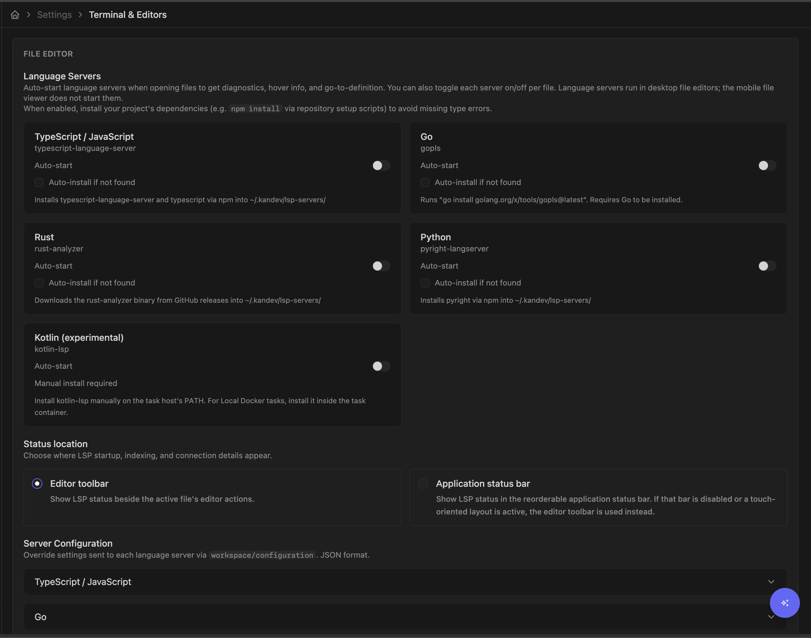
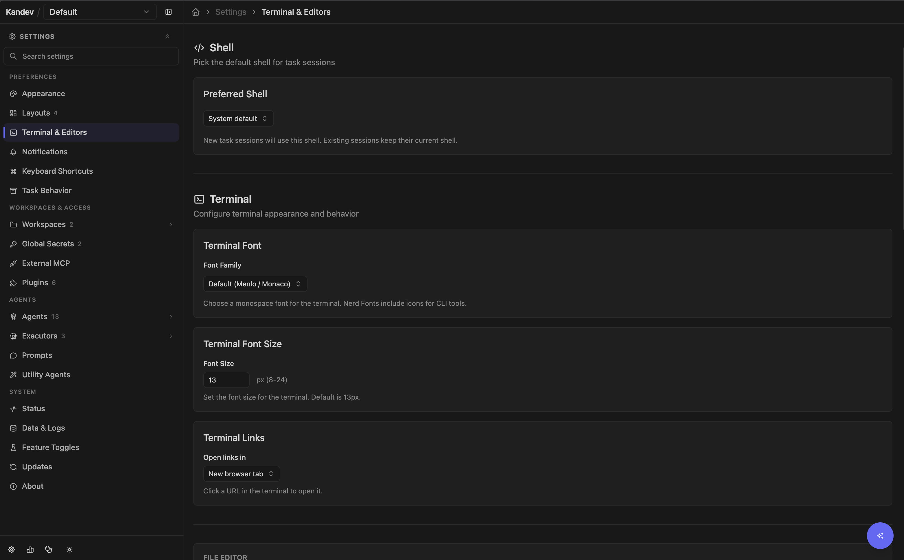

# Developer Tools

Kandev includes short-lived chat, reusable AI helpers, dictation, file and editor integration, language servers, and terminals. Some tools run in a task environment; others run on the Kandev backend host or in the browser. That boundary determines which files, executables, credentials, and network services they can reach.

## Quick path

1. Use **Quick Chat** for disposable questions.
2. Use a task session for work that needs files, review, or workflow state.
3. Add utility agents, editors, language servers, or terminals only when their host boundary is acceptable.

## Quick Chat

Quick Chat is an agent conversation outside the board. Use it for repository orientation, experiments, and disposable questions that do not need workflow state, review gates, dependencies, or a delivery record.

### Comment on an agent reply

In Task Chat or Quick Chat, select text from a settled agent prose reply, then select the comment button that appears beside the selection. The editor works like plan comments: enter feedback and choose **Add** to keep it as pending context, or **Run** to send it immediately. Pending selections use the same inline highlight and comment badge as plans; select either one to update or delete the feedback. Pending message comments are kept for the current browser tab, appear as composer context chips, and are included in the next prompt as Markdown. If the agent is busy, **Run** queues the feedback for its next turn.

Inline comments are available only on ordinary settled prose. Streaming replies, tool/thinking/status output, plans, rich-block content, raw views, and user messages do not accept inline comments.

### Reference tasks and work items

In Task Chat or an ordinary structured Quick Chat, type `#` at the start of a line or after whitespace, then enter part of a title or key. Kandev searches the active workspace's tasks and connected Jira, Linear, GitHub, GitLab, Azure DevOps, and Sentry sources. Results stay grouped by provider and type; a disconnected or slow provider does not hide results from another source.

Use the arrow keys and **Tab** or **Enter**, or select a row with pointer or touch. Selection inserts a chip without sending. The chip survives draft reloads and becomes a clickable reference after explicit send; messages queued while an agent is busy keep the same reference metadata. CLI-passthrough chat leaves `#` as literal text and does not search.

Use `@` for files, saved prompts, and the current plan. New task lookup is under `#`; existing saved or sent `@task` references remain readable and sendable.

Select **Quick Chat** beside **New Task** in the expanded sidebar, or select its standalone row in the collapsed sidebar.

### Start a chat

1. Turn on **Configuration chat** when the conversation should inspect or change Kandev configuration. This option is hidden when the workspace already has a configuration conversation.
2. Choose an agent profile. Quick Chat requires one and defaults to the workspace's default agent profile when configured.
3. For an ordinary Quick Chat, optionally add one or more workspace repositories.
4. For each repository, choose a branch. The same repository cannot be added twice.
5. Select **Start chat**.

Each selected repository gets an isolated worktree from the chosen branch. Uncommitted changes in your original checkout are not copied. Without a repository, Kandev creates an ephemeral working directory under `<KANDEV_HOME_DIR>/quick-chat/` (by default `~/.kandev/quick-chat/`).

Quick Chat supports multiple tabs, tab renaming, and **+** to open another ordinary-chat setup. Structured profiles show ACP chat; CLI-passthrough profiles show their PTY interface. The desktop window is resizable, while mobile uses a full-screen view.

Your chats and their names are shared by every browser and device signed in to the same Kandev instance. Starting, renaming, or closing a chat on one device updates the others, and a device that was offline catches up when it reconnects.

When **Settings > Preferences > Task Behavior > Agent-generated task titles** is enabled, an ordinary
Quick Chat starts with its normal provisional label and its owner agent can replace that label with a
short title based on your first request. Structured and CLI-passthrough chats receive the title
instruction through their existing first-turn path. The new title appears on every connected device
and survives reload. Configuration Chat and Quick Terminal are excluded. If you disable the setting,
or rename the chat first, the provisional or user-selected title remains authoritative.

Closing a real chat tab permanently deletes its conversation, hidden backing task data, and associated worktree. There is no undo. Kandev also deletes abandoned chats after seven days; cleanup runs when the backend starts and then once per day. Only chats whose session is `RUNNING` or `IDLE` are protected from age-based cleanup. Old `CREATED`, `STARTING`, or `WAITING_FOR_INPUT` chats can expire, so do not use Quick Chat for durable work.

If **Start chat** is disabled, select a profile and finish every repository/branch row. If a repository is missing, confirm that it belongs to the current workspace and refresh the repository configuration. Use a normal task when the result must remain visible on a board or become a reviewed PR.

Utility agents and configuration chat

## Utility agents

Open **Settings > Utility Agents** (`/settings/utility-agents`). Utility agents are one-shot ACP calls used to generate small pieces of text; they do not create a durable task conversation.

The built-in actions are:

- `commit-message`
- `commit-description`
- `branch-name`
- `pr-title`
- `pr-description`
- `enhance-prompt`
- `summarize-session`

Set a global **Default utility agent profile** by choosing an enabled, global, ACP inference profile. Each built-in action can inherit that profile or select another profile, and its prompt template is editable. The profile owns the agent, model, mode, launch flags, environment, and permission policy.

You can also create a custom utility. Name, prompt, and profile are required; description is optional. Prompt fields offer autocomplete for supported `{{...}}` template variables. A stale, disabled, deleted, workspace-scoped, passthrough-only, or unconfigured profile fails closed. Repair the binding in Settings before running the utility again.

Utility calls run as ephemeral processes on the Kandev backend host. Kandev resolves one profile snapshot at call start, records its profile ID with the call, and applies its permissions without asking for interactive approval. If the profile does not auto-approve a permission request, the call is rejected promptly. Profile edits affect the next call; an in-flight call keeps its snapshot.

### Configuration Chat

The same settings page configures the **Configuration Chat Agent** for each workspace. Choose a profile, choose **No default**, or rely on the workspace default profile. Kandev remembers the first explicit selection as that workspace's configuration-chat default.

Open Configuration Chat from the floating chat button on Settings pages, turn on **Configuration chat** while creating a Quick Chat, or run **Configuration Chat** from the `Cmd/Ctrl+K` command menu. A workspace currently has one configuration conversation. The Settings panel shows that conversation without tabs; **Open in Quick Chat** moves the same setup or session into the larger tabbed dialog without copying it.

Configuration Chat uses a repository-less ephemeral task. Its configuration-mode MCP can inspect and change workflows, agent profiles, and MCP configuration, and can list and read saved prompts by exact name. The selected profile's model, credentials, permissions, and external MCP settings apply. Review requested configuration mutations before approving them.

Closing the floating Settings panel preserves the conversation. To delete it, open it in Quick Chat, close its tab, and confirm deletion. Configuration tasks are excluded from the seven-day Quick Chat sweeper and remain available until explicitly deleted or their workspace is deleted.

## Saved prompts

Saved prompt details

Open **Settings > Prompts** (`/settings/prompts`) to add, edit, or delete reusable prompts. A saved prompt needs a unique name and non-empty content.

Type `@` in the task chat composer and select a prompt. The visible message keeps the `@name`; Kandev expands the prompt content into hidden system context for the agent. References are recognized only at the start of the text or after whitespace and must match the stored name. Prompt content can reference other saved prompts. Expansion stops at a depth of eight, skips cycles, and includes each prompt only once.

The Settings prompt editor also offers the same `@name` completion when you edit a saved prompt, a workflow prompt, a workflow step, an automation instruction, a quick action, or a provider watch. The prompt being edited is excluded from its own completion list, so selecting a reference cannot create a direct self-reference by accident. The same `@name` reference works in a workflow step's Prompt field and in a GitHub Review Watch's prompt; see [Saved prompt references in step prompts](workflow-tips.md#saved-prompt-references-in-step-prompts).

Kandev seeds these built-ins:

- `code-review`
- `open-pr`
- `merge-base`
- `ci-auto-fix`
- `changes-walkthrough`

Built-ins are marked in the UI but remain editable. Editing `ci-auto-fix` or `changes-walkthrough` changes the corresponding PR repair or walkthrough action. Seed insertion does not overwrite edits. If you delete a built-in, it stays absent for the current backend run and is seeded again on the next service start. There is no reset-to-default button.

A saved prompt is an instruction, not an authorization or policy boundary. Executor permissions, human gates, tests, and provider protections still control what can happen.

Utility-agent prompt templates use a separate template engine. Type `{{` to select the utility variables shown by the editor, but do not use `@name` saved-prompt references there. Utility calls are sessionless and do not resolve saved prompts at runtime. Put reusable nested instructions in a saved prompt used by a task, workflow, automation, or integration prompt instead.

## Voice Mode

Voice details

Voice Mode is no longer built into Kandev. It ships as the
[Voice Mode plugin](https://github.com/kdlbs/kandev-plugin-voice), installed like any other plugin
from **Settings > Plugins**. Nothing in a Kandev install downloads a speech model, records audio, or
holds a transcription key until you install it.

Once installed, a microphone button appears beside the existing controls in task chat, Quick Chat,
task creation and new-session creation, on desktop and on a phone. Dictating inserts the transcript
at your cursor; Kandev's own composer still owns the draft and the send.

The plugin offers three engines, chosen per user under **Settings > Plugins > Voice Mode**:

| Engine | Where recognition happens | Requirements and data flow |
| --- | --- | --- |
| **Browser speech** | The browser's own recognizer | No audio reaches your Kandev server. Chromium only, and the browser vendor's own handling applies. |
| **In-browser Whisper** | On the device | Downloads and caches an ONNX model from Hugging Face (about 40 MB, 75 MB or 240 MB), then runs locally in a worker. No audio leaves the device. |
| **Server transcription** | Your Kandev server, relaying to OpenAI | Requires an operator to save an OpenAI key in the plugin's settings. The key stays on the server; the request requires a signed-in Kandev user. |

`Automatic` picks the first engine the browser can run, in that order. Engine choice is capability
selection, not runtime failover: once recognition starts, an error does not retry through the next
engine.

Microphone capture requires browser permission and normally HTTPS or localhost. If recording fails,
check site permission, input device, secure context, model download and cache, and network access.
Switching task or session cancels an in-flight recording and discards its transcript.

Kandev no longer reads `KANDEV_VOICE_OPENAI_API_KEY` and no longer serves `/api/v1/transcribe`. An
operator upgrading from an older release re-enters the key in the plugin's settings, and each user
re-picks their engine and language: preferences are not carried over.

## Files and editor integrations

> **Security:** Embedded VS Code runs code-server with `--auth none` inside the task environment. Use it only with a trusted executor and network boundary.

Editor, language-server, and terminal details

For an idle, non-archived repository-backed task, **Files → Workspace actions → Add Repositories to workspace** opens a tab-free source picker. **Add repository** offers a workspace repository, a local Git checkout, or a provider-backed/pasted remote URL. The workspace option shares task creation's saved/discovered selector, refresh, and create-repository actions. **Add folder** is available on Local/Local PC or Worktree. Every repository chooses one base branch, and Local/Local PC uses the current checkout without switching it. Desktop uses a dialog; phones use a full-height drawer with a touch-sized repository menu. A mixed submission is atomic, and repository additions refresh repository-aware tools while folders remain Files-only. See [Tasks and workflows](tasks-and-workflows.md#add-sources-to-an-existing-task).

The task **Files** panel browses, searches, opens, and edits task-worktree files. Kandev rejects file paths that escape the resolved worktree. A session with one worktree opens that worktree directly in a host editor. When a session has several worktrees, the editor button asks which repository or worktree to open, and each configured editor in the adjacent menu expands to the same repository-and-branch picker. Check that selection before launching an editor from a multi-repository task. Older API clients that omit `worktree_id` retain the first-worktree fallback.

Open the context menu on any file or folder in the Files tree: right-click on desktop or long-press on touch to see **Open in \<editor\>**, which launches your default editor at that path instead of at the worktree root. When more than one editor is configured, **Open in other editor** lists the rest. When the tree is rooted above the worktrees (a multi-worktree task or any task that has had sources attached), Kandev resolves the clicked path back to its own worktree, so no picker is needed. The action is hidden for entries that belong to no worktree, such as an attached plain folder, because the editor launch is resolved against a worktree. It is also hidden while several files are selected, because it applies to a single path.

**VS Code (Embedded)** runs code-server inside the active task environment and displays it in a workbench panel. Opening it starts code-server independently of the agent process. It launches with `--auth none` and binds `0.0.0.0` on a random port inside that runtime; network/firewall isolation is therefore important, especially for Local and SSH environments. If the binary is absent, agentctl attempts to download it into `~/.kandev/tools/code-server`; first use needs a supported execution platform and access to the [code-server release](https://github.com/coder/code-server/releases/tag/v4.130.0). Native Windows Local and Worktree sessions do not support this integration. Linux-backed Local Docker, Sprites, and supported SSH sessions can offer it even when the Kandev app runs on Windows. The task-detail topbar follows the active session's executor capability, never the visitor's browser platform; other configured editors remain available. Use the panel error and task-environment logs when installation, startup, or proxying fails.

Use the workbench top bar's split-editor action to open the selected session worktree in the default editor. Its menu lets you choose another configured editor. A file's **Open with** menu can also open a specific editor, copy the path, or ask the operating system to show the folder.

Open **Settings > Preferences > Terminal & Editors** (`/settings/preferences/terminal-editors`) to set a default and configure integrations. Kandev discovers these built-in desktop editors when installed:

- Visual Studio Code
- Zed
- Cursor
- Windsurf
- IntelliJ IDEA
- GoLand
- PhpStorm

You can add:

- a custom command with `{cwd}`, `{file}`, `{rel}`, `{line}`, and `{column}` placeholders;
- VS Code Remote SSH with a required host and optional user and URI scheme;
- a hosted editor base URL, to which Kandev adds file or folder query parameters.

Desktop editor discovery and custom commands run on the Kandev backend host. The executable must be installed there and visible in its `PATH`; in a remote browser deployment, a local-editor command may therefore launch on the server rather than your laptop. Remote SSH needs a reachable SSH host and a registered VS Code URI handler. Hosted URLs need an accessible service and receive the absolute backend-host path in their `file` or folder query parameter. Configure only trusted custom commands because invoking one executes it on the host.

## Language servers

Language-server settings are part of **Settings > Preferences > Terminal & Editors**. Kandev currently registers servers for:

- TypeScript and JavaScript;
- Go;
- Rust;
- Python;
- Kotlin through the official `kotlin-lsp`. Kotlin support is experimental because the upstream server is still alpha.

Auto-start and auto-install are off for every language by default. Enable only the languages used by the workspace, then save settings. Each language card keeps its installation command, prerequisites, and managed destination visible next to the auto-install setting, including for touch and keyboard users. Open the language-server control to inspect its status and use the explicit **Start**, **Stop**, or **Retry** action. Browser-local storage remembers manual enablement for that session and language. If you stop an auto-started server, it stays off for that session and language in the current browser tab, even if a matching editor reopens, until you explicitly start it again or reload the page. Kandev disconnects an unused server connection after two minutes.

**Status location** defaults to the active file's editor toolbar. On a fine-pointer desktop with **Show status bar** enabled under **Settings > Preferences > Appearance > Status Bar**, you can instead place it in that bar; the item follows the active supported file and is absent on unsupported files and non-file panels. Turning the status surface off moves the item back to the editor toolbar without overwriting its saved location. A touch-oriented tablet also keeps the saved preference but uses the 44 px editor-toolbar control and bottom drawer. The phone file viewer has no LSP control.

Language servers run beside the project on the **task host**, with the task workspace as their working directory. V1 supports Local PC and Local Docker tasks. SSH, Sprites, and remote-Docker tasks show an unsupported-executor state instead of starting a server; an LSP request alone does not launch or resume those task resources. The desktop Monaco editor wires diagnostics plus completion, hover, definition, references, signature help, and semantic tokens when the server advertises them. TypeScript/JavaScript built-ins remain available to other sessions and models, and for features the active external server does not advertise or Kandev does not replace. After a file is successfully saved, Kandev sends its latest content change before notifying an active server that requested save synchronization; a failed save sends no save notification. The mobile file viewer does not start language servers in the background.

Only enable Kotlin language support for repositories you trust. Kotlin project import can evaluate Gradle or Maven build configuration on the task host; use a disposable Local Docker executor when the repository or its build files are untrusted.

Server lookup checks the task host's `PATH` and its `~/.kandev/lsp-servers` directory. The managed cache resolves `~` from the same task `HOME` used to execute installer commands, including executor-provided environment overrides. Auto-install uses different toolchains:

- TypeScript/JavaScript and Python install npm packages into Kandev's language-server storage;
- Go runs `go install ...@latest` and therefore needs a working Go toolchain. Result discovery follows `GOBIN`, `GOPATH`, and the task user's default Go workspace, including `%USERPROFILE%\go\bin` on Windows;
- Rust downloads a release for supported macOS or Linux, x86-64 or ARM64 task hosts. The Editors checkbox is a global preference; agentctl applies it only when the active task host supports the installer. A Windows Local PC task therefore needs a manual installation, while a Linux Local Docker task can auto-install Rust even when Kandev itself runs on Windows. If the selected task host has no supported installer, its status directs you to install the server manually even before you enable auto-install;
- Kotlin is manual-only. Follow the [official Kotlin LSP installation guide](https://kotlinlang.org/docs/kotlin-lsp.html), then verify `command -v kotlin-lsp` and `kotlin-lsp --version` in the task environment.

For a Local PC task, start Kandev from an environment whose `PATH` includes the server executable. For a Local Docker task, the host installation is not visible: add the executable and its runtime requirements to the executor image or prepare script, then recreate the task container. A Kotlin server in a Local Docker task must therefore be resolvable by `command -v kotlin-lsp` inside that container. If a managed installation fails, the language-server status preserves the detailed installer output after the connection closes.

The default Go server configuration enables semantic tokens. A custom language-server configuration must be a JSON object; Kandev returns it through the language-server workspace configuration request and notifies an already-running server immediately after a saved change. Installing a language server does not install project dependencies or make an unsupported language available. If the task host cannot launch a discovered executable, the editor shows a localized start-failure status while the detailed execution error remains in backend logs. Check the backend log/status, executable `PATH`, supported host platform, toolchain/network access, project dependencies, and that the file belongs to the active task worktree.

The status surface separates process startup, the LSP `initialize` request, and server-reported background project analysis. **Server process started** means the executable is running but has not yet answered `initialize`; definitions and references across files remain unavailable during that stage. After one minute, Kandev calls out the long wait without stopping the server. For Kotlin, a Gradle project import is one possible cause, especially in a large or multi-module codebase. **Stop** remains available throughout.

Kandev does not impose an automatic initialization timeout or invent a percentage or ETA. Some valid project imports take several minutes, and LSP has no universal indexing-progress contract. When a server reports standard work-done progress, Kandev shows its title, message, percentage, and concurrent work-item count when available. Those values describe only the work item the server reported; its completion does not guarantee that every cross-file definition or reference is ready. If cross-file navigation is still incomplete, leave the server running while its project model warms up, or stop it explicitly if the wait is unexpected.

Each browser connection owns a language-server process; editors in one browser window share the connection for the same session and language. Kandev allows eight active connections by default; operators can change that startup limit with `KANDEV_LSP_MAX_CONNECTIONS`. A request above that limit is rejected before it can start or resume the task host. Stopping a server, closing its connection, or stopping the task reaps the task-host process tree. If the toolbar says the server is unavailable, distinguish a missing task-host binary from an unsupported executor or the active-connection limit before retrying.

## Integrated terminal

The task terminal is a PTY in the task environment. Local tasks run through the local environment; Docker, SSH, and other remote executors route the terminal to their configured runtime.

When the workspace uses managed GitHub credentials, a new terminal receives the same task-scoped
Git and GitHub CLI routing as its agent. **Inherit executor Git credentials** leaves that routing
to the selected executor instead. The environment is fixed when the PTY starts, so reopen a
terminal after a session resume or credential-policy change.

On desktop, select **+ > Terminals > New Terminal**. Parked terminal sessions can appear in the same menu for reopening. The tab context menu offers **Rename** and **Terminate**, not a separate Close action. Selecting the tab's **X** deletes the terminal and asks for confirmation when it is busy. Removing the panel through layout management can instead park it and keep its PTY alive; terminating a live terminal or deleting a parked entry destroys it. On mobile, select **Terminal** in task navigation and use the terminal picker to create another.

Do not confuse a user terminal with a CLI-passthrough agent tab: both use PTYs, but only the agent tab is the agent's native interface. `Cmd/Ctrl+J` toggles the bottom terminal area.

Open **Settings > Preferences > Terminal & Editors** (`/settings/preferences/terminal-editors`) to configure:

- preferred shell, which defaults to the system shell; the built-in choices are zsh, bash, and sh on macOS/Linux, and PowerShell (`pwsh`), Windows PowerShell, and cmd on Windows, plus a custom executable;
- terminal font, with a default Menlo/Monaco-style stack;
- font size, default 13 px and allowed range 8–24 px;
- URL handling, which defaults to a new browser tab and can instead use Kandev's built-in browser panel.

Shell changes apply whenever a new or restarted terminal is created, including inside an existing task. Only an already-live PTY keeps its current shell. A custom shell must exist in the task environment. Fonts render only when available to the browser. Commands can behave differently from your login shell because the executor may use another user, `PATH`, credentials, working directory, or startup files.

If no terminal can be created, wait for the task environment to become ready and confirm its executor is reachable. If a reopened terminal is dead, create a new one; the original PTY or remote connection may have exited.

## Choose the right surface

| Need                                             | Use                          |
| ------------------------------------------------ | ---------------------------- |
| Disposable question or experiment                | Quick Chat                   |
| Board history, branch, review, dependency, or PR | A normal task and workflow   |
| Small generated title, summary, or description   | Utility agent                |
| Reusable task-chat instructions                  | Saved prompt                 |
| Dictate into chat                                | Voice Mode                   |
| Browse or edit task files                        | Files and editor integration |
| Diagnostics for supported languages              | Language server              |
| Run a command in the task runtime                | Integrated terminal          |

Related: [Use Kandev](use-kandev.md), [Sessions and review](sessions-and-review.md), [Agents and profiles](agents-and-profiles.md), and [Integrations](integrations.md).
