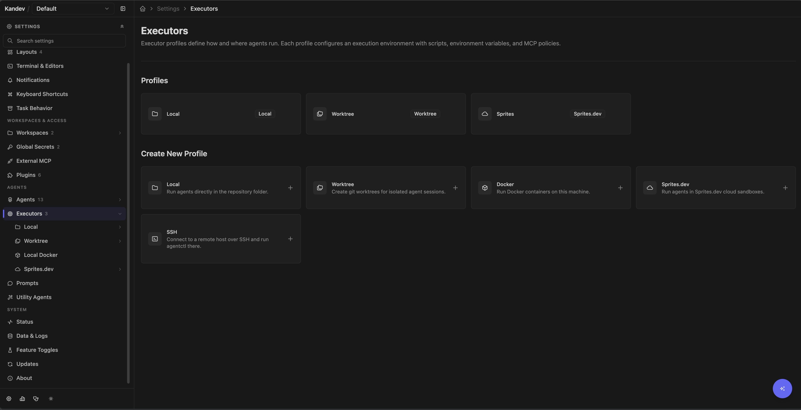

# Executors

An executor determines where Kandev creates a task environment and runs `agentctl`, the selected agent, terminals, and Git commands. An executor profile supplies reusable settings for that executor. A task environment is the concrete workspace created for one task; several sessions may reuse it.

## Quick path

1. Choose **Worktree** for normal isolated Git work.
2. Choose **Local** only when sharing the selected checkout is intentional.
3. Choose Docker, SSH, or Sprites when the host boundary or remote location is part of the requirement.
4. Review credentials, scripts, mounts, and network policy as part of the executor trust boundary.

## Current support

| Executor      | Current status                                                                  | Workspace                                                               | Use it when                                                              |
| ------------- | ------------------------------------------------------------------------------- | ----------------------------------------------------------------------- | ------------------------------------------------------------------------ |
| Worktree      | Supported; normal default                                                       | Dedicated Git worktree on the Kandev host                               | Parallel coding on a trusted machine                                     |
| Local         | Supported                                                                       | The selected checkout, or an explicit folder for a repository-free task | One controlled task must work in that exact folder                       |
| Local Docker  | Supported when the global Docker runtime is enabled and its daemon is reachable | `/workspace` in a new Docker container                                  | You need a repeatable container boundary                                 |
| Sprites.dev   | Supported, provider-dependent                                                   | `/workspace` in a provider sandbox                                      | You need remote compute and accept provider lifecycle/billing            |
| SSH           | Supported for repository sources on a trusted host                              | A task folder on a trusted SSH host                                     | You need a remote host with SSH, SFTP, forwarding, and clone credentials |
| Remote Docker | **Not implemented**                                                             | None                                                                    | Do not select or create this type                                        |

`mock_remote` also exists in backend models for tests. It is not a product executor.

Remote Docker deserves explicit treatment: the backend registers the runtime type, but its create and stop methods return `remote_docker runtime is not yet implemented`. The current **Settings > Executors** hub does not offer it. Older routes and stored fields such as `docker_host`, `docker_tls_verify`, and `docker_cert_path` do not make it operational.

## Embedded VS Code availability

**VS Code (Embedded)** starts code-server inside the active task environment, so its availability
follows that session's executor rather than the operating system of the browser or desktop app.
It is available for Local and Worktree sessions on Linux or macOS, and for Linux-backed Local
Docker, Sprites, and supported SSH sessions. Native Windows Local and Worktree sessions do not
offer it. See [Developer tools](developer-tools.md#files-and-editor-integrations) for code-server network and
download requirements.

## Create and select a profile

Open **Settings > Executors**, then choose **Local**, **Worktree**, **Docker**, **Sprites.dev**, or **SSH** under **Create New Profile**. Local and Worktree profiles already exist in a new database.



<DocsVideo
  webm="./media/feature-guides/profile-executor-selection.webm"
  mp4="./media/feature-guides/profile-executor-selection.mp4"
  poster="./media/feature-guides/profile-executor-selection.webp"
  title="Choose an agent and executor profile"
  caption="Agent, model, repository, and executor choices are reviewed before starting a task."
/>

A profile stores:

- its name;
- environment variables, either as a literal value or a Kandev secret reference;
- a prepare script and cleanup script;
- an MCP policy JSON object;
- runtime-specific configuration.

Literal environment values are stored with the profile. Use secret references for credentials. Resolved values and copied credential files normally become accessible to the agent and commands in that environment, including repository setup scripts and the terminal panel's shells. A terminal that is already open keeps the environment it started with; open a new terminal after changing the profile. SSH is narrower: its remote agent process and terminals receive only the credential allowlist documented below, not arbitrary profile variables.

The MCP editor checks only that the value is a JSON object. Its presets cover stdio, HTTP, and SSE transport allowances, server allowlists, and URL rewrites. Test restrictive policies with the actual MCP servers the agent needs; see [Automation and MCP](automation-and-mcp.md).

Profile edits apply when Kandev provisions a launch, but a Docker container or Sprite resume can reconnect to the already provisioned process, image, environment, credentials, and files. Use **Reset Environment** or explicitly destroy the resource when a change must take effect on a fresh environment. Deleting or editing a profile does not tear down an already-running resource.

### Repository environment secrets

Open a workspace repository's editor to add **Environment secrets** bindings. Each binding maps a POSIX environment key to a Global secret or a Workspace secret from that same workspace. A task receives the bindings from every repository attached to it, along with its selected executor profile environment. The resolved snapshot is available to repository setup scripts, the agent, child shells, and new terminal-panel terminals on supported executors.

Kandev fails closed before provisioning when a repository binding is missing, deleted, unreadable, unauthorized, or from another workspace. It also rejects ambiguous keys: identical references to the same secret are merged, while different secret IDs, literal-versus-secret bindings, or different literal values for one key are a launch error. The error identifies the key and source origins without exposing secret values or IDs. Editing a binding or rotating a secret does not mutate a running process or an open terminal. Fresh provisioning, a cold recreation, or **Reset Environment** resolves the current bindings; warm resume keeps its existing snapshot.

SSH has an additional forwarding boundary. Remote agent and terminal instances receive the managed credential allowlist plus the repository keys explicitly approved by these bindings. Arbitrary host, request, or unrelated executor-profile variables are not forwarded to the remote process.

### Portable agent configuration

Local Docker, SSH, and Sprites profiles can copy selected agent configuration
bundles. Open an agent row in the remote credentials settings to choose that
agent's authentication files and configuration bundles independently.
Kandev owns the allowlist. You cannot enter an arbitrary host path or copy a
complete agent home.

Kandev copies each selected file without changes. A file can contain secrets,
environment values, hooks, commands, model settings, permissions, MCP servers,
endpoints, or host paths that do not work in the executor. A fresh provision or
**Reset Environment** can replace the target file. A warm resume keeps the
existing executor file and does not read the host again.

Each file is limited to 1 MiB and each launch is limited to 4 MiB. Kandev
writes copied files with owner-only mode `0600`. Missing, unreadable, invalid,
or oversized optional files produce a preparation warning and do not stop the
launch. File contents are not returned by the API or stored in the profile.

SSH writes below the configured remote user's home. If that account is shared,
the copied configuration can affect other processes that use the same account.
Review the selected bundles before saving the profile.

### Model selection in remote executors

The host model probe helps edit a profile, but it is not the launch authority.
At launch, the selected executor's advertised ACP catalog decides whether
Kandev sends the saved model. If the executor does not advertise that model,
Kandev sends no request for it. It uses an advertised fallback only when one
exists; otherwise the agent uses its current or default model.

Kandev writes one warning to task chat when this happens. The warning can list
the requested model, effective model, agent, executor, and executor profile.
It also tells you to check executor credentials, copied agent configuration,
and the agent version. Kandev does not rewrite the saved profile model.
Portable configuration can improve parity, but it does not guarantee equal
host and executor model catalogs.

### Script behavior is runtime-specific

Do not treat the two script fields as universal hooks:

| Runtime          | Prepare script                                                                                                        | Profile cleanup script                                                                                                                                                                                                                                                  |
| ---------------- | --------------------------------------------------------------------------------------------------------------------- | ----------------------------------------------------------------------------------------------------------------------------------------------------------------------------------------------------------------------------------------------------------------------- |
| Local / Worktree | Runs on the host during preparation, with the common `KANDEV_TASK_PREPARATION_TIMEOUT` limit (`10m` by default). A failure is shown but is non-fatal, so the agent can still start for diagnosis. | Not executed by the executor runtime. Repository-level worktree cleanup is a separate repository setting.                                                                                                                                                               |
| Local Docker     | Runs inside the container before `agentctl`, with the common preparation limit. Failure is logged but `agentctl` still starts.                           | Not executed.                                                                                                                                                                                                                                                           |
| Sprites          | Runs inside a newly created sandbox, with the common preparation limit. Failure aborts the launch and destroys that new sandbox.                         | Runs, with a 60-second limit, only when a live execution is stopped with a task/session archived or deleted reason; failure does not prevent the subsequent destroy attempt. Plain Stop, **Reset Environment**, and profile-page direct destroy do not run this script. |
| SSH              | Runs on the target before `agentctl`, with the common preparation limit. An empty profile script uses the SSH default, which materializes the primary repository at the task-workspace root, reuses a matching checkout, runs repository setup, and selects the Kandev branch. A non-zero exit, timeout, missing checkout, or conflicting origin aborts the launch. | Runs on the target, with a 60-second limit, only for task/session archive or delete stops. Failure is logged but does not prevent controller teardown. Plain Stop and backend restart preserve the task workspace and skip cleanup. |

Keep working prepare scripts noninteractive and idempotent. Kandev resolves supported placeholders and appends its managed branch checkout for Docker, Sprites, and SSH after the user script. A profile cleanup script must never remove paths outside the environment it owns.

The common preparation limit is configured through
`KANDEV_TASK_PREPARATION_TIMEOUT`; see [Configuration](configuration.md#setup-and-launch-timing)
for duration syntax, fallback behavior, and the derived launch-phase limit.

Two current preparation exceptions are easy to miss:

- A repository-free Local task bypasses the environment-preparer stage, even when it uses an explicit workspace folder. Its profile prepare script therefore does not run.
- A Worktree task with two or more attached repositories runs each repository's setup script while creating that repository's worktree, but the current multi-repository preparer does not run the executor profile's task-level prepare script.

## Managed GitHub credentials

The workspace's GitHub connection and the task's Git transport policy are separate. **Managed
workspace credentials** is the default and provides the broker behavior below. Select **Inherit
executor Git credentials** in the workspace GitHub settings to leave Git and `gh` to the host or
selected executor; Kandev then injects no GitHub broker helper or shim. Local and Worktree use
host-visible Git/SSH credentials, while Docker, SSH, and cloud require executor-configured
credentials. An explicit executor-profile `GH_TOKEN` or `GITHUB_TOKEN` overrides the managed
workspace route.

For attached GitHub repositories, Kandev normally gives the task an opaque lease for each
repository instead of placing the workspace PAT, selected CLI token, or App installation token in
its ambient environment. Git's credential helper selects the lease whose HTTPS host and path
exactly match the repository. A broker-aware `gh` shim redeems the primary repository lease for
each invocation, sets `GH_TOKEN` only on the child `gh` process, and isolates CLI configuration
from the host.

When the workspace uses a GitHub App, the redeemed installation token is minted for that one
repository. On a multi-repository task, Git can redeem each repository's lease, but App-backed
`gh` commands are primary-repository scoped. Run cross-repository GitHub API work through Kandev's
workspace-aware backend surfaces.

PAT and named-CLI automation tokens cannot be cryptographically reduced after redemption. Exact
lease matching prevents accidental cross-repository redemption, but the trusted agent subprocess
receives a bearer token with all scopes and repositories granted by GitHub. An explicit profile
`GITHUB_TOKEN` or `GH_TOKEN` bypasses managed broker selection entirely and is the operator's
unmanaged grant. Personal GitHub tokens and App registration private keys never enter executors.

Managed Docker, Sprites, and SSH launches probe the exact credential-resolution route from inside
the executor before clone or agent startup and require its `204 No Content` readiness response.
Network failures, redirects, proxy routing errors, and broker server errors stop launch instead of
falling back to another GitHub credential.

A newly opened task terminal and a CLI-passthrough agent tab use the same task-scoped Git and
GitHub CLI routing as the agent that owns the execution. This applies only after the task
ownership check and does not change **Inherit executor Git credentials** mode. A terminal that is
already open keeps the environment from its launch; reopen it after a new session launch, resume,
or a Git credential-policy change.

### Workspace automation identity and task Git transport

The workspace GitHub connection is the automation identity Kandev uses for provider operations,
such as finding or creating a pull request. The task Git credential policy is separate: it decides
whether Git uses Kandev-managed credentials or the selected executor's own Git and SSH setup.
Changing the workspace connection does not install an SSH key in an executor.

For **Inherit executor Git credentials**, configure the executor where Git runs. Local and Worktree
use the Kandev host's Git configuration, SSH agent, known-hosts file, and credential helpers.
Docker uses the credentials in the container, while SSH and Sprites use the credentials configured
on the remote environment. A host `gh` login or `~/.ssh` file is not automatically available in a
Docker, SSH, or Sprite executor.

To make host GitHub CLI operations prefer SSH, run this on the Kandev host:

```bash
gh config set git_protocol ssh --host github.com
```

Restart Kandev after changing the host GitHub protocol. The restart lets Kandev reconcile managed
repository origins before the next task launch. For an SSH or Docker executor, configure the
equivalent GitHub SSH access, known-hosts entry, and agent or key on that executor instead.

## Worktree

Worktree creates a dedicated host Git worktree and runs the standalone `agentctl` service against it. It separates branches and files between tasks, but the process still has the Kandev user's host permissions, network access, and readable credentials.

Repository settings control base branch, branch naming, pull-before-create, repository setup/cleanup scripts, and optional copies of ignored files. With **Always pull before creating a new worktree** enabled, the base refresh is required for a new or recreated worktree. An authentication, network, timeout, missing-ref, divergent-ref, or uncertain-ancestry failure stops the launch; Kandev does not use a stale local fallback. Disable this setting only for an intentional offline local workflow. Copy ignored files narrowly: `.env` and similar files often contain production secrets. Multi-repository tasks receive one materialized worktree per attachment; use the per-repository setup scripts because the profile-level prepare script is currently skipped for that path.

Normal stop keeps the task environment available. Task deletion or **Reset Environment** removes the tracked worktree when configured to clean worktrees. Preserve or push valuable changes first; see [Git Operations](git-operations.md).

Typical failures:

- dirty or conflicting source repository state;
- base branch missing locally or remotely;
- required refresh credentials, network access, or remote ancestry cannot be verified;
- worktree path already registered in Git metadata;
- setup dependencies absent on the host;
- repository cleanup failure leaving a stale worktree.

Use `git worktree list --porcelain` in the source repository when diagnosing stale registrations. Do not delete a worktree directory by hand before checking whether Git still tracks it.

## Local

Local runs directly in the selected checkout. It provides no file isolation: concurrent tasks, the user, and other tools can edit the same files. When sources are attached, Local uses each user-owned repository's current checkout; Kandev does not switch its branch.

Use Local for an intentionally shared checkout, a controlled single task, or a repository-free task with an explicit workspace folder. Prefer Worktree for parallel coding. Stop ends the agent process but does not clean the checkout or undo its changes.

## Workspace sources

An idle, non-archived repository-backed task can add sources from its **Files** panel. Repository sources (saved workspace repository, local Git repository, or remote Git repository) are supported on **Worktree**, **Local/Local PC**, **Local Docker**, **SSH**, and **Sprites**. Worktree materializes Remote Git from Kandev's owned host cache. Docker, SSH, and Sprites clone local Git sources and therefore require a cloneable origin; Worktree and Local/Local PC can use the host repository directly.

Every repository row records a base branch. Worktree, Docker, SSH, and Sprites may also materialize an existing checkout branch for repository rows. Local/Local PC always uses the repository's current checkout and does not offer or perform a branch switch.

Arbitrary folders are supported only on **Worktree** and **Local/Local PC**. They remain live host paths; Kandev links them into its task workspace and never copies, moves, or deletes their contents. Docker and remote executors do not offer folders and reject a forged folder request. Remote Docker remains unavailable because its runtime is not implemented.

Source batches are atomic: if validation, cloning, or runtime adoption fails, Kandev removes the new records and Kandev-owned entries while preserving existing task contents. Persisted attachments are reapplied after reload, relaunch, or **Reset Environment**; a previously attached folder that later disappears is reported instead of silently skipped. See [Tasks and workflows](tasks-and-workflows.md#add-sources-to-an-existing-task).

## Local Docker

> **Daemon authority:** Dockerfile instructions run with the configured daemon's authority. Treat profile creation as an administrative operation on that daemon.

<details>
<summary>Local Docker details</summary>

### Prerequisites and profile creation

Install a reachable Docker Engine and leave `docker.enabled: true` (the non-containerized backend default). The published Kandev service image overrides this to `false`; see [Docker](docker.md#using-docker-for-agent-environments). The runtime health method is currently a no-op and the client is initialized lazily, so a green control-plane startup does not prove daemon access; image build or first task launch is the effective check.

Choose **Settings > Executors > Docker**. The current UI requires an image tag, Dockerfile content, and a successful **Build Image** operation before it creates the profile. **Use defaults** supplies:

- image tag `kandev/multi-agent:latest`;
- `node:22-slim`;
- `git`, CA certificates, and `curl`;
- `/workspace` as the working directory.

The build request sends a single Dockerfile-only context to the configured daemon. `COPY` cannot see repository files. Every Dockerfile instruction runs with the daemon's authority, so profile creation is an administrative operation on that daemon.

At launch Kandev:

1. uses the profile's `image_tag`;
2. creates `kandev-agent-<execution-prefix>` with Kandev task/session labels;
3. bind-mounts a released Linux `agentctl` helper read-only at `/usr/local/bin/agentctl`;
4. publishes control and agent ports to random ports on Docker-host loopback;
5. runs the resolved prepare script, which normally clones attached repositories into `/workspace` and checks out the Kandev branch;
6. starts `agentctl` even if prepare failed, then creates the agent instance.

The repository workspace itself is not a normal host bind mount. For a local filesystem clone URL, Kandev temporarily mounts that local clone source read-only so the in-container `git clone` can read it. Images need the selected agent's dependencies; they do not need to contain `agentctl`.

The daemon connection comes from global Kandev configuration. At present, the client uses `docker.host` and optional `docker.apiVersion`. The accepted `docker.tlsVerify`, `docker.defaultNetwork`, and `docker.volumeBasePath` settings are not applied by the current Docker client/container manager. Per-executor `docker_host` values are also not used by this runtime.

The current container manager always selects the Linux/amd64 `agentctl` helper. Use a Linux/amd64-compatible agent image and daemon (native or correctly emulated); native ARM64 agent containers are not yet wired to the released ARM64 helper.

Kandev passes each agent definition's CPU and memory limits to Docker. These are agent implementation defaults, not executor-profile controls. Apply additional daemon, cgroup, storage, and network policy outside Kandev when required.

</details>

### Credentials and security

> **Trust boundary:** A container is useful but not a hostile-code sandbox. The daemon has host-level power, bind mounts expose sources, agents can use injected secrets, and the default image has outbound network access. Kandev does not mount the Docker socket automatically.

<details>
<summary>Docker credential and security details</summary>

Docker profiles can inject resolved environment secrets. For agent file-based authentication, Kandev selectively seeds a per-execution directory under `<KANDEV_HOME_DIR>/agent-sessions/` and mounts that directory at the agent's expected config path. It does not intentionally mount the entire host home.

A container is a useful boundary, not a hostile-code security sandbox. The Docker daemon has host-level power, bind mounts expose their sources, the agent can use every injected secret, and the default image has outbound network access. Kandev does **not** mount the Docker socket into agent containers automatically.

Plain Stop preserves a healthy container for resume. A later launch reconnects to an existing running container, or starts one in a stopped/exited state; if reconnect fails, it creates a fresh container. Archive, delete, stale cleanup, explicit removal in the profile page, and **Reset Environment** can stop or force-remove it. Inspect matching containers before manual cleanup:

```bash
docker ps -a --filter label=kandev.managed=true
```

</details>

## Sprites.dev

> **Credentials and network:** Sprites sandboxes receive highly sensitive data. Credential upload is best effort, and network policy is installed only after credential upload, prepare, controller startup, and agent-instance creation; bootstrap traffic may happen first, so the policy is not a security boundary.

<details>
<summary>Sprites.dev details</summary>

### Configure

1. Save the provider token as a Kandev secret.
2. Choose **Settings > Executors > Sprites.dev**.
3. Select that secret for the required `SPRITES_API_TOKEN` profile environment variable.
4. Review remote credential methods, Git identity, prepare/cleanup scripts, and network policy.

Sprites profiles do not copy the host-active `gh` CLI token. Kandev may copy explicitly selected agent credential files, resolve selected Kandev secrets into agent environment variables, or run an agent auth setup script. A profile-selected GitHub token is an unmanaged override; otherwise an attached GitHub repository uses the workspace credential broker. Set `githubCredentialBroker.publicBaseUrl` (or `KANDEV_GITHUB_CREDENTIAL_BROKER_PUBLIC_BASE_URL`) to an HTTPS Kandev URL reachable from remote executors. To recover managed Git credentials after a backend restart, configure the stable secret `githubCredentialBroker.reissueSigningKey` (or `KANDEV_GITHUB_CREDENTIAL_BROKER_REISSUE_SIGNING_KEY`); changing it invalidates outstanding execution capabilities. Drain or quiesce active agent sessions before key rotation. The broker uses `/api/v1/git/credentials/resolve` and `/api/v1/git/credentials/reissue`; the older GitHub paths remain compatibility aliases. These settings are independent of GitHub App registration. Credential upload is best-effort: provisioning can continue while later agent authentication fails. The remote sandbox receives highly sensitive data; use a scoped provider token and least-privilege repository credentials.

Network rules are stored in `sprites_network_policy_rules` as JSON entries with `domain`, `action` (`allow` or `deny`), and optional `include`. Kandev applies them only on fresh sandbox creation, and currently does so after credential upload, prepare, controller startup, and agent-instance creation. Bootstrap traffic can therefore occur before the profile policy is installed. A parse/provider failure is reported as skipped and does not abort launch. Provider semantics remain authoritative; do not treat this late, best-effort step as a security boundary, and test the resulting policy.

Fresh launch creates a sandbox named `kandev-<execution-prefix>`, uploads the Linux/amd64 `agentctl`, uploads credentials, runs prepare, starts the controller, and opens a local proxy to its control port. The current Sprites path does not probe sandbox architecture; it assumes x86-64. A failed fresh launch destroys the new sandbox. Resume reconnects to the recorded sandbox; if it no longer exists or has expired, Kandev warns and provisions a fresh one on the recorded branch.

Plain Stop preserves the sandbox and workspace for resume. Archive/delete terminal stops attempt to destroy it, and the profile page can list and explicitly destroy Kandev-named sandboxes with the selected provider token. **Reset Environment** also requests sandbox destruction, but the current direct-reset path does not carry the profile's Sprites secret into that destroy request; after a reset or backend restart, verify the old sandbox in the profile page and destroy it there if it remains. Provider retention, quotas, network behavior, and billing remain provider-dependent. Destroying a sandbox out of band breaks any session that still references it.

</details>

## SSH

> **Trust boundary:** Verify the target host fingerprint before saving. Kandev pins the target key, but unknown ProxyJump bastion keys may be accepted on first use; remote credential transfers write sensitive material under the remote user's home.

<details>
<summary>SSH details</summary>

SSH is implemented as a separate remote connection per session. Kandev uploads a platform-matched `agentctl` helper over SFTP, starts it in the remote task directory, and forwards its port to local loopback.

### Host requirements

- Linux `amd64`/`arm64` or macOS `amd64`/`arm64`;
- SSH public-key authentication and SFTP;
- `bash` on Linux or `zsh` on macOS by default, or a compatible configured login shell;
- TCP forwarding enabled by `sshd` and enough `MaxSessions` capacity;
- the selected agent command already installed and visible to a login shell;
- writable remote home and adequate disk/process capacity.

Released Kandev bundles include helpers for all four platform combinations. The full automated SSH task E2E target currently exercises a Linux/amd64 container; other platform gates and helper selection are unit-tested.

### Create the connection

Choose **Settings > Executors > SSH**. Enter a name plus either a Host or a host alias from your OpenSSH client configuration. The backend resolver can inherit `HostName`, `Port`, `User`, `IdentityAgent`, `IdentityFile`, and one `ProxyJump`; explicit form values win. The current create form defaults and persists Port `22` and identity source `ssh-agent`, so enter a non-22 alias port and desired identity source explicitly instead of assuming those two values inherit. `IdentitiesOnly` and arbitrary OpenSSH directives are not consumed by Kandev.

Authentication choices are:

- ssh-agent, using the host's expanded `IdentityAgent` when configured and otherwise `$SSH_AUTH_SOCK`; or
- an unencrypted private-key file.

`IdentityAgent none` disables agent authentication for that host. Kandev expands `~`, `${VAR}`, whole-value `$VAR`, `SSH_AUTH_SOCK`, and the `%%`, `%d`, `%h`, `%i`, `%j`, `%k`, `%L`, `%l`, `%n`, `%p`, `%r`, and `%u` OpenSSH tokens in agent socket paths; `%C` is not supported. Password and keyboard-interactive authentication are not supported. A passphrase-protected key file must first be loaded with `ssh-add`, then used through ssh-agent.

Run **Test Connection**, independently verify the observed SHA256 host fingerprint, select **Trust this host**, then save. Kandev pins the final target fingerprint and refuses a changed key. With ProxyJump, the target remains pinned, but bastion handling is weaker: Kandev checks `~/.ssh/known_hosts` when available and rejects a changed known key, while an unknown bastion key is accepted on first use. Verify and pre-populate the bastion key yourself.

The profile editor exposes remote shell and agent-readiness checks. Backend/API configuration also recognizes `ssh_workdir_root` (default `~/.kandev`) and `ssh_shell`; the current profile UI exposes `ssh_shell` but not a workdir-root field.

The remote-auth card is built from the currently enabled agents. Depending on an agent's declared methods, it can copy selected local credential files, resolve a stored secret into that agent's authentication environment variable, or run an agent-specific setup script on the remote host. GitHub can use an explicitly selected `GITHUB_TOKEN` secret as an unmanaged profile override; Kandev does not copy the host-active `gh` token. These transfers write sensitive material under the remote user's home and are best-effort, verify authentication on the remote after saving. Although the profile editor also stores Git name/email controls for SSH, the current SSH runtime does not apply them; configure Git identity on the remote host yourself.

</details>

### Repository sources and cleanup

> **Cleanup:** SSH task directories, session-runtime data, and cached helpers may remain after disconnect. Audit remote processes and paths before deleting anything.

<details>
<summary>SSH repository source details</summary>

SSH materializes the primary attached repository at the remote task-workspace root and additional repository sources in direct child directories. The default prepare script initializes or reuses the root checkout, verifies the configured origin, fetches the base branch, runs repository setup, and lets Kandev's managed postlude select the task branch. A stored profile script replaces that default and must leave the same verified primary checkout before `agentctl` starts. Existing matching checkouts retain local commits and untracked files; a different origin, missing checkout, failed script, timeout, or cancellation fails the launch before a controller is started. Ensure the remote host has the required Git credentials and can reach every selected remote; folders cannot be attached to SSH tasks.

The runtime preflights the selected agent command and reports an installation hint when missing; it does not install the agent or its toolchain. Only these resolved credential environment names are forwarded to the remote agent: `CLAUDE_CODE_OAUTH_TOKEN`, `ANTHROPIC_API_KEY`, `OPENAI_API_KEY`, `GEMINI_API_KEY`, `GOOGLE_API_KEY`, `GITHUB_TOKEN`, and `GH_TOKEN`. Arbitrary profile variables and control-plane process variables are not forwarded to that agent process. Agent-specific auth setup scripts can still consume a selected stored secret and materialize their own remote login state.

Stop attempts to kill the session's remote `agentctl` and remove only the remote session-runtime directory, then closes forwarding and SSH. Terminal archive/delete stops run the profile cleanup script first; cleanup is best-effort, so a failure does not block controller teardown. Plain Stop and backend restart skip cleanup and preserve the task workspace for resume. The task directory always remains and no background sweeper currently removes it. The cached helper and checksum at `~/.kandev/bin/agentctl` and `agentctl.sha256` also remain for later sessions. Periodically audit the remote process list, session directories, and `<workdir-root>/tasks/` after confirming no session needs the data. Resume re-dials SSH and reuses a live recorded PID when possible; otherwise Kandev starts a fresh remote controller and re-runs preparation.

</details>

## Lifecycle and cleanup

The task environment reports `creating`, `ready`, `stopped`, or `failed`; individual execution records have finer states. Stop is deliberately not synonymous with destroy for resumable Docker and Sprites environments.

Use a task's **Reset Environment** action when you need a clean materialization. Kandev blocks reset while a task session is starting or running, can optionally push the current branch, and requests teardown of the recorded worktree/container/sandbox. It normally keeps the environment record when teardown returns an error. The current Sprites credential-context limitation described above can instead report success while leaving the provider sandbox, so verify it separately. SSH task directories are intentionally retained; use the profile cleanup script for terminal hook work and remove the directory manually only after confirming no session needs it.

Before deleting any environment, push or otherwise preserve uncommitted work. Profile deletion and provider/daemon-side deletion can bypass normal lifecycle safeguards.

## Troubleshooting

- **Profile missing at launch:** ensure the executor is active, the profile still exists, and the task/workflow references the correct IDs.
- **Prepare reports failure but agent starts:** expected for Local, Worktree, and Docker; inspect the failed step output and retry commands inside the same environment.
- **Docker unavailable:** verify global `docker.enabled`, effective `docker.host`, daemon permission, image existence, and the released Linux helper path.
- **Docker clone fails:** test the clone URL, base branch, DNS, CA trust, and token scope from inside the selected image.
- **Sprite cannot resume:** check provider token, quota, sandbox existence, expiration, and network policy; a missing sandbox triggers fresh provisioning.
- **SSH handshake fails:** test ssh-agent/key access, host fingerprint, bastion trust, SFTP, TCP forwarding, and remote OS/architecture.
- **SSH agent is missing:** run the reported `command -v` check through the configured login shell and install the agent on that host.
- **Disk usage grows:** inspect **Settings > System > Disk usage**, Docker containers, provider sandboxes, host worktrees, and retained SSH task directories before removal.

Related guides: [Docker](docker.md), [Git Operations](git-operations.md), [Operations](operations.md), and [Windows Support](windows-support.md).
