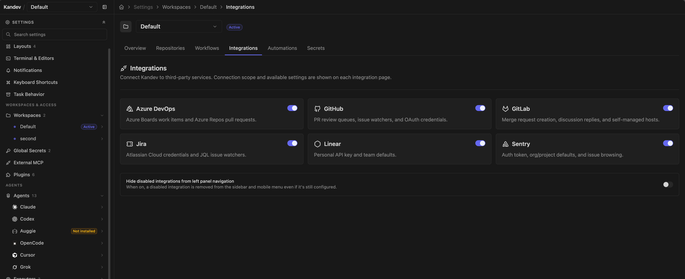

# Integrations

Integrations let Kandev's backend read and update provider data. They power repository and issue browsers, task associations, watches, pull-request review, and provider-specific task launchers.

## Quick path

1. Open the integration for the workspace that owns the work.
2. Connect the narrowest provider credential that supports the task.
3. Test the connection before browsing or enabling watches.
4. Keep provider API credentials, task Git credentials, and agent credentials separate.

They do **not** provide every credential a task needs. Keep these paths distinct:

- an integration credential lets the Kandev backend call a provider API;
- Git or SSH credentials in an executor let the task fetch and push a repository;
- an agent login or API key lets the coding CLI call its model provider.

GitHub is the important exception. Kandev first resolves explicit profile remote-auth secrets; a resulting `GITHUB_TOKEN` or `GH_TOKEN` is an unmanaged override. Otherwise, for each repository identified as GitHub, the task receives an opaque, task/repository-scoped credential lease instead of an ambient token. Git resolves the matching lease against the workspace automation connection when it runs, so an App installation token can be renewed during a long task. The App private key and personal user tokens are never sent to an executor. Repository and credential-generation checks are repeated when a lease is resolved, and disconnecting or replacing the connection invalidates old leases.

For GitLab, Kandev resolves only the active task workspace's connection. It provides that connection's token as `GITLAB_TOKEN` and its normalized host as `GITLAB_HOST`/`KANDEV_GITLAB_HOST` to the execution path, and configures HTTP Git authentication only for the matching host. It does not reuse another workspace's GitLab credential or silently fall back from a self-managed host to `gitlab.com`. SSH remotes still require usable SSH credentials in the executor.

A task can therefore display a pull or merge request while its worktree cannot push, or edit a repository while Kandev cannot read provider state. Diagnose the failing credential path separately. An App token redeemed through the broker is minted for that repository. PAT and named-CLI tokens remain bearer credentials with all provider-granted scopes once delivered to the trusted Git or `gh` subprocess; lease matching prevents accidental cross-repository redemption but cannot narrow those tokens at GitHub. GitLab integration tokens are provided only to tasks in their configured workspace and should be treated as credentials that task agents may receive.

## Open integration settings

Select **Settings > Workspaces > _Workspace_ > Integrations**, then choose a provider. The direct routes are:

- `/settings/workspace/{workspaceId}/integrations/github`
- `/settings/workspace/{workspaceId}/integrations/gitlab`
- `/settings/workspace/{workspaceId}/integrations/azure-devops`
- `/settings/workspace/{workspaceId}/integrations/jira`
- `/settings/workspace/{workspaceId}/integrations/linear`
- `/settings/workspace/{workspaceId}/integrations/sentry`

Compatibility routes under **Settings > Integrations** use the active workspace where the provider has workspace settings.

GitHub, GitLab, Azure DevOps, Jira, and Linear configuration are workspace-specific. GitHub supports one automation connection per workspace and, for App-backed workspaces, one personal identity per Kandev user and workspace. The current GitHub integration targets `github.com`; GitLab supports `gitlab.com` and self-managed origins. Sentry supports multiple named instances per workspace. Do not assume that configuring one workspace gives another the same provider scope.

Provider secrets saved by these forms use Kandev's encrypted secret store. The backend must still decrypt them to make API requests. Limit access to settings and the Kandev data directory, and use the narrowest provider scope that works.

### Author prompt fields

Quick actions and provider watch prompts use the same inline prompt editor. Type `{{` to open the provider's placeholder list, or type `@` after whitespace to find a [saved prompt](developer-tools.md#saved-prompts). Select an item to insert it into the draft. The menu shows the exact tokens supported by that provider and prompt type.

Common quick-action tokens are `{{url}}` and `{{title}}`. Jira quick actions also provide `{{key}}` and `{{description}}`. Watch prompts expose provider data such as `pr.*`, `issue.*`, `mr.*`, `work_item.*`, or `pull_request.*`, depending on the integration and watch type.

Selecting a completion changes the local draft only. Use the route-level **Save changes** action to persist it; **Reset** restores the provider defaults and **Cancel** or discard returns to the last saved draft. Saved-prompt references are expanded when the watch or action runs, so later edits to the referenced prompt apply without changing each integration setting.

### The Enabled switch

Jira, Linear, and Sentry pages show an **Enabled** switch. It is a browser-local preference, saved per installation in that browser and on by default. It controls some client-side entry points, availability checks, and configuration fetches; settings pages can still poll provider health. It does not delete backend configuration and does not stop a server-side watch. Pause/delete watches or remove the provider configuration when processing must stop.

Health results are cached and periodically refreshed (normally about every 90 seconds in the settings UI). Use **Test connection** after changing a URL or credential rather than waiting for the next probe.

## GitHub

GitHub details

Use GitHub for pull requests, issues, reviews, checks, repository discovery, task associations, and provider-triggered work. Browse it at `/github` after connecting an account.

### Authenticate

Open the workspace GitHub settings. **Workspace automation** offers three connection types:

- **Personal access token (PAT):** Kandev validates the token before replacing the current connection and stores it in the encrypted secret store. A classic PAT needs `repo` and `read:org` for full behavior. Scope a fine-grained token to only the repositories and operations the workspace needs.
- **GitHub CLI:** first run `gh auth login` as the operating-system user that runs the Kandev backend. Kandev lists every authenticated host/login pair and stores the selected `github.com` login, not its token. On current CLI releases it resolves that exact account with `gh auth token --hostname github.com --user <login>` and never changes the host's active account with `gh auth switch`. Older releases without structured status or `--user` remain supported when the selected account is active; make the account active or upgrade `gh` before selecting a different stored login.
- **GitHub App:** recommended for organization-managed or unattended automation. From the
  workspace, select a known registration, add an App you already own, or create one through
  GitHub's App Manifest flow, then install it on the intended account. Kandev keeps root App
  credentials server-side and mints short-lived installation tokens as needed.

A workspace has one active automation connection at a time. Replacing it changes the identity used by repository discovery, watches, background work, and task GitHub access in that workspace only. Disconnecting a CLI connection does not sign the host out of `gh`; disconnecting an App connection removes only the workspace binding and does not uninstall the App from GitHub.

New workspaces created by an operator or an internal trusted flow start with **Inherit executor Git credentials** for task Git access when the settings write succeeds. When the backend host has an authenticated active `gh` account, the new workspace also snapshots that exact host/login as its named GitHub CLI automation connection; Kandev stores the selection, never the CLI token. If `gh` is unavailable or unauthenticated, creation still succeeds with executor inheritance and no automation connection. If the settings write itself fails, workspace creation remains available but the existing managed compatibility fallback applies until the workspace is configured or retried. Authenticated non-admin members receive the executor default but never the operator's host identity.

Workspaces migrated from an older Kandev release may temporarily use a compatibility connection
named `legacy_shared`. It continues using the deployment's existing authenticated `gh` account,
`GITHUB_TOKEN`/`GH_TOKEN`, or legacy stored PAT for both GitHub API calls and workspace-isolated
managed repository clones. When both environment variables are set, `GH_TOKEN` takes precedence,
matching GitHub CLI behavior. Its token remains in memory during use. Choosing a new workspace
connection leaves compatibility mode permanently.

The status panel identifies the selected source, verified actor, connection state, and any missing App capabilities. When GitHub has reported quota data, use **Show GitHub API limits** to inspect the remaining API requests, GraphQL query points, Search requests, and reset times for that workspace connection. The disclosure appears as a tooltip on desktop and a tap-accessible drawer on touch devices. A failed PAT or CLI validation leaves the previous connection intact. An unknown CLI login, revoked PAT, suspended/deleted installation, or missing App permission affects only the bound workspace and displays a reconnect or capability-specific error.

### Automation and personal identity

PAT and CLI connections are human identities. They provide both workspace automation and the fallback identity for **My GitHub** views and user-triggered actions. Settings show this shared identity inside **Workspace GitHub access** instead of repeating it as a separate **My GitHub identity** section.

A GitHub App installation is an automation identity, not a person. App-backed repository discovery, watches, task Git operations, pull-request creation, reviews, and merges are attributed to the App when the App is the effective actor. App-backed workspaces therefore show a separate **My GitHub identity** section where you can connect the human account used to see pull requests or issues assigned to the current user. This is a GitHub App user authorization, stored per Kandev user and workspace.

Kandev routes credentials as follows:

| Operation | Credential | GitHub attribution |
|---|---|---|
| Background reads/writes, watches, task Git, and agent `gh` | Workspace automation | PAT/CLI user or App |
| **My GitHub** reads | Personal identity, then human PAT/CLI automation | User |
| User-triggered review, merge, or other mutation | Personal identity, then human PAT/CLI automation, then App | Effective actor shown in the UI |

An App-only workspace continues automation without a personal connection, but **My GitHub** remains unavailable. A personal connection cannot widen access: Kandev intersects the workspace repository scope, the App installation's repositories, and the user's GitHub access. Personal access and refresh tokens are never exposed to agents or executors.

For task processes, Git's credential helper selects among all attached repository leases. The
broker-aware `gh` shim uses the primary repository lease for each invocation. With App automation,
that makes agent-issued `gh` commands primary-repository scoped; use Kandev's workspace-aware
backend actions for another attached repository. PAT/CLI `gh` commands still receive the broader
bearer grant described above. Explicit executor-profile tokens bypass these managed guarantees and
must be scoped and rotated independently.

### Choose task Git credentials

Within **Workspace GitHub access**, select **Connect GitHub** or **Change connection** to manage
both the workspace automation connection and **Task Git access**. The page keeps a compact summary
of the saved task access mode. Task Git access controls how GitHub HTTPS and `gh` authenticate
*inside newly launched task processes*:

For PAT or GitHub CLI connections, choose the connection and task-access settings first, then
select **Save changes** once. GitHub App creation, import, and installation remain separate
GitHub workflows. The help control beside **Task Git access** explains the effective credential
path on desktop hover or focus and in a touch-accessible drawer on mobile.

- **Managed workspace credentials** (an opt-in policy) uses the selected workspace PAT, named GitHub
  CLI account, or GitHub App through Kandev's short-lived, task/repository-scoped broker. Kandev
  configures `agentctl` as Git's credential helper so an attached repository can redeem its
  matching lease on demand; the returned credential is not written to the repository or Git
  configuration. A separate broker-aware shim handles `gh`. The task receives neither the stored
  PAT nor an App private key. An executor-profile `GH_TOKEN` or `GITHUB_TOKEN` deliberately takes
  precedence for that task.

For a managed **Improve Kandev** task, Kandev keeps the task attached to the canonical
`kdlbs/kandev` repository. Before the first launch, the workspace automation connection resolves
one exact writable fork as the task's contribution destination. Kandev stores that destination
without credentials, adds a dedicated push remote, and issues one additional broker lease for the
exact fork. The canonical `origin` remains the pull, issue, and pull-request target. A direct write
connection does not need a fork. An App connection without direct write access cannot own an
automatic personal fork, so managed fork preparation fails closed; the Improve Kandev issue-only
option remains available.

- **Inherit executor Git credentials** is the default for newly created workspaces and does not
  install Kandev's broker helper or `gh` shim. Local
  and Worktree tasks use credentials already visible to the host Git process (including SSH).
  Docker, SSH, and cloud tasks use only credentials intentionally configured in that executor.
  For Kandev-managed GitHub checkouts, Local and Worktree preparation also updates `origin` to the
  host's configured `gh` clone protocol. Selecting SSH therefore lets Git conditional includes that
  match `remote.*.url` apply; switching back to managed credentials restores the canonical HTTPS
  origin. Repositories you registered from an existing local checkout are never rewritten.

If Git rejects a managed checkout with **detected dubious ownership**, the Kandev service account
and the checkout owner do not match. Repository preparation stops and the session error identifies
the ownership boundary; inspect the service unit and the managed home/repository owner, then
preserve or deliberately reconcile the service account. The diagnostic is credential-safe and
bounded. Do not add `safe.directory=*` or let Kandev recursively chown the checkout: those actions
hide an installation identity problem instead of fixing it.

Selecting a GitHub CLI workspace connection does not implicitly select host Git credentials; use
the explicit inheritance mode when that is the intended boundary. The Changes panel's branch
details show the non-secret identity and delivery route captured for a successfully launched
session.

### Use a GitHub App

Choose a GitHub App when automation should not depend on one person's long-lived credential, when
an organization wants to approve repository access centrally, or when background jobs need
short-lived tokens. PAT and named CLI connections are simpler for a local workspace that should act
as one person. An App adds ownership, public callback, webhook, installation, and credential-
rotation responsibilities, and GitHub attributes its automation to the App rather than a human.

Kandev stores a catalog of App registrations. Adding or creating a registration does not change a
workspace's active connection; the workspace must explicitly select the registration and complete
an installation. You can use the same registration in several related workspaces, or create
separate registrations for stronger isolation:

| Choice | Shared | Isolated per workspace installation |
|---|---|---|
| Reuse one registration | App owner and bot identity, private key, OAuth client secret, webhook secret, permission policy, and root-credential revocation | Installation token, account/repository grants, workspace scope, personal OAuth tokens, and broker leases |
| Use separate registrations | Nothing at the App-credential layer | App owner, bot identity, root credentials, permission policy, revocation, installations, repository grants, and workspace credentials |

Reuse is appropriate for related workspaces that deliberately share one organizational automation
identity. Create separate registrations for work and personal accounts, unrelated organizations,
or any boundary where rotating or deleting one App must not affect the other.

This feature targets `github.com`, not GitHub Enterprise Server. Before creating or importing an
App, give Kandev a stable public HTTPS origin. GitHub must reach the callback and webhook routes
from the public internet. Guided setup rejects private, loopback, split-horizon, and plain HTTP
origins. A local deployment needs a trusted HTTPS tunnel or reverse proxy whose hostname remains
stable for the life of the registration.

#### Create a new App

1. Open the workspace's GitHub integration settings, choose **Change connection**, then choose
   **GitHub App** and **Create new App**.
2. Choose the GitHub user or organization that will own the App, enter a registration label and
   the public Kandev origin, and review the requested permissions.
3. Keep **Private** unless the same App must be installable outside its owner. **Public** means
   other GitHub accounts can install it. It does not publish the App to Marketplace, reveal its
   credentials, or grant any repository without an approved installation.
4. Continue to GitHub and confirm the generated manifest within one hour. Kandev verifies the
   single-use callback, encrypts the returned credentials, and adds the registration without a
   restart.
5. Back in the workspace, select the new registration and install it. The GitHub account owner
   still chooses the account, organization, and repositories granted to that workspace.

Creating an App does not select it automatically. If GitHub creates the App but Kandev cannot save
the callback result, remove that orphan App in GitHub or restart the registration flow; Kandev
cannot delete the provider-side App for you.

#### Add an existing App

Use **Add existing App** when you own a GitHub App that should follow the same catalog lifecycle as
a Kandev-created App. The preparation step allocates a registration ID and displays exact,
copyable settings for that pending import. It is short-lived and single-use.

1. Start **Add existing App** from the workspace GitHub connection flow. Enter its owner, label,
   visibility, and the public Kandev origin.
2. Open the App under the owning user's or organization's **Settings > Developer settings > GitHub
   Apps**, then apply every URL, permission, and event shown by Kandev. Add the workspace
   installation callback as the first user authorization callback and the personal identity
   callback as the second. Set the App homepage to the public Kandev origin, use JSON webhook
   delivery with SSL verification, request user authorization during installation, leave the setup
   URL empty, and keep expiring user tokens enabled.
3. Return before the preparation expires and provide the App ID, OAuth client ID and secret, App
   slug, webhook secret, and an RSA private key generated for that App. Treat every secret field as
   a root credential and never put it in workspace environment variables or executor profiles.
4. Kandev authenticates as the App, verifies its ID, owner, slug, homepage, permissions, events,
   and webhook settings where GitHub exposes them, then encrypts the credential bundle. You must
   confirm callback settings that GitHub's API does not expose.
5. Select and install the imported registration. Importing alone never replaces the workspace's
   current PAT, CLI account, or App installation.

If the App is already in the catalog, Kandev directs you to the known registration instead of
storing a second copy of the same root credentials.

Each registration uses its own ID in every public route. The UI supplies complete URLs; these path
templates are useful when checking a proxy or GitHub setting:

| Purpose | URL path |
|---|---|
| Manifest creation callback | `/api/v1/github/app/registrations/{registrationId}/manifest/callback` |
| Workspace installation OAuth callback | `/api/v1/github/app/registrations/{registrationId}/install/callback` |
| Personal identity OAuth callback | `/api/v1/github/app/registrations/{registrationId}/personal/callback` |
| Signed webhook delivery | `/api/v1/github/app/registrations/{registrationId}/webhook` |

The registration starts with an unverified webhook status. It becomes verified only after Kandev
receives a correctly signed delivery on that registration's route. A failing status indicates a
route, proxy, secret, or post-signature processing problem; a successful browser callback alone
does not prove webhook reachability.

For full Kandev behavior, request the smallest applicable repository/organization permissions from this list:

| GitHub App permission | Access | Used for |
|---|---|---|
| Metadata | Read | Repository discovery and identity. |
| Contents | Read and write | Clone, fetch, push, and repository content changes. |
| Pull requests | Read and write | PR browsing, creation, reviews, and merges. |
| Issues | Read and write | Issue browsing and updates. |
| Checks | Read | Check runs and conclusions. |
| Commit statuses | Read | Commit status reporting. |
| Actions | Read | Workflow-run status. |
| Administration | Read | Branch-protection details. |
| Members | Read | Organization/team membership lookups. |
| Workflows | Write | Changes under `.github/workflows`; omit when agents must not edit workflow files. |

Subscribe to `push` and `check_run`. GitHub sends `installation`, `installation_repositories`, and `github_app_authorization` lifecycle events automatically; they do not appear as selectable subscriptions. Kandev uses the lifecycle events to track installation suspension/deletion, repository access changes, and revoked personal authorizations. PR, issue, and review watches continue to poll and do not require their corresponding webhooks. GitHub's [registration guide](https://docs.github.com/en/apps/creating-github-apps/registering-a-github-app), [App permission reference](https://docs.github.com/en/rest/authentication/permissions-required-for-github-apps), and [webhook guide](https://docs.github.com/en/apps/creating-github-apps/registering-a-github-app/using-webhooks-with-github-apps) describe the provider-side settings.

To delete a registration, first disconnect every workspace using it and remove personal identities
issued through it. Kandev blocks deletion while any workspace or personal connection is bound,
deletes only the encrypted catalog credential bundle, and does not delete or uninstall the App on
GitHub. Remove the provider-side App separately only after confirming that no other deployment uses
it.

### Upgrade and recovery

Workspaces that existed when workspace authentication was introduced receive a **Legacy shared** connection so upgrades do not immediately lose GitHub access. It preserves the previous installation-wide resolution behavior while the workspace is migrated. Existing workspaces and their saved task-access policies are not rewritten by the new-workspace defaults. After a legacy workspace selects a PAT, named CLI account, or App installation, it cannot return to legacy mode. Copying a workspace never copies authentication or App installation bindings.

Legacy shared resolution checks an authenticated host `gh` CLI first, then backend `GITHUB_TOKEN`, backend `GH_TOKEN`, and finally the old stored `GITHUB_TOKEN`/`github_token` secret. Those ambient sources are migration compatibility only; configure an explicit workspace connection to make identity and access deterministic.

For recovery:

- Replace an invalid PAT or select the exact CLI account again; validation must succeed before Kandev swaps the connection.
- Run `gh auth status --hostname github.com` as the Kandev service user when a selected CLI login disappears, then sign in that account again if necessary.
- Reconnect **My GitHub identity** after authorization expiry/revocation. App automation remains available while the personal connection is invalid.
- Ask an organization owner to unsuspend or reinstall an App, restore its repository selection, or grant a reported missing permission. Refresh the workspace status afterward.
- Disconnect and repeat **Install GitHub App** when the workspace is bound to the wrong installation. Removing the binding does not uninstall the provider-side App.
- To replace compromised App root credentials, disconnect every binding, delete the catalog
  registration, rotate the credentials in GitHub, and add the App again. Kandev does not rotate App
  private keys, OAuth client secrets, or webhook secrets automatically.

### Configure and use the workspace

Workspace GitHub details

Workspace GitHub settings control repository scope, default/saved searches, quick-action prompts, pull-request analytics, review watches, and issue watches. At `/github`, search or browse pull requests and issues, save queries, apply prompt presets, and launch a Kandev task. A saved query can default to one repository; choose **All repos** for no repository default, and change the repository filter without rewriting the saved query. An associated pull request also appears in task review surfaces for feedback, checks, reviews, and merge actions.

In the **Saved** list, use the star beside a query to set or clear it as the default view. Pull requests and issues keep separate saved defaults. Kandev applies the relevant saved default, including its repository filter, the next time you enter `/github` or switch to that result type; setting or clearing the star does not replace the view currently on screen. Without a saved default, Kandev uses the first configured default query for that result type.

A **Review Watch** polls a GitHub search and creates review work. It requires a workflow, starting step, prompt, and workspace. The default query is `type:pr state:open review-requested:@me -is:draft`; add repository filters or replace the query as needed. An optional agent or executor profile overrides the selected step's defaults. The poll interval defaults to 300 seconds and accepts 60–3,600 seconds. The prompt field accepts `@name` references to saved prompts, resolved the same way as in a workflow step; see [Saved prompt references in step prompts](workflow-tips.md#saved-prompt-references-in-step-prompts).

When a review watch is created, Kandev saves its verified target GitHub login. App-backed polling replaces `review-requested:@me` with that explicit login because an installation is not a user. Creating a user-targeted review watch therefore requires a connected personal identity or human PAT/CLI automation identity. A migrated watch with no verified target is disabled until an identity is reconnected.

An **Issue Watch** behaves similarly for issues. Its default search is `type:issue state:open`. Choose labels or provide a custom GitHub query; the custom query takes precedence over label selection.

Both watch types default to the **Auto** cleanup policy: delete merged/closed tasks only when the user has not typed a message. For a GitHub Review Watch task with any PR lifecycle prompt enabled, **Auto** instead retains the terminal task so that lifecycle delivery can finish. **Always delete** is the explicit override and deletes even after user engagement or enabled lifecycle prompts; **Never** retains every task. You can pause a watch, poll immediately, or clean completed work. Deleting a GitHub review or issue watch best-effort cascade-deletes the tasks it owns. **Reset** is also destructive: after its preview, it permanently cascade-deletes every watch-created task, including archived tasks, and clears cursor/deduplication state so current matches become eligible again. Review-watch reset schedules a re-import; issue-watch reset re-imports on its next poll. Reset is not a way to keep old tasks and rerun a query.

Repository scope, authentication, and watch filters are workspace-specific. Repository scope constrains Kandev operations in addition to the repositories allowed by the selected credential; it cannot grant access the credential lacks. Explicit executor profile tokens remain a separate override and should be scoped independently. GitHub workspace configuration can be copied, but credentials, App installation bindings, personal identities, and watches are deliberately not copied.

### Automate a linked pull request

For a task with linked GitHub pull requests, open the PR status control above the task chat input. The automation controls, **Auto-fix CI & address comments**, **Auto-merge or requeue when ready**, **Your review is requested**, **PR merged**, and **PR closed without merging**, are scoped to whichever linked PR's tab is selected. Enabling a control for one linked PR does not enable it for the task's other linked PRs; Kandev tracks delivery and deduplication separately for each linked PR. The saved auto-fix prompt override applies to every linked PR.

This is a GitHub-only lifecycle feature. Kandev reuses the existing lightweight task PR poller, which checks watched linked PRs roughly once per minute; it does not add a separate scheduler. Saving enabled options also evaluates the task's current linked PRs without waiting for the next poll.

When GitHub puts a linked pull request in a merge queue, the PR status control shows its queue state. It also shows the queue position and estimated merge time when GitHub provides them. The same status appears in the task summary, the mobile PR chip, and Review.

The existing two automation switches also control merge-queue recovery. Auto-fix sends one actionable queue removal to the linked task agent and counts it as one auto-fix round. Auto-merge submits an eligible pull request through GitHub's queue-aware merge action. If GitHub removes a queue attempt, Kandev records the reason and waits for a new pull-request head before it submits another attempt; it never retries the same head automatically. An active queue entry is adopted when auto-merge is enabled, so enabling the option does not submit a duplicate request. Unknown, manual, and branch-protection removals remain visible but do not start automatic repair.

**Your review is requested** matches the GitHub account connected to the task's workspace. The first observation is a quiet baseline. Any later transition to a request for that account wakes the agent, including the first new request after baselining and a re-review request after changes. Clearing a request rearms the next transition. If the workspace's connected GitHub account changes, Kandev quietly rebinds the task and re-establishes every linked PR's baseline; switching accounts does not itself create a prompt.

**PR merged** and **PR closed without merging** are separate subscriptions to the same kind of follow-up: waking the agent when review work ends. Each notifies once when its linked PR enters the selected terminal state. Kandev delivers lifecycle notifications to the task's active promptable session, preferring the primary session. It does not interrupt a busy session: it queues a message for delivery when that session is available. If the task has no promptable session, Kandev records the per-PR delivery error, creates no new session, and retries once a session becomes promptable.

The UI edits the auto-fix prompt only. Lifecycle messages use immutable,
server-owned templates that include only the linked PR's canonical URL; their
text cannot be customized through the UI, HTTP, MCP, or storage. They report the
observed event without prescribing an action; the task workflow and agent
context determine the response. GitLab has the same auto-fix, auto-merge, and
lifecycle controls. See "Automate a linked merge request" below. Selecting a
destination workflow step for a lifecycle event remains follow-up work for
both providers.

## GitLab

GitLab details

GitLab supports workspace-scoped connections, issue and merge-request browsing, task launch and durable MR links, automation watches, linked-MR review actions, and merge-request creation. GitHub and GitLab can be connected at the same time; each provider uses its own credentials and records.

### Connect a workspace

Open **Settings > Workspaces > _Workspace_ > Integrations > GitLab**. Each workspace owns one connection: a normalized HTTP(S) origin and one authentication method. `https://gitlab.com` is the default. For a self-managed instance, enter the exact HTTP or HTTPS origin that the Kandev backend and task executors can reach. The configured scheme is significant for HTTP remotes, API requests, links, and MR creation.

The normal settings path saves an encrypted personal access token and validates it against GitLab before replacing the current connection. The UI calls out `api` and `read_user`; write actions need the corresponding upstream project permissions, and GitLab tier or project policy can further restrict approvals and merges. Use a dedicated account with only the access Kandev needs. Connection health refreshes periodically, normally about every 90 seconds, and distinguishes rejected authentication from an unreachable host.

Workspaces are isolated. Two workspaces can connect to different GitLab hosts or accounts simultaneously, and browse, watch, review, and write requests resolve only the requested workspace's connection. Removing a connection leaves links and watch definitions stored, but provider polling and actions fail until that workspace is connected again.

The settings header's **Copy configuration** action copies the host, authentication method, and stored PAT into another workspace after confirmation. It overwrites the target connection, but does not copy watches, task-launch action presets, or task-to-MR links.

### Browse, launch, and link tasks

Use `/gitlab` with the active workspace to browse built-in or saved merge-request and issue queries. Results are server-paginated in pages of 25. The project picker narrows only the current page's results; it is not a GitLab permission boundary or a provider-side project query, so matching items can still exist on later pages.

Each row has a task-launch menu backed by workspace-specific prompt presets. Launching from an issue adds its URL, title, and prompt context to the task but does not create a durable issue association. Launching from an MR also attempts to record a durable link. If that second step fails, the task still opens and Kandev shows an error with instructions to retry from the task.

Automatic repository selection and MR linking require a repository recorded as provider `gitlab` with the same normalized host and full `group/subgroup/project` path. A same-named project on another host is not eligible. From an existing task, select **Link GitLab merge request**, paste a URL from the workspace's configured host, and choose the task repository when the task has more than one. Unlinking removes only the Kandev association; it does not close, merge, or unsubscribe from the upstream MR.

Linked MRs appear in the GitLab results and task toolbar. One MR can be linked to several tasks, and multi-repository tasks keep each link scoped to its selected repository.

### Review a linked merge request

Open a linked MR from the task review surface. Kandev fetches and displays its overview, source and target branches, mergeability and conflicts, approvals, pipeline rollup, files, commits, reviewers, assignees, labels, and threaded discussions. From the same panel you can:

- reply to or resolve a discussion and add selected feedback to the active task session's prompt context;
- approve or unapprove, merge after confirmation, and update labels or assignees;
- search active project members and replace or clear the reviewer list using GitLab user IDs;
- subscribe or unsubscribe the connected GitLab user from that MR's upstream notifications;
- refresh, open in GitLab, or unlink the association.

These actions use the connected GitLab user's permissions and do not bypass protected branches, approval requirements, merge rules, or reviewer eligibility. The current product UI exposes notification subscription for linked merge requests; issue subscribe/unsubscribe is implemented in the backend integration but has no issue-detail control in `/gitlab`.

### Automate a linked merge request

For a task with a linked GitLab merge request, open the MR topbar control. The **Automation** group has the same two controls as GitHub's PRs: **Auto-fix CI and address comments** and **Auto-merge when ready**. Below it, expand **Review follow-up** for three lifecycle booleans: **Your review is requested**, **MR merged**, and **MR closed without merging**.

All five belong to a single merge request. A task with several linked MRs shows one **Automation** group per MR, each labelled with its MR number, so you can automate one MR and leave the rest untouched; Kandev tracks delivery and deduplication separately for each. The auto-fix prompt override is the one setting that stays task-level; editing it applies to every linked MR. An agent calling `update_task_mr_automation_kandev` can name a merge request to target it alone, or omit the merge-request fields to apply the change to every MR linked to the task.

Kandev reuses the existing lightweight task MR poller, which checks linked MRs roughly once per minute; it does not add a separate scheduler. Saving enabled options also evaluates the task's current linked MRs without waiting for the next poll.

**Auto-fix CI and address comments** waits for the linked MR's pipeline to settle, then sends the agent a new or changed failing job or unresolved discussion note. It stops after 10 repair rounds for that MR; disable and re-enable it to reset the limit. The repair prompt comes from the built-in `mr-auto-fix` saved prompt and can be overridden per task from the same control, mirroring GitHub's auto-fix prompt editor. Auto-fix and lifecycle notifications stop once the MR is merged, closed, or locked.

**Auto-merge when ready** merges the linked MR only when it is open, not a draft, its pipeline is passing, it has no unresolved discussions, and GitLab's own merge-readiness verdict (`detailed_merge_status`, falling back to `merge_status` on older GitLab versions) agrees. An auto-fix dispatch in the same evaluation pass takes priority over an auto-merge attempt in that pass.

**Your review is requested** matches the GitLab account connected to the task's workspace against the MR's current reviewer list: GitLab has no separate "review requested" API event, so appearing as a reviewer is the signal. The first observation is a quiet baseline; only a later false-to-true transition to being a reviewer wakes the agent. Staying assigned across MR updates does not re-fire it; clearing the reviewer assignment and being re-added (for example, for a re-review after changes) rearms the next transition.

**MR merged** and **MR closed without merging** each notify once when the linked MR enters that terminal state; reopening and re-closing an MR re-arms the notification. Kandev delivers lifecycle notifications to the task's active promptable session, preferring the primary session, and does not interrupt a busy session; it queues the message for delivery when that session is available. Lifecycle messages report only the observed event and the MR's canonical URL and cannot be customized.

For a GitLab Review Watch task with any MR lifecycle prompt enabled, the **Auto** cleanup policy retains the terminal task so lifecycle delivery can finish, matching the GitHub review-watch behavior described above.

On desktop, hovering the MR topbar control for a task with one linked MR opens a preview of the pipeline pass rate, approval status, and unresolved-discussion count without opening the dropdown; clicking still opens the dropdown as before. Touch surfaces skip the hover preview. A linked MR also adds a status badge to the task's Kanban card, alongside any linked pull-request badge; a task with several linked MRs shows one badge with a count.

### Create review and issue watches

GitLab settings include **Merge request review watches** and **Issue watches**. Each watch selects a workflow and initial step, optional repository/base branch and profile overrides, a task prompt, project paths, raw GitLab query parameters, a 60–3,600 second poll interval, an optional maximum in-flight task count, and an **Auto**, **Always**, or **Never** cleanup policy. Issue watches can also require labels. Leaving project paths empty searches every project visible to the connected user.

With no custom query, a review watch searches open MRs that directly request the connected user as reviewer; an issue watch searches open issues assigned to that user. A custom query replaces those default constraints. GitLab has no team review-request equivalent, so the broader **Direct and group-compatible requests** setting currently behaves like direct user requests.

A new match creates at most one task for that watch and external item. MR-created tasks are linked to the MR; issue-created tasks retain issue metadata but are not durable issue associations. Watch controls let you edit, pause/enable, run now, reset, and delete. Invalid or removed workspace dependencies self-disable the affected watch and leave its error visible.

Both watch types inspect only their first GitLab result page, up to 50 items. Already-seen items still occupy that window, so narrow broad queries enough that important matches can reach the first page. The in-flight cap defers dispatch when too many watch-created tasks are active; it does not expand the provider result window.

**Reset** previews its task count, then permanently best-effort deletes all tasks owned by that watch, including archived tasks, clears deduplication state, and makes current matches eligible again. A review-watch reset schedules an immediate rerun; an issue-watch reset waits for the next poll or **Run now**. Deleting a watch also best-effort deletes all of its owned tasks and cannot trigger another run.

### Create a merge request from a task

For a task repository whose `origin` matches the workspace's GitLab host, the Changes surface labels the provider action **Create Merge Request**. Kandev pushes the current branch, uses an explicit target branch or resolves the GitLab project's default branch, supports draft MRs, and creates through an authenticated `glab` when available or the workspace token REST fallback. HTTPS, SSH, `gitlab.com`, and configured self-managed remotes are supported.

A successful create returns the MR URL and asynchronously records it against the originating task repository. If association fails, use the manual link action. Retrying is idempotent for an existing open MR with the same source and target branches. A push can succeed even when MR creation fails; Kandev reports that partial result and leaves the remote branch in place for retry.

## Bitbucket

> [!EXPERIMENTAL]
> Bitbucket uses Kandev's experimental plugin platform. Package signatures are
> not enforced yet, so the official plugin follows the same unsigned install
> path as current plugins; signature enforcement is deferred.

Bitbucket support is provided by the separately installed **Bitbucket** plugin.
Install a package built for the running Kandev host from **Settings > Plugins**,
then open its **Bitbucket** entry in the Integrations section. The connection is
workspace-specific: configure each Kandev workspace that should discover
repositories, launch tasks, link pull requests, or use Bitbucket review and
watch workflows.

### Connect Bitbucket Cloud

Choose **Bitbucket Cloud**, enter the Bitbucket workspace slug or ID, then pick
one of these authentication methods:

| Method | Required values | Use when |
|---|---|---|
| API token | Atlassian account email and API token | A workspace-scoped, non-interactive connection is sufficient. |
| OAuth 2.0 | OAuth client ID and secret, then complete the browser flow | Access should be granted interactively and refreshed by Bitbucket. |

For a [scoped Cloud API token](https://support.atlassian.com/bitbucket-cloud/docs/using-api-tokens/), grant `read:user:bitbucket`,
`read:repository:bitbucket`, `write:repository:bitbucket`,
`read:pullrequest:bitbucket`, and `write:pullrequest:bitbucket`. The write
grants are needed for Git push, pull-request creation/review mutations, and
other enabled write actions; omit them only if those operations should fail
closed. For OAuth, enable Account read plus Repository and Pull request
read/write permissions on the consumer; the plugin requests those scopes in
the authorization flow.

For OAuth, copy the read-only callback URL that the plugin shows into the
Bitbucket OAuth consumer. It is derived from the current Kandev origin; changing
that origin requires updating the consumer redirect URI before reconnecting.
Select **Check connection** and wait for the health card to report
**Connected** before browsing repositories.

### Connect Bitbucket Data Center

Choose **Bitbucket Data Center**, enter the full HTTPS base URL (including any
context path such as `/bitbucket`), and select the narrowest credential that
matches your server:

| Method | Required values |
|---|---|
| Personal access token | Bitbucket username and PAT. |
| Project access token | Project token. |
| Repository access token | Repository token. |
| OAuth 2.0 | Bitbucket username, OAuth client ID and secret, then browser authorization. |

The Data Center OAuth incoming application link must allow `REPO_READ` and
`REPO_WRITE`. PATs and project/repository tokens likewise need read access for
discovery/review and write access for push, pull-request, and review mutations.

Data Center deployments differ in their enabled REST and OAuth capabilities.
The plugin reports unavailable operations from the connected server rather than
assuming Cloud behavior. Use a trusted HTTPS URL; test-only insecure endpoints
are not accepted by the normal connection flow.

### What the plugin adds

With a healthy connection, the plugin contributes Bitbucket repository discovery
to **New Task**, credential-free remote inspection/branch lookup, task link and
launch actions, a provider-neutral review panel, pull-request create/update and
review actions where the server grants them, and workspace pull-request watches.
Watches persist their cursor and reservations so a restart can reconcile a
partially created task; they still depend on the configured provider identity
and its current access.

Task Git credentials are brokered per verified Bitbucket provider/workspace/
task/repository scope. The plugin returns credentials transiently; Kandev does
not persist them in task metadata or remote URLs. Rotating credentials,
disconnecting the workspace, disabling the plugin, or uninstalling it revokes
the provider's leases so an already-issued helper fails closed. Configure
executor SSH credentials separately for SSH remotes.

### Security and limitations

The plugin stores only credential-free connection settings in plugin state and
keeps tokens, refresh tokens, and OAuth client secrets in Kandev's encrypted
plugin secret vault. Existing secrets are never displayed; leave a secret empty
only when the UI says it will retain the saved value. **Disconnect Bitbucket**
removes that workspace's Bitbucket connection and stored plugin credentials.

Install plugins only from sources you trust. A plugin backend runs as a Kandev
subprocess and its native UI runs in the Kandev origin, so capabilities are
permission gates, not an operating-system or browser sandbox. Limit Bitbucket
tokens to the repositories and write operations the workspace needs, and review
the plugin's requested `api_read`, `api_write`, `state`, and `secrets`
capabilities before installation.

The plugin does not turn a Bitbucket API credential into unrestricted executor
access. A task can show a Bitbucket pull request while its selected executor
cannot push; use the task's generated HTTPS credential path or separately
configured SSH credentials. Dynamic `#` references and review actions are
reauthorized against the active connection at use time, so a removed grant or
disconnected connection is denied rather than using cached authority.

## Azure DevOps

Azure DevOps details

Azure DevOps configuration is workspace-specific. The current integration supports Azure DevOps Services organizations at `https://dev.azure.com/<organization>`. A trailing slash is accepted and removed when Kandev saves the canonical URL. Azure DevOps Server/TFS and alternate organization URL forms are not supported.

Enter the organization URL on the Azure DevOps settings page, then hover, focus, or tap the info icon beside **Personal Access Token**. Follow its **Create personal access token** link. In Azure DevOps, select **New Token**, choose the organization and an expiration, and select **Custom defined** scopes. Under **Work Items**, check **Read & write**; under **Code**, check **Read**; leave every other scope unchecked. Create the token, copy it while Azure DevOps still displays it, and paste it into Kandev.

Kandev stores the PAT in its encrypted secret store and calls Azure DevOps REST API 7.1 directly. The connection, work-item, and pull-request paths do not require GitHub, `gh`, `az`, or Azure CLI authentication. When editing a saved connection, a blank PAT preserves that workspace's existing credential. Copy configuration transfers the encrypted credential to the target workspace.

Use `/azure-devops` to browse the team board, work items, and pull requests. The board view loads columns and cards for the selected project, team, and board; desktop users can drag cards between columns, while mobile users can move cards from the focused-column editor. Selecting a card opens a responsive detail dialog/drawer with the sanitized description, planning and effort fields, discussion, links, and supported actions. Azure work items are read-only apart from assigning or unassigning yourself and moving the item between board columns (including split-column completion). Kandev runs the default **Recently updated** work-item query after the Work items flow is ready. Raw WIQL remains available under **Advanced** for custom work-item searches. Pull-request feedback includes reviewers and votes, comment threads, linked work items, and branch-policy results.

Work-item and pull-request views include provider-native quick actions such as implementation, review, feedback, and CI triage. These actions open the normal Kandev task flow with the Azure title, URL, and context prefilled, and retain a durable association so linked tasks are visible from the detail view. Browse mode, the selected preset or saved view, project/team/board/column selections, and filters persist per user and workspace. A full page refresh restores the same browse state.

The Azure DevOps settings page orders its automation controls as pull-request watches, work-item watches, quick actions, and default queries after the connection card. Quick actions and default queries are workspace settings: choose the pull-request or work-item tab, edit the provider-native fields, and use the page-wide **Save changes** control. **Reset** removes that workspace's override so it follows future built-in defaults.

Settings > Azure DevOps includes watchers for saved WIQL queries and pull-request filters. A watcher can be enabled or disabled, run immediately, edited, reset, or deleted. Each watcher validates its project, repository, workflow, step, agent, and executor scope before saving; it deduplicates matches, enforces the configured poll interval and in-flight limit, and can clean up linked tasks when the source reaches a terminal state. Watchers use the same workspace PAT and begin polling as soon as a valid connection is saved.

You can launch a task from a work item or pull request. When the selected Kandev repository is configured with matching Azure project and repository identifiers, launching from a pull request also stores a durable task association. Task surfaces show its normalized status, review, and policy summary while Azure-native feedback remains in the Azure DevOps browser. Synchronization uses the backend REST client and does not depend on tools installed in the task environment.

The **Remote** picker in **New Task** searches configured GitHub, GitLab, and Azure DevOps repositories and keeps manual supported URLs available. When more than one repository provider is connected, use the provider tabs at the bottom of the picker to switch the visible results; the tabs stay hidden for a single provider. When all three providers are available, the tabs use compact provider icons with hover labels. For a private Azure repository, the backend uses the workspace PAT only while initially cloning or fetching the managed checkout. The PAT is not written into the remote URL, task metadata, command arguments, or agent environment. Configure executor Git credentials independently for pushes and for repository access outside that backend materialization path.

Azure DevOps currently uses PAT authentication. It does not yet provide an Entra OAuth flow or webhook subscription; watcher polling is performed by Kandev's backend.

## Jira

Jira details

Jira configuration is workspace-specific. Use `/jira` to search with JQL, save views, open issue details, run supported transitions, and launch tasks with Jira prompt presets. Launch copies Jira URL/content into the task title and description; it does not store a durable Jira issue association on the task.

Enter the site URL (a missing scheme is normalized to HTTPS), choose **Cloud** or **Server/Data Center**, and optionally set a default project key. Authentication options are:

| Deployment | Method | Required values |
|---|---|---|
| Jira Cloud | API token (recommended) | Atlassian account email and API token. |
| Jira Cloud | OAuth 2.0 | Approval from the Atlassian account in a browser window. |
| Jira Cloud | Browser session | Only the value of the `cloud.session.token` or `tenant.session.token` cookie. Do not include the cookie name or `=`. |
| Server/Data Center | Personal access token | Bearer personal access token with the required read/write access. |

Cloud API tokens are not accepted for Server/Data Center, and Server/Data Center PATs are not the Cloud token flow. Browser-session JWTs expire and are less reliable than an API token; Kandev surfaces the decoded expiry and warns as it approaches.

For OAuth, select **Connect with Atlassian**. Then approve the connection in the browser window. Kandev completes the connection when Atlassian returns the result. If the automatic return fails, paste the full callback URL into Kandev.

When editing, a blank secret preserves the saved credential only if the URL, account identity, and authentication method still match. Supply a new secret when changing those identity fields. Save, select **Test connection**, and check the background health result.

### Jira issue watches

Create a watch with JQL, test the query, then choose a workflow and starting step. A new watch starts with `project = PROJ AND status = "Open" ORDER BY created DESC`; replace `PROJ` before testing. Repository selection is optional: leaving it blank creates repo-less tasks. When a repository is selected, a blank branch resolves to that repository's default branch. Blank agent and executor profile fields inherit the starting step's defaults. Customize the task prompt and set a poll interval, which defaults to 300 seconds and accepts 60–3,600 seconds.

The maximum in-flight value defaults to 5. Leave it blank for no cap. A cap defers remaining matches rather than importing them all at once. Each poll fetches only the first 50 JQL matches and does not paginate. Already-seen issues still occupy that provider result window, so a stable broad query can leave later matches unseen indefinitely; narrow the JQL enough that every important issue can enter the first page. Pause the watch before changing a broad query. Jira task-preset prompts can use ticket key, URL, title, and description placeholders from the preset editor.

Deleting a Jira watch leaves its previously created tasks in place. **Reset** is destructive: after the preview, it permanently deletes every watch-created task, including archived tasks, clears cursor/deduplication state, and makes current matches eligible for the next poll.

## Linear

Linear details

Linear configuration is workspace-specific. Enter a personal API key and optionally a default team. Kandev calls the fixed Linear GraphQL endpoint at `https://api.linear.app/graphql` and sends the key as its authorization value. Leaving the credential blank during an edit keeps the stored key.

After saving and testing the connection, use `/linear` to search by text, team, or assignee, view issue details, change supported states, and launch tasks. Linear launch uses fixed title/description construction, has no prompt-preset editor, and does not store a durable Linear issue association.

Linear watches can filter by team, states, labels, priorities, assignee, creator, estimate range, and free-text query. At least one of those filters is required. They also define dispatch order, workflow and starting step, optional repository/base branch/profile overrides, prompt, poll interval, and a maximum in-flight count. New watches default to five in-flight tasks and **Priority (high → low)** dispatch. The poll interval defaults to 300 seconds and accepts 60–3,600 seconds; clear the in-flight field for no cap.

Leaving the repository blank creates repo-less tasks. When a repository is selected, a blank branch resolves to its default branch. Test narrow filters before enabling the watch. Deleting a Linear watch retains existing tasks; **Reset** permanently deletes every watch-created task, including archived tasks, clears cursor/deduplication state, and makes current matches eligible for the next poll.

Linear polling is also bounded. **Default (Linear order)** reads one page of 50; an explicit dispatch sort reads at most five pages of 50 before sorting locally. Matches outside that window can remain unseen, and reset does not bypass the bound.

## Sentry

Sentry details

Sentry configuration is workspace-specific and supports multiple named instances. This is useful when one Kandev workspace spans different Sentry organizations or self-hosted installations.

Create an instance with a unique name, base URL, and bearer authentication token. The default URL is `https://sentry.io`; replace it for self-hosted Sentry. A URL with no scheme becomes HTTPS. It must be a bare HTTP(S) host root, paths, queries, and fragments are rejected. The UI lists `org:read`, `project:read`, and `event:read` as the required read scopes.

On any saved edit, a blank token preserves the existing token, including when the URL changes. The pre-save **Test connection** candidate cannot reuse that stored token after a URL change, so paste the token to test the new URL before saving.

A Sentry watch binds to one instance, organization, and project; the selected instance is immutable after creation. It can filter environment, level, one status, and a free-text Sentry query, then select a workflow/step, optional repository/base/profile overrides, prompt, poll interval, and maximum in-flight count. New watches default to `fatal` and `error` levels, `unresolved` status, a 24-hour stats period, five in-flight tasks, and a 300-second poll interval. The interval accepts 60–3,600 seconds; clear the in-flight field for no cap. Although the UI currently permits selecting several statuses, the backend rejects save with more than one because Sentry has no OR form for `is:`. Passthrough agent profiles are not offered to watches.

Leaving the repository blank creates repo-less tasks. With a selected repository, a blank branch resolves to its default branch. Deleting a Sentry watch retains its existing tasks; **Reset** permanently deletes every watch-created task, including archived tasks, clears cursor/deduplication state, and makes current matches eligible for the next poll.

Each Sentry poll reads only the newest first page (up to 100 issues) and does not paginate. Older matches can remain unseen while newer/seen issues occupy that page; reset does not force a complete backlog import.

An instance cannot be deleted while a watch references it. Because the instance binding is immutable, delete those watches first and recreate them against another instance if needed. Sentry issues appear in task issue-selection/current-task surfaces; there is no top-level `/sentry` browser comparable to GitHub, GitLab, Jira, or Linear.

## Copy configuration between workspaces

Copy configuration details

Supported integration pages offer **Copy configuration** with provider-specific behavior:

- GitHub copies repository scope, saved/default searches, and quick-action presets. It does not copy authentication or watches.
- Azure DevOps, Jira, and Linear copy the workspace configuration and encrypted credential, replacing the target's provider configuration and re-running health checks. They do not copy watches.
- Sentry adds copies of the source instances with new IDs and copied secrets, preserves target instances, and deduplicates conflicting names. It does not copy watches.
- GitLab replaces the target workspace's host, authentication method, and stored PAT. It does not copy watches, task-launch action presets, or task-to-MR links.

Workspace automations are never copied by this action. Review the target workspace's repository and workflow scope before enabling any copied connection.

## Security and troubleshooting

Issue bodies, pull-request comments, commit messages, and incident details are untrusted prompt input. Use read-only credentials for triage, restrict repositories/projects/channels, and keep a human workflow gate before merge, release, deployment, or sensitive transitions.

- **Connection test fails:** verify the base URL, deployment type, token format, expiration, scopes, and network/DNS access from the backend host.
- **Cleared token but connection remains:** for GitHub, a higher-priority CLI or environment credential may still be active. Clearing GitLab from its workspace settings removes that workspace connection.
- **Repository, project, or team is missing:** confirm the connected identity can see it and check workspace filters/defaults.
- **Kandev can read but cannot write:** add only the specific provider write scope needed, then repeat the test.
- **Task cannot fetch or push:** inspect the selected executor's Git/SSH credentials and repository remote. For GitHub, inspect any explicit profile `GITHUB_TOKEN`/`GH_TOKEN`; otherwise verify the workspace automation connection, repository scope, broker reachability, and App Contents permission. For GitLab HTTP remotes, confirm the task workspace connection host exactly matches the remote and its token can access the project. The Azure PAT can authenticate the backend's initial managed clone/fetch but is not exposed to the task for later pushes. Jira, Linear, and Sentry integration credentials are not task Git credentials.
- **A watch still runs after disabling the provider:** the Enabled switch is browser-local. Pause/delete the watch, or remove the backend configuration.
- **Unexpected work is created:** pause the watch or automation, inspect its query, last-polled/status fields, and created-task list, then narrow provider filters before resetting or polling again. Watch tables do not provide a separate run/import history.

Related: [Tasks and workflows](tasks-and-workflows.md), [Sessions and review](sessions-and-review.md), and [Automation and MCP](automation-and-mcp.md).
