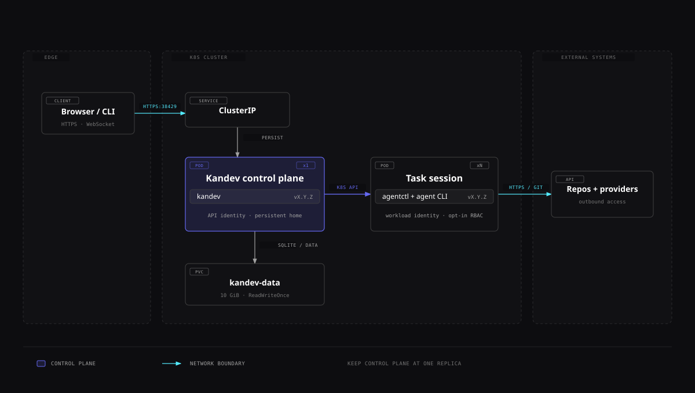

# Kubernetes

Kandev ships example Kubernetes YAML in `k8s/`. The control-plane files are a single-replica, persistent deployment example, not a Helm chart, operator, or supported high-availability topology. A separate opt-in RBAC file supports the Kubernetes executor and is never applied by the documented deployment path. The release workflow publishes container images but does not apply manifests to a cluster. Review and adapt every file before production use.

## Quick path

1. Pin a published image and keep one replica.
2. Apply the ConfigMap, PVC, Service, and transformed Deployment.
3. Port-forward first; add TLS and authentication before exposing an Ingress.
4. Back up the database and PVC before upgrades or deletion.

To run task sessions as Pods, follow [Configure the Kubernetes executor](#configure-the-kubernetes-executor) after the control plane is reachable. That is a separate cluster-authority decision.



[Open full-size SVG diagram][k8s-diagram]

[k8s-diagram]: ../../docs/screenshots/k8s.svg

The control-plane Pod owns the persistent home and API identity. Task-session Pods are a separate, opt-in workload path with their own service-account permissions.

## Architecture and limitations

The example creates:

| File | Resource | Current value |
|---|---|---|
| `k8s/configmap.yaml` | `ConfigMap/kandev-config` | `/data` home, info logs, Docker executor disabled |
| `k8s/pvc.yaml` | `PersistentVolumeClaim/kandev-data` | 10 GiB, `ReadWriteOnce`, default StorageClass |
| `k8s/deployment.yaml` | `Deployment/kandev` | one replica, `Recreate`, example resources and probes |
| `k8s/service.yaml` | `Service/kandev` | `ClusterIP`, TCP 38429 |
| `k8s/ingress.yaml` | `Ingress/kandev` | ingress-nginx-oriented example for `kandev.example.com` |
| `k8s/executor-rbac.yaml` | `ServiceAccount`, `Role`, and `RoleBinding` | Opt-in access for task-session Pods in `kandev-agents`; not part of the deployment quick path |

One pod serves the SPA, API, WebSocket, external MCP endpoint, and `/health` on port 38429. With SQLite, the same PVC holds the database, workspaces, CLI installs, and authentication files.

Keep `replicas: 1`. PostgreSQL and NATS are useful external dependencies, but they do not by themselves make Kandev horizontally scalable: task workspaces, local agent processes, control connections, and other runtime state remain pod/filesystem-local. A tested shared-filesystem and runtime-ownership design would also be required. No multi-replica product deployment is currently documented or validated.

The supplied `Recreate` strategy intentionally stops the old pod before starting the new one. Upgrades therefore have downtime.

## Prerequisites

- a Linux `amd64` or `arm64` cluster with `kubectl` configured;
- registry egress to `ghcr.io`, or a mirrored image;
- a default StorageClass that can provision `ReadWriteOnce`, or an explicit `storageClassName`;
- enough PVC capacity for database, repositories, worktrees, caches, and agent CLIs;
- optional ingress controller, DNS, TLS, and an external authentication gateway;
- outbound access required by selected repositories, package registries, agents, integrations, SSH hosts, or Sprites.

The published image is documented in [Docker](docker.md#published-images). Pin a version or digest; do not use a moving tag for a controlled rollout.

## Deploy the example safely

The checked-in Deployment says `image: kandev:latest`. That is a placeholder, not the published GHCR reference; because the tag is `latest`, Kubernetes also defaults its pull policy to `Always`. Replace it. If you deliberately test a node-preloaded local image, set an appropriate `IfNotPresent` or `Never` pull policy in your own manifest. Apply a pinned published image without editing the source file:

```bash
export KANDEV_IMAGE='ghcr.io/kdlbs/kandev:X.Y.Z'

kubectl apply \
  -f k8s/configmap.yaml \
  -f k8s/pvc.yaml \
  -f k8s/service.yaml

kubectl set image \
  -f k8s/deployment.yaml \
  kandev="$KANDEV_IMAGE" \
  --local -o yaml | kubectl apply -f -

kubectl rollout status deployment/kandev
kubectl get pod -l app=kandev
```

Replace `X.Y.Z` with a real release. Add `-n <namespace>` consistently if deploying outside `default`; the supplied resources do not declare a namespace.

Do not apply `k8s/ingress.yaml` yet. It contains a placeholder host, no TLS section, no Kandev authentication, and controller-specific annotations.

The commands above also omit `k8s/executor-rbac.yaml` intentionally. Deploying the Kandev control plane must not silently grant it permission to create or enter workload Pods.

For private initial access:

```bash
kubectl port-forward service/kandev 38429:38429
```

Open `http://localhost:38429`.

## Configure the Kubernetes executor

The Kubernetes executor is independent of where the Kandev control plane runs. A host process can use a kubeconfig, while a Kandev Pod can use either a mounted kubeconfig or its in-cluster service account. One executor connects to one API server context and one namespace; every selected task session gets one Pod in that namespace.

Only administrators can create, edit, delete, or test Kubernetes executors and profiles. Members can list and use administrator-configured profiles, resume their authorized sessions, and view the sanitized status rows available to them. When Kandev authentication is disabled, requests use the synthetic single-user administrator identity.

The experimental E2E matrix validates API and `agentctl` connectivity against Kubernetes 1.34.8 and 1.36.1, with the full launch, reconnect, storage, failure, and cleanup lifecycle exercised on 1.36.1. Other Kubernetes server versions are currently unvalidated rather than known incompatible.

### Executor prerequisites

- A pre-created namespace dedicated to an appropriate task trust level. Kandev does not create or discover namespaces.
- Linux nodes matching the profile's fixed `linux/amd64` or `linux/arm64` platform.
- Kubernetes API connectivity that supports Pod exec and port-forward over WebSocket or SPDY upgrades. A proxy that allows normal REST calls can still block these streaming subresources.
- Namespaced Pod permissions and storage permissions for the selected workspace mode.
- API discovery and `SelfSubjectAccessReview` access for **Test Kubernetes**. Standard clusters normally grant these basic self-inspection operations to authenticated identities; hardened clusters may require a separate cluster administrator decision.
- An admitted main-container image that satisfies the [image contract](#choose-and-pin-the-main-container-image).

Kandev does not require `list` or `get` access to `Namespace` resources. The configured namespace is a validated DNS label, not a namespace browser.

### Grant only the namespaced operations

[`k8s/executor-rbac.yaml`](../../k8s/executor-rbac.yaml) is an opt-in `ServiceAccount`/`Role`/`RoleBinding` example. It targets `kandev-agents` and is deliberately absent from the control-plane apply commands above. Review and change every namespace occurrence before applying it.

Create the namespace with a cluster-administrator identity, then apply the reviewed file explicitly:

```bash
kubectl create namespace kandev-agents --dry-run=client -o yaml | kubectl apply -f -
kubectl apply -f k8s/executor-rbac.yaml
```

The Role grants exactly:

- `get`, `create`, `delete`, and `watch` on Pods;
- `get` and `create` on `pods/exec` and `pods/portforward`; and
- `get`, `create`, and `delete` on PVCs for the starter `managed_pvc` mode.

Tailor the PVC rule to the profiles that use this identity:

- `managed_pvc`: keep `get`, `create`, and `delete`;
- `existing_claim`: reduce the rule to `get`; or
- `empty_dir` only: remove the PVC rule.

The Role grants no Namespace, Pod list, Secret, ConfigMap, Event, Pod log, node, workload-controller, or cluster-wide access. Kandev reads exact recorded Pods and claims by name. Add unrelated diagnostic permissions only to a separate operator identity.

The connection test creates `SelfSubjectAccessReview` objects to verify each permission and uses API discovery to obtain the server version. Those are cluster-scoped API operations and cannot be granted by a namespaced Role. If a hardened cluster removed the usual basic-user/discovery grants, decide whether to restore that self-inspection access or accept that **Test Kubernetes** will fail even though direct runtime operations might be allowed.

The example binds the Role to `ServiceAccount/kandev-executor` in the same namespace. For in-cluster authentication, run the Kandev control-plane Pod with that service account:

```yaml
spec:
  template:
    spec:
      serviceAccountName: kandev-executor
```

If the control plane runs in another namespace, keep the Role and RoleBinding in the executor namespace, create the ServiceAccount in the control-plane namespace, and change the RoleBinding subject's `namespace` accordingly. If a kubeconfig authenticates as another user or service account, bind the Role to that exact subject instead. Do not give workload Pods this executor identity.

Before saving, inspect effective access as the intended service account:

```bash
kubectl auth can-i get pods \
  --as=system:serviceaccount:kandev-agents:kandev-executor \
  -n kandev-agents
kubectl auth can-i create pods/exec \
  --as=system:serviceaccount:kandev-agents:kandev-executor \
  -n kandev-agents
kubectl auth can-i create persistentvolumeclaims \
  --as=system:serviceaccount:kandev-agents:kandev-executor \
  -n kandev-agents
```

The impersonation checks themselves require permission to impersonate that service account. Run them as a cluster administrator, not as the executor identity.

### Choose kubeconfig or in-cluster authentication

Open **Settings > Executors > Kubernetes** and set one connection mode:

- **Kubeconfig**: enter an absolute path on the machine or container running the Kandev backend. A path on the browser's computer is irrelevant. An optional context overrides the file's current context. Mount the file read-only into a containerized control plane and protect it with owner-only filesystem permissions.
- **In-cluster**: Kandev uses the service-account CA, token, and API endpoint mounted into its own Pod. Kubeconfig path and context must remain empty. This mode fails outside a Kubernetes Pod or when service-account credentials are not mounted.

> **Trust kubeconfig content like executable code.** `client-go` can run credential helpers declared in `users[].user.exec` and initialize configured auth-provider plugins inside the Kandev backend, with the backend's OS privileges. Use a root-owned, read-only kubeconfig, or one owned by a dedicated Kandev service account and not writable by agents. Accept kubeconfigs only from trusted administrators, and review every exec plugin command and referenced binary.

Set the exact executor namespace and a request timeout from 1 to 300 seconds; the UI defaults to `default` and 30 seconds. Kubeconfig bytes and resolved credentials are never copied into executor JSON or a session Pod. The saved path, context, namespace, auth mode, and timeout are connection configuration, so anyone who can mutate them can redirect the backend's cluster access.

### Create and test a profile

The create flow saves one executor plus its first profile. A profile sets:

- main container, default `kandev-agent`;
- platform, `linux/amd64` or `linux/arm64`;
- one strict `apiVersion: v1`, `kind: PodTemplate` YAML document, limited to 256 KiB; and
- workspace mode plus only the fields used by that mode.

Run **Test Kubernetes** before Save and after changing cluster, namespace, template, image, or storage policy. The test reports causal steps for configuration, discovery, namespace selection, RBAC, storage/admission, and streaming:

1. It parses the unsaved connection and optional profile.
2. It discovers the API server version. The namespace step reports the configured namespace; it does not list or get a Namespace object.
3. It submits self-access reviews for the exact Pod, streaming, and conditional PVC permissions.
4. With a profile, it dry-runs the composed Pod and, for `managed_pvc`, the PVC. For `existing_claim`, it reads the exact named claim.
5. It creates one disposable `emptyDir` probe Pod from the profile, waits for the main container, verifies exec and port-forward transport, and deletes that exact Pod with a UID precondition.

No diagnostic PVC is retained. The streaming probe is a real temporary Pod, so quota, scheduling, image pulls, admission, and Pod billing can apply. A cleanup failure makes the test fail; inspect `kandev-stream-probe-*` in the configured namespace before retrying. Kandev returns sanitized errors and template-policy warnings, but do not place secrets in a template or error-producing field.

After saving, each Kubernetes profile opens with the shared **Cluster connection** editor, **Test Kubernetes**, and executor-wide **Active sessions** before workload, workspace, credential, and script settings. The test combines the current unsaved connection and profile values. Administrators edit both resources through the page's one Save/Reset flow; members see the same hierarchy read-only. A connection edit is shared by every profile on that executor and can change how active sessions reconnect, while a profile edit affects only new workload snapshots. If both are dirty, Kandev confirms active-session impact once and saves the connection before the profile. The raw PodTemplate field grows and shrinks with its YAML; long unwrapped lines scroll inside the field without widening the settings page.

Configured executor rows expand to their profile pages, and task settings links open the exact selected profile. The standalone `/settings/executors/k8s/<executor-id>` connection editor is only a recovery surface for an executor that has no profiles; a bookmarked URL for a configured executor redirects to its first profile.

The **Active sessions** card refreshes every 90 seconds and reads only Kandev's runtime inventory. For each authorized task row, the backend gets the exact recorded Pod and checks namespace, name, UID, and ownership labels. It does not list arbitrary namespace workloads or return Pod specs, environment, logs, or credentials. Administrator change and deletion confirmations use a separate admin-only global count of every runtime row that refers to the executor, including rows whose detailed metadata is malformed; that endpoint returns only the count and never cross-user task or session identities.

On a Kubernetes task, use the Pod control in the task header to inspect the exact authorized Pod's live phase, container state, restart count, workspace mode, creation time, and sanitized failure reason. Desktop opens this disclosure on hover; touch and coarse-pointer layouts provide a named 44 px button that opens a Drawer with the same structured Pod summary. Quiet Refresh and Settings icons sit in the summary header. Refresh visibly stays busy until the immediate status read settles, and Settings opens the exact selected profile. Kubernetes does not show the generic **Reset environment** action because Pod and PVC lifecycle remains owned by Stop, Resume, Archive, and Delete.

The smaller Pod glyphs on Kanban cards and in task lists request their exact session status as soon as they appear, so their healthy or failed color does not depend on a first hover. On a fine pointer, hover or keyboard focus opens a compact summary with the Pod identity and aligned rows for state, restarts, workspace mode, creation time, last check, and any sanitized failure. On touch layouts, the same glyph has an expanded 44 px hit target and opens that summary in a bottom Drawer without selecting the task row.

### Understand template ownership

Kandev preserves compatible administrator fields such as images, resources, security contexts, tolerations, affinity, sidecars, init containers, image-pull secrets, and workload service accounts. It rejects a profile before an API write when it conflicts with runtime invariants, uses unknown strict-YAML fields, contains multiple documents, omits the named main container or its image, or exceeds the size limit.

Kandev owns generated resource names, namespace, `restartPolicy: Always`, Linux OS/architecture scheduling, the main-container command/arguments/working directory, port 8765, reserved environment, and three volumes/mounts:

| Volume | Main-container path | Purpose |
|---|---|---|
| `kandev-runtime` | `/opt/kandev` | Injected helper, runtime environment, prepare script, and restart marker |
| `kandev-auth` | `/run/kandev` | Memory-backed auth environment and runtime home |
| `kandev-workspace` | `/workspace` | Selected `emptyDir`, managed PVC, or existing claim |

The template cannot set the main container's command, args, or working directory; use reserved volume names or mount paths; use container port 8765 or the `kandev-agentctl` port name; or define `HOME`, `AGENTCTL_*`, or `KANDEV_*` environment keys. It also cannot set Pod name/namespace/UID, owner references, finalizers, restart policy, node name, OS, or Linux OS/architecture selectors. Kandev defaults `automountServiceAccountToken: false` only when the template leaves it unset.

Every Kandev-created Pod and managed PVC has this complete custom identity:

| Label | Recorded value |
|---|---|
| `kandev.ai/executor-id` | Executor record ID |
| `kandev.ai/profile-id` | Executor-profile record ID |
| `kandev.ai/instance-id` | Runtime instance ID |
| `kandev.ai/task-id` | Task ID |
| `kandev.ai/session-id` | Task-session ID |
| `kandev.ai/environment-id` | Task-environment ID |

It also owns `app.kubernetes.io/name=kandev-agent`, `app.kubernetes.io/component=agent-session`, `app.kubernetes.io/managed-by=kandev`, and `app.kubernetes.io/instance=<runtime-instance-id>`. All `kandev.ai/*` label and annotation keys are reserved, including keys not listed above. Kandev rejects an admission response that changes or adds one of those reserved identities.

Every Kandev-created Pod and managed PVC also receives a fresh 256-bit `kandev.ai/create-nonce` annotation for that individual create request. If a create response is lost or ambiguous, Kandev adopts, checkpoints, bootstraps, or deletes the resulting object only when the API object preserves that exact nonce and the complete recorded identity.

Structurally valid high-risk policy remains administrator-owned. Kandev warns about privileged containers, host networking, host PID/IPC, `hostPath`, host ports, and explicit service-account token automount, but does not strip them. Enforce the real boundary with Pod Security admission, policy controls, quotas, network policy, workload identity, and storage policy. See [Security and Trust](security.md#separate-kubernetes-control-and-workload-identities).

### Choose and pin the main-container image

The UI's starter template uses:

```yaml
apiVersion: v1
kind: PodTemplate
template:
  spec:
    containers:
      - name: kandev-agent
        image: ghcr.io/kdlbs/kandev:latest
```

`latest` is convenient for a first disposable test but is a moving tag. For a controlled environment, replace it with the matching stable release, such as `ghcr.io/kdlbs/kandev:X.Y.Z`, or an immutable digest. Validate both supported architectures before reusing one profile across heterogeneous clusters.

A custom image does not need `agentctl`; Kandev injects the platform-matched helper. It must provide:

- Linux `amd64` or `arm64` matching the selected platform;
- `sh`, `sleep`, `git`, CA trust, and ordinary shell/core utilities used by bootstrap and repository setup, including `cat`, `chmod`, `cp`, `dd`, `find`, `grep`, `mkdir`, and `rm`;
- Node.js and npm for the supported agent-install flow, plus the selected agent CLI or everything its install script needs; and
- compilers, package managers, shells, certificates, and repository-specific tools needed by the task.

The effective runtime user must be able to write `/opt/kandev`, `/run/kandev/home`, and `/workspace`. Configure a compatible image user and volume ownership, or set an appropriate Pod `fsGroup` and verify the CSI driver's behavior. If an agent install uses npm globals, point its prefix and `PATH` at a writable location rather than assuming `/usr/local` or an image-specific home is writable. A read-only root filesystem can work only if the template and image leave every non-volume path used by installed tooling writable elsewhere. Test agent installation, Git clone, npm global installation, a terminal, and the repository's real build before promoting the image.

### Use prepared worker image recipes

The repository includes copyable worker image recipes in
[`k8s/worker-images`](../../k8s/worker-images/README.md) and strict PodTemplate
examples in [`k8s/presets`](../../k8s/presets/). They are inputs to the existing
Kubernetes executor. They do not create Pods or start sessions by themselves.
Kandev still injects `agentctl`, the launch command, credentials, runtime files,
and the selected workspace mount.

The recipes provide these starting targets:

| Target | Extra runtime |
|---|---|
| `minimal` | Published Kandev base tools, Node, npm, Python, venv, and Git |
| `node-pnpm` | The pinned pnpm version in `k8s/worker-images/pins.env` |
| `python` | The published base Python and venv support |

Build and smoke-test them with the pinned base image:

~~~bash
bash scripts/test-kubernetes-worker-images.sh --check
bash scripts/test-kubernetes-worker-images.sh --smoke --platform linux/amd64
~~~

The current recipe and Kind lifecycle evidence covers Linux `amd64` and the
Kubernetes version named in the experimental matrix. It does not establish
support for another architecture or cluster version. Build and push a selected
target to an operator-controlled registry, then replace the preset image marker
with that image's immutable digest. Keep `imagePullPolicy` appropriate for the
registry. The local `imagePullPolicy: Never` and image tags used by Kind tests
are fixture-only values.

The examples use UID 1000, writable `/workspace` paths for npm and Python
artifacts, no service-account token automount, dropped capabilities, and no
privilege escalation. Review resource requests, Pod Security admission, storage
ownership, registry access, and repository tool requirements before use.

### Choose workspace storage

| Mode | Profile fields | Lifecycle |
|---|---|---|
| `managed_pvc` | Positive Kubernetes quantity, optional StorageClass, and one or more access modes. Defaults are `10Gi` and `ReadWriteOnce`. | One filesystem PVC per session, without a Pod owner reference. It survives ordinary stop, backend restart, main-container restart, and Pod replacement. Terminal/forced cleanup deletes it only after exact identity verification. |
| `empty_dir` | No PVC fields. | Pod-scoped storage. It survives a container restart but disappears with the Pod. A missing Pod makes the workspace unrecoverable. |
| `existing_claim` | Exact claim name in the executor namespace. | Kandev gets and mounts the claim but never creates, relabels, or deletes it. Data retention, access modes, concurrent mounts, and backup remain the operator's responsibility. |

A managed claim may remain Pending because of StorageClass, topology, quota, access-mode, or binding policy even after dry-run admission succeeds. An existing claim can expose data from other applications or sessions to the agent. Use a dedicated claim unless deliberate sharing and its concurrency model have been reviewed.

### Recovery, snapshots, and cleanup

Kandev's `executors_running` inventory is authoritative. It records exact Pod and PVC namespace/name/UID, full resource identity, workspace ownership, platform, main container, remote port, hashes, and the validated workload launch snapshot. The snapshot contains Pod template, platform, main container, and storage configuration only. It excludes Kandev-resolved credentials, resolved profile environment values, injected files, and scripts; literal values written by an administrator into the Pod template remain in the snapshot.

Current connection configuration and recorded workload configuration serve different purposes:

- Saved kubeconfig/in-cluster mode, kubeconfig path/context, and timeout are used for later status, reconnect, replacement, and cleanup. Changing credentials or context can restore or break access to an existing session. Retained sessions continue to target their recorded namespace; changing the saved namespace affects new sessions only.
- Saved profile edits affect new sessions. An existing Pod is never live-mutated, and a missing-Pod replacement uses the recorded workload snapshot rather than the profile's current image, template, platform, main container, or storage fields.

Ordinary Stop and backend shutdown close local clients and forwards but preserve the Pod and workspace. Agent or main-container restart keeps the Pod volumes; Kandev performs a new nonce handshake and local port-forward. If a Pod disappears, managed or existing PVC storage can support a replacement Pod after identity checks; `emptyDir` cannot.

Archive/delete terminal cleanup and explicit force cleanup are destructive. Before deletion, Kandev verifies the recorded namespace, name, UID, and complete standard plus `kandev.ai/*` ownership-label set. It then deletes the exact Pod with UID/resource-version preconditions and deletes a PVC only when inventory proves Kandev created that managed claim. Existing claims are never deleted. A missing object is idempotent; an inventory read error, same-name replacement, UID mismatch, missing label, changed label, extra `kandev.ai/*` label, or mismatched create nonce fails closed without deleting the ambiguous object.

Kandev blocks deleting an executor, or changing an executor into or out of Kubernetes, while runtime inventory still refers to it. Finish normal session cleanup first. Profile deletion does not rewrite or destroy a retained workload because recovery owns the recorded profile ID and snapshot.

Do not manually delete by name or label alone. If manual incident cleanup is unavoidable, compare the Kandev runtime inventory with namespace, name, UID, and all ownership labels first, preserve required workspace data, and record the out-of-band action.

### Read retained resource status

The **Active sessions** card shows the sanitized session inventory for the
selected executor. It includes sessions that Kandev can resume after ordinary
Stop, not only sessions whose agent process is currently running. The card
shows separate session state, Pod state, retention state, workspace mode, and
main-container CPU and memory requests.

Desktop rows use two status lines. The first line shows session and retention
badges. The second line shows Pod phase and main-container state. Use the row
disclosure to see the full labeled details. Phone cards show the same facts in
a compact group and keep the full card as the task link.

`active` means the recorded session is in an active lifecycle state.
`retained` means the verified Pending or Running Pod remains after a stopped,
completed, failed, or idle session. `terminating`, `terminal`, `missing`, and
`unknown` describe other verified or incomplete observations. These labels do
not prove agent connectivity, process activity, actual CPU or memory use, or
cost. Requests describe only the main container. They exclude sidecars and
Pod-wide resources.

Use **Stop** when the session must remain resumable. Archive or Delete can
remove a Kandev-managed Pod and workspace during terminal cleanup. An
operator-owned `existing_claim` is never deleted by Kandev. Refresh the card
after a lifecycle change because session and Pod observations can change
independently.

### Inspect Kubernetes launch timings

Kandev writes bounded Info-level records for fresh Kubernetes environment
creation. Set `KANDEV_LOG_LEVEL=info` when starting the backend, then inspect
the active backend log under `KANDEV_HOME_DIR/logs/backend-logs.log` or the
configured container log sink.

The `kubernetes.launch.stage` record reports one of `storage`, `pod_ready`,
`bootstrap`, or `agentctl_connect`. The `kubernetes.launch.completed` record
reports the total environment-call duration. Both records include an opaque
attempt ID, task/session/instance IDs, `mode: fresh`, `duration_ms`, and an
outcome of `success`, `error`, `canceled`, or `timeout`. A failed stage or
finalization site is included when known.

The total covers fresh environment creation and its rollback. It does not
measure queue wait, instance-lock wait, client construction, credential
persistence, or agent-process startup. Reconnect and replacement paths do not
emit fresh-start records. Logs never include raw requests, scripts, errors,
tokens, nonces, or credentials.

## Persistence and filesystem permissions

With `KANDEV_HOME_DIR=/data`, the PVC includes:

- `/data/data/kandev.db`, WAL/SHM files, and SQLite snapshots;
- `/data/tasks`, `/data/worktrees`, `/data/repos`, `/data/sessions`, and `/data/lsp-servers`;
- `/data/agent-sessions` for selectively seeded Docker-agent state;
- `/data/.npm-global` for runtime-installed npm agent CLIs;
- `/data/home` for CLI auth, Azure config, caches, and user configuration.

The base image starts as root, recursively fixes `/data` ownership, then drops to the `kandev` user at UID 1000. This may violate a restricted Pod Security policy, fail on root-squashed storage, or make a large-volume restart slow. The universal image is configured to run directly as `kandev` and therefore does not perform that ownership repair.

For a non-root pod, provision the volume for UID 1000 and test your CSI driver's `fsGroup` behavior. A common starting point is:

```yaml
spec:
  template:
    spec:
      securityContext:
        fsGroup: 1000
        fsGroupChangePolicy: OnRootMismatch
      containers:
        - name: kandev
          securityContext:
            runAsNonRoot: true
            runAsUser: 1000
```

This is storage-policy guidance, not a universally portable manifest. Some CSI drivers ignore or implement `fsGroup` differently. Verify a write to `/data/data` and `/data/home` before relying on it.

PVC retention depends on the StorageClass reclaim policy. Deleting `PersistentVolumeClaim/kandev-data` can permanently remove database, repositories, and credentials; back up and verify the target before doing so.

## Configuration and secrets

Non-sensitive values may stay in `kandev-config`. Put database passwords and deployment credentials in a Kubernetes `Secret`, then reference keys from the container:

```yaml
env:
  - name: KANDEV_DATABASE_PASSWORD
    valueFrom:
      secretKeyRef:
        name: kandev-database
        key: password
```

Create the example secret without committing its value:

```bash
kubectl create secret generic kandev-database \
  --from-literal=password='<replace-me>'
```

Shell history and the Kubernetes API still see this literal. Prefer your cluster's normal encrypted secret-delivery workflow. Kandev secrets created in the UI live in its database, so database backups are sensitive too.

See [Configuration](configuration.md) for exact YAML and `KANDEV_` names. Important image/example values:

| Setting | Example value | Meaning |
|---|---|---|
| `KANDEV_HOME_DIR` | `/data` | Persistent Kandev root |
| `KANDEV_DOCKER_ENABLED` | `false` | No Docker daemon in the supplied pod |
| `KANDEV_LOG_LEVEL` | `info` | Backend log threshold |
| `KANDEV_DATABASE_DRIVER` | `sqlite` by default | Set `postgres` for an external database |

Kubernetes detection makes the default log format JSON. Kandev writes the active file under `/data/logs/backend-logs.log`, closes it before an entry would exceed 16 MiB, and names the closed segment `backend-logs-YYYY-MM-DD-NNNNNN.log`. Active and closed backend files use at most 256 MiB in total. High-volume periods keep the newest evidence and can shorten the available history. Three UTC days is the maximum file age. Kandev emits warn-and-above to stdout by default; ensure the home path is persistent if the retained file history must survive pod replacement.

### PostgreSQL

For PostgreSQL, configure at least:

```yaml
env:
  - name: KANDEV_DATABASE_DRIVER
    value: postgres
  - name: KANDEV_DATABASE_HOST
    value: postgres.example.internal
  - name: KANDEV_DATABASE_PORT
    value: "5432"
  - name: KANDEV_DATABASE_USER
    value: kandev
  - name: KANDEV_DATABASE_DBNAME
    value: kandev
  - name: KANDEV_DATABASE_SSLMODE
    value: verify-full
  - name: KANDEV_DATABASE_PASSWORD
    valueFrom:
      secretKeyRef:
        name: kandev-database
        key: password
```

Use the SSL mode and trust material required by your database. PostgreSQL moves only database data; keep the `/data` PVC. Kandev's built-in backup/restore is SQLite-only, so schedule `pg_dump` and test restoration independently.

## Agent execution in a pod

> **Docker boundary:** Do not add only a Docker socket mount. The runtime also needs helper, credential-session, and local-clone bind sources at matching daemon-host paths. Privileged Docker-in-Docker has a separate security and persistence model and no supplied manifest.

The [Kubernetes executor](#configure-the-kubernetes-executor) creates separate task-session Pods through the Kubernetes API and does not require a Docker socket. The Local and Worktree behavior below instead runs agent processes inside the control-plane Pod itself.

<details>
<summary>Agent execution, resources, and probes</summary>

Local and Worktree profiles run agents inside the Kandev pod. Install agent CLIs from **Settings > Agents**, or derive an image that contains them. Runtime npm installs persist under `/data/.npm-global`. Choose the universal image when tasks need its additional build toolchains, but account for the larger image and non-root volume requirement.

The checked-in ConfigMap disables Local Docker. Do not add only a Docker socket mount: the current runtime also needs helper, credential-session, and local-clone bind sources to exist at identical paths on the Docker daemon host, and it currently selects a Linux/amd64 helper. See [containerized control plane limitation](docker.md#containerized-control-plane-limitation). A privileged Docker-in-Docker sidecar has a separate security and persistence model and no supplied Kandev manifest.

SSH and Sprites profiles can run from Kubernetes if the pod can reach their endpoints and has the required secrets/helper bundle. SSH can materialize repository sources; review [SSH repository-source limits](executors.md#repository-sources-and-cleanup). Remote Docker is unimplemented.

Interactive commands should run as the service user. With the base image, a Kubernetes exec starts as root, so use:

```bash
kubectl exec -it deployment/kandev -- gosu kandev gh auth login
```

The universal image already runs as `kandev`; use `kubectl exec -it deployment/kandev -- gh auth login`. Prefer Kandev secret/profile flows over ad hoc pod login where possible.

## Resources and probes

The example requests 250 millicores and 512 MiB, with limits of 2 CPU and 2 GiB. Those are placeholders, not capacity recommendations. Local/Worktree agents share the pod limit with the control plane and can exceed it during builds. Measure workload memory, CPU, ephemeral storage, PVC growth, and process counts; then set requests/limits accordingly.

The example liveness probe calls `/health`; the example readiness probe calls `/ready`. `/health` returns 200 as soon as the TCP listener accepts connections, before startup finishes: it confirms the process is alive, not that it can serve real traffic, so gating liveness on it never restarts a pod that is merely still starting up. `/ready` returns 503 until routes are wired, the agent registry is seeded, and (in e2e builds) the mock-harness routes are mounted, then 200. Neither is a deep check of database, repository, Docker, provider, or agent health.

Long migrations or slow storage may need a startup probe to prevent premature liveness restarts:

```yaml
startupProbe:
  httpGet:
    path: /health
    port: backend
  periodSeconds: 5
  failureThreshold: 60
```

Tune from observed startup time. Keep liveness on `/health` and readiness on `/ready`; use separate external monitoring for dependencies and real workflows.

</details>

## Ingress and exposure

Kandev ships with its experimental authentication boundary disabled. Do not expose the example Ingress publicly until authentication and TLS are in place; use an authenticated gateway when relying on a supported external identity boundary.

Before applying `k8s/ingress.yaml`:

1. replace `kandev.example.com`;
2. configure the real `ingressClassName` or class annotation;
3. add TLS/certificate configuration;
4. add an identity-aware authentication layer;
5. preserve WebSocket upgrades and long idle timeouts;
6. ensure clients cannot bypass the gateway through the Service or node network.

The example's `nginx.ingress.kubernetes.io/configuration-snippet` is ingress-nginx-specific and is disabled by policy in many clusters. Adapt it to your controller; modern controllers may handle WebSocket upgrades without a custom snippet. Proxy the application at `/` on a dedicated host. A subpath deployment is not a documented base-path configuration.

Apply only after review:

```bash
kubectl apply -f k8s/ingress.yaml
kubectl describe ingress kandev
```

## Backup, upgrade, and rollback

Before an upgrade, create and verify a database backup and preserve any irreplaceable task branches. See [Operations](operations.md).

```bash
kubectl set image deployment/kandev \
  kandev=ghcr.io/kdlbs/kandev:X.Y.Z
kubectl rollout status deployment/kandev
kubectl logs deployment/kandev --tail=200
```

The `Recreate` strategy stops active local agents. SQLite migrations run on startup and create a pre-migration snapshot when required; snapshot failure aborts startup. PostgreSQL migrations do not invoke `pg_dump`, so take and verify a PostgreSQL backup before the upgrade.

This release includes a one-time task-worktree ownership schema cutover (see [Operations](operations.md)). The cutover rewrites the worktree ownership tables in one transaction and drops legacy schema. It requires:

- A verified pre-upgrade database backup. For SQLite, create and verify a manual snapshot **before** starting the upgrade; the automatic pre-migration snapshot is taken during startup of the new binary and cannot be verified beforehand. For PostgreSQL, use `pg_dump` (the cutover does not invoke it).
- All writers stopped during the cutover. With PostgreSQL, do not run a mixed-version fleet across the upgrade; the cutover takes a database advisory lock and fails closed if it cannot serialize.
- One successful schema initializer: keep the deployment at a single replica during startup, and check `kubectl rollout status` before scaling out.

If the initializer reports a worktree-ownership conflict, stop the rollout and
do not delete database rows. The transaction leaves the legacy schema intact.
Restore service with a compatible pre-cutover image, or deploy the migration
hotfix and retry against the unchanged PVC. Do not run an older image against a
database after the cutover has committed.

`kubectl rollout undo` changes the image, not the database schema. After the cutover the final schema is intentionally not readable by older binaries, so a binary downgrade requires restoring the matching pre-upgrade database backup; do not start an older image against the normalized database. Reapplying the checked-in `k8s/deployment.yaml` without the image transformation resets the image to `kandev:latest`, so keep your production customization in your own overlay or deployment repository.

## Remove while retaining data

Delete compute and routing resources separately from the PVC:

```bash
kubectl delete ingress kandev --ignore-not-found
kubectl delete deployment kandev
kubectl delete service kandev
kubectl delete configmap kandev-config
kubectl get pvc kandev-data
```

Do not delete the PVC until its database, workspaces, auth state, and backups have been exported or intentionally discarded.

## Troubleshooting

```bash
kubectl get pod -l app=kandev -o wide
kubectl describe pod -l app=kandev
kubectl logs deployment/kandev --tail=200
kubectl get pvc kandev-data
kubectl describe pvc kandev-data
kubectl get events --sort-by=.lastTimestamp
```

- **`ImagePullBackOff`:** the example's placeholder `kandev:latest` was not replaced, the tag is wrong, registry egress is blocked, or image-pull credentials are missing.
- **`CrashLoopBackOff` with permission errors:** check PVC ownership, Pod Security admission, root-squash, UID 1000, and universal/base image behavior.
- **Liveness kills startup:** inspect migration/storage timing and add/tune a startup probe.
- **UI works through port-forward but not ingress:** check host/DNS, TLS, auth-gateway route, WebSocket support, and controller-rejected annotations.
- **Agent CLI missing:** install it through Settings or bake it into a derived image; confirm `/data/.npm-global/bin` is on `PATH`.
- **SQLite locked or pod pending after scaling:** return to one replica and `Recreate`; do not share one SQLite database between pods.
- **PVC full:** inspect worktrees, repositories, caches, CLI installs, logs, and retained task state before expanding or deleting anything.

Related pages: [Docker](docker.md), [Configuration](configuration.md), [Executors](executors.md), and [Operations](operations.md).
