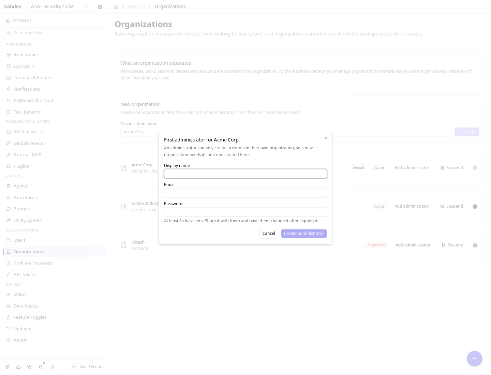
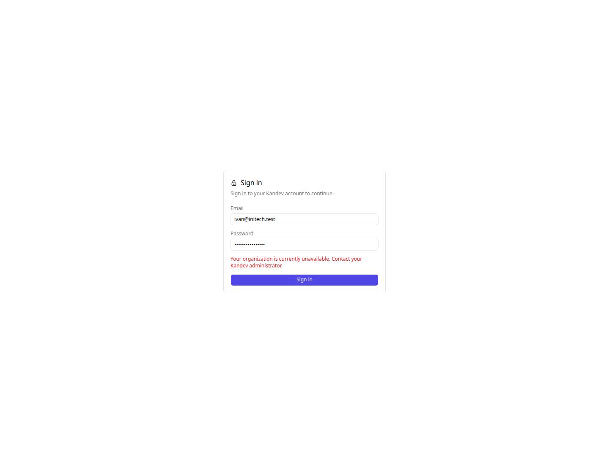
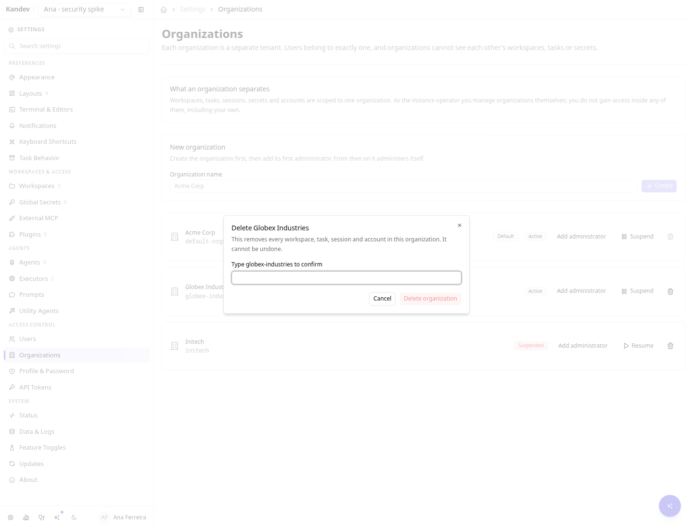
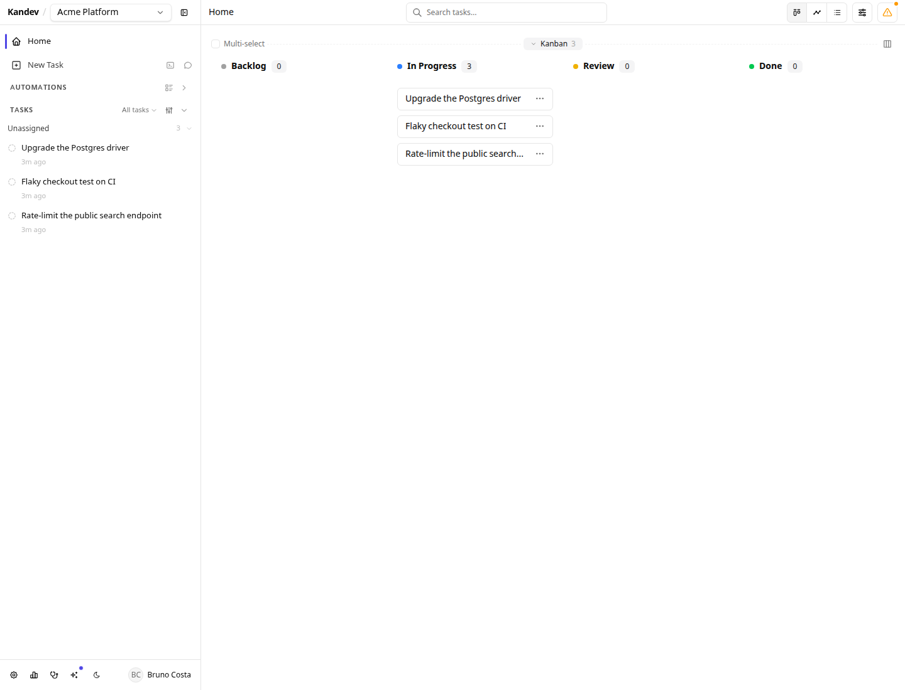
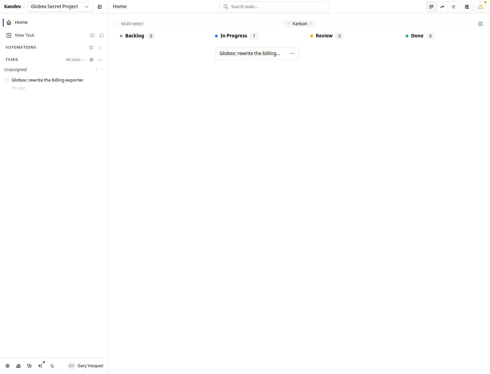

# Organizations

An organization is an experimental **tenant identifier** above users. Normal authorized request paths use it to scope workspaces, tasks, sessions, and secrets. The current implementation is not yet a hard boundary between mutually untrusting tenants: user administration and install-wide system operations have cross-organization gaps, and ordinary WebSocket notification fan-out can fail open on resolution errors. See [Current limits](#current-limits).

Use organizations to evaluate tenant-aware behavior or organize trusted groups on one server. If groups must be isolated from one another, run separate Kandev instances until the current gaps are closed. If everyone on your server is one team, use [Team Access](team-access.md) instead, which is about sharing *within* one organization.

Organizations are an **experimental runtime feature** and are disabled in every shipped profile. They require experimental [authentication](authentication.md); enabling organizations with authentication off is refused at startup, because a tenant boundary with nobody to belong to it is not a boundary.

## Quick checklist

1. Enable **Authentication & users** and complete the setup wizard.
2. Enable **Organizations** in `Settings > System > Feature Toggles` and restart.
3. Everything you already had lands in one default organization; the first admin becomes the instance operator.
4. Create further organizations in `Settings > Access Control > Organizations` and give each one its first administrator.
5. Review the current isolation gaps before adding organizations that do not trust one another.

## Enabling

`Settings > System > Feature Toggles`, turn on **Organizations**, restart. Or set the environment variable on a fresh server:

```bash
KANDEV_FEATURES_AUTH=true
KANDEV_FEATURES_MULTI_TENANCY=true
```

On the first boot with the flag on, Kandev migrates itself:

- A single **default organization** is created.
- Every existing user, workspace and secret is put into it.
- The first admin is granted the **instance operator** tier, so the instance is never left with organizations and nobody able to manage them.
- Any workspace membership that would straddle two organizations is dropped.

Nothing becomes visible to anyone new. The migration is idempotent, so a second boot changes nothing.

## Two tiers, deliberately separate

| Tier | Manages | Can read your workspaces? |
|---|---|---|
| **Instance operator** | Organization lifecycle and first administrators | **No** |
| **Organization admin** | Users, invites, settings and shared configuration; current user and system routes have install-wide gaps | Only what team access already grants them |

The operator tier is an *administration* tier, not a visibility one. An operator creates, suspends and deletes organizations. The operator bit by itself grants no permission inside an organization; access to the operator's own workspaces comes from that account's organization and team membership, exactly like everyone else. Install-wide backup, database, storage, and feature-toggle operations are not yet restricted to this tier; org admins currently retain them.

## Managing organizations

`Settings > Access Control > Organizations` is visible only to the instance operator. A non-operator gets a not-found response from those routes, so the page does not appear for them. The entry sits with the other access settings rather than under System, because an organization is a boundary above users; System is for operating the instance. It is hidden entirely until the feature is enabled.


### Creating one

Create the organization, then give it a first administrator. That second step is not optional bookkeeping: direct account creation inherits the creating admin's organization, so a brand-new organization has no way to get its first user. This operator-only path breaks that circularity. The new admin can then create accounts in that organization, subject to the user-management gaps below.



### Suspending

Suspension is the reversible lever, for a billing lapse or an investigation. Every session and token for that organization fails closed immediately, running work is refused, and **nothing is deleted**. Resuming restores access exactly as it was.

A suspended user is told what actually happened rather than that their password is wrong, so they contact an administrator instead of resetting a credential that works.



### Deleting

Deletion removes every workspace, task, session and account in the organization. It requires typing the organization's slug verbatim, and the last remaining organization cannot be deleted.

**Deletion is not retroactive across backups.** It is irreversible on the live server, but a backup taken while the organization existed still contains it, secrets included, and restoring that backup brings it back. This is not a temporary gap that a later release closes: erasing an organization from backups already written needs key material kept outside the database snapshot, which is a separate decision with its own recovery tradeoffs.

If you need an organization's data gone from your backups, the lever is deleting the backup files, not waiting for them to age out. Snapshots do not all expire, and one class never does:

| Snapshot | Where it comes from | Does it age out? |
|---|---|---|
| `kandev-*.db` | Written automatically before an upgrade migration | Only the newest two survive, and only pruned on a boot that changes version |
| `manual-*.db` | `System > Backups` | **Never.** Delete it deliberately |
| `kandev-pre-reset-*.db` | Factory Reset | Excluded from the Backups delete action on purpose, since it is the lifeline if a reset goes wrong |

A manual snapshot is exactly what a careful operator takes right before a destructive deletion, and it will hold that organization indefinitely. Remove it from `System > Backups`, or from the `backups/` directory beside the database.



## What the boundary looks like in use

Two organizations on one server. Ana is in Acme; her team's board is shared with her whole organization through [team access](team-access.md).



Gary is an administrator of Globex on the **same server**. In workspace and task views, he sees his own organization. Acme's org-visible workspace is not merely hidden from him; guarded domain reads return not found. This example does not cover the Users, System, or WebSocket notification gaps listed below.



## How normal domain access is scoped

- **Your organization comes from your account, never from the request.** Guarded domain routes do not accept an organization selector that moves the caller between tenants. There is no organization switcher, and one person belongs to exactly one organization; someone who needs two uses two accounts.
- **The tenant check runs before any workspace role.** For guarded workspace reads and actions, a workspace in another organization is unreachable by an org admin, by the instance operator, and even by a stale membership row.
- **It fails closed.** An account somehow carrying no organization reaches nothing while the feature is on, rather than matching everything.
- **New accounts inherit their creator's organization.** Admin-created users and invite links both carry the minting admin's organization, so accepting an invite can never place someone in a tenant the inviter cannot see.
- **Email is unique across the whole server**, not per organization. One address is one person, which is why signing in needs no organization picker.

## Current limits

These are real and worth knowing before you put two untrusting groups on one server.

- **Do not use one instance as a hard boundary between untrusted tenants yet.** The org-admin Users API currently lists accounts across organizations and accepts cross-org role or status changes. Install-wide backup, database, storage, and runtime-feature mutations also use the org-admin settings scope rather than the instance-operator tier, so an org admin can affect other tenants or download a backup containing their data.
- **Ordinary WebSocket notification fan-out is not fail-closed.** Workspace-aware delivery normally narrows recipients by reach, but its regular path falls back to global delivery if reach and owner resolution both fail. Selected sensitive notifications use a fail-closed path; the general notification stream does not yet provide a hard tenant boundary. See [WebSocket API](websocket-api.md#emitted-notifications-and-recipients).
- **Secrets are scoped per organization, but not encrypted per organization.**
  Reads are org-scoped, so one organization cannot fetch another's secret
  through the API. At rest, every secret on the instance is sealed under a
  single master key in the data directory next to the database, so anyone who
  can read that directory can decrypt every organization's secrets.
  Per-organization encryption keys are designed but not yet implemented.
- **Filesystem and agent credentials are shared.** Worktrees and clones live under one `~/.kandev` tree owned by the OS user running Kandev, and agent CLI logins (`gh auth`, `claude login`, provider API keys) authenticate as that OS user. Organizations are an **application-layer** boundary over Kandev's data: they are not a sandbox. Two organizations that must not share agent credentials need separate Kandev instances or separate OS users today.
- **Executors and agent profiles are still instance-wide.** They are shared configuration, and a shared agent profile means a shared provider credential.
- **No per-organization billing, quotas or usage metering.** Suspension is the only lever.
- **No per-organization export or backup.** Backups are instance-wide and contain every organization.
- **No supported cross-organization collaboration**, by design: no shared workspaces, no moving a user or workspace between organizations, and no cross-organization search.
- **Users cannot be moved between organizations.** Moving a person would leave their workspaces behind in the old tenant.

## Turning it off

Flip the toggle off and restart. Organization assignments are retained, so re-enabling restores the previous boundary without another migration. With it off, the instance behaves as a single organization again and the Organizations page disappears.
