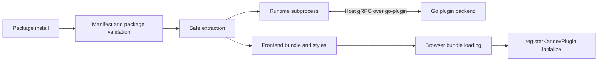

# Authoring a Plugin

This is the canonical developer entry point for Kandev runtime plugins. Use it
to choose a supported surface, edit manifest.yaml, implement the backend or
native UI, package it, and test it against a disposable development instance.
The [plugin manifest reference](plugins-manifest.md) owns field-by-field schema
details; [Plugins](plugins.md) covers operator installation and lifecycle.

The official scaffold is
[kdlbs/kandev-plugin-template](https://github.com/kdlbs/kandev-plugin-template).
Production plugins live in their own repositories. The in-tree fixture is test
support, not a starter repository.

## Quick workflow

1. Choose the closest recipe in this page.
2. Copy the template and edit manifest.yaml: identity, runtime executable, UI
   paths, capabilities, events, webhooks, and config.
3. Implement only through the Go pluginsdk and the frontend registry/Host API.
4. Run the plugin repository tests, vet/lint, and build.
5. Stage the package, run plugin-pack, inspect the archive and generated
   checksums, then install it in a disposable Kandev instance.
6. Smoke-test every declared hook and capability, then bump the version for
   the next iteration.

## Lifecycle



Installation validates the manifest, archive paths, checksums, managed runtime,
and the current host executable before extraction. Kandev then supervises the
declared subprocess and injects a Host connection. Installing a new version
does not remove the one it replaces: that version stays on disk as the rollback
target, and only the versions before it are deleted, once the new one is
confirmed running. Two extracted versions is therefore the steady state for a
plugin that runs; a plugin that is disabled or failed to start keeps every
version it has, and `data/` is never part of that cleanup. The UI bundle is static
package content loaded by the browser; it does not run inside the backend
subprocess. On disable or uninstall, the host calls destroy when present and
bulk-revokes registrations, styles, routes, handlers, and navigation. Reloads and
updates are generation-safe: a slow or failed initialization is not treated as a
definitive revocation, while a successfully ready generation can remove panels it
no longer registers. Each attempted generation owns its requests, subscriptions,
modals, task-link dialogs, toasts, and review surfaces. Timeout, failure, reload,
disable, or uninstall aborts and cleans those resources before calling `destroy`
exactly once; late callbacks from an expired generation are fenced from host state.

## Package and data layout

```text
<id>-<version>.tar.gz
├── manifest.yaml                         # required, validated first
├── server/
│   └── plugin-<goos>-<goarch>[.exe]      # one or more declared binaries
├── ui/
│   ├── bundle.js                          # optional native ES module
│   ├── plugin.css                         # optional styles
│   └── assets/                            # optional files referenced by UI
├── assets/                                # optional manifest icon/assets
├── checksums.txt                          # generated by plugin-pack
└── checksums.txt.sig                      # optional signature
```

runtime.executables maps a platform key such as linux-amd64 to a clean
package-relative path such as server/plugin-linux-amd64. Windows values must
end in .exe. The host platform's key must be present at install time. A
UI-focused plugin still ships a managed backend executable because the current
installer requires runtime.type: binary; that executable can be a no-op
pluginsdk.UnimplementedPlugin server.

Kandev injects KANDEV_PLUGIN_DATA_DIR into the subprocess. It is the durable,
per-plugin directory for arbitrary files or a plugin-owned database:

```text
~/.kandev/plugins/<id>/data/
```

The directory is shared across installed versions, survives restarts and
upgrades, and is removed on uninstall. Keep small structured values in Host
state instead, and never write arbitrary files elsewhere in the Kandev data
directory.

## Choose a plugin shape

| Shape             | Package contents                                           | Typical contract                                                        | Minimal capability set                                 |
| ----------------- | ---------------------------------------------------------- | ----------------------------------------------------------------------- | ------------------------------------------------------ |
| Backend plugin    | Go binary and manifest                                     | events, webhooks, Host data, state, secrets, or utility-agent calls     | only the capabilities used by the backend              |
| UI-focused plugin | no-op managed binary, ui/bundle.js, optional styles/assets | routes, nav, named slots, WebSocket handlers, keybindings, shared store | ui.bundle; add ui.keybindings when declaring shortcuts |
| Combined plugin   | Go binary plus UI bundle                                   | UI calls a declared webhook or backend API; backend uses Host           | union of the two surfaces, kept least-privilege        |

There is no separate HTTP server to launch. pluginsdk.Serve owns the
go-plugin/gRPC handshake and Host injection. The backend implements
pluginsdk.Plugin (OnEvent and/or HandleWebhook) and embeds
pluginsdk.UnimplementedPlugin for no-op defaults.

### Contribute an agent tool

A managed plugin can contribute task-aware MCP tools through the same supervised
gRPC process. Add an `agent_tools` declaration to `manifest.yaml` and implement
the optional `pluginsdk.AgentToolPlugin` interface:

```yaml
agent_tools:
  - name: add_tag
    description: Add an existing tag to the current task.
    surfaces: [kanban-task]
    input_schema:
      type: object
      properties:
        tag_id: { type: string }
      required: [tag_id]
      additionalProperties: false
    annotations:
      read_only_hint: false
      destructive_hint: false
      idempotent_hint: true
```

The host exposes the readable canonical name
`kandev_<plugin-id-slug>_<local-name>` (for example,
`kandev_task_tags_v1_add_tag`). Punctuation in the stable plugin ID becomes an
underscore. Very long names receive a short stable hash suffix after the slug
is truncated. Tool names are host-owned; the plugin-local `name` is used for
the gRPC dispatch.

Tools may target `kanban-task`, `office-task`, or both. They are not exposed to
configuration or external MCP clients. Kandev validates the input and optional
output JSON Schemas, supplies task/session/workspace/surface context, enforces
a 30-second deadline and 1 MiB result limit, and does not retry calls.

The optional SDK method is:

```go
InvokeAgentTool(context.Context, *pluginsdk.AgentToolRequest) (*pluginsdk.AgentToolResult, error)
```

The request includes immutable invocation, task, session, workspace, and
surface context. Return required fallback text, optional structured content,
and `IsError` when the operation failed. Declaring a tool does not grant Host
API capabilities; use the existing `capabilities` fields for those permissions.

## Security and capabilities

Plugins are privileged installed code. The capability list gates Host RPCs; it
is not an operating-system sandbox. A backend subprocess inherits the Kandev
process environment, and a UI bundle runs as same-origin JavaScript with the
curated React, UI, and app-store surface.

- Plugins do not receive direct database access. Use typed Host readers/writers,
  Host state, secrets, events, and the data directory. Do not import Kandev
  internal/... packages or call undocumented REST endpoints.
- state gates Host state; secrets gates RevealSecret and plugin-owned secret
  methods; each api_read resource gates its reader; api_write gates
  task/message mutations and interaction responses; agent_invoke gates
  utility-agent calls; and capabilities.events controls event delivery.
- GetConfig and EmitEvent are ungated. GetConfig returns this plugin's own
  config, including cleartext secret fields, so do not log or commit it.
- Declared webhook keys default to public. Set `webhooks[].access: authenticated`
  for browser UI and billable operations. Kandev does not enforce
  `webhooks[].method`; public integrations must still validate the provider
  signature and replay/timestamp rules before side effects.
- An authenticated webhook is reachable from your panel with any method,
  `GET` included: `host.api.fetch` is same-origin (or carries an accepted
  `Origin` in a split-origin install), which is what the host checks. You do
  not need to force a read onto `POST`.
- capabilities.auth is the highest-risk capability. A webhook response may
  assert a verified external identity with X-Kandev-Auth-Login; only assert an
  email the IdP verified as owned by the subject. See [ADR 0050](../decisions/0050-plugin-external-auth-capability.md).

## Storage decision table

| Need                                      | Use                                                                  | Scope/lifecycle                                                                                       | Capability or rule                                                              |
| ----------------------------------------- | -------------------------------------------------------------------- | ----------------------------------------------------------------------------------------------------- | ------------------------------------------------------------------------------- |
| Small JSON object owned by this plugin    | Host state: GetState, SetState, DeleteState, ListState               | instance, workspace, task, or agent; survives restart/upgrade and is included in Kandev state backups | capabilities.state: true; values are JSON objects, not bare scalars             |
| Per-user browser/plugin storage           | host.storage: get/set/delete/list/subscribe                          | instance, workspace, task, session, or repository, scoped per user                                    | capabilities.user_state: true; set/delete accept ifUnmodifiedSince and writerId |
| Operator configuration                    | Host.GetConfig and manifest config_schema                            | Plugin-owned settings; config changes restart an active subprocess                                    | Ungated GetConfig; secret fields arrive cleartext in the subprocess             |
| Plugin-owned credentials                  | Host.GetSecret/SetSecret/DeleteSecret, or secret: true config fields | Encrypted Kandev vault, namespaced to this plugin                                                     | capabilities.secrets: true; never log values                                    |
| Files, caches, or plugin-managed database | KANDEV_PLUGIN_DATA_DIR                                               | Shared across versions, removed on uninstall                                                          | Write only below the injected directory; own schema, locking, and migrations    |

Host state is not host.storage: Host state is plugin-scoped backend state with
no transaction primitive, so design updates to be idempotent; host.storage
(below) is per-user, per-scope frontend storage with an optional
ifUnmodifiedSince compare-and-swap.

## Authoritative contracts

The guide summarizes the contract for discovery. These files remain the source
of truth and must be updated together when the contract changes:

- Versioned frontend author contract: `@kandev/plugin-sdk`, sourced from
  `apps/packages/plugin-sdk`. Import it with `import type`; the package has no
  dependency on Kandev, React, Zustand, or private `@/` modules, so it also
  typechecks when consumed from an isolated or sparse checkout.
- Frontend host implementation: docs/plans/plugins/PLUGIN-API.md and
  apps/web/lib/plugins/types.ts. These may contain compatibility-only host
  details that are deliberately absent from the public SDK.
- Concrete frontend Host exports: apps/web/lib/plugins/host-api.ts.
- Backend author API: apps/backend/pkg/pluginsdk.
- Wire contract: apps/backend/proto/kandev/plugin/v1/plugin.proto.
- Manifest model and semantic validation: apps/backend/internal/plugins/manifest.
- Package integrity and installation: apps/backend/internal/plugins/pkgtar.
- Durable decisions: [ADR 0043](../decisions/0043-plugin-host-data-api.md), [ADR 0047](../decisions/0047-plugin-host-conversation-reads.md), [ADR 0048](../decisions/0048-plugin-host-utility-agent-invoke.md), and [ADR 0050](../decisions/0050-plugin-external-auth-capability.md).

## Frontend contract

### Loading and cleanup

The package's ui.bundle is a hand-written ES module. When active, Kandev loads
it and the bundle calls:

```js
window.registerKandevPlugin("my-plugin", {
  initialize(registry, host) {},
  destroy() {},
});
```

initialize receives a registry scoped to this plugin and a PluginHostApi. The
host may call initialize more than once across disable/enable cycles. Make it
repeatable; return a cleanup function from subscriptions and timers, and use
destroy to remove side effects that are not registrations. The host revokes all
registry entries, closes plugin modals, and removes plugin styles on
disable/uninstall. Reloads can temporarily leave a plugin in a loading or failed
state; open and saved panels remain until the current generation is ready. A
ready generation that no longer registers a panel closes it, while an explicit
disable or uninstall closes every panel owned by the plugin. This lifecycle
bookkeeping is host-internal; plugins do not call lifecycle methods.

Type frontend bundles against the versioned, runtime-free SDK rather than
copying host interfaces or importing Kandev application files:

```ts
import type { PluginHostApi, PluginRegistry } from "@kandev/plugin-sdk";
```

Official code-host plugins use `host.context` for provider-neutral workspace,
task-creation, and exact repository-identity reads. `getWorkspaceIds()` and
`subscribeWorkspaces()` let a plugin republish workspace-scoped integration
state after load or when the workspace list changes. If a required read is
missing, extend this typed context contract; do not reverse-engineer Zustand
slice shapes in a released plugin.

### Frontend hook/API matrix

| Surface                         | Location and input                                                                                                                                                                                                                                                                                     | Manifest requirement                                                   | Cleanup/lifecycle                                                                                                                                                                                               | Small example                                                                                                       |
| ------------------------------- | ------------------------------------------------------------------------------------------------------------------------------------------------------------------------------------------------------------------------------------------------------------------------------------------------------ | ---------------------------------------------------------------------- | --------------------------------------------------------------------------------------------------------------------------------------------------------------------------------------------------------------- | ------------------------------------------------------------------------------------------------------------------- |
| registerRoute                   | registry.registerRoute(path, Component, options?); exact SPA path; options.topbar defaults to host chrome or false for full-bleed                                                                                                                                                                      | Active ui.bundle                                                       | Route is removed on disable/uninstall; use destroy for subscriptions                                                                                                                                            | registry.registerRoute("/acme", Page, { topbar: { title: "Acme" } })                                                |
| registerNavItem                 | { id, label, path, icon?, section? }; section is main, integrations, sidebar-footer (sidebar footer icon row, subject to an inline budget past which the item moves to the footer's overflow menu; and phone menu Utilities group, uncapped), or accepted-but-not-rendered settings                    | Active ui.bundle                                                       | Nav item is revoked and removed from desktop/phone navigation                                                                                                                                                   | registry.registerNavItem({ id: "home", label: "Acme", path: "/acme", icon: "chart" })                               |
| registerSettingsRoute           | registerSettingsRoute(fullPath, Component) with an exact path under /settings/plugins/<id>/...; settings shell supplies chrome                                                                                                                                                                         | Active ui.bundle                                                       | Route is removed on disable/uninstall                                                                                                                                                                           | registry.registerSettingsRoute("/settings/plugins/acme/health", HealthPage)                                         |
| registerComponent               | registerComponent(slot, Component); component receives { slotProps?: unknown }                                                                                                                                                                                                                         | Active ui.bundle                                                       | Every registration is owner-tracked, error-isolated, and bulk-revoked                                                                                                                                           | registry.registerComponent("task-sidebar", Panel)                                                                   |
| registerWsHandler               | registerWsHandler(action, handler(payload)); receives actions bridged from lib/ws                                                                                                                                                                                                                      | Active ui.bundle                                                       | Handler is removed on disable/uninstall; tolerate duplicate/replayed actions                                                                                                                                    | registry.registerWsHandler("acme.updated", renderUpdate)                                                            |
| registerKeybinding              | registerKeybinding(id, handler(event)); id must be declared in ui.keybindings; users can override the effective combo                                                                                                                                                                                  | ui.bundle and ui.keybindings[]                                         | Handler is removed on disable/uninstall; core shortcuts win, and editable targets are skipped unless that entry set ui.keybindings[].allow_in_editor                                                            | registry.registerKeybinding("open-panel", () => host.openModal(...))                                                |
| registerIntegrationSettings     | One provider-owned settings component with an optional action mounted in the detail header and the integrations index card                                                                                                                                                                             | Active ui.bundle                                                       | Registration is exclusive by id and revoked on unload; host owns workspace selection and settings navigation; component and action receive the routed `workspaceId`, and action receives its `surface`          | registry.registerIntegrationSettings({ id: "acme", Component, action: Toggle })                                     |
| registerTranslations            | Flat English fallback plus optional Kandev locale catalogs, isolated to this plugin's namespace                                                                                                                                                                                                        | Active ui.bundle                                                       | Catalogs are replaced atomically, removed on unload, and registry consumers invalidate when the host locale changes                                                                                             | registry.registerTranslations({ en: { settings: "Settings" }, "pt-pt": { settings: "Definições" } })                |
| registerRepositoryProvider      | Provider-owned paged/searchable repository list, URL match/inspect, branches, and optional native `createChangeRequest` transport                                                                                                                                                                      | ui.bundle and matching `repository_providers[]` id                     | Registration and in-flight callbacks are result-fenced on unload; host owns native task and Create PR UI                                                                                                        | registry.registerRepositoryProvider({ id: "acme", ...provider })                                                    |
| registerTaskAction              | Child action inside the task menu's native Link section                                                                                                                                                                                                                                                | Active ui.bundle                                                       | Action is revoked on unload; host supplies current task/workspace and desktop/mobile presentation                                                                                                               | registry.registerTaskAction({ id: "link-pr", placement: "link", ... })                                              |
| registerReviewProvider          | Normalized task reviews, workspace associations, unlink, and shared Review panel                                                                                                                                                                                                                       | ui.bundle and matching `repository_providers[]` id                     | Snapshots/subscriptions are owner-scoped and revoked on unload; host owns status chrome, indicators, unlink UI, and responsive Review placement                                                                 | registry.registerReviewProvider({ id: "acme", ...reviews })                                                         |
| registerTaskPanel               | { id, title, icon?, Component, mobileEnabled? }; adds a row to the task workspace's "+" (add panel) menu; Component receives { panelId, taskId, sessionId, presentation }                                                                                                                              | Active ui.bundle                                                       | Panel renders behind its own error boundary; slow/failed reloads preserve it, a ready generation missing it closes it, and disable/uninstall closes every owned instance                                        | registry.registerTaskPanel({ id: "notes", title: "Notes", Component: NotesPanel })                                  |
| registerTaskMenuAction          | { id, label, icon?, group: "edit" \| "primary", visible?(context), run(context) }; "edit" is card-only inside Edit, while "primary" is a flat item on cards and desktop/mobile task-row menus                                                                                                          | Active ui.bundle                                                       | Action is revoked on disable/uninstall; a throwing/rejecting run is caught and logged                                                                                                                           | registry.registerTaskMenuAction({ id: "enhance", label: "Enhance", group: "primary", run: doEnhance })              |
| registerTaskFilter              | { id, label, getOptions(), matches(context, selected) }; adds a client-side, multi-select filter section to the kanban board's display dropdown, alongside Workflow/Repository                                                                                                                         | Active ui.bundle                                                       | Filter is revoked on disable/uninstall; selections are ephemeral (not persisted); matches is only called for a non-empty selection, and a throw is caught, logged, and treated as non-matching                  | registry.registerTaskFilter({ id: "tags", label: "Tags", getOptions: listTagOptions, matches: taskHasSelectedTag }) |
| registerTaskListFacet           | { id, label, getValues({ taskId, workspaceId }), subscribe? }; adds page-local Sort and Group choices on `/tasks`                                                                                                                                                                                      | Active ui.bundle                                                       | Values apply only to the loaded page, callbacks are isolated, and registrations are revoked on disable/unload                                                                                                   | registry.registerTaskListFacet({ id: "tags", label: "Tag", getValues: taskTags })                                   |
| host.React / host.jsx           | Shared React instance and React.createElement alias                                                                                                                                                                                                                                                    | Active ui.bundle                                                       | No cleanup; never bundle a second React/Radix runtime                                                                                                                                                           | const h = host.jsx                                                                                                  |
| host.context                    | Versioned provider-neutral reads/subscriptions for active workspace, all workspace ids, native task creation, and exact provider repository identity                                                                                                                                                   | Active ui.bundle                                                       | Subscriptions are generation-owned and revoked on unload; records are stable SDK shapes, not private app state                                                                                                  | const ids = host.context.getWorkspaceIds()                                                                          |
| host.useSettingsSaveContributor | Registers one plugin-owned contributor for the native save bar; the host prefixes ids with `plugin:<pluginId>:` before shared coordination                                                                                                                                                             | Active ui.bundle                                                       | Contributor lifecycle follows the rendering component; save and discard remain plugin-owned                                                                                                                     | host.useSettingsSaveContributor({ id: "credentials", revision, isDirty, save, discard })                            |
| host.setIntegrationEnabled      | Publishes one registration's live enabled value for one workspace; the value is reactive but not durable                                                                                                                                                                                               | Active ui.bundle                                                       | The host validates that `integrationId` belongs to this plugin; republish after load using `host.context.getWorkspaceIds()` and `subscribeWorkspaces()`                                                         | host.setIntegrationEnabled("acme", workspaceId, enabled)                                                            |
| host.i18n                       | Plugin-scoped `locale`, imperative `t(key, options?)`, and reactive `useTranslation()`                                                                                                                                                                                                                 | A registered English catalog                                           | Locale changes re-render reactive consumers; missing active-locale messages fall back to the plugin's English catalog                                                                                           | const { t } = host.i18n.useTranslation(); t("pullRequests")                                                         |
| host.store (legacy)             | Compatibility-only access to Kandev's private Zustand store; intentionally absent from `@kandev/plugin-sdk`                                                                                                                                                                                            | Older ui.bundle                                                        | Do not use in new or official plugins; private slices may change without plugin-API compatibility                                                                                                               | Migrate reads to host.context                                                                                       |
| host.api.fetch / baseUrl        | fetch(path, init?) is scoped to /api/plugins/<id>/...; baseUrl is the backend origin for split-origin deployments                                                                                                                                                                                      | Active ui.bundle; backend path must be a declared webhook when relayed | Declare `webhooks[].access: authenticated` for UI-only or billable operations; requests are generation-aborted on unload                                                                                        | host.api.fetch("webhooks/inbound", { method: "POST" })                                                              |
| host.api.invokeAction           | Authenticated call to a declared action with host-verified workspace/task/session/repository selectors and bounded untrusted body                                                                                                                                                                      | Matching manifest `actions[]` key/scope                                | Browser abort cancels the bounded plugin RPC; safe domain statuses and `Retry-After` may be returned                                                                                                            | host.api.invokeAction("reviews.get", { taskId }, { signal })                                                        |
| host.storage                    | Authenticated, per-user key/value storage: get(scope, scopeId, key, options?)/set(scope, scopeId, key, value, options?)/delete(scope, scopeId, key, options?)/list(scope, scopeId, options?) plus subscribe(filter, handler); no plugin backend required                                               | capabilities.user_state: true                                          | Reads and writes accept an AbortSignal; set/delete also accept writerId (appended to the host's per-tab id, not a replacement) for echo suppression; list returns every entry under the scope pair, unpaginated | host.storage.set("task", taskId, "note", value, { writerId: panelId, signal })                                      |
| host.ui                         | Curated host instances: Alert*, Badge, Button, Card*, Checkbox, Dialog*, DropdownMenu*, Input, Label, Pagination*, ScrollArea, Select*, Separator, Sheet*, Skeleton, Spinner, Switch, Table*, Tabs*, Textarea, Tooltip*, RichTextEditor, RichTextReadOnly, plus Combobox, PageTopbar, TaskCreateDialog | Active ui.bundle                                                       | Host owns contexts/portals; render with host React and let modal/slot cleanup run                                                                                                                               | const Button = host.ui.Button                                                                                       |
| host.theme                      | Current "light" or "dark" theme                                                                                                                                                                                                                                                                        | Active ui.bundle                                                       | Read during render; subscribe through host/app patterns if theme-sensitive                                                                                                                                      | host.theme === "dark"                                                                                               |
| host.navigate                   | Soft SPA navigation navigate(href, { replace? })                                                                                                                                                                                                                                                       | Active ui.bundle                                                       | No registry cleanup; avoid navigating to undeclared external origins                                                                                                                                            | host.navigate("/t/" + taskId)                                                                                       |
| host.openModal                  | Host-owned modal: { title?, content, size?, dismissible? } -> { close() }                                                                                                                                                                                                                              | Active ui.bundle                                                       | Modal auto-closes on disable/uninstall; close handles are idempotent                                                                                                                                            | const modal = host.openModal({ content: Panel })                                                                    |

### Code-host integration surface map

A code-host plugin should be a normalized provider adapter, not a parallel copy
of Kandev's GitHub UI. The plugin owns remote API calls, authentication,
provider identifiers, and normalized snapshots. Kandev owns the interaction
patterns, responsive layout, status colors, dialogs, menus, and review chrome.

| User-facing result                     | Plugin hook                                                                            | Plugin supplies                                                                                  | Kandev supplies                                                                                                                          |
| -------------------------------------- | -------------------------------------------------------------------------------------- | ------------------------------------------------------------------------------------------------ | ---------------------------------------------------------------------------------------------------------------------------------------- |
| Provider workbench                     | `registerRoute`, `registerNavItem`, and host dashboard primitives                      | Query state, normalized rows, opaque cursors, refresh and launch callbacks                       | Page chrome, searchable repository filter, cursor pagination, saved-query dialog, list rows, task preset menu, desktop/mobile primitives |
| Workspace connection settings          | `registerIntegrationSettings`                                                          | Provider-specific fields, health checks, connect/disconnect behavior                             | Settings navigation, active workspace, lifecycle and error boundary                                                                      |
| Native repository and branch selection | `registerRepositoryProvider` plus declared branch action                               | Credential-free repositories, branches, URL inspection, optional `createChangeRequest` transport | Existing task dialog, provider picker, branch picker, push-before-create flow                                                            |
| Task-to-review linking                 | `registerTaskAction` and `host.openTaskLinkDialog`                                     | Provider label/icon, accepted reference syntax, authenticated link callback                      | Existing **Link** submenu, dialog validation, submit state, toast and desktop/mobile presentation                                        |
| Task indicators, CI, unlink and review | `registerReviewProvider`                                                               | Association snapshots, semantic `taskStatus`, normalized review detail, refresh/unlink callbacks | Sidebar/Kanban indicators, status palette, 90-second refresh, topbar/composer status, unlink UI and shared Review panel                  |
| Composer `#` search                    | Manifest `reference_sources`, `SearchEntityReferences`, and `AuthorizeEntityReference` | Display candidates and a fresh provider authorization at submission                              | Source menu, chips, canonical metadata and fail-closed submission                                                                        |
| Authenticated browser operations       | Manifest `actions` and `host.api.invokeAction`                                         | Bounded action handler using verified context                                                    | Actor/resource authorization, selector stripping, timeout, cancellation and response limits                                              |

The task indicator uses the same semantic precedence as first-party providers:
failures and requested changes are red, pending checks yellow, an outstanding
review with passing checks sky blue, passing checks green, merged reviews
purple, and neutral or draft reviews muted. Publish semantic state only; never
send CSS classes or provider-selected colors.

Persist links, suppressions, task reservations, and watches by provider ID,
provider connection scope, immutable repository ID, and change-request number.
Repository names, paths, clone URLs, and human-readable review keys can change or
be reused, so use them only for display and live lookup. Bind watch state and OAuth
refresh work to an opaque connection epoch; replacement or disconnect must fence
in-flight results, while an explicit resume may bind a watch to the new epoch.

Keep `refresh(taskId)` lightweight: publish metadata, reviewers, checks, and an
inexpensive comment count when available. Load files, diffs, commits, and comment
bodies from `ReviewPanel` only when the user opens Review. Bound every provider page
and action response, and expose truncation rather than overflowing Kandev's response
limit.

Repository listing callbacks receive optional `query`, opaque `cursor`, `limit`, and
`signal` fields. Return `{ repositories, nextCursor }` for a page; returning an array
remains compatible for small or older providers. Treat cursors as provider-owned opaque
values, bind them to the original query, and stop emitting `nextCursor` when exhausted.
Include immutable repository identity and provider connection scope in that binding;
reject a mismatched cursor before making a remote request.
Kandev follows pages and fails a repeated cursor instead of looping forever.

### Localize plugin UI

Register an English fallback before registering labels or rendering routes.
Catalogs are flat, plugin-scoped, and support `{{name}}` interpolation plus
`_one`/`_other` plural keys. Use the reactive hook in components and the
imperative translator in registry getters so a locale change updates native
navigation and provider labels without reloading the plugin.

```ts
registry.registerTranslations({
  en: {
    pullRequests: "Pull requests",
    linkedCount_one: "{{count}} pull request linked",
    linkedCount_other: "{{count}} pull requests linked",
  },
  "pt-pt": {
    pullRequests: "Pull requests",
    linkedCount_one: "{{count}} pull request associado",
    linkedCount_other: "{{count}} pull requests associados",
  },
});

const translate = host.i18n.t;
registry.registerNavItem({
  id: "reviews",
  get label() {
    return translate("pullRequests");
  },
  path: "/reviews",
});

function ReviewsPage() {
  const { t } = host.i18n.useTranslation();
  return host.jsx("h1", null, t("pullRequests"));
}
```

### Own provider brand icons

Icon fields accept a curated host icon name or a plugin-owned component. Keep
provider brands in the plugin repository so a new code host does not require a
Kandev icon-map change. Build the component with `host.jsx`; do not bundle React.

```ts
const AcmeIcon = ({ className }: { className?: string }) =>
  host.jsx(
    "svg",
    { viewBox: "0 0 24 24", className, "aria-hidden": true },
    host.jsx("path", { d: "M4 12h16" }),
  );

registry.registerRepositoryProvider({
  id: "acme",
  label: "Acme",
  icon: AcmeIcon,
  // listRepositories, listBranches, and inspectURL omitted here
});
```

Kandev accepts only supported host locale IDs, at most 1,000 messages per
locale, safe flat keys, and messages up to 4,096 characters. An invalid
replacement is rejected before the active catalog changes. Do not translate
provider identifiers, action keys, URL paths, or other machine-readable state.

For a plugin-owned workbench, use `host.ui.IntegrationRepositoryFilter` and
`host.ui.IntegrationCursorPagination`; they preserve the same searchable picker,
pagination geometry, touch targets, and responsive behavior as first-party code-host
pages without requiring a plugin to copy their markup.

The examples below were captured from an isolated packaged-plugin run. The
provider data is fictional; the surrounding controls are the production
host-owned components.

#### Provider dashboard and repository picker

The plugin route composes the shared dashboard primitives, while the declared
repository provider appears inside Kandev's existing task dialog.


#### Link a pull request from a task

`registerTaskAction` contributes only the provider entry. The host owns the
parent **Link** menu and the link dialog.


#### Task status, CI, and review

Association and review snapshots drive every surface. In this example, passing
CI plus one outstanding reviewer makes the task icon sky blue; hovering it
shows the same normalized summary used by first-party providers.


#### Composer reference search

Dynamic `reference_sources` appear beside built-in sources. A selected result is
display-only until Kandev calls the plugin again to authorize it for submission.


### Supported named slots

registerComponent currently has these mounted slots. The source type is open
to strings, but an unmounted name renders nowhere.

| Slot                      | Mounted location                                                                           | slotProps                                                        |
| ------------------------- | ------------------------------------------------------------------------------------------ | ---------------------------------------------------------------- |
| task-sidebar              | Bottom of task-detail sidebar                                                              | none                                                             |
| settings-nav              | Settings navigation tree                                                                   | none                                                             |
| chat-input-actions        | Task or Quick Chat composer toolbar                                                        | PluginComposerSlotProps                                          |
| task-create-input-actions | Task creation composer toolbar                                                             | PluginComposerSlotProps                                          |
| new-session-input-actions | New-session composer toolbar                                                               | PluginComposerSlotProps                                          |
| chat-top-bar              | Session top bar                                                                            | { taskId, taskTitle?, workspaceId, activeSessionId, sessionIds } |
| main-top-bar              | Home/Kanban/Tasks top bar                                                                  | { workspaceId, workspaceLabel?, currentPage }                    |
| app-status-bar-left       | Left side of desktop status bar or mobile status drawer                                    | AppStatusBarSlotProps                                            |
| app-status-bar-right      | Right side of desktop status bar or mobile status drawer                                   | AppStatusBarSlotProps                                            |
| plugin-settings           | Top of this plugin's Settings > Plugins page                                               | { pluginId, status }; owner-scoped to the plugin being viewed    |
| task-card-indicators      | Kanban card, beside the PR status icon                                                     | { taskId, workspaceId, workflowStepId }                          |
| task-card-tags            | Kanban card, its own row below the badges row                                              | { taskId, workspaceId, workflowStepId }                          |
| task-row-metadata         | Sidebar task tree and `/tasks` rows                                                        | TaskRowMetadataSlotProps                                         |
| sidebar-workspace-actions | Desktop New Task row or phone navigation action group, after Quick Terminal and Quick Chat | SidebarWorkspaceActionsSlotProps                                 |

AppStatusBarSlotProps is { placement, presentation, density, pathname,
activeWorkspaceId, activeTaskId, activeSessionId }. Desktop presentation is a
compact 24px bar; mobile presentation is an in-flow drawer, so render a
touch-usable row. Status items can be reordered by the host; plugins do not get
an ordering API.

`SidebarWorkspaceActionsSlotProps` is `{ workspaceId, workspaceLabel?,
presentation }`. The host uses `presentation: "desktop"` for the compact
sidebar cluster and `presentation: "mobile"` for the phone navigation sheet.
Mobile actions must keep their own buttons or links at least 44px in the active
dimension and provide an accessible name.

`PluginComposerSlotProps` is `{ surface, presentation, taskId, taskTitle?,
activeSessionId, sessionIds, disabled, submittable, disabledReason?, composer }`.
The `composer` capability provides `insertText`, `focus`, and asynchronous
`submit`; submit returns `submitted` only when the native composer accepts the
operation, otherwise `blocked` or `unavailable`.

## Backend contract

### Plugin lifecycle surface

| Surface              | Input/output                                                                                                                      | Manifest capability or declaration                                    | Lifecycle/cleanup                                                                                                                  | Example                                            |
| -------------------- | --------------------------------------------------------------------------------------------------------------------------------- | --------------------------------------------------------------------- | ---------------------------------------------------------------------------------------------------------------------------------- | -------------------------------------------------- |
| Plugin.OnEvent       | OnEvent(ctx, \*pluginsdk.Event) error; event has EventID, EventType, OccurredAt, WorkspaceID, Payload                             | Matching capabilities.events subject/pattern                          | Delivery is sequential per plugin with bounded queue and retries; make handlers idempotent by EventID and reconcile critical state | if event.EventType == "task.created" { ... }       |
| Plugin.HandleWebhook | HandleWebhook(ctx, *pluginsdk.WebhookRequest) (*WebhookResponse, error); request includes key, method, path, query, headers, body | webhooks[].key; auth additionally required for login assertion header | Undeclared keys are 404; GET/POST are relayed; validate method/signature and bound side effects                                    | if req.WebhookKey == "inbound" { ... }             |
| Host.EmitEvent       | EmitEvent(ctx, name, payload) publishes plugin.<id>.<name>                                                                        | None; intentionally ungated                                           | Subscribers must declare the emitted subject; use versioned names/payloads                                                         | host.EmitEvent(ctx, "sync.completed", payload-map) |

Event delivery is best-effort: Kandev makes the initial attempt plus retries
with 5s, 15s, and 45s delays, and a bounded in-memory queue/error buffer can
drop events during sustained overload or restart. Use EventID for deduplication
and a source-of-truth reconciliation path when loss matters. The full
subscription vocabulary and wildcard rules are in the
[manifest reference](plugins-manifest.md#event-subscription-vocabulary).

### Host API matrix

| Host surface          | Methods                                                                        | Required manifest capability                                                | Notes                                                                                                                                                                                       |
| --------------------- | ------------------------------------------------------------------------------ | --------------------------------------------------------------------------- | ------------------------------------------------------------------------------------------------------------------------------------------------------------------------------------------- |
| State                 | GetState, SetState, DeleteState, ListState                                     | state: true                                                                 | Plugin-scoped JSON objects keyed by scope/scopeID/key; no transactions                                                                                                                      |
| Config                | GetConfig                                                                      | None                                                                        | Reads this plugin's validated config_schema; secret fields are cleartext in the subprocess; config updates restart active plugins                                                           |
| Secrets               | RevealSecret, GetSecret, SetSecret, DeleteSecret                               | secrets: true                                                               | Encrypted vault; plugin-owned keys are namespaced; never log values                                                                                                                         |
| Tasks                 | Tasks().List, Tasks().Get                                                      | api_read: tasks                                                             | Typed DTOs and opaque pagination cursor                                                                                                                                                     |
| Tasks writes          | Tasks().Create, Tasks().Update, Tasks().Move                                   | api_write: tasks                                                            | Implemented; routed through Kandev services so events/WS updates fire. Update rejects a workflow step change; Move is the only path that moves a task between steps                         |
| Sessions              | Sessions().List, Sessions().CodeStats                                          | api_read: sessions                                                          | Typed session and computed code-stat records                                                                                                                                                |
| Workspaces            | Workspaces().List                                                              | api_read: workspaces                                                        | Instance-visible workspaces                                                                                                                                                                 |
| Workflows             | Workflows().List, Workflows().ListSteps                                        | api_read: workflows                                                         | List steps by workflow id                                                                                                                                                                   |
| Agent profiles        | AgentProfiles().List                                                           | api_read: agent_profiles                                                    | Global agent profiles exposed by the Host data API                                                                                                                                          |
| Repositories          | Repositories().List                                                            | api_read: repositories                                                      | List by workspace id                                                                                                                                                                        |
| Messages              | Messages().List                                                                | api_read: messages                                                          | Historical user/agent content; Kandev system blocks are stripped                                                                                                                            |
| Message send          | Messages().Send                                                                | api_write: messages                                                         | Sends a prompt to a task session and records plugin:<id> author                                                                                                                             |
| Interactions          | Interactions().ListPending, Interactions().Get                                 | api_read: interactions                                                      | Durable record of agent requests still owed a human answer; Get resolves resolved ones too                                                                                                  |
| Interaction responses | Interactions().RespondToPermission, .AnswerClarification, .CancelClarification | api_write: interactions                                                     | Routed through the services the native UI drives; first terminal response wins                                                                                                              |
| Utility agent         | InvokeUtilityAgent(ctx, prompt)                                                | agent_invoke: true plus config_schema.utility_agent (format: utility-agent) | One-shot completion using the selected utility-agent ID; Kandev resolves that utility's enabled profile, permissions, and launch settings. Missing or stale bindings are FailedPrecondition |

The Go signatures, filters, DTOs, and pagination types live in
apps/backend/pkg/pluginsdk/host.go and data_types.go. api_write task/message
methods are implemented in the current branch; do not repeat older docs that
call them reserved.

Host calls are request-scoped rather than registrations: pass the handler
context, handle cancellation, and close any files or external clients created
by the plugin. There is no Host cleanup callback. Typical calls are
`host.SetState(ctx, "task", taskID, "note", value)`,
`host.Tasks().List(ctx, filter, page)`,
`host.Tasks().Create(ctx, pluginsdk.CreateTaskInput{...})`,
`host.Messages().Send(ctx, taskID, sessionID, text)`, and
`host.InvokeUtilityAgent(ctx, prompt)`; each fails with `PermissionDenied`
when its manifest capability is absent.

## Task-oriented recipes

The snippets below are deliberately small. Keep the full template Makefile and
release workflow from the official scaffold.

The maintained in-tree fixture shows the same surfaces end to end: its
[Go backend](../../apps/backend/cmd/plugin-fixture/plugin.go),
[manifest](../../apps/backend/cmd/plugin-fixture/fixture-package/manifest.yaml),
and [native bundle](../../apps/backend/cmd/plugin-fixture/fixture-package/ui/bundle.js)
are the source examples used by the package and browser tests.

### 1. UI-focused plugin

Use a no-op backend because the managed installer requires a host executable.

```yaml
# manifest.yaml
id: "acme-dashboard"
api_version: 1
version: "0.1.0"
display_name: "Acme Dashboard"
runtime:
  type: binary
  executables:
    linux-amd64: server/plugin-linux-amd64
ui:
  bundle: "/ui/bundle.js"
```

```go
// server/main.go
package main

import "github.com/kandev/kandev/pkg/pluginsdk"

func main() { pluginsdk.Serve(&pluginsdk.UnimplementedPlugin{}) }
```

```js
// ui/bundle.js
window.registerKandevPlugin("acme-dashboard", {
  initialize(registry, host) {
    function Page() {
      return host.jsx("main", null, "Acme dashboard");
    }
    registry.registerRoute("/acme-dashboard", Page);
    registry.registerNavItem({
      id: "home",
      label: "Acme",
      path: "/acme-dashboard",
      icon: "chart",
    });
  },
});
```

### 2. Go backend with Host state

```go
type Plugin interface {
	// OnEvent handles a single bus event delivery. A non-nil error causes
	// kandev to retry (3 retries, 5s/15s/45s backoff).
	OnEvent(ctx context.Context, e *Event) error

	// HandleWebhook handles an inbound request relayed from
	// POST /api/plugins/{id}/webhooks/{key}.
	HandleWebhook(ctx context.Context, req *WebhookRequest) (*WebhookResponse, error)
}
```

Embed `pluginsdk.UnimplementedPlugin` and override only the methods you need
It is a no-op base that also implements `HostSetter`, so `Serve` injects a
live `Host` into your plugin once the broker connection back to kandev is
established (retrieve it later via `p.Host()`).

## Webhooks

Declare each webhook key in `manifest.yaml`. Kandev relays `GET` and `POST`
requests for `/api/plugins/<id>/webhooks/<key>` to `HandleWebhook`; undeclared
keys return `404`. Request bodies are limited to **4 MiB** and requests that
exceed the limit return `413` before reaching the plugin. Kandev does not
authenticate webhook callers or enforce the manifest's informational `method`,
so validate the HTTP method and the upstream provider's signature before any
side effect.

## The Host API

A plugin calls back into kandev through the injected `Host`:

```go
type Host interface {
	GetState(ctx context.Context, scope, scopeID, key string) (value map[string]any, found bool, err error)
	SetState(ctx context.Context, scope, scopeID, key string, value map[string]any) error
	DeleteState(ctx context.Context, scope, scopeID, key string) error
	ListState(ctx context.Context, scope, scopeID string) ([]StateEntry, error)

	// GetConfig returns the plugin's own operator-editable config (set via
	// Settings > Plugins > <plugin>, generated from manifest config_schema).
	// Ungated: always readable, secret values included. Kandev restarts a
	// running plugin when its config changes, so re-read at startup.
	GetConfig(ctx context.Context) (map[string]any, error)

	// GetSecret/SetSecret/DeleteSecret manage a plugin-owned secret in
	// kandev's encrypted vault, namespaced to this plugin. Require the
	// `secrets` capability.
	GetSecret(ctx context.Context, key string) (value string, found bool, err error)
	SetSecret(ctx context.Context, key, value string) error
	DeleteSecret(ctx context.Context, key string) error

	// RevealSecret resolves an operator-provided secret reference (e.g. a
	// config value pointing at a shared kandev secret) to its cleartext
	// value. For secrets the plugin itself owns, use GetSecret/SetSecret.
	RevealSecret(ctx context.Context, ref string) (string, error)

	EmitEvent(ctx context.Context, name string, payload map[string]any) error

    // Tasks/Sessions/Workspaces/Workflows/AgentProfiles/Repositories return
	// Host data accessors. List/Get operations require their own api_read
	// resource; task Create/Update/Move require api_write:tasks.
	Tasks() TaskReader
	Sessions() SessionReader
	Workspaces() WorkspaceReader
	Workflows() WorkflowReader
	AgentProfiles() AgentProfileReader
	Repositories() RepositoryReader

	// Messages.List reads historical content (api_read:messages); Send
	// delivers a user prompt through the task session (api_write:messages).
	Messages() MessageReader

	// InvokeUtilityAgent runs a one-shot completion using this plugin's
	// selected utility agent (capability agent_invoke). No API key of your
	// own; FailedPrecondition when no valid enabled agent is selected.
	InvokeUtilityAgent(ctx context.Context, prompt string) (string, error)
}
```

Executor profiles are an additive, optional Host extension so older Host
implementations remain source-compatible. Discover it through the SDK helper:

```go
profiles, ok := pluginsdk.ExecutorProfiles(host)
if ok {
	items, page, err := profiles.List(ctx, pluginsdk.Page{})
	// handle items, page, and err
}
```

Declare `api_read: ["executor_profiles"]` before using this reader. A host that
does not implement the extension returns `ok == false`; an implemented reader
without the capability returns `PermissionDenied` from `List`.

Pending agent interactions are an additive, optional Host extension too;
discover it the same way with `pluginsdk.Interactions(host)`. See "Pending
agent interactions" below for the contract.

**Host state** is a small key/value store kandev keeps for your plugin in
its own database. Each entry is addressed by a `(scope, scopeID, key)`
triple and holds a JSON object (`map[string]any`): `SetState` upserts one,
`GetState` reads it back (`found` is `false` when the key was never set),
`DeleteState` removes it, and `ListState` returns every entry under a
`(scope, scopeID)`. Values are JSON objects, not bare scalars; wrap a
number as `map[string]any{"n": 3}`. State is namespaced per plugin (kandev
injects your plugin id server-side, so no plugin can read or write
another's), survives restarts, is captured by kandev's database backups, and
is deleted when the plugin is uninstalled. Reach for it when you want kandev
to durably remember something small and structured for you; use the writable
data directory below for arbitrary files you'd rather manage yourself.

`scope` partitions that store by what a value belongs to: `instance` (the
whole kandev instance; `scopeID` empty), or `workspace` / `task` / `agent`
with `scopeID` set to that entity's id. A per-task counter, for example, is
`SetState(ctx, "task", taskID, "count", map[string]any{"n": 3})`; kept
separate from every other task's.

`EmitEvent` publishes `plugin.<your-plugin-id>.<name>` on kandev's internal
event bus for delivery to any subscriber (including other plugins).

The data-reader accessors return typed, paginated readers, for example
`host.Tasks().List(ctx, TaskFilter{...}, Page{Limit: 50})` returns
`([]Task, *PageInfo, error)` with an opaque `PageInfo.NextCursor` for the
next page. See `pkg/pluginsdk/data_types.go` for the full `Task`,
`Workspace`, `Workflow`, `WorkflowStep`, `AgentProfile`, `Repository`,
`Session`, `Message`, and filter/page types.

`host.Messages().List(ctx, MessageFilter{...}, Page{...})` reads historical
conversation content (capability `api_read:messages`). Filter by `SessionIDs`,
`TaskIDs`, a `Since`/`Until` `created_at` window (RFC3339; `Since` inclusive,
`Until` exclusive, the natural way to fetch "yesterday"), and message
`Types`. Each `Message` carries `id`, `session_id`, `task_id`, `turn_id`,
`author_type` (`user` or `agent`), `content`, `type`, and `created_at`.
`content` has kandev's injected `<kandev-system>` blocks stripped; a plugin
never sees raw system prompts.

### Pending agent interactions

An agent sometimes stops and waits for a person: a tool-permission request, or
a structured question bundle. If your plugin surfaces attention (an inbox, a
notifier, a dashboard badge), read that from the interaction API rather than
from session state. `WAITING_FOR_INPUT` also describes an ordinarily completed
turn, so a plugin that branches on state alone tells people they owe an answer
they do not.

```go
interactions, ok := pluginsdk.Interactions(host)
if !ok {
    // Host predates the interaction API.
    return nil
}
pending, _, err := interactions.ListPending(ctx, pluginsdk.InteractionFilter{
    TaskIDs: []string{taskID},
}, pluginsdk.Page{Limit: 50})
```

Each `Interaction` carries `ID` (the pending id every response keys on), `Kind`
(`permission` or `clarification`), the task, session and turn ids, a normalized
`Status`, timestamps, and everything needed to render a valid response:
`Options` for a permission, `Questions` (each with its own options) for a
clarification bundle. `AgentDisconnected` marks a still-pending clarification
whose original waiter went away; it remains answerable, and answering it
resumes the session in a new turn, so do not treat it as resolved.

`Interactions().Get(ctx, id)` resolves any interaction, including resolved
ones. That is how an event-driven cache reconciles: an id from an event you
replayed or a snapshot you took before a restart still resolves to its current
state instead of vanishing.

Responding requires `api_write: ["interactions"]` and goes through the same
services the native UI drives, so the agent actually unblocks:

```go
_, err := interactions.RespondToPermission(ctx, pluginsdk.PermissionResponse{
    InteractionID: interaction.ID,
    OptionID:      interaction.Options[0].OptionID,
})
```

`OptionID` must name one of the interaction's declared options; Kandev derives
the approve/deny outcome from that option's `Kind`, so you cannot report an
outcome the agent never offered. Set `Cancelled: true` (with an empty
`OptionID`) to dismiss the request instead. `AnswerClarification` takes one
answer per question in the bundle; `CancelClarification(ctx, id, reason)`
declines the bundle on the user's behalf and works whether or not the original
waiter is still parked.

Writes are terminal-once. The first response wins; a later attempt against an
already-resolved interaction returns gRPC `FailedPrecondition`, and an unknown
id returns `NotFound`. Branch on those two to tell "someone else answered
first" apart from "my cached id is stale". Do not retry a
`FailedPrecondition`.

`host.InvokeUtilityAgent(ctx, prompt)` runs a one-shot, non-interactive LLM
completion using the utility agent selected for this plugin in **Settings >
Plugins > `<plugin>`** (capability `agent_invoke`), and returns its text. Declare
the selector in `manifest.yaml`:

```yaml
capabilities:
  agent_invoke: true

config_schema:
  type: object
  properties:
    utility_agent:
      type: string
      format: utility-agent
      title: Utility Agent
      description: Agent used for this plugin's LLM calls
  required: ["utility_agent"]
```

The picker displays configured built-in and custom agent names but stores the
selected agent's stable ID. Omit `utility_agent` from `required` only when the
plugin supports operating without LLM delegation; optional selectors include a
**Not set** choice. The plugin needs no provider API key because it delegates to
a kandev-configured agent. A missing, deleted, or disabled selection returns
gRPC `FailedPrecondition`, so handle that as "ask the operator to configure
one" rather than a transient failure. This is the LLM step behind, e.g., a
"summarize yesterday" plugin: read the conversation with `host.Messages()`,
then summarize it with `host.InvokeUtilityAgent(...)`.

**Capability gating.** Every Host RPC except `GetConfig` and `EmitEvent` is
checked against your manifest's `capabilities` before the handler runs:
`GetState`/`SetState`/`DeleteState`/`ListState` require
`capabilities.state: true`; `GetSecret`/`SetSecret`/`DeleteSecret`/
`RevealSecret` require `capabilities.secrets: true`; `InvokeUtilityAgent`
requires `capabilities.agent_invoke: true`; each data-reader accessor requires
its resource in `capabilities.api_read` (e.g. `tasks`, `sessions`, `messages`,
`interactions`, `workspaces`, `workflows`, `agent_profiles`, `repositories`).
Calling one without the declared capability returns gRPC `PermissionDenied`
with a message naming the missing capability; declare what you use.

### Live Host writes

`api_write` is live, not advisory. Declare only the exact resource you mutate:
`api_write: ["tasks"]` enables `host.Tasks().Create(ctx, CreateTaskInput{...})`,
`.Update(ctx, UpdateTaskInput{...})`, and `.Move(ctx, MoveTaskInput{...})`;
`api_write: ["messages"]` enables
`host.Messages().Send(ctx, taskID, sessionID, text)`;
`api_write: ["interactions"]` enables the interaction response methods above. A blank
`sessionID` targets the task's primary session. Send queues behind a running
session or resumes/starts it when appropriate, returning `queued`, `sent`, or
`started`.

Task writes use Kandev's first-party service layer, so normal task events and
browser updates occur. Kandev stamps the source as `plugin:<id>` and reserves
the `metadata.source` key; plugin metadata is stored under that source. `.Update`
writes only title, description, and state: it rejects a workflow step change.
Moving a task between workflow steps goes through `.Move` instead, which routes
through the same path the board's own drag-and-drop move uses (validation, WIP
admission, `task.moved` publication, auto-start gates, queue reconciliation),
so a plugin-driven move triggers `on_enter`/`on_exit` step actions the same way
a manual move does. Creating a task can select an existing repository or
provide a complete, credential-free remote descriptor only when the plugin
owns that `repository_providers` id. Treat all write calls as user-visible
mutations and honor `ctx.Done()`.

## Authenticated declared actions

Use a manifest `actions` entry for a browser action that needs the current
Kandev identity and a Kandev resource, not a public webhook. The bundle calls
`host.api.invokeAction`; Kandev authenticates the request, authorizes the
declared `scope`, strips selectors from the untrusted body, and calls the
plugin's optional `ActionHandler` with a `VerifiedActionContext`.

```yaml
min_kandev_version: "0.91.1"
actions:
  - key: "pullrequests.link"
    scope: "task"
    access: "authenticated"
    max_body_bytes: 32768
```

`access` defaults to `authenticated`. Set it to `admin` for instance-wide
configuration or credentials that only a Kandev administrator may manage. The
host checks this policy before reading the bounded envelope or invoking the
plugin, so the plugin does not need to infer roles from actor IDs. An `admin`
action requires `min_kandev_version: "0.91.1"` or later; validation rejects a
missing or older minimum because earlier hosts do not enforce action access.

```ts
const result = await host.api.invokeAction(
  "pullrequests.link",
  {
    taskId,
    body: { pullRequestId },
  },
  { signal: controller.signal },
);
```

The JSON envelope uses camelCase resource selectors:
`{ workspaceId?, taskId?, sessionId?, repositoryId?, body? }`. It is not a source of
authority. A `workspace` action requires only `workspaceId`; a `task` action
requires `taskId` (an optional matching `workspaceId` is checked) and may include
`repositoryId` only when that persisted repository is attached to the task. It may
include `sessionId` only when that session belongs to the task. When both are present,
Kandev verifies the repository worktree and derives its non-empty head branch; a
`repository` action requires `workspaceId` and `repositoryId`. The plugin gets
only host-verified `actorID`, `workspaceID`, `taskID`, `sessionID`, `repositoryID`,
and derived `headBranch` plus
the bounded JSON `Body`. Unknown actions return 404; bad envelopes and
scope-selector combinations return 400; unauthenticated calls return 401; and
members calling an `admin` action receive 403.

The host gives each action 15 seconds and cancels its RPC when the browser
abandons the request. Pass the `AbortSignal` supplied to your UI calls, and in
the backend check `ctx.Done()` before and during provider I/O. An action reply
is capped at 1 MiB. A zero response status means 200; explicit statuses from 200
through 599 let the plugin report safe domain failures such as 400, 409, or 429.
The response may set only `Content-Type`, `Cache-Control`, `ETag`, or `Retry-After`;
the host rejects invalid statuses, redirects, cookies, arbitrary headers, and
unexpected internal error text.

Use `pluginsdk.CategorizeActionError` or
`pluginsdk.CategorizeActionErrorWithRetry` inside the backend instead of classifying
`err.Error()` text. The stable categories are `invalid_argument`,
`unauthenticated`, `permission_denied`, `not_found`, `conflict`, `rate_limited`,
`unavailable`, and `upstream`; `pluginsdk.ActionErrorHTTPStatus` projects their
shared HTTP status. Preserve wrapped causes for `errors.Is`/`errors.As`, but return a
sanitized response message. A retry hint belongs in the typed error and the allowed
`Retry-After` header, never in string parsing.

## Provider, task, review, and reference registrations

A native bundle can register a manifest-owned repository provider with
`registry.registerRepositoryProvider(...)`, children of the task menu's **Link**
submenu with
`registerTaskAction(...)`, and review data/panels with
`registerReviewProvider(...)`. These registrations are revoked automatically
when the plugin disables or uninstalls. Repository and review providers are
exclusive by provider id; declare the id in `repository_providers` before
registering it. Provider IDs must already be canonical lowercase identifiers;
the manifest and runtime registry reject case variants instead of treating them
as separate owners. Provider callbacks receive an `AbortSignal` and must cancel
fetches rather than publishing results after their host surface has gone away.
Kandev overwrites `RepositoryInspection.providerId` with the owning registration
ID for both listing and URL inspection, so result data cannot claim another
provider's namespace.

`matchesURL` is an optional, synchronous performance hint, never an ownership
decision. Omit it when ownership depends on workspace configuration (especially
self-hosted origins). Kandev asks every remaining candidate to run cancellable,
workspace-scoped `inspectURL`; return `null` for a URL the configured provider
does not own. Exactly one structured inspection may succeed. Multiple successes
are rejected as ambiguous instead of selecting registration order, while a real
inspection failure is surfaced when no provider establishes ownership.

### First-use repository task creation

The browser `inspectURL` callback supports the repository picker. Its result is
display data and is not trusted for a native task write. To support a native task
that uses a repository not yet saved in the workspace, declare this action:

```yaml
actions:
  - key: "repositories.inspect"
    scope: "workspace"
    max_body_bytes: 16384
```

Kandev invokes the active manifest owner from the backend. It supplies a verified
workspace context and a body with only the submitted URL:

```json
{"url":"https://code.example.com/owner/repository"}
```

The preferred response nests the complete descriptor under `repository`:

```json
{
  "repository": {
    "provider_id": "acme",
    "provider_host": "https://code.example.com",
    "provider_scope": "workspace-a",
    "provider_repository_id": "owner/repository",
    "owner_or_project": "owner",
    "name": "repository",
    "clone_url": "https://code.example.com/owner/repository.git",
    "default_branch": "main"
  }
}
```

The host also accepts the descriptor fields at the top level for compatibility.
Return `{"matched":false}` when the provider does not own the URL. The host
requires a matching `provider_id`, a valid HTTPS provider origin, a scope of at
most 512 bytes, and complete repository identity fields. The clone URL must be
HTTPS, contain no credentials, and use the same origin as `provider_host`.
Provider and repository identity fields must not contain NUL bytes. The host
also checks any provider scope or repository ID hint that came from the picker.

The action has a 15-second deadline and a 1 MiB response limit. Do not return
credentials or provider error details. Invalid output maps to a validation error,
`{"matched":false}` maps to not found, and provider or transport failures map to
an unavailable error. After successful inspection, Kandev persists the validated
descriptor with the normal native task flow. Existing repository IDs and built-in
provider URLs continue to use their existing paths.

A code-host review provider may publish normalized task chrome on each snapshot:

```ts
interface ReviewItemSummary {
  providerId: string;
  reviewKey: string;
  title: string;
  url: string;
  connectionScope: string;
  repositoryId: string;
  changeRequestNumber: string | number;
  state: string;
  taskStatus?: {
    number: number | string;
    state: "open" | "merged" | "closed" | "draft";
    pipelineState: "success" | "failure" | "pending" | "neutral";
    checks: readonly {
      id: string;
      label: string;
      state: "success" | "failure" | "pending" | "neutral";
      detail?: string;
      url?: string;
    }[];
    review?: {
      state: "approved" | "changes_requested" | "pending";
      approved: number;
      required?: number;
      requested?: number;
    };
    unresolvedComments?: number;
    loading?: boolean;
    error?: string;
    updatedAt?: number;
  };
}
```

Kandev automatically renders `taskStatus` in the same task-topbar button,
composer CI chip, desktop hover popover, and mobile drawer used by first-party
code hosts. A rendered linked-task row acquires a deduplicated initial provider
refresh, so its semantic icon color updates before hover; hover/focus can refresh
again. Active topbar/composer status refreshes every 90 seconds. Do not register
`chat-top-bar`/composer lookalikes or run another status poller in the plugin.

If persisted repositories from your provider should populate Kandev's native task
branch picker, also declare a workspace-scoped `repositories.branches` action. Kandev
calls it from the backend with `body.repository` containing the stored, credential-free
snake-case descriptor (`provider_id`, `provider_host`, `provider_repository_id`,
`owner_or_project`, `name`, `clone_url`, and `default_branch`). Return
`{"branches":[{"name":"main","commit":"optional","is_default":true}]}`. The active
manifest owner is resolved by Kandev; never use browser input to choose the repository
or provider for this operation.

`reference_sources` declares dynamic `#` composer sources. Implement both
`SearchEntityReferences` and `AuthorizeEntityReference`: search candidates are
display data only. At submission Kandev reconstructs the canonical reference,
checks its workspace/provider/kind, and calls the active plugin again with the
`submission` purpose. Return allow only after a current provider-side access
check; timeout, error, disabled plugin, or denial fails closed.

For a manifest-owned repository provider, `ResolveGitCredential` and
`GetGitCredentialBinding` are optional SDK extensions used by the generic Git
credential broker. Credentials are transient and must never be logged or
persisted. The binding is a non-secret, opaque revision for the exact verified
provider/workspace/task/session/repository/host/path scope. Change it whenever
credentials rotate or disconnect; Kandev compares it around redemption and
revokes provider leases when the plugin becomes inactive, so stale helpers fail
closed. Kandev supplies that complete scope for initial host-side cloning too;
plugins should reject missing task, session, or repository identity rather than
weakening authorization to workspace-only access.
The same contract is used for pre-environment origin refresh. Once it succeeds,
Kandev's local and worktree preparers use refreshed refs and do not contact the remote
again outside the credential seam.

**External login (`capabilities.auth`).** An auth-capable plugin can log a
visitor in against an external IdP (OIDC/SAML). Handle the IdP callback / SAML
ACS in a `webhook`, validate the token yourself, then set the reserved
`X-Kandev-Auth-Login` response header to a JSON object
`{"provider","subject","email","display_name"}`. Kandev maps it to a user
(link-by-email or just-in-time member provisioning), mints the session, and sets
the session cookie itself (the host derives the name from the request host:
`kandev_session` on default ports, `kandev_session_<port>` otherwise, unless
`auth.cookieName` is explicitly configured, in which case that name is used
verbatim and must be unique per cookie host); your
plugin never handles the raw token, and any `Set-Cookie` you return is
dropped. Requires authentication enabled; emitting the header without
`capabilities.auth` returns 403.

Declare both the initiate webhook and the callback webhook with `access: public`.
Kandev checks the initiate key before it shows the login button. The manifest
has no callback field, so your plugin must declare the callback key separately.
Kandev logs a warning when a declared initiate webhook is not public.

**You MUST only assert an `email` the IdP has verified as owned by `subject`.**
Kandev auto-links that email to (or provisions) an account, so an unverified or
user-settable email claim is an account-takeover vector. Kandev refuses to
auto-link to an admin account as defense-in-depth, but it cannot tell a verified
email from an unverified one; that is on your plugin. See ADR 0050.

**Writable data directory.** Kandev injects `KANDEV_PLUGIN_DATA_DIR` into
every spawned plugin subprocess: a per-plugin writable directory
(`~/.kandev/plugins/<id>/data`) for anything you'd rather keep on disk than
in `Host` state.

#### Host-state idempotency example

Declare state, embed the no-op base, and read the Host at handling time because
the broker connection may not exist during construction.

```yaml
capabilities:
  events: ["task.created", "task.state_changed"]
  state: true
```

```go
import (
  "context"
  "errors"
)

type plugin struct{ pluginsdk.UnimplementedPlugin }

func (p *plugin) OnEvent(ctx context.Context, event *pluginsdk.Event) error {
  if event == nil || event.EventID == "" { return errors.New("event ID is required") }
  host := p.Host()
  if host == nil { return errors.New("plugin host unavailable") }
  value, found, err := host.GetState(ctx, "instance", "", "events")
  if err != nil { return err }
  if !found { value = map[string]any{} }
  processed, _ := value["processed_event_ids"].(map[string]any)
  if processed == nil { processed = map[string]any{} }
  if _, seen := processed[event.EventID]; seen { return nil }
  count := 0.0
  if found { count, _ = value["count"].(float64) }
  processed[event.EventID] = true
  value["processed_event_ids"] = processed
  value["count"] = count + 1
  return host.SetState(ctx, "instance", "", "events", value)
}
```

The durable EventID claims make retries no-ops. Delivery is sequential per
plugin, while Host state itself has no transaction primitive; keep the claim
and counter in one state update and bound or prune old claims in a long-lived
plugin.

## Optional: native UI

A plugin may ship `ui.bundle` in its manifest: a static browser ES module
served verbatim from the extracted package directory. It may be hand-written or
generated by your checked-in UI build; package the resulting bundle and never
bundle a second React or Radix runtime.


The single entry point: the bundle, once evaluated, calls
`window.registerKandevPlugin(id, { initialize(registry, host), destroy?() })`.
Kandev's frontend host imports the bundle on boot (or on runtime enable),
then calls `initialize(registry, host)`. On disable/uninstall it calls
`destroy?.()` and bulk-revokes every registration the plugin made.

**Registry surface** (`registry: PluginRegistry`, passed to `initialize`):

```ts
interface PluginRegistry {
  // Top-level SPA route, exact-match against window.location path. The host
  // wraps the page in kandev's title bar by default; configure or opt out
  // via options.topbar.
  registerRoute(
    path: string,
    Component: React.ComponentType,
    options?: PluginRouteOptions,
  ): void;
  // Sidebar/main nav entry, rendered by <PluginNavItems/>.
  registerNavItem(item: NavItem): void;
  // Route under /settings/plugins/{id}/..., rendered inside the settings shell.
  registerSettingsRoute(path: string, Component: React.ComponentType): void;
  // Native Settings > Integrations entry and global/workspace settings page.
  registerIntegrationSettings(
    registration: IntegrationSettingsRegistration,
  ): void;
  // Named slot injection. Initial slots: "task-sidebar", "settings-nav",
  // "main-nav-footer", "chat-input-actions", "chat-top-bar", "main-top-bar",
  // "app-status-bar-left", "app-status-bar-right", and "plugin-settings"
  // (see "Named slots" below).
  registerComponent(
    slot: string,
    Component: React.ComponentType<{ slotProps?: unknown }>,
  ): void;
  // WS action handler, bridged into the existing lib/ws dispatch.
  registerWsHandler(action: string, handler: (payload: unknown) => void): void;
  // Bind a handler to a keybinding declared in this plugin's manifest
  // (ui.keybindings[].id). See "Keybindings" below.
  registerKeybinding(id: string, handler: (event: KeyboardEvent) => void): void;
}

type PluginIcon = string | React.ComponentType<{ className?: string }>;

interface NavItem {
  id: string;
  label: string;
  path: string;
  // Curated icon name or plugin-owned component; unknown names render the puzzle glyph.
  icon?: PluginIcon;
  // "main" (default): top-level sidebar entry. "integrations": renders inside
  // the sidebar's Integrations section alongside first-party integration links.
  // Both also render in the phone menu sheet, so plugin pages stay reachable
  // when the desktop sidebar is hidden.
  // "settings" is accepted by the type but not rendered by any sidebar section.
  // Use registerSettingsRoute for plugin administration, or
  // registerIntegrationSettings for service configuration in native Integrations.
  section?: "main" | "settings" | "integrations";
}

interface IntegrationSettingsRegistration {
  id: string;
  label: string;
  description: string;
  icon?: PluginIcon;
  Component: React.ComponentType<{ workspaceId?: string }>;
  // Optional action in the detail section header and integrations index card.
  // The surface identifies the host location.
  action?: React.ComponentType<IntegrationSettingsActionProps>;
}

type IntegrationSettingsActionSurface = "detail" | "index";

interface IntegrationSettingsActionProps {
  workspaceId?: string;
  surface: IntegrationSettingsActionSurface;
}

interface PluginRouteOptions {
  // Kandev-style title bar above the page. Default: enabled with a derived
  // title (from the matching nav item, else the plugin's display name).
  // Pass a PluginPageChrome to configure it, or `false` for a full-bleed
  // page that owns its own chrome (e.g. with host.ui.PageTopbar).
  topbar?: boolean | PluginPageChrome;
}

interface PluginPageChrome {
  title?: string;
  subtitle?: string;
  icon?: PluginIcon;
  backHref?: string; // default "/"
  backLabel?: string; // default "Kandev"
  actions?: React.ComponentType; // rendered on the right side of the topbar
}
```

**Host API** (`host: PluginHostApi`, passed to `initialize`):

```ts
interface PluginHostApi {
  pluginId: string;
  React: typeof import("react"); // shared host React instance; MUST use this, never bundle your own React
  jsx: typeof React.createElement; // convenience alias
  context: {
    getActiveWorkspaceId(): string | undefined;
    subscribeActiveWorkspace(listener): () => void;
    getWorkspaceIds(): readonly string[];
    subscribeWorkspaces(
      listener: (workspaceIds: readonly string[]) => void,
    ): () => void;
    getTaskCreationContext(workspaceId: string): TaskCreationContext | null;
    subscribeTaskCreationContext(workspaceId: string, listener): () => void;
    resolveRepositoryId(identity: {
      workspaceId: string;
      providerId: string;
      providerScope: string;
      providerRepositoryId: string;
    }): string | undefined;
  };
  api: {
    // fetch scoped to /api/plugins/{id}/...; relayed to your webhook handler.
    fetch(path: string, init?: RequestInit): Promise<Response>;
    // Authenticated manifest action. Selectors are verified by Kandev and
    // delivered separately from the untrusted body.
    invokeAction<T>(
      key: string,
      input?: {
        workspaceId?: string;
        taskId?: string;
        sessionId?: string;
        repositoryId?: string;
        body?: unknown;
      },
      options?: { signal?: AbortSignal },
    ): Promise<T>;
    // Backend API origin ("" when the SPA and API share an origin); lets a
    // plugin reach first-party kandev REST endpoints directly.
    baseUrl: string;
  };
  ui: PluginUIApi; // named curated host components; see @kandev/plugin-sdk
  i18n: {
    readonly locale: string;
    t(
      key: string,
      options?: {
        defaultValue?: string;
        count?: number;
        values?: Record<string, string | number>;
      },
    ): string;
    useTranslation(): {
      readonly locale: string;
      t: PluginHostApi["i18n"]["t"];
    };
  };
  theme: "light" | "dark";
  // Soft SPA navigation (history push/replace), same as the app's own router.
  navigate(href: string, options?: { replace?: boolean }): void;
  // Imperatively opens a modal window. See "Modal windows" below.
  openModal(options: PluginModalOptions): PluginModalHandle;
  // Native task change-request link workflow. See "Task link dialogs" below.
  openTaskLinkDialog(options: PluginTaskLinkDialogOptions): PluginModalHandle;
  // Registers one plugin-owned contributor with the native settings save bar.
  // The host prefixes the id with `plugin:<pluginId>:` before coordination.
  useSettingsSaveContributor(contributor: SettingsSaveContributor): void;
  // Publishes one integration registration's live enabled state for one
  // workspace. Persist the source of truth with host.storage and republish it
  // after load.
  setIntegrationEnabled(
    integrationId: string,
    workspaceId: string,
    enabled: boolean,
  ): void;
}

interface SettingsSaveContributor {
  id: string;
  order?: number;
  revision: string | number;
  isDirty: boolean;
  canSave?: boolean;
  invalidReason?: string;
  save(revision: string | number): Promise<void> | void;
  discard(revision?: string | number): Promise<void> | void;
}

interface PluginModalOptions {
  title?: string; // rendered in DialogHeader/DialogTitle; omit for no title
  description?: string; // supporting copy below the title
  content: React.ComponentType; // reuses the slot-component contract
  size?: "sm" | "md" | "lg" | "xl"; // default "md"
  dismissible?: boolean; // overlay click / Escape; default true
  presentation?: "dialog" | "drawer"; // default dialog
}

interface PluginTaskLinkDialogOptions {
  title: string;
  description: string;
  inputLabel: string;
  placeholder?: string;
  emptyError: string;
  failureMessage: string;
  successMessage: string;
  inputTestId?: string;
  errorTestId?: string;
  submitTestId?: string;
  onSubmit(reference: string, signal: AbortSignal): Promise<void>;
}

interface PluginModalHandle {
  close(): void; // no-op if already closed
}
```

A compatibility-only `host.store` remains for older bundles, but it is absent
from `@kandev/plugin-sdk`. New plugins must not depend on private `AppState`
records or mutate the SPA store.

A plugin bundle must render with `host.React` / `host.jsx`; bundling your
own React copy breaks hook identity against the host tree.

`host.ui` is a curated `@kandev/ui` subset: Alert, Badge, Button, Card,
Checkbox, Dialog, DropdownMenu, Input, Label, Pagination, ScrollArea, Select,
Separator, Sheet, Skeleton, Spinner, Switch, Table, Tabs, Textarea, Tooltip
(each with their compound sub-parts, e.g. `DialogContent`, `TableRow`) plus
first-party app UI: `Combobox` (the app's picker), `PageTopbar` (the title
bar a route gets by default via `registerRoute`'s `options.topbar`, exposed
here for routes that opt out and render their own chrome), and
`TaskCreateDialog`, so a plugin can hand off task creation to kandev's real
create-task flow (repo/branch/agent pickers, validation) instead of POSTing
directly. Code-host plugins also receive `ChangeRequestList`,
`ChangeRequestRow`, `ChangeRequestDetail`, `IntegrationListToolbar`, `IntegrationScopeBar`,
`IntegrationSaveQueryDialog`, `IntegrationStartTaskMenu`, `IntegrationIcon`,
`TaskRowIndicator`, `IntegrationRepositoryFilter`, and
`IntegrationCursorPagination`. These are the same
provider-neutral dashboard components used by Kandev's GitHub and GitLab
pages. Supply normalized data and callbacks instead of cloning their markup:
the shared **Task** preset menu opens `TaskCreateDialog` directly, while review
stays in the plugin's registered task review surface. `IntegrationIcon` accepts
semantic names (`pull-request`, `pull-request-closed`, `merged`, and `filter`) so
code-host plugins use the host's exact glyphs instead of copying SVG paths. Runtime
components remain host-owned; do not move or duplicate them in a plugin UI package. See
`apps/web/lib/plugins/host-api.ts` for the exact current list.

Native integration settings also expose `IntegrationAuthStatusBanner`,
`IntegrationEnabledControl`, `SettingsSection`, `SettingsCard`, and
`WorkspaceScopedSection`. The host supplies the shared settings layout and
save coordination; the plugin supplies provider fields and persistence.

`host.utils.integrationStatusRefreshMs` is the host polling interval used by
native integration health controls. Use it when a plugin must match that
refresh cadence.

A repository provider may implement `createChangeRequest`. Kandev keeps the native
Create PR dialog and Git eligibility rules, pushes the selected checkout through the
executor, and only then invokes the provider with the host-verified task and persisted
repository plus the session whose checkout was pushed. The provider should forward
that `sessionId` as an authenticated task-action selector; Kandev derives the exact
head branch from its session worktree and the plugin uses `VerifiedActionContext.HeadBranch`.
Never send or trust a browser body `source` branch. Set `supportsDraft: false` when the
provider cannot create drafts. Do not
add a second plugin-owned create button or send provider creation through agentctl.
Return `{ url, provider?, output?, linked?, associationError? }`. When the remote change
request exists but task association failed, return `linked: false` plus a safe
`associationError`; Kandev warns the user to retry only the **Link** action and never
offers to repeat remote creation. Respect the supplied `AbortSignal`: cancellation
stops host feedback, but it cannot make an already-created remote change request safe
to create again.
An open registered review participates in the same native action eligibility, so the
primary action stops offering Create PR once that change request is linked.

A review provider can implement the workspace association snapshot/subscription/refresh
trio plus `unlink`. Kandev then owns sidebar/Kanban/list PR indicators and the shared
desktop/mobile unlink control. `unlink` removes only the selected task association and
must not delete the remote change request. After it resolves, Kandev refreshes both the
task review snapshot and the workspace association snapshot. On desktop, hovering or
keyboard-focusing an association indicator refreshes the matching task review and renders
the same structured pull-request summary used by first-party providers. The host also
leases one initial refresh for each rendered linked task, deduplicated with any topbar or
panel consumer, so status color does not depend on first opening the popover. Publish
`ReviewItemSummary.taskStatus` to supply state, review, and CI rows; do not add a plugin
poller. Mobile exposes the same review data through the native Status and Review surfaces
because it has no hover interaction.

Each `ReviewTaskAssociation` and `ReviewItemSummary` must include
`connectionScope`, immutable `repositoryId`, and `changeRequestNumber`. Kandev matches
them only by that complete identity, so a renamed repository remains linked while a
new repository reusing the old display path cannot inherit its task or mutation
authority. `reviewKey` is display and lookup data, never an authorization key. The host
drops incomplete provider records instead of falling back to a mutable display key.

Registered review panels use `host.ui.ChangeRequestDetail`, the same detail
component consumed by GitHub. Supply provider-neutral identity, state, branches,
diff totals, description, reviews, requested reviewers, checks, comments, advertised
actions, and refresh/context callbacks. Kandev owns the exact header and section
layout, status icons, add-to-context behavior, one scroll container, loading/error
states, and native desktop/mobile presentation. Provider-specific review markup is
not a supported parity path.

Code-host plugins that must preserve a verified provider descriptor can pass
`TaskCreateDialog` a create-mode transport override:

```ts
createTask?: (payload: TaskCreatePayload) => Promise<CreateTaskResponse>;
```

The callback receives the exact payload built by the native dialog. Route it
through your authenticated plugin action and `Host Tasks.Create`. If omitted,
the dialog keeps using Kandev's normal REST task endpoint. The callback is also
used for the fresh-branch re-consent retry; edit and session modes ignore it.
Send only the native task choices and a per-dialog idempotency identifier. Resolve the
provider repository and branch again inside the authenticated plugin action; never
accept a browser-supplied repository descriptor as authority. Reuse the identifier for
retries of one submission, but generate a new one when the user opens a new launch so
one change request can have multiple tasks.

Repository identity is not a display slug. `RepositoryInspection.repositoryId` must
be the provider's immutable repository identifier. Self-managed providers also set
`providerScope` to an opaque, credential-free connection identity that distinguishes
instances sharing one authority (for example, two Data Center context roots).
Kandev persists this as `provider_scope` and keys provider rows and managed clone
paths by workspace + provider + scope + immutable repository ID. `providerHost`,
owner, name, and clone URL remain routing/display data; reconnecting must not silently
reinterpret an older unscoped row.

### Modal windows

`host.openModal(options)` imperatively opens a host-owned Dialog, rendered
by a `<PluginModalHost/>` mounted once inside the authenticated AppShell's
theme/tooltip/toast provider tree, isolated behind its own error boundary, and
auto-closed if the plugin is disabled or uninstalled
while it's open. It's independent of keybindings: call it from a keybinding
handler, a nav route, a slot component, or a WS handler. It complements the
declarative `host.ui.Dialog`; reach for `host.ui.Dialog` when a dialog is
embedded in a slot's own render tree, and `host.openModal` when you need to
pop one open imperatively from anywhere in your plugin's code.

```js
const handle = host.openModal({
  title: "Acme settings",
  content: SettingsPanel,
  size: "lg",
});

// later, e.g. after the panel calls back on save:
handle.close();
```

### Task link dialogs

Code-host plugins must use `host.openTaskLinkDialog(options)` for a task menu's
change-request link action. The host renders the same one-field workflow used by
GitHub: title and description, inline validation, Cancel/Save footer, submitting
state, success toast, and close-on-success. The plugin supplies provider copy and
an authenticated submit callback. A child inside the existing **Link** submenu names
only its target, such as **Bitbucket Pull Request**; do not repeat the parent verb.

```js
host.openTaskLinkDialog({
  title: "Link Acme pull request",
  description: "Use an Acme pull request URL or key for this task.",
  inputLabel: "Pull request",
  placeholder: "workspace/repository#42",
  emptyError: "Enter an Acme pull request URL or key.",
  failureMessage: "Failed to link Acme pull request.",
  successMessage: "Acme pull request linked",
  onSubmit: async (reference, signal) => {
    await host.api.invokeAction(
      "pullrequests.link",
      {
        workspaceId,
        taskId,
        body: { reference },
      },
      { signal },
    );
  },
});
```

## Named slots

`registerComponent(slot, Component)` injects a component into a host-defined
slot. The host renders every plugin's component for that slot (each isolated
behind an error boundary), so a slot may hold contributions from several
plugins at once. Available slots:

| Slot                        | Where it renders                                                                                       | `slotProps`                                                       |
| --------------------------- | ------------------------------------------------------------------------------------------------------ | ----------------------------------------------------------------- |
| `task-sidebar`              | Bottom of the task-detail sidebar                                                                      | none                                                              |
| `settings-nav`              | Settings navigation tree                                                                               | none                                                              |
| `main-nav-footer`           | Footer of the main sidebar                                                                             | none                                                              |
| `chat-input-actions`        | Task or Quick Chat composer toolbar                                                                    | `PluginComposerSlotProps`                                         |
| `task-create-input-actions` | Task creation composer toolbar                                                                         | `PluginComposerSlotProps`                                         |
| `new-session-input-actions` | New-session composer toolbar                                                                           | `PluginComposerSlotProps`                                         |
| `chat-top-bar`              | Session top bar, beside the CPU/DB metrics and the document/editor/debug controls                      | `{ taskId, taskTitle, workspaceId, activeSessionId, sessionIds }` |
| `main-top-bar`              | Default app top bar (Home / Kanban / Tasks), beside the CPU/DB metrics and the view/display controls   | `{ workspaceId, workspaceLabel, currentPage }`                    |
| `app-status-bar-left`       | Default-left item in the global status surface                                                         | `AppStatusBarSlotProps`                                           |
| `app-status-bar-right`      | Default-right item in the global status surface                                                        | `AppStatusBarSlotProps`                                           |
| `plugin-settings`           | A plugin's own settings page (**Settings > Plugins > `<plugin>`**), at the top above the settings form | `{ pluginId, status }`                                            |

`plugin-settings` is the one exception to "every plugin's component renders":
it is **owner-scoped**, so the host renders only the component registered by the
plugin whose settings page is being viewed. See "Plugin settings page" below.

For a third-party service, use `registerIntegrationSettings(...)` instead of a
`settings-nav` slot. Kandev adds the native integration index card, workspace settings
navigation, and global/workspace routes, then wraps the plugin component in the shared
settings section. IDs must be URL-safe, cannot shadow built-in integrations, and stay
owned until unload.

### Workspace integration state and native save bar

The optional `action` component and the main integration component both receive
the `workspaceId` from the URL. The action also receives `surface`, with the
value `"detail"` for the settings header or `"index"` for the integrations card.
Use the workspace value for the workspace that the user is editing. Do not
replace it with `host.context.getActiveWorkspaceId()`.

`host.setIntegrationEnabled(integrationId, workspaceId, enabled)` updates the
live **Enabled** badge for one registration. The host checks the registration
owner and keeps the value in memory only. Store the durable value with
`host.storage`, then publish it for every workspace after plugin load:

```js
function publishEnabled(host, integrationId, enabledByWorkspace) {
  for (const workspaceId of host.context.getWorkspaceIds()) {
    host.setIntegrationEnabled(
      integrationId,
      workspaceId,
      enabledByWorkspace.get(workspaceId) === true,
    );
  }
}

const unsubscribe = host.context.subscribeWorkspaces((workspaceIds) => {
  // Refresh durable values for new or removed workspace ids.
});
```

Use `host.useSettingsSaveContributor` for plugin drafts that must use the
native Save changes bar. Contributor ids are local to the plugin. The host
adds a `plugin:<pluginId>:` prefix before it stores the contributor, so a
plugin cannot replace a host contributor with the same local id.

### Composer actions

Register `chat-input-actions`, `task-create-input-actions`, or
`new-session-input-actions` to add an action to the corresponding composer.
Each receives the versioned `PluginComposerSlotProps` contract described above,
including presentation and native insert, focus, and submit capabilities.

A task can hold several sessions, so both the active session and the full
`sessionIds` list are provided. These are **kandev** session ids; resolving one
to an agent/ACP transcript id (for example, to key per-session cost data from a
tool like tokscale) is your plugin's job. Do that **server-side in your plugin
backend** via the Host data API (`host.Sessions()` exposes each session's
`ACPSessionID`), not in the bundle: propagate the ids from the UI to your
backend over `host.api.fetch(...)`, and let the backend do the matching.

```js
function makeChatAction(host) {
  const { jsx: h, ui } = host;
  const { Button, Tooltip, TooltipTrigger, TooltipContent } = ui;

  return function ChatAction({ slotProps }) {
    const { taskId } = slotProps ?? {};
    return h(
      Tooltip,
      null,
      h(
        TooltipTrigger,
        { asChild: true },
        h(
          Button,
          {
            type: "button",
            variant: "ghost",
            size: "icon",
            className: "h-7 w-7 cursor-pointer hover:bg-muted/40",
            "aria-label": "Open plugin page",
            onClick: () => host.navigate("/hello-world"),
          },
          /* an icon element built with host.jsx */ myIcon(h),
        ),
      ),
      h(TooltipContent, null, taskId ? `Task: ${taskId}` : "Plugin action"),
    );
  };
}

// inside initialize(registry, host):
registry.registerComponent("chat-input-actions", makeChatAction(host));
```

Match the first-party toolbar buttons: `Button` from `host.ui` with
`variant="ghost"`, `size="icon"`, `h-7 w-7`, `cursor-pointer`, and a 16px
(`h-4 w-4`) icon. Wrap it in `host.ui.Tooltip` so it reads like the native
mic/attach controls. `kandev-plugin-hello/ui/bundle.js` ships a working
example.

### Session top bar

Register a `chat-top-bar` component to surface at-a-glance status in the
session top bar, beside first-party document/editor/debug controls. The host passes the current context as
`slotProps`:

```ts
type ChatTopBarSlotProps = {
  taskId: string | null;
  taskTitle?: string;
  workspaceId: string | null;
  activeSessionId: string | null; // session the top bar is bound to
  sessionIds: string[]; // every kandev session id on the task
};
```

Like `chat-input-actions`, both the active session and the full `sessionIds`
list are provided (see the note above about resolving kandev session ids to
ACP transcript ids server-side). The top bar is a compact horizontal strip, so
keep contributions to small badges or `h-7` buttons that match the native
metric chips.

```js
// inside initialize(registry, host):
registry.registerComponent("chat-top-bar", makeTopBarStatus(host));
```

### Default app top bar

Register a `main-top-bar` component to add status or a small action to the
**default app top bar**, the strip across the Home, Kanban, and Tasks views,
beside the CPU/DB metrics and the view/display controls. This is the app-wide,
task-agnostic counterpart to `chat-top-bar`: use it for something that isn't
tied to one session (a workspace-level indicator, a global quick action). The
host passes:

```ts
type MainTopBarSlotProps = {
  workspaceId: string | null; // workspace the top bar is showing, null on global home
  workspaceLabel?: string; // human-readable workspace name, when known
  currentPage: "kanban" | "tasks";
  presentation: "desktop" | "mobile";
};
```

Because the bar is not scoped to a task, no task/session ids are provided. Like
`chat-top-bar` it is a compact horizontal strip, so keep contributions to small
badges or icon buttons. On a phone, `presentation` is `"mobile"`; the
contribution joins the horizontally scrollable middle strip between the fixed
Kandev link and menu button. Use `host.ui.Button` for documented icon actions.
The host normalizes those buttons to a 32px box and their SVG icons to 16px.
Do not add a second horizontal scroll container. Desktop contributions keep
their existing sizing.

```js
// inside initialize(registry, host):
registry.registerComponent("main-top-bar", makeAppBarStatus(host));
```

### Plugin settings page

Register a `plugin-settings` component to render your own UI inline on your
plugin's administration page (**Settings > Plugins > `<plugin>`**), at the top above
the schema-driven settings form. Use it for package/runtime health or custom controls
alongside that form. Service credentials, provider health, defaults, and saved watches
belong in `registerIntegrationSettings(...)`. The host passes:

```ts
type PluginSettingsSlotProps = {
  pluginId: string; // the plugin whose settings page is being viewed (always yours)
  status: "registered" | "active" | "error" | "disabled" | "uninstalled";
};
```

Unlike the other slots, `plugin-settings` is **owner-scoped**: the host renders
only the component registered by the plugin currently being viewed, so your card
appears on your own settings page and never on another plugin's; you do **not**
need to gate on `slotProps.pluginId` yourself. The host provides no wrapper card,
so your component owns its own card and can render `null` when it has nothing to
show.

```js
// inside initialize(registry, host):
registry.registerComponent("plugin-settings", makeSettingsStatus(host));
```

### Global Status bar

Register `app-status-bar-left` or `app-status-bar-right` for app-wide, compact
status UI. Kandev mounts exactly one presentation: a 24 px bar on tablet and
desktop, or an in-flow Status drawer section on phone. Keep bar content small;
render a touch-usable row when `presentation` is `"mobile-drawer"`.

```js
function StatusContribution({ slotProps }) {
  const { placement, presentation, activeTaskId } = slotProps ?? {};
  return host.jsx(
    "span",
    {
      className:
        presentation === "bar"
          ? "truncate text-xs"
          : "block min-h-11 px-3 py-2",
    },
    `${placement}: ${activeTaskId ?? "no active task"}`,
  );
}

registry.registerComponent("app-status-bar-left", StatusContribution);
registry.registerComponent("app-status-bar-right", StatusContribution);
```

Each contribution receives this exact context:

```ts
type AppStatusBarSlotProps = {
  placement: "left" | "right";
  presentation: "bar" | "mobile-drawer";
  density: "full" | "compact";
  pathname: string;
  activeWorkspaceId: string | null;
  activeTaskId: string | null;
  activeSessionId: string | null;
};
```

The IDs are opaque context hints. Use a typed `host.context` read or a
host-verified plugin action when the public contract exposes the needed record;
request a context API extension rather than reading private store slices. Each component registration
is one opaque item: Kandev does not inspect or separately reorder its children.
The slot chooses the default side. A user can Cmd-drag (macOS) or Ctrl-drag
(other desktop platforms) with a mouse across the full bar, and Kandev preserves
that backend-owned order across reloads, restarts, and plugin disable/enable.
Phone lists the saved left sequence followed by the saved right sequence and does
not offer drag ordering. There is no keyboard-arrow, touch, or plugin-priority
ordering API. Enable, disable, and uninstall update the live surface without a
reload, and each contribution has its own error boundary. A full-bleed route
(`topbar: false`) owns its own chrome; mount the host Status trigger there if that
route should expose Status.

### 3. Task panel with task-scoped Host state

There is now a real `registerTaskPanel` and per-user `host.storage`; prefer
them over the old task-sidebar-plus-webhook workaround.

```yaml
capabilities:
  user_state: true
```

```js
function useNoteValue(taskId, panelId) {
  const [value, setValue] = host.React.useState("");
  const [loadedTaskId, setLoadedTaskId] = host.React.useState(null);
  const [readError, setReadError] = host.React.useState(false);
  const updatedAtRef = host.React.useRef(undefined);
  const dirtyRef = host.React.useRef(false);
  // Holds cancellation/generation state outside the effect so `refresh` is a
  // stable function the conflict-refetch below can also call, instead of
  // duplicating the read-and-commit logic without its guards.
  const guardRef = host.React.useRef({ cancelled: false, generation: 0 });

  const refresh = host.React.useCallback(
    (options = {}) => {
      const preserveValue = options.preserveValue ?? dirtyRef.current;
      const guard = guardRef.current;
      const generation = ++guard.generation;
      return host.storage.get("task", taskId, "note").then(
        (entry) => {
          // Ignore a response that resolves after taskId changed, the panel
          // unmounted, or a newer refresh started; otherwise a stale read
          // (the previous task's note, or one of two overlapping reads that
          // resolved out of order) can land in the current field.
          if (guard.cancelled || generation !== guard.generation) return;
          if (!preserveValue && !dirtyRef.current)
            setValue(entry ? entry.value : "");
          updatedAtRef.current = entry ? entry.updatedAt : undefined;
          setLoadedTaskId(taskId);
          setReadError(false);
          return true;
        },
        () => {
          // Do not mark the task loaded after a rejected read. Rendering an
          // empty editor here would allow its first save to omit
          // ifUnmodifiedSince and overwrite an existing note. Keep the panel
          // in a retry state until an authoritative read succeeds.
          if (guard.cancelled || generation !== guard.generation) return false;
          setReadError(true);
          return false;
        },
      );
    },
    [taskId],
  );

  host.React.useEffect(() => {
    const guard = guardRef.current;
    guard.cancelled = false;
    // Clear the previous task's value/timestamp synchronously; otherwise it
    // stays on screen (and could be sent as ifUnmodifiedSince under the new
    // taskId) until this effect's first refresh() resolves.
    setValue("");
    updatedAtRef.current = undefined;
    dirtyRef.current = false;
    setLoadedTaskId(null);
    setReadError(false);
    refresh();
    // Scope echo suppression to this panel instance rather than the shared
    // per-tab default writer id; otherwise a second surface editing the
    // same note (a kanban shortcut, another panel) looks like this panel's
    // own echo and its write never arrives here.
    const unsubscribe = host.storage.subscribe(
      { scope: "task", scopeId: taskId, key: "note", writerId: panelId },
      refresh,
    );
    return () => {
      guard.cancelled = true;
      unsubscribe();
    };
  }, [taskId, panelId, refresh]);
  return {
    value,
    setValue,
    updatedAtRef,
    dirtyRef,
    loaded: loadedTaskId === taskId,
    readError,
    refresh,
  };
}

function NotesPanel({ taskId, panelId }) {
  const {
    value,
    setValue,
    updatedAtRef,
    dirtyRef,
    loaded,
    readError,
    refresh,
  } = useNoteValue(taskId, panelId);
  const [conflict, setConflict] = host.React.useState(false);
  const [writeError, setWriteError] = host.React.useState(false);
  const pendingValueRef = host.React.useRef(undefined);
  const writeTimerRef = host.React.useRef(undefined);
  const writeInFlightRef = host.React.useRef(false);
  const writeBlockedRef = host.React.useRef(false);
  const writeGenerationRef = host.React.useRef(0);

  const flushWrite = host.React.useCallback(() => {
    if (
      writeBlockedRef.current ||
      writeInFlightRef.current ||
      pendingValueRef.current === undefined
    ) {
      return;
    }
    const generation = writeGenerationRef.current;
    const next = pendingValueRef.current;
    pendingValueRef.current = undefined;
    writeInFlightRef.current = true;
    host.storage
      .set("task", taskId, "note", next, {
        writerId: panelId,
        ifUnmodifiedSince: updatedAtRef.current,
      })
      .then((result) => {
        if (writeGenerationRef.current !== generation) return;
        updatedAtRef.current = result.updatedAt;
        dirtyRef.current = pendingValueRef.current !== undefined;
        setConflict(false);
        setWriteError(false);
      })
      .catch((error) => {
        if (writeGenerationRef.current !== generation) return;
        // Stop the queue on a conflict. Refresh only the authoritative
        // timestamp and preserve the local value so the user can choose
        // whether to retry their edit; never replace dirty text silently.
        pendingValueRef.current = pendingValueRef.current ?? next;
        writeBlockedRef.current = true;
        if (error.name === "PluginStorageConflictError") {
          setConflict(true);
          return refresh({ preserveValue: true });
        }
        setWriteError(true);
      })
      .finally(() => {
        if (writeGenerationRef.current !== generation) return;
        writeInFlightRef.current = false;
        if (!writeBlockedRef.current && pendingValueRef.current !== undefined) {
          writeTimerRef.current = setTimeout(() => {
            if (writeGenerationRef.current !== generation) return;
            writeTimerRef.current = undefined;
            flushWrite();
          }, 150);
        }
      });
  }, [dirtyRef, panelId, refresh, taskId, updatedAtRef]);

  const scheduleWrite = host.React.useCallback(() => {
    if (writeBlockedRef.current || writeTimerRef.current !== undefined) return;
    const generation = writeGenerationRef.current;
    writeTimerRef.current = setTimeout(() => {
      if (writeGenerationRef.current !== generation) return;
      writeTimerRef.current = undefined;
      flushWrite();
    }, 150);
  }, [flushWrite]);

  const retryWrite = host.React.useCallback(async () => {
    if (!(await refresh({ preserveValue: true }))) return;
    writeBlockedRef.current = false;
    setConflict(false);
    setWriteError(false);
    scheduleWrite();
  }, [refresh, scheduleWrite]);

  host.React.useEffect(() => {
    const generation = ++writeGenerationRef.current;
    pendingValueRef.current = undefined;
    writeInFlightRef.current = false;
    writeBlockedRef.current = false;
    setConflict(false);
    setWriteError(false);
    return () => {
      if (writeGenerationRef.current === generation)
        writeGenerationRef.current += 1;
      pendingValueRef.current = undefined;
      writeInFlightRef.current = false;
      writeBlockedRef.current = false;
      if (writeTimerRef.current !== undefined)
        clearTimeout(writeTimerRef.current);
      writeTimerRef.current = undefined;
    };
  }, [taskId, panelId]);

  if (readError) {
    return host.jsx(
      "button",
      { type: "button", onClick: refresh },
      "Could not load this note. Retry",
    );
  }
  if (!loaded) return host.jsx("div", null, "Loading...");
  const editor = host.jsx(host.ui.RichTextEditor, {
    taskId,
    value,
    onChange: (next) => {
      setValue(next);
      dirtyRef.current = true;
      pendingValueRef.current = next;
      scheduleWrite();
    },
  });
  const status = conflict
    ? host.jsx(
        "div",
        null,
        "This note changed elsewhere. Your edit is preserved.",
        host.jsx(
          "button",
          { type: "button", onClick: retryWrite },
          "Retry my edit",
        ),
      )
    : writeError
      ? host.jsx(
          "div",
          null,
          "Could not save this note.",
          host.jsx("button", { type: "button", onClick: retryWrite }, "Retry"),
        )
      : null;
  return host.jsx("div", null, editor, status);
}

registry.registerTaskPanel({
  id: "notes",
  title: "Notes",
  icon: "book",
  Component: NotesPanel,
  mobileEnabled: true,
});
```

On a phone, all `mobileEnabled` panels appear under one **Panels** bottom-nav
action. The picker uses a touch-sized, internally scrolling sheet with each
panel's icon and title; selecting a row dismisses the picker and focuses that
panel as the single full-height mobile surface. The component receives
`presentation: "mobile"`; desktop dockview receives `presentation: "desktop"`.
The same registration and panel identity drive both viewports, so a panel remains
selected through a slow or failed reload and is closed only after a ready
generation omits it or the plugin is explicitly disabled/uninstalled.

`writerId` is appended to the host's own per-tab id, not a full replacement;
a static value like `panelId` is the same across every tab that has that
panel open, so two different tabs subscribing with the same raw `panelId`
would otherwise suppress each other's real, cross-tab updates as if they were
local echoes. Pass `ifUnmodifiedSince` (the `updatedAt` from the last `get`)
to `set` and handle the resulting `409` by refetching, rather than silently
discarding a concurrent edit. `host.storage.list` returns every entry under a
`(scope, scopeId)` pair with no pagination; fine for a handful of keys per
task, not for an unbounded per-item collection.

### 4. Webhook receiver

Declare the route, validate the method and provider signature inside the
backend, and return a bounded status/body. Public webhooks are capped at 4 MiB.
For plugin-UI operations, declare `access: authenticated`; those routes may
raise `max_body_bytes` to 16 MiB. Kandev verifies the current user but strips
its session cookie and PAT before relaying the remaining headers.

On an instance with authentication enabled, a caller identified by the session
cookie must additionally look same-origin, because that cookie is ambient and a
page on another site could otherwise make the browser send it. The host accepts
the request in exactly two cases:

- it carries an accepted `Origin`; or
- it carries no `Origin` and `Sec-Fetch-Site` is `same-origin` or `none`.

Everything else is rejected, including `Sec-Fetch-Site` of `cross-site` or
`same-site` and a request carrying neither header. Browsers omit `Origin` on
same-origin `GET` and `HEAD` requests, so the second rule is what lets a panel
poll its own webhook with `GET`. In practice `host.api.fetch` from an active
`ui.bundle` satisfies it with no work on your part, whatever method you use.

Callers identified by a PAT are not subject to this check at all, because a PAT
is not ambient. That is the supported way to call an authenticated webhook from
outside a browser (a script, a CLI, your own backend); a replayed session cookie
carries no origin signal and is refused.

```yaml
webhooks:
  - key: "provider-events"
    description: "Provider event callback"
    method: "POST" # informational; enforce it in HandleWebhook
```

```go
func (p *plugin) HandleWebhook(ctx context.Context, req *pluginsdk.WebhookRequest) (*pluginsdk.WebhookResponse, error) {
  if req.WebhookKey != "provider-events" || req.Method != http.MethodPost {
    return &pluginsdk.WebhookResponse{Status: http.StatusNotFound}, nil
  }
  if !validProviderSignature(req.Headers, req.Body) {
    return &pluginsdk.WebhookResponse{Status: http.StatusUnauthorized}, nil
  }
  // Decode, deduplicate, and enqueue the event before returning.
  return &pluginsdk.WebhookResponse{Status: http.StatusAccepted}, nil
}
```

### 5. Event subscriber

Subscribe to exact subjects or one-segment wildcards and make processing
idempotent by EventID.

```yaml
capabilities:
  events: ["task.created", "task.state_changed"]
```

```go
func (p *plugin) OnEvent(ctx context.Context, event *pluginsdk.Event) error {
  // Apply the durable EventID claim pattern from the Host-state recipe before
  // performing side effects.
  if event.EventType == "task.created" { return p.handleTask(ctx, event.Payload) }
  return nil
}
```

For critical workflows, periodically reconcile from host.Tasks() or another
Host reader because event queues are bounded and delivery is best-effort.

### 6. Task contributions

`registerTaskMenuAction` adds an item to native task menus. Group `"edit"` is
card-only and nests inside the kanban card's `Edit` submenu. Group `"primary"`
renders as a flat top-level item on cards and desktop/mobile task-row menus.
`task-card-indicators` (see the named slots table) is the matching read-only
surface, rendered beside the PR status icon on every card. `task-card-tags`
is a sibling read-only surface with the same `slotProps` shape, mounted in its
own row instead of that cramped title-row spot; reach for it when a
contribution (for example, a row of tag chips) needs its own width.
`visible(context)` and `run(context)` receive the actual `presentation`.
The value is `"desktop"` or `"mobile"` for the current native task menu.

`task-row-metadata` is the plugin-agnostic compact counterpart for the sidebar
task tree and `/tasks` list. It receives `{ taskId, workspaceId,
workflowStepId, surface: "sidebar" | "task-list" }`. Use it for read-only
metadata such as labels, ownership, provider state, or tags. An empty slot
adds no wrapper or spacing.

```js
registry.registerTaskMenuAction({
  id: "enhance-notes",
  label: "Enhance notes",
  group: "edit",
  visible: (context) => Boolean(context.taskId),
  run: async (context) => {
    await host.storage.set("task", context.taskId, "note", "...");
  },
});
```

With no plugin action registered, the card's `Edit` item stays flat; once any
plugin registers one for group `"edit"`, it becomes `Edit > Edit task`
followed by each visible action. A `run` that throws or rejects is caught and
logged, not left to crash the card; the menu closes either way. Group
`"primary"` actions render and behave the same way as their own top-level row,
including in desktop and phone task-row menus. Do not patch first-party task
components directly.

`registerTaskFilter` adds a client-side, multi-select filter section to the
kanban board's display dropdown, next to the built-in Workflow and Repository
sections. The plugin supplies its own options (including any "untagged"-style
sentinel; the host does not special-case option values) and a `matches`
predicate; filtering runs entirely against tasks already loaded in the
board's in-memory state, with no backend query or persistence; selections
reset on reload.

```js
registry.registerTaskFilter({
  id: "tags",
  label: "Tags",
  getOptions: () => [
    { value: "bug", label: "Bug", color: "#ef4444" },
    { value: "untagged", label: "Untagged" },
  ],
  matches: (context, selected) => taskHasAnyTag(context.taskId, selected),
});
```

An empty selection is implicit "All" for that section: `matches` is only
called once at least one option is selected, and a `matches` that throws is
caught, logged, and treated as non-matching for that task.

Use `registerTaskListFacet` when a plugin owns values that users should sort or group on in the
`/tasks` list. Values are synchronous and apply only to the currently loaded page. A facet is
removed automatically when its plugin unloads; optional subscriptions let it refresh the page.
Return each value at most once for a task. Keep the same label and color for a value across all
tasks. Facet sorting uses the first value label after a case-insensitive alphabetical comparison.
Tasks with multiple values appear in every matching group. A task without a value is shown in the
host's `Ungrouped` section. A child whose parent does not match a group is rendered at that group's
root.

```js
registry.registerTaskListFacet({
  id: "tags",
  label: "Tag",
  getValues: ({ taskId, workspaceId }) => taskTags(taskId, workspaceId),
  subscribe: (listener) => tagStore.subscribe(listener),
});
```

## Build, package, install, and test

### Plugin repository

From the plugin repository created from the official template:

```bash
go test ./...
go vet ./...
make package-host       # local platform, fastest loop
make package            # all platforms declared by the template
```

The template's package target stages manifest.yaml, server/, ui/, and assets,
then runs the monorepo plugin-pack command. If using a custom Makefile, the
equivalent is:

```bash
rm -rf .build/stage
mkdir -p .build/stage/server
cp manifest.yaml .build/stage/manifest.yaml
if [ -d ui ]; then cp -R ui .build/stage/ui; fi
if [ -d assets ]; then cp -R assets .build/stage/assets; fi
go build -o .build/stage/server/plugin-$(go env GOOS)-$(go env GOARCH) ./server
go run github.com/kandev/kandev/cmd/plugin-pack \
  -dir .build/stage \
  -out acme-dashboard-0.1.0.tar.gz \
  -platform-only
```

plugin-pack requires manifest.yaml, rejects pre-supplied checksum files, and
generates checksums.txt. It is a packager, not an exhaustive semantic or
JavaScript validator: it does not execute the plugin or prove every referenced
UI asset is valid.

### In-tree fixture validation

The monorepo provides a maintained package smoke path without a production
instance:

```bash
make -C apps/backend e2e-plugin-package
cd apps/backend
go test ./cmd/plugin-pack ./cmd/plugin-fixture ./internal/plugins/manifest \
  ./internal/plugins/pkgtar ./pkg/pluginsdk
```

The fixture build proves the current SDK/package shape and produces a
host-platform archive. pkgtar.Install is the install-time authority for manifest
validity, safe archive paths, checksums, managed runtime, and the host
executable. It also extracts the package; it does not run the plugin or perform
a full browser/module build.

### Disposable-instance smoke test

Install the archive through Settings > Plugins or the local API:

```bash
curl -F "package=@acme-dashboard-0.1.0.tar.gz" \
  http://localhost:38429/api/plugins/install
```

Then enable it, open each registered route, exercise every declared webhook or
event, verify denied capabilities fail as expected, and disable/re-enable to
confirm destroy and state preservation. Uninstall only in a disposable
instance; it removes the plugin package and KANDEV_PLUGIN_DATA_DIR.

Reinstalling the same id/version is rejected. Bump version or uninstall before
repackaging.

| Layer   | Command/source                       | Checks                                                                           | Does not check                                         |
| ------- | ------------------------------------ | -------------------------------------------------------------------------------- | ------------------------------------------------------ |
| Source  | go test, go vet, template lint/build | Backend compilation and tests                                                    | Package paths or browser runtime                       |
| Package | plugin-pack                          | Manifest presence, safe staging, generated checksums                             | Full manifest semantics, JS execution, live Host calls |
| Install | pkgtar.Install via upload/sideload   | Manifest validation, archive safety, checksums, managed runtime, host executable | Plugin behavior or UI rendering                        |
| Runtime | Disposable instance smoke test       | Subprocess, Host permissions, events, webhooks, UI cleanup                       | Production-scale load/provenance                       |

## Common mistakes

- **Missing the leading slash:** ui.bundle and ui.styles must be root-relative
  (/ui/bundle.js, /ui/plugin.css), not ui/bundle.js.
- **Forgetting capabilities:** every Host state, secret, data-reader, write, or
  utility-agent call fails with PermissionDenied unless its manifest capability
  is present.
- **Confusing plugin_state with host.storage:** Host state is backend,
  plugin-scoped JSON with no per-user identity; host.storage is per-user.
- **Reusing a raw surface id as writerId:** a static id like panelId is the
  same across every tab that has that surface open. Passed as-is to
  host.storage's writerId, it makes two different tabs look like the same
  writer and suppresses real cross-tab updates as if they were local echoes;
  the host already appends it to a per-tab id, so pass the surface id, not a
  fabricated combined string.
- **Writing outside KANDEV_PLUGIN_DATA_DIR:** arbitrary files belong below the
  injected per-plugin directory; do not write beside the Kandev database or into
  another plugin's directory.
- **Leaving stale frontend registrations:** use destroy, unsubscribe store/WS
  listeners, clear timers, and rely on host bulk revocation after disable or
  uninstall.
- **Importing direct DB/internal packages:** use apps/backend/pkg/pluginsdk and
  typed Host methods. Direct database access is outside the plugin contract.
- **Trusting webhook metadata:** `webhooks[].method` is informational. Public
  routes are not authenticated by Kandev, so validate method, signature, timestamp, replay
  protection, and body before side effects.
- **Authenticated webhook access:** a valid Kandev session or PAT, plus a
  same-origin request for the session case, is all the host checks. Any
  signed-in user reaches an authenticated webhook, so enforce your own
  per-user or per-role rules when the endpoint needs them. It is not an
  authorization boundary, and it is not a CSRF boundary for your own state
  either: the host proves the request came from its own origin, not that the
  user meant to trigger whatever your handler does.
- **Bundling React:** use host.React, host.jsx, and host.ui; a second React or
  Radix copy breaks shared contexts and portals.
- **Shipping the wrong binary name:** every declared executable must be under
  server/, match its <goos>-<goarch> key, and include .exe on Windows.

Related: [Plugins](plugins.md), [Plugin manifest reference](plugins-manifest.md),
[Plugin marketplace](plugins-marketplace.md), and [Extending Kandev](extending-kandev.md).
