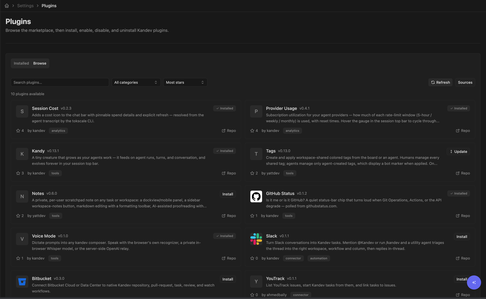

# Plugin Marketplace

The marketplace is a discoverable, curated catalog of kandev plugins you can
browse and install from inside the app, no tarball URL required. It is
assembled from one or more **sources**: kandev ships with the official source
enabled by default, and you can add team or corporate sources alongside it.

This page covers using the marketplace (browse, install, update, add sources)
and publishing a plugin into it. For what plugins are and how the install
pipeline, enable/disable, and security posture work, see
[Plugins](plugins.md). For building one, see [Authoring a
plugin](plugins-authoring.md).

Like the rest of plugins, the marketplace ships in the base product with no
feature flag to turn on; **Settings > Plugins** is always available in the
sidebar.

## Quick path

1. Browse and filter the catalog.
2. Select **Install** and review the package result.
3. Update installed plugins only when you approve the new version.
4. Add a team source only when you trust its maintainer.

> **Sideloading still works.** The marketplace only adds *discovery*. Installing
> a plugin by URL or by uploading a `.tar.gz` is unchanged and always available,
> even with every source disabled or offline, see
> [Plugins → Installing a plugin](plugins.md#installing-a-plugin).

## Using the marketplace

**Settings > Plugins** has two tabs:

- **Installed**: the plugins on this instance, with Enable / Disable /
  Uninstall and an **Update** button when a newer version is available.
- **Browse**: the merged catalog across all enabled sources.

### Browse and install

Open **Settings > Plugins > Browse**. Each plugin shows as a card with its
name, description, author, categories, source repository link, latest version,
and GitHub star count. To narrow the list:



- **Search**: type in the search box to match plugin name or description.
- **Category**: filter to a single category with the category dropdown.
- **Sort**: **Most stars** (default), **Recently updated** (by latest release
  / repo activity), or **Name**.

Stars are a **sort hint, not a quality score**. kandev collects no download or
usage telemetry, so there is no "most installed" metric; ranking is GitHub
stars only, and "Recently updated" surfaces new or actively maintained plugins
that high-star incumbents would otherwise bury.

Click **Install** on a card to install it. This resolves the entry to its
latest release tarball and runs the same verified install pipeline as
install-by-URL (`POST /api/plugins/install`), see [Plugins → Installing a
plugin](plugins.md#installing-a-plugin) for the exact steps and integrity
checks. A card for a plugin you already have at the latest version shows
**Installed** instead of an install button.

Plugin-provided icons render on the cards. A plugin that ships an icon (via the
manifest's `icon` field) shows it; otherwise the card falls back to a neutral
letter tile.

### Keep plugins updated

Every row on the **Installed** tab shows the plugin's latest known marketplace
version next to its installed version (e.g. "Latest v2.1.0"), so you can see
version drift at a glance, not only when an update is available. A plugin
that isn't in any configured source shows a "not in the marketplace" hint
instead. That hint only appears when the check actually reached every enabled
source: if one of your sources was unreachable, or you have no source enabled
at all, the plugins it carries are simply left blank rather than reported as
removed, and the header explains what went wrong.

This check runs once when the page loads. Select **Check for updates** to clear
the marketplace cache and retrieve current versions without reloading the
page. **Sync** remains a separate action that reconciles your local plugins
folder.

While a check is running, the header shows a "Checking for updates…"
indicator. After the check completes, the header shows the last check time.
If the marketplace cannot be reached, an inline error explains the problem.
Your installed plugins and their Enable, Disable, and Uninstall actions remain
available.

Each installed row also has a visible **Settings** link. Select it to open the
plugin's settings page, where you can change any configuration declared by the
plugin.

When the marketplace advertises a newer version than the one you have
installed, the row shows an **Update to v`<version>`** button with the primary
action color. Clicking it reinstalls the newer tarball through the normal
pipeline; while it's in progress the button shows a spinner and
Enable/Disable/Uninstall are disabled. On success the version and button
refresh; on failure an inline error shows the reason and the button stays
clickable so you can retry.

Updates are never automatic from this button; kandev surfaces the newer
version and waits for an explicit click. Separately, an **opt-in** background
auto-updater can install newer versions for you; see [Auto-update
(opt-in)](#auto-update-opt-in) below for the instance-wide and per-plugin
toggles. There are no update channels, version pinning, or scheduled
maintenance windows in either case.

### Auto-update (opt-in)

Beyond the manual **Update** button, kandev can update installed
plugins in the background, **off by default**. An instance-wide
**"Automatically update plugins"** switch (Settings > Plugins) sets the
default for every installed plugin; each row also has its own switch that can
override the default either way, with a **Reset** control to clear the
override and inherit the default again.

Only plugins that are currently **active** *and* opted in are eligible, on a
periodic background sweep. A disabled or errored plugin is never
auto-updated and stays on its installed version until you re-enable it. A
failed auto-update behaves exactly like a failed manual one: the installed
version is left untouched, or the plugin lands in the same **Error** state a
failed manual update would.

### Add a team or corporate source

The **Sources** button on the Browse tab opens the **Marketplace sources**
dialog. The official kandev source is present by default, badged **Official**,
and cannot be removed. To add another:

1. Click **Sources**.
2. Enter a **name** (e.g. `Acme Internal`) and the **URL** of an `index.json`
   document (see [Host your own source](#host-your-own-source) below).
3. Click **Add**.

Its plugins are then merged into the Browse tab alongside the official ones.
You can enable/disable a source without deleting it, and remove any non-official
source. Adding a source is an explicit act of trust in its maintainer, much
like `brew tap`-ing a third-party tap.

Notes:

- When the same plugin `id` appears in more than one source, the **first
  configured source wins** (the official source is always first); later
  duplicates are hidden.
- A source that is unreachable or serves malformed JSON is reported as
  **degraded**: its entries are omitted, but the healthy sources still load.
- Configured sources persist across restarts; the fetched catalog itself is a
  short-lived cache and is re-fetched on demand.

## Publishing a plugin

<details>
<summary>Publishing details</summary>

Getting a plugin into the catalog follows a **one-repo-per-plugin** model,
mirroring Obsidian's community-plugin registry: each plugin lives in its own
public GitHub repository and publishes its package as a GitHub **Release**
asset; the official catalog is a curated pointer list that names *which repos*
are included. The descriptive metadata (name, description, version, tarball
URL, stars) is always read from your latest release, so a listing can never
drift from what actually ships.

### 1. Publish the plugin package as a release

Package your plugin as usual (see [Authoring a plugin →
Packaging](plugins-authoring.md#packaging)) and cut a GitHub **Release**. One
asset is required; a second is optional:

- `<id>-<version>.tar.gz` (**required**); the plugin package. It carries its
  own internal `checksums.txt` covering every packaged file, which the install
  pipeline verifies on extraction.
- `checksums.txt` (optional); the sha256 of the tarball itself. Advisory
  provenance: the catalog reserves a `package_sha256` field for it, but the
  index builder does not populate or enforce the digest yet, so it is included
  only for forward compatibility.

The release must pass the standard package integrity gate. The
[`kdlbs/kandev-plugin-template`](https://github.com/kdlbs/kandev-plugin-template)
  starter repo is the recommended way to bootstrap a repo with the right layout.
its `.github/workflows/release.yml` produces both assets automatically when you
push a version tag.

### 2. Add an icon (optional)

Add an `icon:` field to your `manifest.yaml`; a **package-relative path** to an
image your package ships (for example `icon.svg`). The catalog resolves it to
your icon and renders it on the plugin card; without it, the card shows a letter
tile. See the [Plugin manifest reference](plugins-manifest.md#field-reference).

### 3. Submit to the official catalog

The official source is curated: a plugin appears only after a maintainer merges
a PR that lists it.

1. Fork `kdlbs/kandev` and add one entry to
   [`plugin-registry/plugins.yaml`](https://github.com/kdlbs/kandev/blob/main/plugin-registry/plugins.yaml)
   pointing at your public repo:

   ```yaml
   plugins:
     - id: my-plugin              # MUST equal the `id` in your plugin manifest
       repo: your-org/your-plugin-repo   # owner/name
       categories: [productivity] # optional
   ```

   Keep `id` equal to your manifest `id` and unique in the file, and name your
   release package `<id>-<version>.tar.gz` to match, so the index resolves the
   right asset. `categories` here are free-form curation tags for catalog
   filtering (not the manifest's category enum). `featured` is a maintainer-only
   pin; leave it out of submissions. The pointer-list shape is defined by
   [`plugin-registry/schema.json`](https://github.com/kdlbs/kandev/blob/main/plugin-registry/schema.json).
2. Open a pull request. The registry index-build workflow runs on your PR
   (build + tests, no Pages deploy), resolving your entry against the GitHub API
   Your repo must have a latest release that publishes a `.tar.gz` package
   asset (an accompanying `checksums.txt` asset is optional). An entry whose repo
   has no release or no package asset is skipped.
3. A maintainer reviews and merges; maintainer approval is what gates the
   official catalog. The index-build workflow then picks up your entry and your
   plugin appears in the in-app catalog on the next build.

Ranking in the catalog is **GitHub stars only**: there is no download or usage
telemetry to game. Full submission details are in
[`plugin-registry/README.md`](https://github.com/kdlbs/kandev/blob/main/plugin-registry/README.md).

</details>

## Host your own source

<details>
<summary>Host-source details</summary>

You do not have to PR into the official registry to share plugins internally.
Any URL that serves an `index.json` document of the catalog shape can be added
as a marketplace source (see [Add a team or corporate
source](#add-a-team-or-corporate-source)), and its plugins merge into the Browse
tab alongside the official ones. This is the recommended path for a team or
corporate registry, no PR to the main repo.

The `index.json` document is the fetch contract between a source and kandev. The
simplest way to produce one is to copy the official registry's
`plugin-registry/` directory into your own repo; its `plugins.yaml` +
[`build-index.mjs`](https://github.com/kdlbs/kandev/blob/main/plugin-registry/build-index.mjs)
build script (zero-dependency Node) + GitHub Action resolve each listed repo's
latest release into a full catalog record and publish the generated
`index.json` to GitHub Pages. Point kandev at that Pages URL. The document
shape, the build pipeline, and the source data model are specified in the
[plugin marketplace spec](https://github.com/kdlbs/kandev/blob/main/docs/specs/plugins/requirements/marketplace.md).

Related: [Plugins](plugins.md), [Authoring a
plugin](plugins-authoring.md), [Plugin manifest
reference](plugins-manifest.md).

</details>
