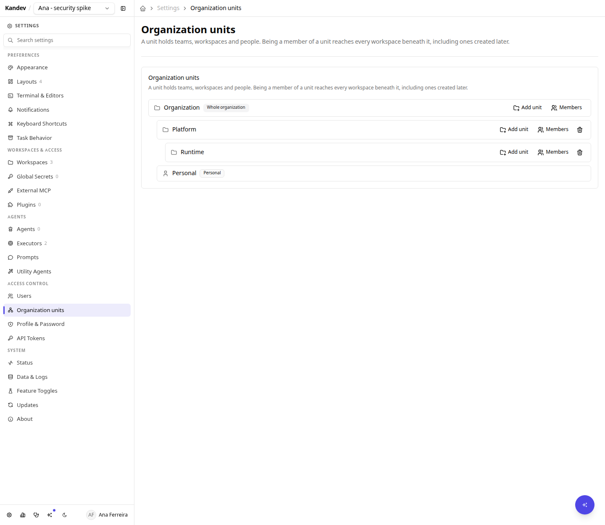
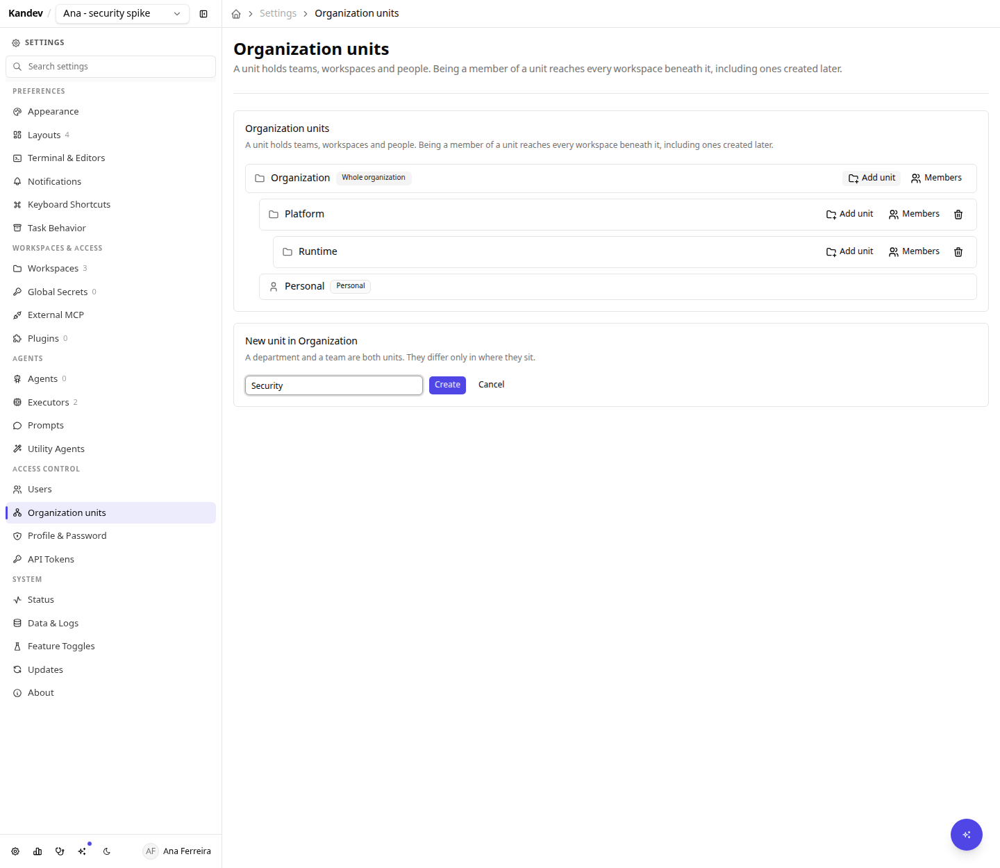
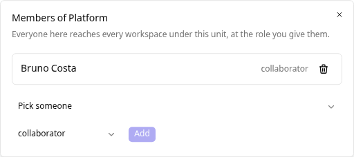
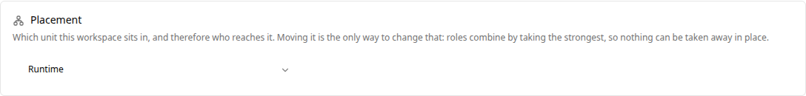
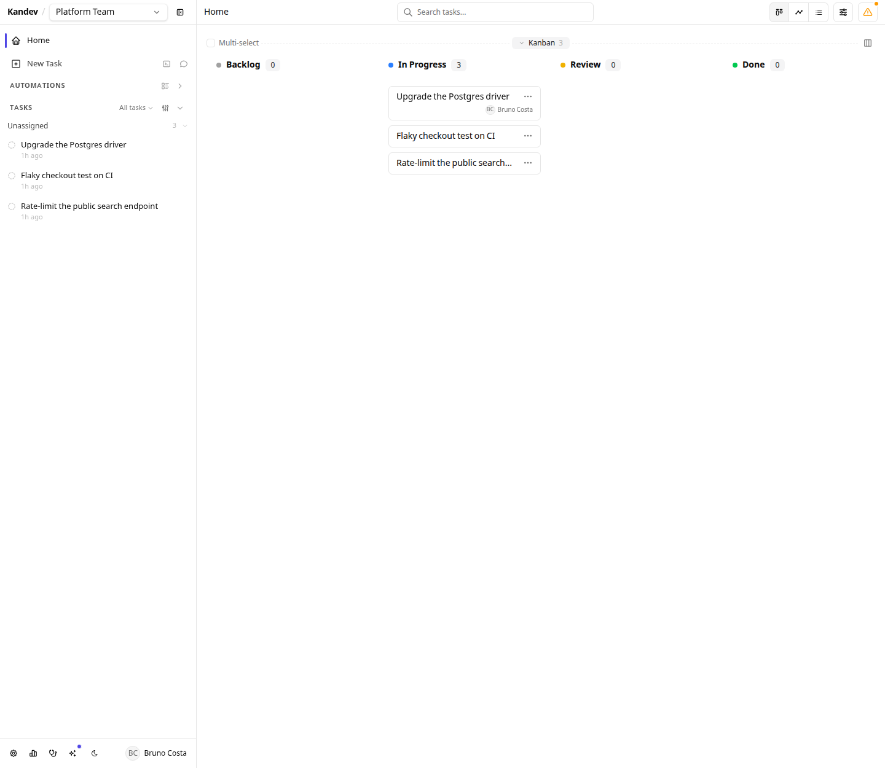
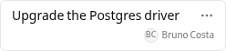

# Team Access

Kandev starts private: with [authentication](authentication.md) enabled, each person sees only their own workspaces. **Team access** is how a team on a shared server gets shared boards instead, without falling back to a single login everyone knows.

Team access is **experimental** because it is available only through the experimental authenticated multi-user path. It has no separate release toggle: enabling `features.auth` is the opt-in boundary for this path.

The whole model is one idea: **workspaces live in a tree, and so do people.**

- An **organization unit** holds child units, workspaces, and members. Your departments and your teams are both units; they differ only in depth.
- Being a member of a unit reaches **every workspace beneath it**, including ones created later.
- Work that is nobody else's business lives in your **personal unit**, which takes no members.

There is no per-workspace visibility switch. Where a workspace sits *is* who reaches it.

> Team access requires authentication. On a single-user install with authentication off, none of this appears and nothing changes.

## Quick checklist

1. Enable [authentication](authentication.md) and create the admin account.
2. Build your structure: `Settings > Access Control > Organization units`.
3. Add people to the unit that matches their team.
4. Move a workspace into that unit to share it, or leave it in your personal unit to keep it to yourself.
5. Remember that secrets, integration credentials, and workspace deletion stay with the owner.

## Building the tree

A Kandev workspace is coarse. It owns the default executor, environment and agent profile, the task prefix, and its Kanban workflow, so a team usually has one or two. Units are what group them.

Add a unit under any other. A department and a team are the same thing at different depths, so adding a level later is a move rather than a migration.

Two units are created for you and behave differently on purpose:

- The **root** is the whole organization. A workspace parked here is reached by everyone you put in the root.
- A **personal unit** belongs to one person, takes no members, and cannot be deleted. It replaces the old private flag: a workspace nobody else should see simply lives there.

## Putting people in a unit

Everyone in a unit reaches every workspace under it, at the role you give them. Add someone once when they join the team, not once per board.

## Moving a workspace

A workspace sits in exactly one unit, and `Settings > Workspaces > (workspace)` is where you change it. Moving it is how you hand a board to another team, or take it back.

## Narrowing access

There is no way to subtract a role, and that is deliberate. Roles combine by taking the strongest: what you inherit from a unit plus anything granted directly on one workspace. A grant can raise your access; nothing lowers it.

To give fewer people access to something, **move it to a unit with fewer members**. That keeps "why can this person write here" answerable by reading the tree, instead of by working out which of two mechanisms won.

## What a colleague sees

Once a workspace sits in a unit your colleague is in, it simply appears. No invitation, no acceptance step.

They can open a colleague's task, read the agent conversation, test the preview, and take it over. **Takeover is reassign plus continue**: no lock is taken and no session is torn down.

Every human action is recorded against the person who took it, which is what a shared login cannot give you: message attribution comes from the authenticated session, not from the browser, so nobody can post as somebody else.

## Assigning a task to a person

A task carries two independent assignees: the **agent** that runs it, and the **person** who owns it. Setting one never changes the other, and a task can have both.

It works the same on both boards.

On a **kanban** task, the assignee sits in the task's top bar. Open the control to pick a colleague, or choose **Assign to me** to take the task over.

Cards on the board carry the same name, so you can see who is on what without opening anything.

In **office**, it is the **Assigned to** row in the task properties panel, next to the agent **Assignee** row.

The list offers everyone in the user directory, because who reaches a workspace is not something the browser can work out on its own. The server is the authority: assigning someone who cannot reach it is refused with "that person cannot see this workspace", so a task is never parked on somebody who will never find it.

Assignment is advisory. It records who owns the work and gates nothing: anybody with `task.write` can reassign anything, including to themselves, and doing so takes no lock and interrupts no running session. That is the whole of takeover, and it is why the button needs no confirmation.

The control is hidden when authentication is disabled, because then every visitor is the same anonymous user and there is nobody to assign to.

## Roles

Two role tiers combine. Your **org role** is on your account; your **workspace role** applies to one workspace.

**Org roles**

| Role | Can |
|---|---|
| `admin` | Manage users and invites, org settings, and shared configuration (executors, agent profiles, environments, editors, prompts, notification providers) |
| `member` | Contribute; no management rights |
| `guest` | Reach **only** workspaces they hold an explicit member row on, including none of the org-visible ones |

An admin is a **management role, not a reach role**. An admin reaches a workspace because they are in a unit above it, exactly like any member, and never reaches anything in someone else's personal unit.

With Organizations enabled, the current Users API is not fully tenant-scoped: an org admin can list accounts and change role or status outside their organization. The workspace reach rules above still apply, but do not treat `org.members.manage` as a hard tenant boundary yet. See [Organizations](organizations.md#current-limits).

**Workspace roles**

| Role | Read board & transcripts | Edit tasks | Prompt / stop agents | Terminal, shell, previews | Manage members, secrets, settings, delete |
|---|---|---|---|---|---|
| `owner` | yes | yes | yes | yes | yes |
| `collaborator` | yes | yes | yes | yes | no |
| `viewer` | yes | no | no | no | no |

On an org-visible workspace, `admin` and `member` both act as `collaborator` unless an explicit row says otherwise.

### Viewer

A viewer reads the board and the agent conversations and can do nothing else. Terminal and shell access is deliberately a **separate permission** from prompting an agent: prompting is bounded by what that agent is allowed to do, but a shell in the worktree is not, so being able to read a transcript never implies being able to run commands.

The UI hides what you cannot do, and the API refuses it independently, so a viewer who calls the endpoint directly gets `403`.

### Transferring ownership

Every workspace has exactly one accountable owner. Use **Make owner** on a member row: the new owner takes over and the previous owner becomes a collaborator. You cannot remove the owner's row; transfer first.

## Mobile

The same card works on a phone, including the role pickers and the add-member flow.

## What stays with the owner

These are shared credentials and destructive actions, so they do not follow membership:

- Workspace **secrets** and **integration credentials**
- Adding and removing **repositories**
- Renaming, changing defaults, moving it between units, and **deleting** the workspace
- Adding, re-roling and removing **members**

A member acts under their **own** GitHub connection wherever per-user identity is supported, so "Approve as ..." on a pull request is that person, not the workspace owner.

## Upgrading an existing server

Every workspace you already own moves into **your personal unit**, so it stays exactly as private as it was. A workspace with no owner, created before authentication existed, moves to the root, which is where everyone already reached it.

An upgrade never widens access. Sharing is an explicit act afterwards: move a workspace into a unit, or add people to the unit it is already in.

## Permission reference

Every guarded action names a scope. These strings appear in the API and are what the UI gates on.

| Scope | Grants |
|---|---|
| `workspace.read` | See the workspace, its board, tasks, and transcripts |
| `workspace.manage` | Rename, change defaults, move between units, delete |
| `task.write` | Create, edit, move, assign, archive, delete tasks |
| `session.prompt` | Start or resume a session and message an agent |
| `session.control` | Stop or cancel a running agent |
| `session.exec` | Terminal, shell, file writes, port previews, VS Code, LSP |
| `repository.manage` | Add or remove workspace repositories |
| `secret.manage` | Workspace secrets and integration credentials |
| `member.manage` | Add or remove members, transfer ownership |
| `org.members.manage` | Invite, create, disable and re-role users |
| `org.settings.manage` | Org-wide settings and defaults |
| `unit.manage` | Create, rename, move and delete units, and place workspaces in them |
| `org.config.manage` | Executors, agent profiles, environments, editors, prompts, notification providers |

`GET /api/v1/authz/scopes` returns this list with descriptions.

## Current limits

- **"Organization" means one tenant.** With the Organizations feature off there is exactly one, implicitly, and its root unit covers everyone on the server. To run one server for several independent teams or customers, see [Organizations](organizations.md).
- **The `guest` role cannot be assigned in the UI yet.** `Settings > Access Control > Users` can change accounts between admin and member only, so assign a guest through the API: `PATCH /api/v1/users/{id}` with `{"role": "guest"}`.
- **Roles are fixed.** There is no custom-role builder; scopes are the extension point and adding one is a code change.
- **No standalone groups.** A unit answers "who is in this team", so a set of people that ignores the tree, like every site reliability engineer across three departments, is not modelled yet.
- **No presence.** There are no cursors, typing indicators, or "who else is viewing" markers.
- **Concurrent prompting is serialized, not blocked.** If two people prompt the same session at once, both messages queue in arrival order and both are attributed. Kandev deliberately does not lock a session to one human: a lock would strand the session when someone closes their laptop.
- **Filesystem and agent credentials are not isolated per user.** As with authentication generally, application-layer scoping is the boundary between users' Kandev data; it does not sandbox the filesystem or per-user agent logins. See the limits in [Authentication & Users](authentication.md).
