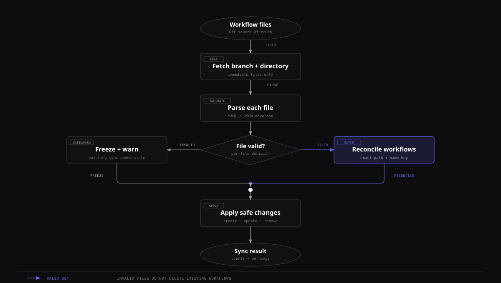

# Workflow Sync

Workflow Sync makes a GitHub or GitLab directory the source of truth for selected workflows in one Kandev workspace. Each run reads portable workflow files, creates or reconciles sync-owned workflows, and safely removes definitions that no longer exist. Workflows created manually in the same workspace are left alone.

Choose sync when workflow changes should be reviewed and versioned in Git. Choose [Workflow Import / Export](workflow-import-export.md) for a one-time copy that remains editable in Kandev.

A workspace has at most one sync configuration, pointed at exactly one provider (GitHub or GitLab). Switching provider on an existing configuration replaces it on the next save; the following sync reconciles the workspace's workflows from scratch against the new provider's file set and applies the usual [deletion rules](#reconciliation-rules).

## Quick path

1. Put portable workflow YAML in a GitHub or GitLab repository.
2. Grant the workspace connection read access.
3. Pick the provider, then fill in the repository (or project path), branch, and directory in **Workflows > Sync**.
4. Run a sync and review created, updated, skipped, and removed definitions.



[Open full-size SVG diagram][workflow-sync-diagram]

[workflow-sync-diagram]: ../../docs/screenshots/workflow-sync.svg

One invalid file freezes the workflows last synced from that file, while valid files continue through reconciliation. This protects existing definitions from a bad edit.

## Prerequisites and credentials

You need a repository and a branch containing valid portable workflow files. The Kandev backend, not the browser and not a task executor, reads the repository. The repository must be inside the workspace's effective scope.

### GitHub

The workspace automation connection must have contents-read access to the configured branch, including for private repositories. Configure one automation connection under the workspace's GitHub integration:

- a personal access token;
- an exact named `gh` CLI host/login; or
- a GitHub App installation with **Contents: read** permission for the repository.

Without a usable workspace automation connection, sync fails. Existing migrated workspaces may temporarily use **Legacy shared**, which alone consults ambient backend `gh`, `GITHUB_TOKEN`, `GH_TOKEN`, or old globally named secrets.

### GitLab

Sync always uses the workspace's already-configured GitLab connection (Settings → Workspaces → select a workspace → Integrations → GitLab), using a personal access token or the `glab` CLI against whatever host that connection points at, including a self-managed instance. Workflow Sync itself has no separate host or credential field: the project path/link you enter is never used to derive a host, only a repository path. Pasting a full URL for a self-managed instance (any hostname) still works to fill in the project path; the host portion of that link is simply ignored.

Grant only the repository access that this operation needs, protect the backend environment and secret store, and do not commit a token into a workflow file.

## Configure a workspace

Open **Settings → Workspaces → select a workspace → Workflows → Workflow Sync**, then choose **GitHub** or **GitLab**.

1. Enter the repository. For GitHub, paste a repository link; the field accepts an HTTPS URL with or without a scheme, a `www.github.com` URL, a `.git` suffix, or an SSH form such as `git@github.com:OWNER/REPO.git`. For GitLab, enter the project path directly (e.g. `group/project`, or a nested `group/subgroup/project`) or paste a full project link (any host, including self-managed).
2. Set **Branch** and **Directory** directly; these are their own fields, not just derived text. Pasting a `/tree/BRANCH/DIRECTORY` (GitHub) or `/-/tree/BRANCH/DIRECTORY` (GitLab) link still convenience-fills both from the link, but you can always correct either field afterward. This matters because a branch name can itself contain a slash (a common convention, e.g. `features/TICKET-123`). No link parser can always tell where the branch ends and the directory begins, so a wrong guess from a pasted link is fixed directly in these fields rather than by reshaping the link.
3. Enable **Auto-sync** if the background poller should run. Set an interval of at least 60 seconds; the default is 300 seconds.
4. Save the configuration, then select **Sync now** for the first immediate reconciliation. Saving alone does not fetch definitions.

### Stored fields and defaults

There is at most one sync configuration per workspace.

| JSON field | Requirement and default |
|------------|-------------------------|
| `provider` | `"github"` or `"gitlab"`. Omitted means `"github"`. |
| `repo_owner` | GitHub only. Required after trimming; cannot contain a slash or space. |
| `repo_name` | GitHub only. Required after trimming; cannot contain a slash or space. |
| `project_path` | GitLab only. Required; a namespace path such as `group/project` or `group/subgroup/project` (at least two segments, no empty/`.`/`..` segments, no spaces). |
| `branch` | Defaults to `main`; must be a valid Git branch name. |
| `path` | Leading and trailing slashes are removed. Empty defaults to `.kandev/workflows`; a `..` path segment is rejected. |
| `interval_seconds` | `0` defaults to `300`; valid range is `60` through `2592000` (30 days). |
| `poll_enabled` | Omitted JSON defaults to `true`; `false` allows only **Sync now**. |

`repo_owner`/`repo_name` and `project_path` are mutually exclusive; the backend rejects a request carrying both, and switching the provider in the dialog clears the other provider's fields automatically.

The status also records `last_synced_at`, `last_ok`, `last_error`, and `last_warnings`. Auto-sync checks due configurations on a 60-second outer ticker and waits one full tick after backend startup. A configured interval is therefore a minimum cadence, not an exact schedule; a due sync can start roughly another minute later.

## Definition directory

Sync reads only immediate files in the configured directory. It does not recurse. Extensions are case-insensitive: `.yml` and `.yaml` use YAML decoding, while `.json` uses JSON decoding; other files and directory entries are ignored. Paths are processed in sorted order.

Every file must use the version 1 `kandev_workflow` portable envelope documented in [Workflow Import / Export](workflow-import-export.md). A file may contain one or several workflows. The safest authoring loop is to build and test a workflow in a disposable workspace, export it, commit the export, and then configure the target workspace.

```yaml
version: 1
type: kandev_workflow
workflows:
  - name: Delivery
    steps:
      - name: Todo
        position: 0
        color: bg-slate-500
        events: {}
        is_start_step: true
        show_in_command_panel: true
        allow_manual_move: true
        auto_advance_requires_signal: false
        cancel_triggers_turn_complete: false
      - name: Done
        position: 1
        color: bg-green-500
        events: {}
        is_start_step: false
        show_in_command_panel: true
        allow_manual_move: true
        auto_advance_requires_signal: false
        cancel_triggers_turn_complete: false
```

Commit the file, then use **Sync now**. The status card reports created, updated, deleted, warning, or unchanged results.

## Reconciliation rules

A synced workflow is keyed by its exact repository `source_path` and exact workflow `name`. A matched workflow keeps its database ID. Within it, steps are matched by exact name and keep their IDs, so tasks remain attached when a prompt, color, event, WIP rule, profile, or position changes.

These rules matter when editing definitions:

- Renaming a step is equivalent to removing the old step and creating a new one. If the old step has tasks, Kandev skips the whole workflow update and reports a warning.
- Renaming or moving a workflow definition changes its `(source path, name)` key. Kandev creates the new workflow and treats the old one as removed. If the old workflow still has tasks, both remain and a warning explains why.
- A removed step is deleted only when it has no tasks. A removed workflow is deleted only when the entire workflow has no tasks.
- Duplicate step names in either the desired definition or the existing synced workflow make name matching unsafe; Kandev skips that workflow update and warns.
- Manual workflows are never matched, updated, or removed by sync, even when their name is identical.
- Synced workflows are read-only in normal workflow mutation paths. Edit the repository and sync again. Every run performs a full reconciliation, so it also repairs drift; the stored content hash is for status/observability, not a skip condition.

The portable format does not carry every internal or Office field. Sync reconciles the portable Kanban fields, including `cancel_triggers_turn_complete`, and preserves non-portable internal stage type. Changing that field in the repository changes whether an explicit user cancellation can run the step's normal completion actions on the next sync. Pending clarifications and non-user interruption/failure paths remain ineligible. Do not use this facility as an Office-workflow backup.

### Invalid and empty sources

Parsing and validation happen per file. If one file is invalid, its error becomes a warning, workflows last synced from that exact file are frozen for that run, and valid files continue. This protects existing workflows from deletion because of one broken edit. Fix the file and sync again.

A valid fetch that returns no supported files is different: it is an empty desired set. Synced workflows with no tasks are removed; workflows with tasks remain with warnings. Pointing at the wrong but existing empty directory can therefore remove unused synced workflows.

Repository listing or file-download failures fail the run before apply. Per-workspace locking serializes sync, configuration changes, and removal, so two requests cannot interleave their changes.

> **Network security:** With authentication disabled, the HTTP API is open and can read or change sync configuration with the backend's stored credentials. Experimental authentication requires a session or personal access token, but does not replace TLS. Keep the backend on loopback or behind an authenticated, origin-protected TLS proxy before exposing it.

<details>
<summary>HTTP API, reconciliation, and cleanup details</summary>

## HTTP API

The settings UI uses these backend routes. All require a `workspace_id` query parameter.

| Method | Route | Success behavior |
|--------|-------|------------------|
| `GET` | `/api/v1/workflow-sync/config?workspace_id=ID` | `200` with the configuration, or `204 No Content` when absent. |
| `POST` | `/api/v1/workflow-sync/config?workspace_id=ID` | Validate/upsert the JSON configuration and return it. Does not sync. |
| `DELETE` | `/api/v1/workflow-sync/config?workspace_id=ID` | Release synced workflows to manual ownership, delete the configuration, and return `{"deleted":true}`. |
| `POST` | `/api/v1/workflow-sync/sync?workspace_id=ID` | Run immediately and return the current `config` plus `result` or `error`. |

Example (GitHub):

```bash
curl -fsS -X POST \
  -H 'Content-Type: application/json' \
  -d '{
    "provider": "github",
    "repo_owner": "acme",
    "repo_name": "engineering",
    "branch": "main",
    "path": ".kandev/workflows",
    "interval_seconds": 300,
    "poll_enabled": true
  }' \
  'http://localhost:38429/api/v1/workflow-sync/config?workspace_id=WORKSPACE_ID'

curl -fsS -X POST \
  'http://localhost:38429/api/v1/workflow-sync/sync?workspace_id=WORKSPACE_ID'
```

Example (GitLab):

```bash
curl -fsS -X POST \
  -H 'Content-Type: application/json' \
  -d '{
    "provider": "gitlab",
    "project_path": "acme/engineering",
    "branch": "main",
    "path": ".kandev/workflows",
    "interval_seconds": 300,
    "poll_enabled": true
  }' \
  'http://localhost:38429/api/v1/workflow-sync/config?workspace_id=WORKSPACE_ID'
```

Except for “not configured,” a completed force-sync request returns HTTP `200` even when the response contains an `error`; inspect the JSON and `config.last_ok`, not only the HTTP status. A force sync without a configuration returns `404`.

## Stop syncing and clean up

Choose **Remove sync** to stop polling. Kandev first clears sync ownership from all synced workflows in the workspace, making them normal editable workflows, and then removes the configuration. It does not delete those workflows. If releasing any workflow fails, removal fails and the configuration remains so the operation can be retried.

Deleting an individual repository definition has the different reconciliation behavior described above. Move or archive tasks first when you intend the corresponding synced step or workflow to disappear.

</details>

## Troubleshooting

- **Authentication error (GitHub):** run `gh auth status --hostname github.com` in the backend environment or configure one of the token sources above. Confirm that identity can read the repository and branch.
- **Authentication error (GitLab):** check the workspace's GitLab connection status under Integrations; Workflow Sync has no credentials of its own and fails if that connection isn't authenticated.
- **Directory or branch not found:** verify the resolved owner/repository (or project path), branch, and directory shown in the dialog. A branch name containing `/` (e.g. `features/TICKET-123`) is a common cause; set it directly in the Branch field rather than relying on a pasted link to split it correctly.
- **GitLab project path looks right but sync still 404s:** confirm the path doesn't have a trailing `.git` and matches the project's exact namespace path (visible in the GitLab UI or via its clone URL).
- **Nothing happens after Save:** save stores only the configuration. Use **Sync now** or wait until both the configured interval and the poller's next 60-second check have elapsed.
- **Completed with warnings:** read every warning. Invalid files freeze their previous workflows; tasks in removed steps or workflows block deletion; duplicate step names block safe matching.
- **Unexpected duplicate after rename:** restore the original `(file path, workflow name)`, or move/archive tasks from the old workflow before deleting it.
- **Changes appear to revert:** a synced workflow is repository-owned. Commit the change to its source file; the next reconciliation repairs local drift.
- **Rate limits or intermittent network failures:** lengthen `interval_seconds`, use **Sync now** after recovery, and inspect the GitHub/GitLab integration status and backend logs.

Related guides: [Workflow Tips](workflow-tips.md), [Workflow Import / Export](workflow-import-export.md), [Configuration](configuration.md), and [Operations](operations.md).
