# Screenshots

## Table of contents

- [Core workflow](#core-workflow)
- [Automations](#automations)
- [Plugins](#plugins)
- [Workspace & agent settings](#workspace--agent-settings)
- [Mobile](#mobile)
- [Preferences](#preferences)
- [System settings](#system-settings)

## Core workflow

<table>
  <tr>
    <td align="center"><strong>Kanban</strong> </td>
    <td align="center"><strong>Add Task</strong> </td>
  </tr>
  <tr>
    <td align="center"><strong>Task Session</strong> </td>
    <td align="center"><strong>Plan Mode</strong> </td>
  </tr>
  <tr>
    <td align="center"><strong>Workflows</strong> </td>
    <td align="center"><strong>Pipeline</strong> </td>
  </tr>
  <tr>
    <td align="center"><strong>Workflow Details</strong> </td>
    <td align="center"><strong>File Editor</strong> </td>
  </tr>
  <tr>
    <td align="center"><strong>Embedded VS Code</strong> </td>
    <td align="center"><strong>Git Operations</strong> </td>
  </tr>
  <tr>
    <td align="center"><strong>Review PRs</strong> </td>
    <td align="center"><strong>Review Dialog</strong> </td>
  </tr>
  <tr>
    <td align="center" valign="top">
      <strong>PR auto-fix</strong> 
      Automate CI fixes, review-comment follow-up, and optional auto-merge or requeue when ready.  
      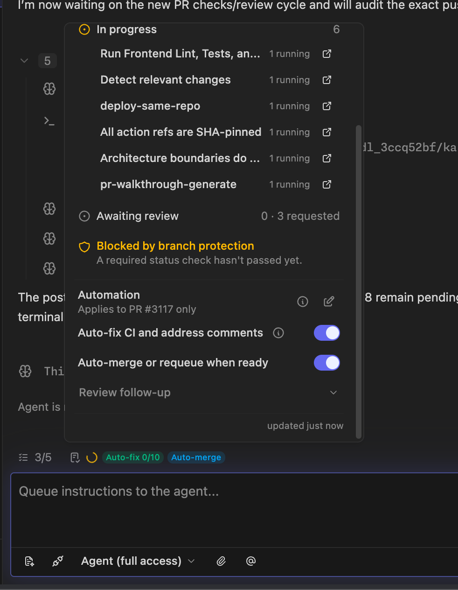
    </td>
    <td align="center" valign="top">
      <strong>Agent updates and version notifications</strong> 
      Get a visible prompt when a managed agent runtime has a newer version.  
      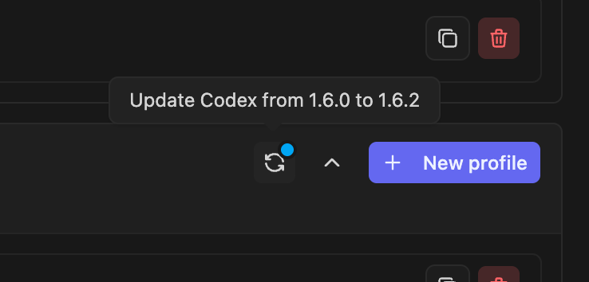
    </td>
  </tr>
  <tr>
    <td align="center"><strong>Plan Comments</strong> </td>
    <td align="center"><strong>CLI Agent</strong> </td>
  </tr>
  <tr>
    <td align="center"><strong>Quick Chats</strong> </td>
    <td align="center" valign="top">
      <strong>Stats</strong> 
      Review task, session, Git activity, provider, GitHub, workload, and telemetry metrics.  
      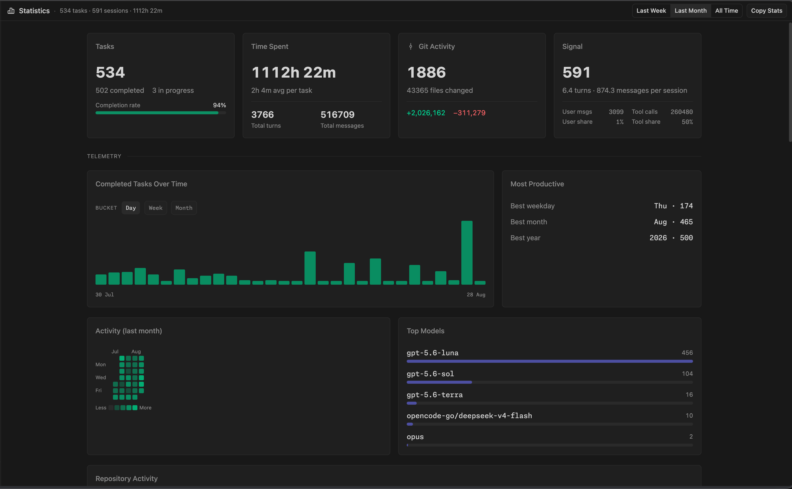  
      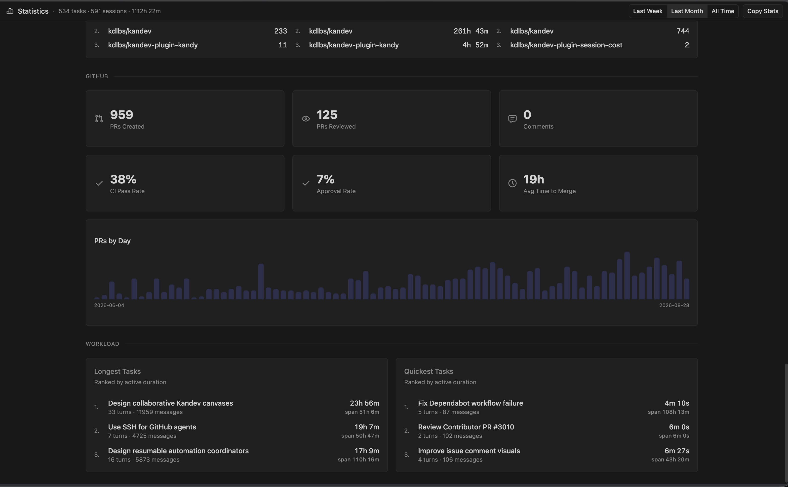
    </td>
  </tr>
</table>

## Automations

<table>
  <tr>
    <td align="center" valign="top" width="50%">
      <strong>Workspace automations</strong> 
      Review scheduled and webhook automations, their enabled state, and recent activity.  
      
    </td>
    <td align="center" valign="top" width="50%">
      <strong>Automation editor</strong> 
      Configure repository access, run destination, context, concurrency, and save changes.  
      
    </td>
  </tr>
  <tr>
    <td colspan="2" align="center">
      <strong>Automation sidebar</strong> 
      Open workspace automations from the main navigation.  
      
    </td>
  </tr>
</table>

## Plugins

Kandev plugins and companion tools add focused views for exploring MCP servers,
monitoring service health, and tracking usage.

<table>
  <tr>
    <td align="center" valign="top" width="50%">
      <strong>Plugin marketplace</strong> 
      Browse, filter, and install plugins from the in-app catalog.  
      
    </td>
    <td align="center" valign="top" width="50%">
      <strong>Plugin settings</strong> 
      Manage installed plugins, updates, activation, and configuration.  
      
    </td>
  </tr>
  <tr>
    <td align="center" valign="top" width="50%">
      <strong>MCP Explorer</strong> 
      Inspect connected servers, available tools, and estimated token costs.  
      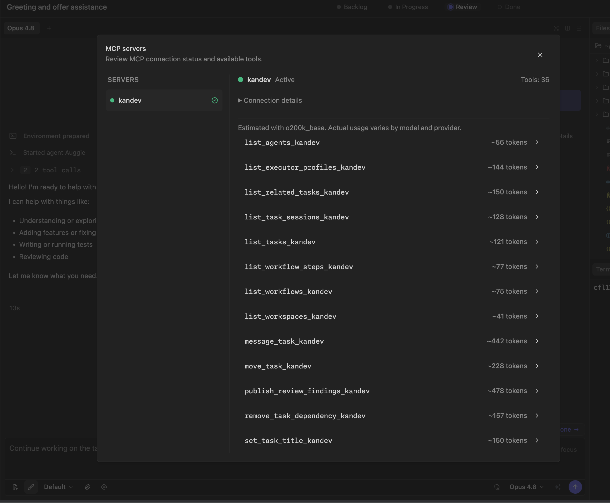
    </td>
    <td align="center" valign="top" width="50%">
      <strong>GitHub Status</strong> (<a href="https://github.com/kdlbs/kandev-plugin-github-status">plugin repository</a>) 
      See GitHub health at a glance, then open detailed component and incident status.  
      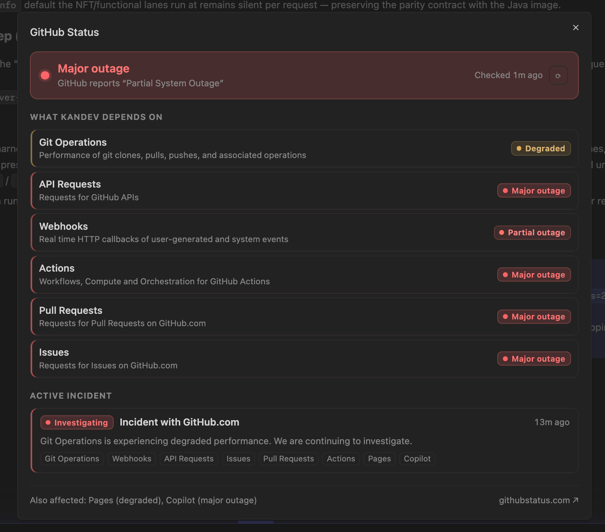  
      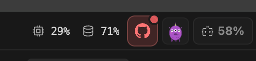
    </td>
  </tr>
  <tr>
    <td align="center" valign="top">
      <strong>Provider Usage</strong> (<a href="https://github.com/kdlbs/kandev-plugin-provider-usage">plugin repository</a>) 
      Monitor provider quota usage and reset windows from the status bar.  
      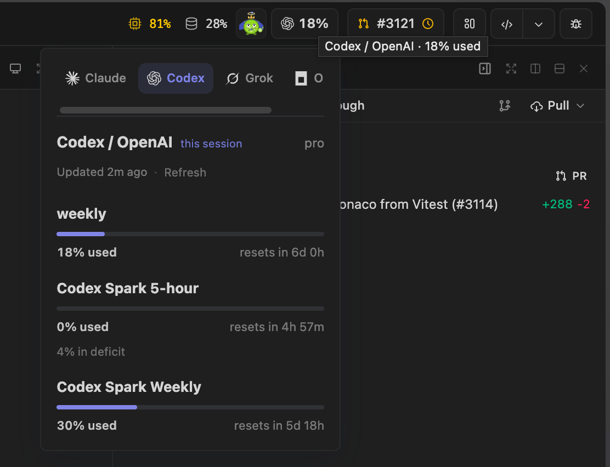
    </td>
    <td align="center" valign="top">
      <strong>Session Cost</strong> (<a href="https://github.com/kdlbs/kandev-plugin-session-cost">plugin repository</a>) 
      Track session spend, turns, token totals, cache reads, and per-model costs.  
      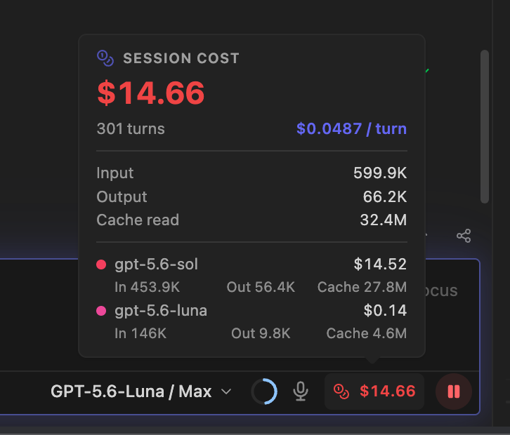
    </td>
  </tr>
  <tr>
    <td colspan="2" align="center">
      <strong>Kandy</strong> (<a href="https://github.com/kdlbs/kandev-plugin-kandy">plugin repository</a>) 
      Add playful progress feedback with levels, experience, status, and celebrations.  
      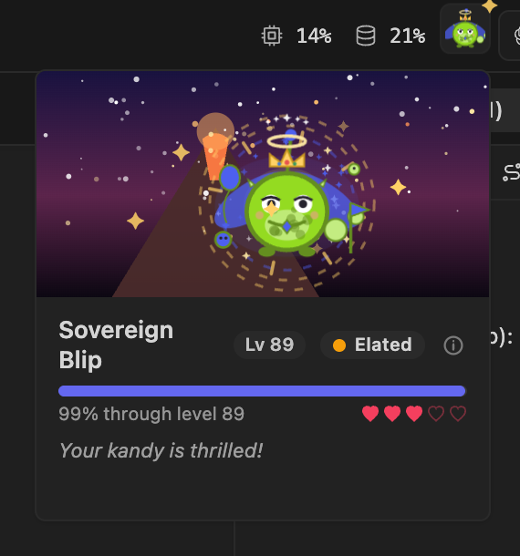
    </td>
  </tr>
</table>

## Workspace & agent settings

<table>
  <tr>
    <td align="center" valign="top" width="50%">
      <strong>Integrations</strong> 
      Connect a workspace to GitHub, GitLab, Jira, Linear, Sentry, and Azure DevOps.  
      
    </td>
    <td align="center" valign="top" width="50%">
      <strong>Agents</strong> 
      Review detected agent CLIs, profiles, availability, and runtime updates.  
      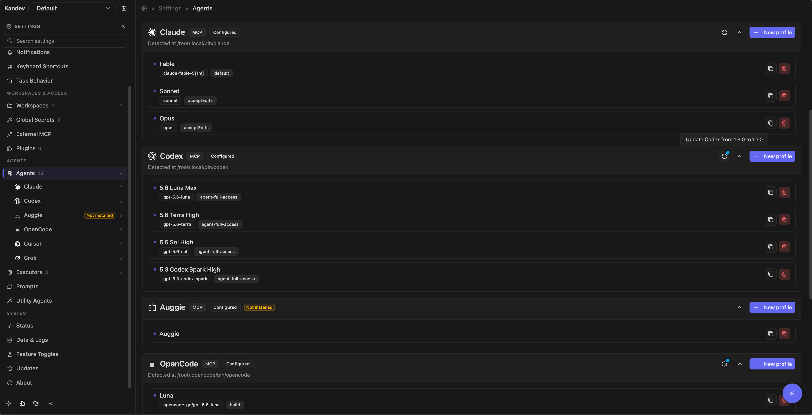
    </td>
  </tr>
  <tr>
    <td colspan="2" align="center">
      <strong>Executors</strong> 
      Configure local, worktree, Docker, Sprites.dev, and SSH execution profiles.  
      
    </td>
  </tr>
</table>

## Mobile

<table>
  <tr>
    <td align="center"><strong>Mobile Chat</strong> </td>
    <td align="center"><strong>Mobile Changes</strong> </td>
    <td align="center"><strong>Mobile Diff Review</strong> </td>
  </tr>
</table>

## Preferences

<table>
  <tr>
    <td colspan="2" align="center">
      <strong>Layouts</strong> 
      Configure reusable desktop workbench profiles and panel arrangements.  
      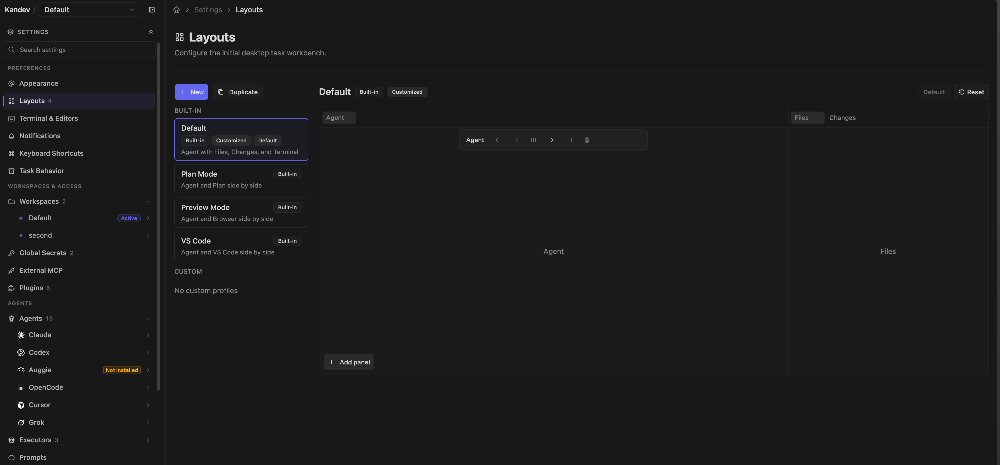
    </td>
  </tr>
  <tr>
    <td align="center" valign="top" width="50%">
      <strong>Language servers</strong> 
      Configure language-server startup, installation, status location, and server settings.  
      
    </td>
    <td align="center" valign="top" width="50%">
      <strong>Task Behavior</strong> 
      Configure task titles, archive confirmation, unread messages, and host sleep prevention.  
      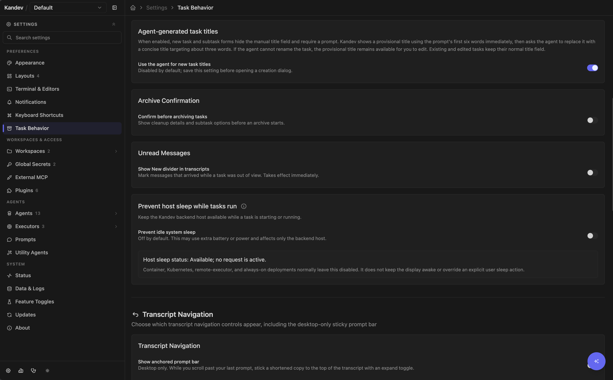
    </td>
  </tr>
  <tr>
    <td align="center" valign="top" width="50%">
      <strong>Keyboard Shortcuts</strong> 
      Customize chat input and command-panel keybindings.  
      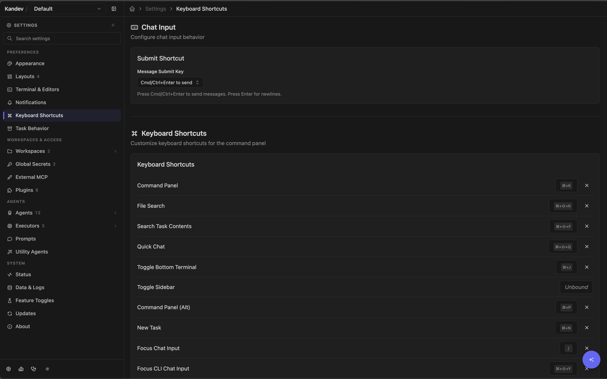
    </td>
    <td align="center" valign="top" width="50%">
      <strong>Appearance</strong> 
      Configure status-bar visibility and resource metrics for the host and execution environments.  
      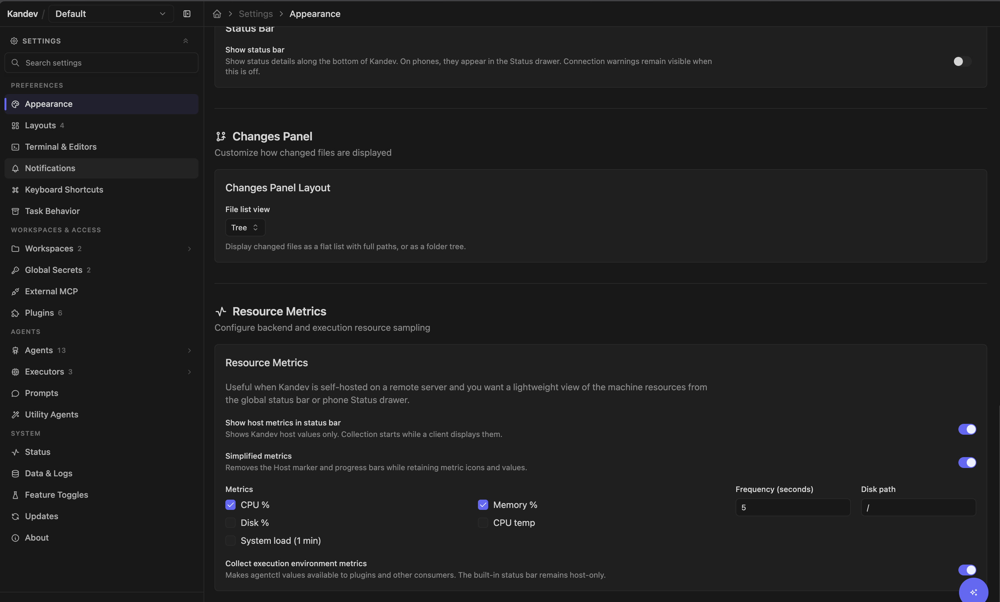
    </td>
  </tr>
  <tr>
    <td colspan="2" align="center">
      <strong>Shell and terminal</strong> 
      Choose the default shell, terminal font, font size, and link behavior.  
      
    </td>
  </tr>
</table>

## System settings

<table>
  <tr>
    <td align="center" valign="top" width="50%">
      <strong>Status</strong> 
      Check system health, the running version, and the Kandev data directory.  
      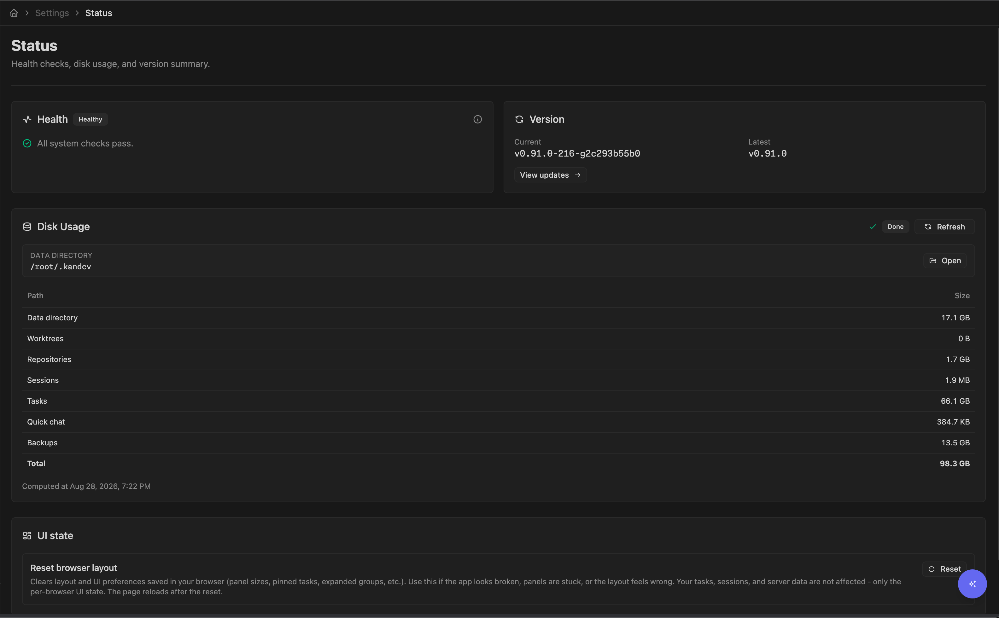
    </td>
    <td align="center" valign="top" width="50%">
      <strong>Storage</strong> 
      Review disk capacity, Kandev-managed usage, and reclaimable space.  
      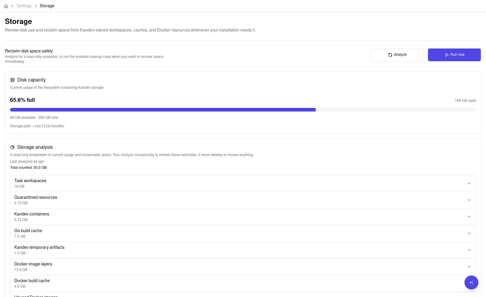
    </td>
  </tr>
  <tr>
    <td align="center" valign="top" width="50%">
      <strong>Maintenance policy</strong> 
      Choose the schedule, idle window, workspace cleanup, and folder allowlist.  
      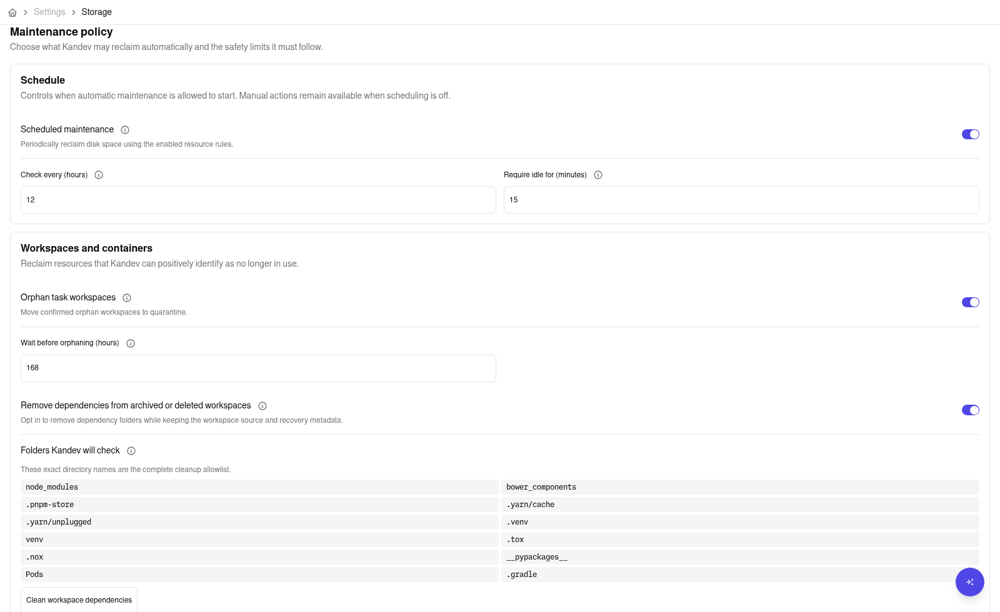
    </td>
    <td align="center" valign="top" width="50%">
      <strong>Docker cleanup</strong> 
      Configure dedicated-daemon protection, build-cache retention, and unused image cleanup.  
      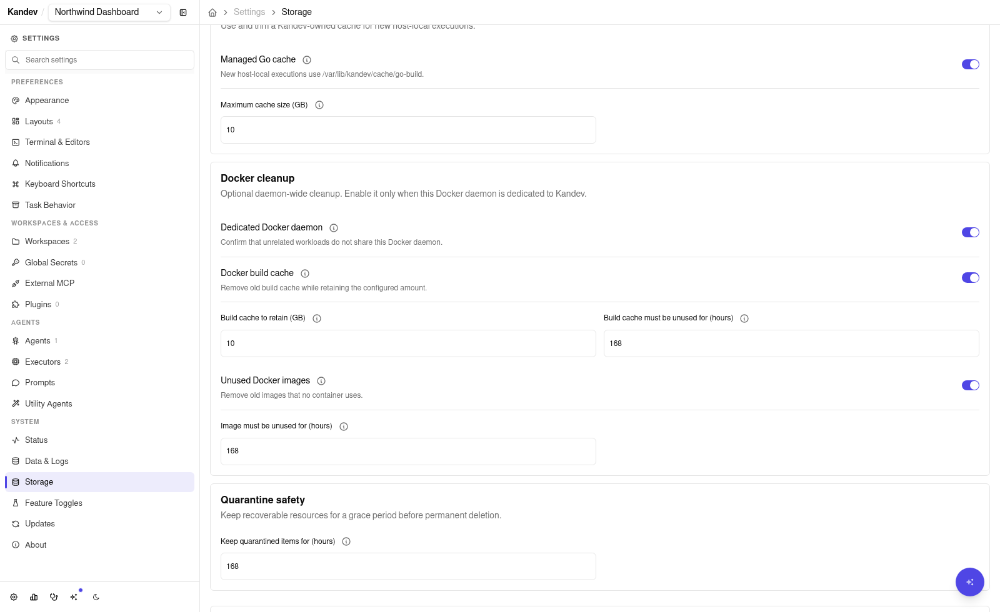
    </td>
  </tr>
  <tr>
    <td colspan="2" align="center">
      <strong>Quarantine</strong> 
      Restore or permanently remove recoverable resources after cleanup.  
      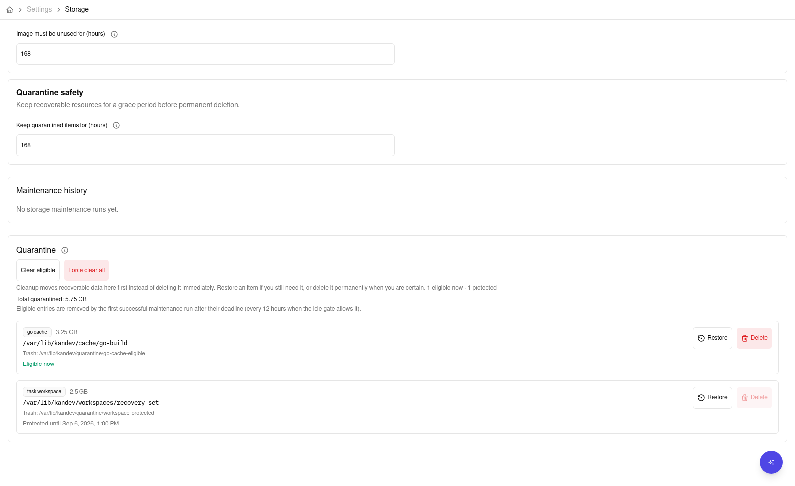
    </td>
  </tr>
</table>
