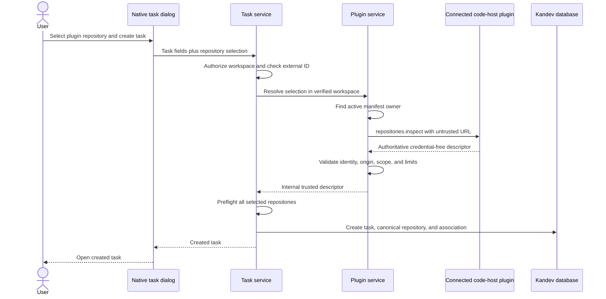

# Plugin Repository Task Creation System Design

## Purpose and boundaries

The plugin system owns the server-side contract that turns an untrusted plugin
repository selection into an authoritative repository descriptor. The task
service consumes that contract before it writes a new task.

The task system continues to own task validation, idempotency, repository
attachment, branch policies, and task persistence. The workspace system
continues to own repository rows. The plugin keeps ownership of provider API
calls and external credentials.

## Requirement mapping

| Requirement | Design section |
| --- | --- |
| `AC-PLUGINS-REPOSITORY-TASK-CREATION-001.1` | [Create sequence](#create-sequence) |
| `AC-PLUGINS-REPOSITORY-TASK-CREATION-001.2` | [Inspection action](#inspection-action) |
| `AC-PLUGINS-REPOSITORY-TASK-CREATION-001.3` | [Trust boundary](#trust-boundary) |
| `AC-PLUGINS-REPOSITORY-TASK-CREATION-001.4` | [Descriptor validation](#descriptor-validation) |
| `AC-PLUGINS-REPOSITORY-TASK-CREATION-001.5` | [Failure contract](#failure-contract) |
| `AC-PLUGINS-REPOSITORY-TASK-CREATION-001.6` | [Multi-repository preflight](#multi-repository-preflight) |
| `AC-PLUGINS-REPOSITORY-TASK-CREATION-001.7` | [Compatibility](#compatibility) |
| `AC-PLUGINS-REPOSITORY-TASK-CREATION-001.8` | [Failure contract](#failure-contract) |
| `AC-PLUGINS-REPOSITORY-TASK-CREATION-001.9` | [Responsive behavior](#responsive-behavior) |

## Components and responsibilities

- `internal/plugins.Service` resolves the active manifest owner and invokes its
  standardized workspace-scoped `repositories.inspect` action. It limits,
  parses, and validates the response.
- A narrow task-service `RepositorySelectionResolver` interface accepts the
  verified workspace ID and an untrusted repository selection. Production
  composition adapts the plugin service to this interface. Focused task tests
  use a stub.
- `internal/task/service.Service` preflights all first-use plugin selections,
  replaces each one with an internal trusted descriptor, and only then enters
  the existing create and repository-attachment sequence.
- Task HTTP and WebSocket handlers map typed inspection failures to bounded
  client errors. The existing task-dialog submit path keeps the dialog open and
  shows the returned message in its error toast.
- The plugin fixture supplies deterministic list, inspect, and branch action
  results for backend and Playwright tests. It contains no real credentials.

## Data and contracts

No database migration or public task-create schema change is required. The
existing task-create repository fields remain selection hints. The internal
`TrustedProviderDescriptor` marker remains unavailable to JSON callers.

The task service classifies each selection before persistence:

- An existing `repository_id` or an internal trusted descriptor uses its
  existing server-owned path.
- A remote URL with a non-built-in provider uses the plugin resolver.
- A remote URL with a blank or built-in provider is parsed through the existing
  built-in path. An unsupported, malformed, or provider-mismatched URL fails
  closed before any task or repository write.

The resolver returns the existing internal repository input shape with a
complete descriptor and `TrustedProviderDescriptor` set by server code. It
does not return credentials.

## Inspection action

A plugin that supports first-use repository selection declares this action:

```yaml
actions:
  - key: "repositories.inspect"
    scope: "workspace"
    max_body_bytes: 16384
```

Kandev selects the active plugin from manifest ownership of the requested
provider ID. It does not accept a plugin ID from the request. It invokes the
action with verified workspace context and a small body:

```json
{
  "url": "https://code.example.com/owner/repository"
}
```

The URL is untrusted. The plugin must first prove that the URL belongs to its
configured provider connection. It must not send connection credentials to an
origin selected only by this value.

A successful response contains either a `repository` object or the same object
as the top-level response for compatibility with existing provider actions:

```json
{
  "repository": {
    "provider_id": "example-provider",
    "provider_host": "https://code.example.com",
    "provider_scope": "https://code.example.com/context-a",
    "provider_repository_id": "immutable-repository-id",
    "owner_or_project": "owner",
    "name": "repository",
    "clone_url": "https://code.example.com/owner/repository.git",
    "default_branch": "main"
  }
}
```

`{"matched":false}` is a normal no-match response. Pull-request inspection
envelopes may contain additional change-request fields, but task repository
resolution reads only the nested repository descriptor.

The host applies the declared request limit, a 15-second deadline, a 1 MiB
response limit, and typed action error classification. It does not retry the
action inside one task-create attempt.

## Trust boundary

The request's provider ID is used only to select a manifest ownership slot. The
active registry determines the plugin record. The remote URL and any other
request fields are lookup or pinning hints. They never become persisted
authority and never enter the Git credential broker.

The plugin response is authoritative because it arrives server-to-server from
the active manifest owner under verified workspace context. Installed plugin
code is trusted to use its own connection safely, but Kandev still validates
the returned descriptor before persistence.

The browser cannot set `TrustedProviderDescriptor`. The existing plugin Host
`Tasks.Create` adapter can still set it after its separate authenticated Host
authorization. These are the only two server-owned paths to the trusted
resolver.

## Descriptor validation

The plugin service and task service jointly enforce these rules before writes:

- The response provider ID equals the manifest-owned provider ID.
- Provider host is a normalized HTTPS origin without user information.
- Provider scope is either empty or a valid normalized scope.
- Immutable provider repository ID, owner or project, name, clone URL, and
  default branch are present.
- Clone URL is credential-free HTTPS and its origin matches the provider host.
- Optional immutable request hints, such as provider scope or repository ID,
  match the response. Mutable owner, name, host, clone URL, and branch values
  from the browser are ignored.
- The response is within size limits and contains one repository descriptor.

The existing trusted remote repository validator remains the final persistence
guard. Validation logic should be shared instead of creating a weaker plugin
action path.

## Create sequence



Task-create idempotency stays first. If an external ID already names an
existing task, Kandev returns that task without contacting a plugin. For a new
task, plugin preflight runs after workspace authorization and request
normalization but before the task row insert.

After preflight, the existing `resolveTrustedRemoteRepository` and
`FindOrCreateRepository` path preserves canonical provider identity and
deduplicates a repository that another request registered concurrently.

## Multi-repository preflight

Kandev resolves repository selections in request order into an in-memory list.
It validates every plugin descriptor before it creates a task or repository
row. A failure discards the list and returns an error.

The service can resolve selections sequentially in the first implementation.
This avoids concurrent calls to the same plugin connection and keeps error
ordering deterministic. Repository database insertion continues through the
existing canonical identity lock after all external work succeeds.

This boundary prevents the issue's empty task and partially registered plugin
repository set. It does not make later blocker, branch-policy, attachment, or
database failures transactional. That broader create-atomicity work remains
separate.

## Failure contract

Inspection failures use typed categories instead of string matching:

| Failure | REST result | WebSocket result | User result |
| --- | --- | --- | --- |
| Invalid selection or descriptor | `400` | validation error | Correct the repository selection. |
| Provider or repository not found | `404` | not-found or validation error | Reconnect or select another repository. |
| Plugin inactive, timeout, rate limit, or upstream unavailable | `503` or typed retryable status | unavailable error | Retry after the provider is available. |

The response includes a stable error code for plugin repository resolution and
a bounded message. Logs can include workspace ID, provider ID, plugin ID,
action key, duration, and failure category. Logs and client responses exclude
secrets, authenticated URLs, plugin configuration, and raw response bodies.

Cancellation stops the action and returns without writes. A provider-specific
failure occurs before the task-created event and before task-create last-used
settings are recorded.

## Compatibility

- A non-empty workspace `repository_id` keeps the current authorized lookup.
- GitHub, GitLab, and Azure DevOps URLs keep the built-in parser.
- Plugin Host `Tasks.Create` keeps its authenticated trusted-descriptor path.
- REST, WebSocket, and MCP callers cannot set the internal trust marker.
- A provider without a valid workspace-scoped `repositories.inspect` action
  cannot create a task from a first-use repository. Its already-persisted
  repositories remain usable.
- Direct and nested repository action responses are accepted during the
  compatibility period. Public documentation defines the nested form as the
  preferred shape.

## Responsive behavior

The feature uses the existing shared task dialog and repository picker. It
adds no desktop-only control, compressed table, hover-only action, or new phone
navigation. The same submit error keeps the dialog open on both presentations.

Playwright must prove the complete first-use flow in a desktop project and a
phone project. The phone test also verifies that the repository and branch
controls remain reachable, the submit action has a touch-sized target, and the
dialog has no horizontal overflow.

## Observability

Structured logs record one inspection outcome with provider ID, plugin ID,
workspace ID, duration, response shape, and typed failure category. Success
logs do not include repository URLs. Existing task-created logs remain the
evidence that persistence followed a successful preflight.

No new metric is required for the first implementation. If operational data
shows repeated provider-specific failures, a later change can add bounded
outcome counters without changing this contract.

## Related decisions

- [Resolve First-Use Plugin Repositories on the Server](../../../decisions/2026-08-26-server-owned-plugin-repository-task-resolution.md)
- [Plugin Repository Provider Extensions](../../../decisions/2026-07-31-plugin-repository-provider-extensions.md)
- [Authenticated Plugin Actions](../../../decisions/2026-07-31-authenticated-plugin-actions.md)
- [Provider-Neutral Git Credential Broker](../../../decisions/2026-07-31-provider-neutral-git-credential-broker.md)
- [Code-Host Plugins Reuse Native Dashboard Primitives](../../../decisions/2026-08-06-plugin-code-host-dashboard-parity.md)
