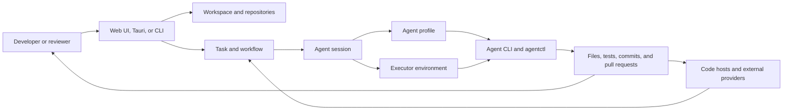

# Product map

**Status:** Proposed baseline for product review.

Kandev is organized around one work loop and several explicit boundaries. The
backend and persistence layer are authoritative; the browser, desktop shell,
CLI, APIs, and agent processes are connected surfaces.

## Core product flow

The loop is intentionally reviewable. A task can continue through multiple
turns and sessions, but the user remains able to inspect and redirect it.

## Product system map

| Area | Product role | Primary relationship |
| --- | --- | --- |
| [Workspaces](../workspaces/README.md) | Owns workspace, repository, worktree, branch, and secret context. | Provides repository scope to tasks and integrations. |
| [Tasks](../tasks/README.md) | Owns durable work items, workflows, sessions, transitions, and task runtime state. | Coordinates the core work loop. |
| [Agents](../agents/README.md) | Owns agent identities, profiles, permissions, provider capabilities, and runtime versions. | Supplies the agent configuration selected by a task or session. |
| [Executors](../executors/README.md) | Owns local, container, SSH, process, port, and environment boundaries. | Materializes the environment in which agent work runs. |
| [Integrations](../integrations/README.md) | Owns external provider credentials, identity, synchronization, and actions. | Connects task and repository state to code hosts and services. |
| [UI](../ui/README.md) | Owns browser presentation, navigation, settings, chat, boards, review, and responsive interaction. | Renders backend state and collects human decisions. |
| [Desktop](../desktop/README.md) | Owns the Tauri shell, native lifecycle, windows, updates, and desktop handoff. | Hosts the same backend-served product surface. |
| [CLI](../cli/README.md) | Owns native launch modes and command-line process contracts. | Starts the same native runtime for browser, headless, or service use. |
| [Platform](../platform/README.md) | Owns shared startup, configuration, health, diagnostics, localization, notifications, and recovery. | Provides cross-cutting runtime guarantees. |
| [Auth](../auth/README.md) | Owns authentication state, trust boundaries, sessions, cookies, and authorization checks. | Protects user and service requests. |
| [Costs](../costs/README.md) | Owns usage, quotas, budgets, and cost-aware model behavior. | Provides accounting and policy inputs to agent and Office flows. |
| [Plugins](../plugins/README.md) | Owns package, marketplace, host API, contribution, and plugin security contracts. | Extends the host without owning core product state. |
| [System page](../system-page/README.md) | Owns operator diagnostics, storage, backups, logs, and maintenance surfaces. | Exposes operational state and recovery actions. |
| [Release](../release/README.md) | Owns version channels, packaging, publication, and artifact verification. | Delivers the runtime consumed by CLI and desktop. |
| [Office](../office/README.md) | Owns feature-flagged autonomy, coordination, routines, dashboards, and Office live state. | Builds on tasks, agents, costs, and integrations; not yet part of the supported production path. |

## Authority boundaries

- The backend and database own durable Kandev state. UI stores and WebSocket
  events are projections that must tolerate reconnects, duplicates, and stale
  delivery.
- Tasks own work intent and workflow state. Workspaces own repository and
  worktree context. Agents own profile and provider configuration. Executors
  own the runtime environment. These boundaries prevent one system from
  silently becoming the source of truth for another.
- Integrations own external provider identity and actions. A provider's remote
  state is not silently treated as a replacement for Kandev's task state.
- Plugins contribute through host contracts. A plugin does not copy or replace
  the core UI, task, authentication, or integration contract.
- Office consumes regular task and agent primitives but does not redefine the
  supported regular Kanban product while it remains feature-flagged.

## Product surfaces

The same product authority is exposed through:

- the browser SPA served by the Go backend;
- the Tauri desktop shell around that backend-served SPA;
- the native CLI for run, start, headless, and service operation;
- HTTP and WebSocket APIs for the web and desktop clients;
- task-scoped MCP tools for agent interaction; and
- agentctl control channels inside the selected execution environment.

These surfaces can differ in capability because of provider, executor,
platform, credential, or install-channel dependencies. They must not create
conflicting product state.

## Open product questions

- Should the product map eventually include a separate event or persistence
  system, or remain a context document over the current platform boundary?
- Which plugin contributions belong in the primary product navigation and which
  should remain explicitly optional?
- What is the graduation path from the current Office boundary to a supported
  product area?
