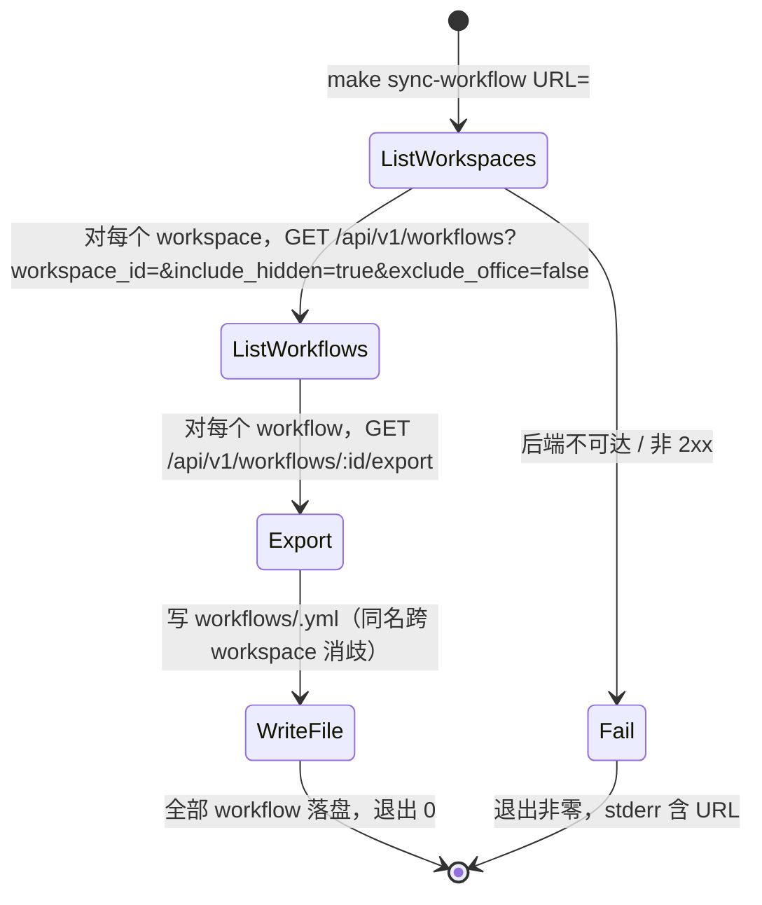

# Tasks: add-make-sync-workflow

## Verification Strategy

| 问题 | 回答 |
|------|------|
| **验证类型** | `e2e-script` |
| **选择理由** | 测试对象是脚本 + make 目标（具体程序代码，非 agent/skill）；`e2e-script` 用桩 HTTP 服务器跑通「列 workspace → 列 workflow → 导出 → 落盘」完整路径，并对文件名去重、幂等、不可达失败做断言，是最高层、最接近真实用法的验收入口 |
| **验证入口** | `bash scripts/sync-workflow.test.sh`（并接入 `make test-scripts`） |
| **probe 证据** | 已 curl 真实后端（localhost:38429）拿到三端点响应形状：`/health` 200；`/api/v1/workspaces` → `{"workspaces":[{"id","name",...}],"total"}`；`/api/v1/workflows?workspace_id=&include_hidden=true&exclude_office=false` → `{"workflows":[{"id","name",...}],"total"}`；`/api/v1/workflows/:id/export` → `Content-Type: application/x-yaml`，body 为 `version: 1\ntype: kandev_workflow\nworkflows: ...` |
| **未验证假设** | N/A（三端点均真实试通；脚本工具链选 Python3 stdlib 已确认） |

## E2E 测试图



### 节点说明

| 节点 | 状态描述 | 断言 |
|------|---------|------|
| ListWorkspaces | 拿到全部 workspace | 响应的 `workspaces` 数组被遍历，空 workspace 不产出文件 |
| ListWorkflows | 拿到某 workspace 全部 workflow（含 hidden/office） | 请求带 `include_hidden=true&exclude_office=false`；列表按 id 排序遍历 |
| Export | 拿到单个 workflow 的 YAML 信封 | `Content-Type: application/x-yaml`，`workflows` 列表含 1 个 workflow |
| WriteFile | 文件写入 `workflows/` | 每 workflow 一文件；跨 workspace 同名生成 `kanban.yml` 与 `kanban--beta.yml` 两个文件 |
| Fail | 后端不可达 | 退出码非 0，stderr 含 base URL |

### 核心覆盖路径

1. **路径 1（成功）**：入口 → ListWorkspaces → ListWorkflows → Export → WriteFile → 出口。断言文件数量、文件名、每文件 `workflows` 长度 = 1。
2. **路径 2（去重）**：两个 workspace 各含一个 "Kanban" → 产出 `kanban.yml` 与 `kanban--<workspace-slug>.yml`，互不覆盖。
3. **路径 3（失败）**：指向不可达端口 → 退出非 0，stderr 含 URL。

## 实现清单

> 每条 task 指向明确文件、清晰边界、可验证结果。按 1 → 2 → 3 顺序推进，每条完成即勾选。

### 1. 脚本 `scripts/sync-workflow.py`

- [x] 1.1 新建 `scripts/sync-workflow.py`，仅用 Python3 stdlib（`json`/`re`/`os`/`sys`/`urllib.request`/`urllib.error`）。接口 `python3 scripts/sync-workflow.py <url> <out_dir>`。核心逻辑（伪码即契约）：
  - `slug(name)`：`re.sub(r"[^a-z0-9]+", "-", name.lower()).strip("-")`，空则 `"workflow"`。
  - `get(url, path) -> bytes`：`urlopen(url.rstrip("/")+path, timeout=10)`；`HTTPError` → `sys.exit("sync-workflow: backend at <url> returned HTTP <code> for <path>")`；其他异常 → `sys.exit("sync-workflow: backend unreachable at <url>: <e>")`。
  - `main`：`os.makedirs(out_dir, exist_ok=True)`；GET `/api/v1/workspaces` → `["workspaces"]` 按 `id` 升序；对每个 workspace GET `/api/v1/workflows?workspace_id=<id>&include_hidden=true&exclude_office=false` → `["workflows"]` 按 `id` 升序；对每个 workflow GET `/api/v1/workflows/<id>/export`（`bytes` 原样写文件）。文件名：`base=slug(name)`，`used` 集合记录已用名，首次用 `base`，冲突用 `base--slug(workspace.name)`，再冲突追加 `--2/--3/...`；写到 `<out_dir>/<fn>.yml`。结束打印 `synced <count> workflow(s) to <out_dir>`。
  - 准出：`python3 scripts/sync-workflow.py http://localhost:38429 /tmp/sync-smoke` 退出 0 且生成若干 `.yml`。
- [x] 1.2 失败路径：`python3 scripts/sync-workflow.py http://localhost:1 /tmp/x` 退出非 0，stderr 含 `localhost:1`。
  - 准出：上面命令 `echo $?` 非 0。

### 2. 根 Makefile 目标

- [x] 2.1 修改 `Makefile`：在变量区加 `URL ?= http://localhost:38429`。
- [x] 2.2 在 `Makefile`（`deploy` 目标附近）加：
  ```make
  .PHONY: sync-workflow
  sync-workflow:
  	$(call phase,Syncing workflows from runtime)
  	@python3 scripts/sync-workflow.py "$(URL)" "$(CURDIR)/workflows"
  	$(call success,Workflows synced to $(CURDIR)/workflows)
  ```
- [x] 2.3 在 `help` 的 "Service Commands" 段加两行：
  ```
  sync-workflow                Export all runtime workflows into workflows/ (one file per workflow)
  sync-workflow URL=http://localhost:38429  Backend base URL override
  ```
  - 准出：`make help` 列出 `sync-workflow`；`make -n sync-workflow`（默认 URL）打印 `python3 scripts/sync-workflow.py "http://localhost:38429" "..."`。

### 3. 测试 `scripts/sync-workflow.test.sh` 并接线

- [x] 3.1 新建 `scripts/sync-workflow.test.sh`（bash，仿 `scripts/make-deploy.test.sh` 的 `pass`/`fail` + 末尾 `exit $status`）。覆盖：
  - (a) `make help` 输出 grep `^[[:space:]]+sync-workflow[[:space:]]` 命中；`make -n sync-workflow` 输出 grep `python3 scripts/sync-workflow.py` 命中。
  - (b) 起一个 Python3 桩服务器（heredoc，`http.server`，随机高位端口），路由：
    - `/api/v1/workspaces` → `{"workspaces":[{"id":"ws-1","name":"Alpha","owner_id":"","task_prefix":"KAN"},{"id":"ws-2","name":"Beta","owner_id":"","task_prefix":"KAN"},{"id":"ws-3","name":"Empty","owner_id":"","task_prefix":"KAN"}],"total":3}`
    - `/api/v1/workflows?workspace_id=ws-1&...` → `{"workflows":[{"id":"wf-1","name":"Kanban"},{"id":"wf-2","name":"PR Review"}],"total":2}`
    - `/api/v1/workflows?workspace_id=ws-2&...` → `{"workflows":[{"id":"wf-3","name":"Kanban"}],"total":1}`
    - `/api/v1/workflows?workspace_id=ws-3&...` → `{"workflows":[],"total":0}`
    - `/api/v1/workflows/wf-1/export`、`wf-2`、`wf-3` → `version: 1\ntype: kandev_workflow\nworkflows:\n    - name: <name>\n      steps: []`（`Content-Type: application/x-yaml`）。
    - 运行 `python3 scripts/sync-workflow.py <stub_url> <tmpdir>` 后断言：`<tmpdir>` 下恰好 `kanban.yml`、`pr-review.yml`、`kanban--beta.yml` 三个文件；每个文件 grep `type: kandev_workflow` 且 `workflows:` 下只含一个 `- name:`；`ws-3`（空）不产出文件。
  - (c) 指向已关闭端口（如先起再杀）运行脚本 → 断言退出非 0 且 stderr 含 URL。
  - 准出：`bash scripts/sync-workflow.test.sh` 全绿退出 0。
- [x] 3.2 修改 `Makefile` `test-scripts` 目标，加一行 `@bash scripts/sync-workflow.test.sh`（与 `make-deploy.test.sh` 并列）。
  - 准出：`make test-scripts` 中该行通过（或单独 `bash scripts/sync-workflow.test.sh` 通过）。

## 验证清单

- [x] 路径 1 验证：桩服务器下「列 workspace → 列 workflow → 导出 → 落盘」产出预期文件，退出 0
- [x] 路径 2 验证：两个 workspace 同名 "Kanban" 产出 `kanban.yml` 与 `kanban--beta.yml`，互不覆盖
- [x] 路径 3 验证：不可达后端退出非 0 且 stderr 含 URL
- [x] 运行测试：`bash scripts/sync-workflow.test.sh`
- [x] 运行 make 级检查：`make help`（列出 sync-workflow）、`make -n sync-workflow`（打印 python 调用）
- [x] 运行校验：`openspec validate add-make-sync-workflow --strict --no-interactive`
