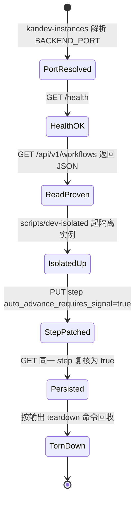

# Tasks: prefer-api-writes-in-debug-skill

> **For agentic workers:** 按 task 顺序推进实现；每条 task 有明确文件、边界与准出标准。本 change 为纯 skill 文档变更，无生产代码、无 DB 变更。apply 完成后进入 verify / archive。

## Verification Strategy

| 问题 | 回答 |
|------|------|
| **验证类型** | `e2e-script`（真实执行 skill 指引的命令路径：端口解析 → REST 读 → 隔离实例写闭环）+ 文档一致性 grep（对 docs 变更即「集成级」检查：映射表所引端点/工具名必须真实存在于路由注册与 MCP 包） |
| **选择理由** | 变更对象是 agent-facing 文档，无逻辑可单测；唯一有意义的验收是「照着 skill 做能走通」+「所引事实与代码一致」。e2e-script 直接复用 skill 新章节里的命令 |
| **验证入口** | 3.1 一致性 grep 命令组；3.2 冒烟命令组（live 只读 + `scripts/dev-isolated` 写闭环），命令全文见「实现清单」Task 3 |
| **probe 证据** | `./scripts/kandev-instances` exit 0，输出表头 `PID BACKEND_PORT WEB_PORT AGENTCTL_PORT HOME_DIR REPO_PATH` + live 行（38429）；`curl /health` → `200`；`GET /api/v1/workflows` → `200 {"workflows":[…]}`；`GET /api/v1/workflows/<id>/workflow/steps` → `200 {"steps":[…含 events/auto_advance_requires_signal…]}`；`head -30 scripts/dev-isolated` 确认 READY/teardown 契约（详见 design.md Research Log） |
| **未验证假设** | 无（依赖门禁全部「试通证据」终态，见 design.md Research Log 末行结论） |

## E2E 测试图

> 节点 = 状态/断言，边 = 动作/转换。核心场景要求完整路径覆盖。



### 节点说明

| 节点 | 状态描述 | 断言 |
|------|---------|------|
| PortResolved | 从实例表解析出端口 | `PORT` 非空且为 live 实例端口（多实例时人工选行） |
| HealthOK | 后端可达 | `/health` HTTP 200 |
| ReadProven | REST 读面可用 | `/api/v1/workflows` 返回合法 JSON（`workflows` 数组） |
| IsolatedUp | 隔离实例就绪 | `dev-isolated` 打印 READY 块（backend URL + teardown 命令） |
| StepPatched | 写路径经 API | PUT 返回 200 且响应体为更新后的 step JSON |
| Persisted | 写入持久 | GET 同一 step 的 `auto_advance_requires_signal` == `true` |
| TornDown | 无残留 | teardown 命令退出码 0，`kandev-instances` 不再列出隔离实例 |

### 核心覆盖路径

1. **路径 1（live 只读冒烟）**：`kandev-instances` → PortResolved → HealthOK → ReadProven → 结束。验证 skill 新章节的端口解析与读命令真实可用，零副作用。
2. **路径 2（隔离写闭环）**：ReadProven → IsolatedUp → StepPatched → Persisted → TornDown。验证 skill 指引的写路径（PUT step 字段）不经 SQLite 直写即可完成并持久化。
3. **路径 3（文档一致性）**：映射表逐项 grep 路由注册 / MCP 包 → 全部命中、无 MISSING；`SKILL.md` 中 `38429` 仅出现在回退默认说明行。验证所引事实与代码一致。

## 实现清单

> 每条 task 应指向明确文件、清晰边界、可验证结果。章节插入位置已锁定（见 design.md Context）。

### 1. SKILL.md：写策略核心章节与 signal-gating 段修正

- [x] 1.1 在 `## 排查配方（先跑这些）` 与 `## 工作流 step 推进机制（排障核心）` 之间插入新章节「数据修改写策略（API 优先）」，内容如下（原文写入，`.agents/skills/debug-kandev/SKILL.md`）：

````markdown
## 数据修改写策略（API 优先）

**读 SQLite 自由，写必须走 API。** 后端 mutation 都经 service 层发布事件（`task.*` /
`workflow_step.*`）：WS 网关靠事件刷新 UI，orchestrator 靠事件失效编译态 step 缓存
（TTL 5s 只是兜底）并重评估队列 admission。直接 `UPDATE` SQLite 的结果是「DB 改了、
运行时没变」——UI 不刷新、引擎用旧 step spec、队列不重排，制造新的疑难杂症。

先解析端口，别硬套 38429：

```bash
PORT=$(./scripts/kandev-instances | awk 'NR==2{print $2}')  # 多实例时按行自选
PORT=${PORT:-38429}                                         # server.port 默认值
curl -s "http://127.0.0.1:$PORT/health"                     # 可达性自检（公共端点）
```

鉴权：auth 是 opt-in runtime flag（`features.auth`），默认关 = 本机裸调即可；开启后
所有请求带 `Authorization: Bearer $KANDEV_API_TOKEN`（PAT，勿写进命令行历史或日志）。

REST 与 MCP 两个写面等价（共享 service 层与事件 publisher，有 parity 测试）：shell 里
用 curl 走 REST；会话本身挂着 kandev MCP 就直接调对应 `*_kandev` 工具。

**例外（确实没有 API 才允许直接写 DB，且仅限以下两类）：**

1. `task_step_transitions` / `session_step_history` —— engine 追加的审计表，无写 API
   也不应改；只读，它们是排障证据链本身。
2. 后端未运行时的数据修复 —— 先确认进程已停（`kandev-instances` 无该实例行），写完
   重启后必须复查；此路径绕过了校验与事件发布，是最后手段，优先拉起后端再走 API。

映射表未覆盖的写需求：先 grep 路由注册（`apps/backend/internal/*/handlers/*.go` 里的
`api.(GET|POST|PUT|PATCH|DELETE)`）或 MCP 工具名（`apps/backend/internal/mcp/handlers/`），
确实没有再考虑例外路径。

**live 实例不要做有副作用的实验。** 需要试写时用 `scripts/dev-isolated` 起隔离实例
（全新 SQLite + mock providers，端口随机），用完按其输出的 teardown 命令回收；实例
识别、诊断包等纪律见 `debug` skill 的 `references/instance.md`。
````

  准出：章节存在且位置正确；`grep -c '## 数据修改写策略' SKILL.md` == 1。

- [x] 1.2 修正 `## 工作流 step 推进机制` 末尾的写法段落（`.agents/skills/debug-kandev/SKILL.md`，当前 176-178 行）。From/To：

  From（现行文本）：
  ```markdown
  改法用 REST API，不要直接写 SQLite（后端会原子更新 + 发事件，且无缓存不一致）：
  `PUT http://127.0.0.1:38429/api/v1/workflow/steps/<step_id>`，body `{"prompt":"..."}`
  或 `{"auto_advance_requires_signal":true}`。REST 无鉴权（本机）。
  ```
  To（替换为）：
  ```markdown
  改法走 API（总则见上文「数据修改写策略」）：
  `PUT http://127.0.0.1:$PORT/api/v1/workflow/steps/<step_id>`，body `{"prompt":"..."}`
  或 `{"auto_advance_requires_signal":true}`；auth 开启时带 Bearer 头。不要直接 UPDATE
  SQLite——后端经 API 会原子更新 + 发事件 + 失效 step 缓存，直写三者全绕过。
  ```

  准出：`grep -n '38429' SKILL.md` 仅剩写策略章节里的回退默认行（`PORT=${PORT:-38429}`）；「REST 无鉴权」字样消失。

### 2. SKILL.md + db-schema.md：API 速查表与交叉引用

- [x] 2.1 在「数据修改写策略」章节之后插入「写需求 → API 速查」章节，内容如下（`.agents/skills/debug-kandev/SKILL.md`）：

````markdown
## 写需求 → API 速查

端口 `$PORT` 的解析与鉴权见「数据修改写策略」。出处：REST 路由注册在
`apps/backend/internal/workflow/handlers/handlers.go`（workflow/steps）与
`apps/backend/internal/task/handlers/task_handlers.go`（tasks）；MCP 工具面在
`apps/backend/internal/mcp/handlers/`。

| 写场景 | REST | MCP |
|---|---|---|
| 改 step（prompt / events / `auto_advance_requires_signal` 等） | `PUT /api/v1/workflow/steps/<id>` | `update_workflow_step_kandev` |
| 建 / 删 step | `POST /api/v1/workflow/steps`、`DELETE /api/v1/workflow/steps/<id>` | `create_workflow_step_kandev`、`delete_workflow_step_kandev` |
| step 重排 | `PUT /api/v1/workflows/<id>/workflow/steps/reorder` | `reorder_workflow_steps_kandev` |
| workflow 导出 / 导入 | `GET /api/v1/workflows/<id>/export`、`POST /api/v1/workspaces/<id>/workflows/import` | `export_workflow_kandev`、`import_workflow_kandev` |
| 写前先读（列查） | `GET /api/v1/workflows`、`GET /api/v1/workflows/<id>/workflow/steps` | `list_workflows_kandev`、`list_workflow_steps_kandev` |
| task 改字段 / 状态 | `PATCH /api/v1/tasks/<id>` | `update_task_kandev`、`update_task_state_kandev` |
| task 移动 step | `POST /api/v1/tasks/<id>/move`（批量 `POST /api/v1/tasks/bulk-move`） | `move_task_kandev` |
| task 归档 / 删除 | `POST /api/v1/tasks/<id>/archive`、`POST /api/v1/tasks/<id>/unarchive`、`DELETE /api/v1/tasks/<id>` | `archive_task_kandev`、`delete_task_kandev` |
| task plan CRUD | —（无 REST 路由；WS 网关有 `task.plan.*` 动作） | `create/get/update/delete_task_plan_kandev` |
| session 停止 / 发消息 / 再拉起 | —（走 WS / orchestrator） | `stop_task_kandev`、`message_task_kandev`、`spawn_session_kandev` |
````

  准出：表格渲染正常（10 行数据行）；`grep -c '## 写需求 → API 速查' SKILL.md` == 1。

- [x] 2.2 交叉引用两处（`.agents/skills/debug-kandev/SKILL.md` + `.agents/skills/debug-kandev/references/db-schema.md`）：

  (a) SKILL.md 的 `## 参考` 列表末尾追加：
  ```markdown
  - `debug` skill 的 `references/instance.md` —— 实例识别（`scripts/kandev-instances`）、
    隔离实例（`scripts/dev-isolated`）、诊断包与日志获取；live 实例纪律（Never mutate）。
  ```

  (b) db-schema.md 文件末尾（「常用 SQL 模板」代码块之后）追加：
  ```markdown
  > **本文件所列的表都是读接口。** 写操作见 SKILL.md「数据修改写策略（API 优先）」与
  > 「写需求 → API 速查」；`task_step_transitions` / `session_step_history` 为审计表，只读。
  ```

  准出：两个文件各追加成功；db-schema.md 原有内容零改动（`git diff` 仅见尾部新增）。

### 3. 一致性检查与冒烟验证（apply 期自查；verify 阶段复跑）

- [x] 3.1 映射表事实一致性 grep（全部期望命中，`.agents/skills/debug-kandev/` 为检查对象）：

  ```bash
  # REST 端点存在于路由注册
  grep -c 'PUT("/workflow/steps/:id"' apps/backend/internal/workflow/handlers/handlers.go        # ≥1
  grep -c 'POST("/tasks/:id/move"' apps/backend/internal/task/handlers/task_handlers.go           # ≥1
  grep -c 'POST("/tasks/:id/archive"' apps/backend/internal/task/handlers/task_handlers.go        # ≥1
  # MCP 工具名存在于 mcp 包（无 MISSING 输出）
  for t in update_workflow_step_kandev create_workflow_step_kandev delete_workflow_step_kandev \
           reorder_workflow_steps_kandev export_workflow_kandev import_workflow_kandev \
           list_workflows_kandev list_workflow_steps_kandev update_task_kandev \
           update_task_state_kandev move_task_kandev archive_task_kandev delete_task_kandev \
           create_task_plan_kandev get_task_plan_kandev update_task_plan_kandev \
           delete_task_plan_kandev stop_task_kandev \
           message_task_kandev spawn_session_kandev; do
    grep -rq "\"$t\"" apps/backend/internal/mcp/ || echo "MISSING: $t"
  done
  # 无裸端口硬编码：38429 只允许出现在回退默认行
  grep -n '38429' .agents/skills/debug-kandev/SKILL.md    # 仅 1 处：PORT=${PORT:-38429}
  ```

  准出：三个 grep 计数 ≥1；for 循环零 `MISSING` 输出；`38429` 恰 1 处。

- [x] 3.2 冒烟闭环（E2E 路径 1 + 路径 2，对 skill 新章节命令的真实执行）：

  ```bash
  # (a) live 只读冒烟（零副作用）
  ./scripts/kandev-instances
  PORT=$(./scripts/kandev-instances | awk 'NR==2{print $2}'); PORT=${PORT:-38429}
  curl -s -o /dev/null -w "%{http_code}\n" "http://127.0.0.1:$PORT/health"      # 200
  curl -s "http://127.0.0.1:$PORT/api/v1/workflows" | head -c 200               # JSON

  # (b) 隔离实例写闭环（有副作用，只在隔离实例上做）
  scripts/dev-isolated                       # 记下 READY 块的 backend URL 与 teardown 命令
  IPORT=<填 READY 块里的 backend 端口>
  WID=$(curl -s "http://127.0.0.1:$IPORT/api/v1/workspaces" | jq -r '.workspaces[0].id')
  WF=$(curl -s "http://127.0.0.1:$IPORT/api/v1/workflows?workspace_id=$WID" | jq -r '.workflows[0].id')
  SID=$(curl -s "http://127.0.0.1:$IPORT/api/v1/workflows/$WF/workflow/steps" | jq -r '.steps[0].id')
  curl -s -X PUT "http://127.0.0.1:$IPORT/api/v1/workflow/steps/$SID" \
    -H 'Content-Type: application/json' -d '{"auto_advance_requires_signal":true}' | jq -r .name
  curl -s "http://127.0.0.1:$IPORT/api/v1/workflow/steps/$SID" | jq .auto_advance_requires_signal
  #   ↑ 期望输出 true（写入持久）；随后执行 READY 块给出的 teardown 命令回收
  ```

  准出：(a) health 200 且 workflows 返回 JSON；(b) PUT 后 GET 复核 `auto_advance_requires_signal` == `true`，teardown 后 `kandev-instances` 无隔离实例残留。若隔离实例新库无种子 workflow（`workflows[0]` 为 null），记录实际输出并停下排查种子行为，不得跳过。

## 验证清单

- [x] 路径 1 验证：`kandev-instances` 解析端口 → `/health` 200 → `GET /api/v1/workflows` JSON（命令见 3.2a）
- [x] 路径 2 验证：`dev-isolated` → PUT step → GET 复核 true → teardown 无残留（命令见 3.2b）
- [x] 路径 3 验证：映射表端点/工具名 grep 全命中、无 MISSING；`38429` 仅回退默认 1 处（命令见 3.1）
- [x] 结构验证：SKILL.md 新章节位置正确（排查配方之后、推进机制之前）、db-schema.md 仅尾部追加
- [x] 运行测试：`make -C apps/backend test`（本 change 无后端代码，期望零差异通过，作为防意外触碰的护栏）
- [ ] 运行 lint / typecheck：N/A（纯 markdown 变更，无 TS/Go lint 对象；prettier 不作用于 `.agents/` 下 md）

> apply 阶段按 task 顺序推进；全部完成并自查通过后进入 verify（`openspec-verify-change`）与 archive。
