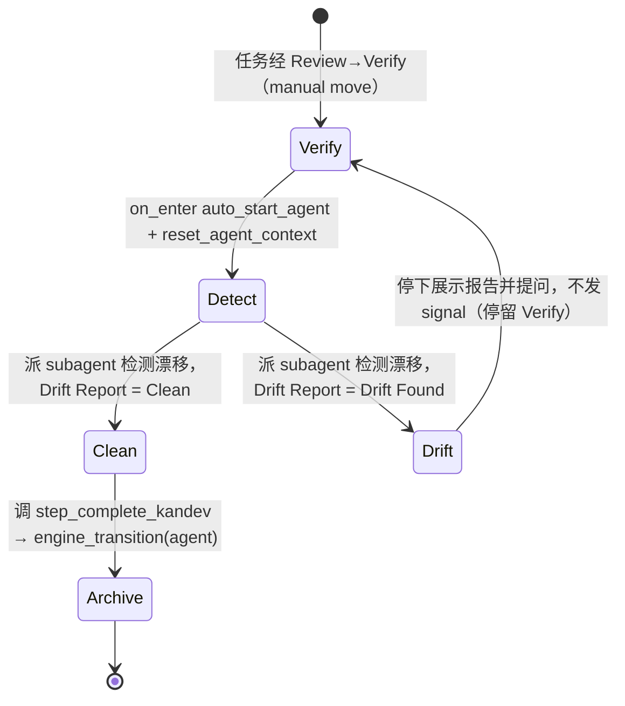

# Tasks: auto-advance-verify-to-archive

## Verification Strategy

| 问题 | 回答 |
|------|------|
| **验证类型** | `integration-test`（REST 读回断言）+ 行为级人工观测（后续任务 Verify→Archive 的 `engine_transition`） |
| **选择理由** | 变更为运行时 DB 配置（无仓库代码）。最直接、可脚本化、零副作用的验证是 `PUT` 后 `GET` 读回，断言新 prompt 已写入且 `auto_advance_requires_signal` / `on_turn_complete` 未变；行为级「Clean→自动推进」需真实任务跑通，成本高且非本 change 的代码层面产出，作为 apply 后人工观测验收。 |
| **验证入口** | `curl -s "http://127.0.0.1:38429/api/v1/workflow/steps/c33e0ba3-14bd-4fe0-9670-230d94e5709a"`（读回后按「验证清单」断言） |
| **probe 证据** | PUT body 字段已确认：`UpdateStepRequest.Prompt *string`（`json:"prompt,omitempty"`），部分更新只改 prompt（`apps/backend/internal/workflow/controller/controller.go:171-186`）；GET 读回已实测返回完整 step JSON（含 `auto_advance_requires_signal:true`、`on_turn_complete` 指向 Archive `8c04e5b9-…`）。 |
| **未验证假设** | 行为级「Clean→自动推进到 Archive」未在 plan 阶段试通（需真实任务），作为 apply 后人工观测项，见「验证清单」第 3 条。 |

## E2E 测试图



### 节点说明

| 节点 | 状态描述 | 断言 |
|------|---------|------|
| Verify | 任务进入 Verify 步骤 | `tasks.workflow_step_id` = Verify（`c33e0ba3`） |
| Clean | 漂移检测结果 Clean（无未实现/范围外/设计偏差） | Drift Report `Status: Clean` |
| Drift | 漂移检测结果 Drift Found | Drift Report `Status: Drift Found` |
| Archive | 自动推进到 Archive | `task_step_transitions` 出现 `Verify→Archive` 且 `trigger=engine_transition`、`actor_kind=agent` |

### 核心覆盖路径

1. **路径 1（Clean 自动推进）**：任务进入 Verify → 漂移检测 Clean → agent 调 `step_complete_kandev` → `engine_transition(agent)` 推进到 Archive — 这是本 change 的目标行为。
2. **路径 2（Drift 不推进）**：任务进入 Verify → 漂移检测 Drift Found → agent 停下展示报告并提问、不发 signal → 任务停留 Verify — 回归保护（signal-gating 不被破坏）。

## 实现清单

> 目标步骤：`dev-openspec-workflow` 的 Verify 步骤，step id `c33e0ba3-14bd-4fe0-9670-230d94e5709a`。
> 变更通道：`PUT http://127.0.0.1:38429/api/v1/workflow/steps/<step_id>`（本机无鉴权）。
> 新 prompt 全文见下，Apply 阶段直接写入。

### 1. 应用 Verify 步骤 prompt 变更

- [x] 1.1 用 python3 把新 prompt 序列化为 JSON body，写 `/tmp/verify-prompt.json`（`apps/backend` 无仓库文件改动）

```bash
python3 - <<'EOF' > /tmp/verify-prompt.json
import json
prompt = """使用 openspec-verify-change 技能：实现完成后检测 code↔spec 漂移。派 subagent 对照 proposal.md 与 design.md 检查，报告未实现需求、范围外新增、设计偏差。

按检测结果分流：
- 若 Drift Report 为 Clean（无明确问题）：调用 `step_complete_kandev` 工具发出完成信号（必填 summary，概括本步骤产出），工作流会自动推进到 Archive。注意 openspec-verify-change 技能本身只提示「下一步 archive」而不发信号，本步骤必须由你主动调用 `step_complete_kandev` 才会流转。
- 若 Drift Found（发现漂移问题）：停下来向用户展示 Drift Report 并提问（Out of Scope 项保留或移除、Must Fix 项返回 Apply 修正），不要发出完成信号。

不要做例行的「是否继续」确认。"""
print(json.dumps({"prompt": prompt}, ensure_ascii=False))
EOF
cat /tmp/verify-prompt.json
```

- [x] 1.2 `PUT` 更新步骤 prompt

```bash
curl -s -X PUT "http://127.0.0.1:38429/api/v1/workflow/steps/c33e0ba3-14bd-4fe0-9670-230d94e5709a" \
  -H 'Content-Type: application/json' \
  --data-binary @/tmp/verify-prompt.json
```

- [x] 1.3 `GET` 读回并断言（见「验证清单」第 1 条）

```bash
curl -s "http://127.0.0.1:38429/api/v1/workflow/steps/c33e0ba3-14bd-4fe0-9670-230d94e5709a"
```

## 验证清单

- [x] 路径 1 读回断言通过：`GET` 返回的 `step.prompt` 同时包含「Drift Report 为 Clean」「`step_complete_kandev`」「Drift Found」，且 `step.auto_advance_requires_signal == true`、`step.events.on_turn_complete[0].config.step_id == "8c04e5b9-8b9c-458c-a7b7-2f8f4c68c5a3"`（仍指向 Archive）、`step.events.on_enter` 仍含 `auto_start_agent` + `reset_agent_context`（未变字段不被破坏）。
- [x] 路径 2 回归保护成立：`auto_advance_requires_signal` 仍为 `true`（未翻转为 `false`），确保 Drift Found 场景不会因 turn-end 被误推进到 Archive。
- [ ] 行为级观测（人工，apply 后）：下一个进入 Verify 且检测为 Clean 的任务，`task_step_transitions` 出现 `Verify→Archive` 的 `engine_transition`（`actor_kind=agent`）；进入 Verify 且 Drift Found 的任务停留 Verify、不自动归档。
- [x] 运行校验：`openspec validate auto-advance-verify-to-archive --strict --no-interactive` 通过。
