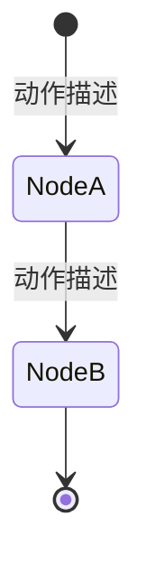

# Tasks: <change-name>

## Verification Strategy

| 问题 | 回答 |
|------|------|
| **验证类型** | `<manual-oneshot | e2e-script | unit-test | integration-test>`（优先 `e2e-script` / `integration-test`；`unit-test` 仅在无更高层验证手段时退而求其次，且不得作为唯一验收依据） |
| **选择理由** | <为什么选这个类型> |
| **验证入口** | `<具体命令或脚本路径>` |
| **probe 证据** | <若涉及第三方接口、外部 CLI、agent/runtime 响应或仓库外知识，记录请求/响应形状、命令+退出码、响应摘要、失败模式或限制；不适用则写 N/A> |
| **未验证假设** | <无法安全试通时记录 blocker、原因和后续验证入口；无则写 N/A> |

## E2E 测试图

> 节点 = 状态/断言，边 = 动作/转换。核心场景要求完整路径覆盖。

### 节点说明

| 节点 | 状态描述 | 断言 |
|------|---------|------|
| NodeA | <状态> | <可验证 claim> |
| NodeB | <状态> | <可验证 claim> |

### 核心覆盖路径

1. **路径 1**：入口 → NodeA → NodeB → 出口 — <场景描述>

## 实现清单

> 每条 task 应指向明确文件、清晰边界、可验证结果。

### 1. <!-- Task Group Name -->

- [ ] 1.1 <任务描述> (`path/to/file`)
- [ ] 1.2 <任务描述> (`path/to/file`)

### 2. <!-- Task Group Name -->

- [ ] 2.1 <任务描述> (`path/to/file`)
- [ ] 2.2 <任务描述> (`path/to/file`)

## 验证清单

- [ ] 路径 1 验证：<入口 → … → 出口，预期行为>
- [ ] 运行测试：`<命令>`
- [ ] 运行 lint / typecheck：`<命令>`
